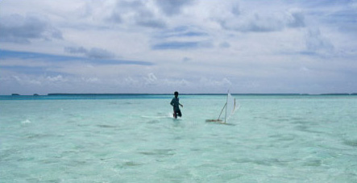
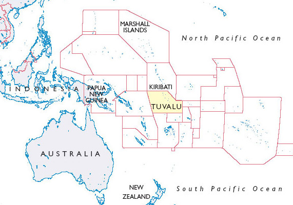
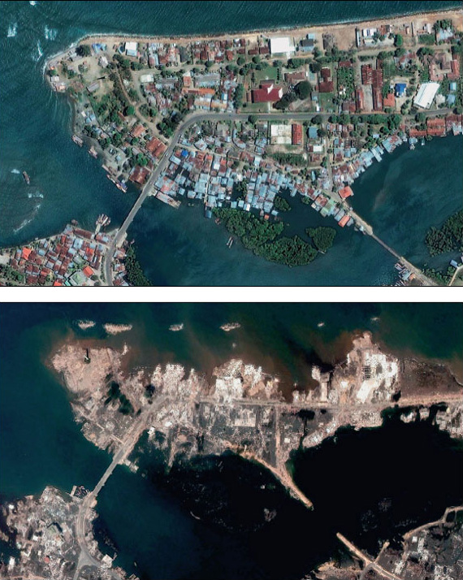

# 1 Dividing the planet

A good globe can set you back quite a lot of money. Of course, I don't mean the little moulded plastic planets or the globes you can blow up as if the world were a beach ball, but the decent sized ones that sit solidly on turned wooden bases and quietly emanate authority from the corner of a room. Yet these days, it hardly seems worthwhile making such an investment. Countries appear to change their colour, their shape or their name with remarkable rapidity.

It has become a cliché to point out that globes and maps that date back to the middle of the last century and earlier featured vast swathes coloured in pink or red to signify lands that belonged to the British Empire. Not only has the British Empire broken up, but over recent decades we have also seen the dissolution of the Soviet Union into a number of new states. Other countries like Czechoslovakia, Yugoslavia and Ethiopia have split themselves into two or more pieces. Meanwhile, in the western Pacific, a cluster of islands that was once a British colony called the Gilbert and Ellice Islands has become two republics: the Gilbert group are now known as Kiribati, while the Ellice Islands are now Tuvalu.

How we divide the planet's surface up into recognisable units reveals ongoing changes: territorial reshufflings that may render a map or globe out of date before it has even left the production line. More importantly, such transformations are often contentious and painfully wrought at the ‘ground level’ where people live, frequently leaving some people unsettled or uncertain as to where they belong. But amid all this relentless activity, it can be tempting to think of the land masses themselves, the continents and the islands, as maintaining the same shape, even as their names, colours or subdivisions change.

While there may be some comfort in the idea that land endures while all else changes, it is a rather dubious assumption. For several decades it has been generally accepted in the earth sciences that continents ‘drift’, usually at the rate of inches or fractions of an inch each year. More recently, a growing body of evidence suggests that much more rapid physical changes in the surface of our planet are also beginning to take place. Since the 1980s, intensive research by climate scientists collaborating internationally has built up a picture of the earth's weather systems being transformed by human activities. These changes are often referred to, in a kind of shorthand, as ‘global warming’.

The prospect of global climate change and what it might mean for the way we experience and imagine our planet is the theme of this course. As we will see, it is not easy to predict the extent or severity of future changes in the world's climate, and it is just as difficult to anticipate how people, organisations and nation states will respond to these potentially changing conditions. Many climate scientists are now predicting that a generalised warming now under way will lead to gradually rising sea levels throughout this century. This would impact on coastlines around the world, but it would have particularly serious implications for small islands or atolls.

Within the span of a single lifetime, islands which now support dense and vibrant populations could become too prone to climatic extremes to remain habitable. Some low-lying coral islands might even disappear completely beneath the surface of the sea.

Figure 1 Boy with model outrigger canoe, Nukulaelae Atoll, Tuvalu

### Activity 1

#### Question

Turn now to Reading 1A by Mark Lynas (2003) entitled ‘At the end of our weather’, which you will find attached below. Lynas, a journalist, felt moved by personal evidence of changing climate to seek out its impacts at ‘ground level’, and to give an impression of what it is like to live through these changes. While you are reading, you might want to pause and think what it would feel like to lose your whole country, never to be able to come back for a visit.

* 
Do you think you would try to stay even if weather events were potentially life-threatening?

* 
If you chose to evacuate your country, where would you go?

* 
What would you try to take with you?

* 
Would you want all your friends and family, or all your compatriots to go to the same place?

Click to view Reading 1A. (2 pages, 0.08MB)

These are emotionally charged issues, and perhaps you are being asked to think about things which are so life-changing as to be almost unthinkable. However, these are also questions or dilemmas that some people, including the islanders of Tuvalu, have to live with in an everyday way. Steve Pile (2006) has written about disturbing events in the past that come back to haunt people in the present; the issue of climate change suggests that there are possible future events that can ‘haunt’ us here and now

Figure 2 Tuvalu's location in the Pacific Ocean

In this way, the phenomenon of climate change, and the possibility of people displacement that it raises, impels us to think afresh about the ground beneath our feet, and the air and sea around us. It prompts us to question the permanence of what we may once have taken to be stable and enduring. The changes that are now being predicted are linked to patterns of energy use in the modern world. Accelerating industrial growth over the last two and a half centuries has relied predominantly on fossil fuels that release carbon into the atmosphere, which scientific evidence suggests is contributing to an enhanced greenhouse effect that is warming the planet as a whole.

### Defining the enhanced greenhouse effect

The greenhouse effect is a natural part of the functioning of the earth. It involves certain atmospheric gases (termed ‘greenhouse gases’) absorbing solar energy which has previously passed through the atmosphere and been reradiated back from the earth's surface. This has the effect of keeping the planet many degrees warmer than would otherwise be expected from the amount of solar energy coming in. There is strong evidence that this natural greenhouse effect is now being enhanced as a result of human activity. Burning fossil fuels and other activities change the composition of gases in the earth's atmosphere – adding significantly more greenhouse gases like carbon dioxide – which results in an overall warming of the planet.

Recognising that industrial processes act cumulatively on climate focuses attention firmly on human activity as a potent force acting on the physical world. Indeed, some social theorists have argued that human-induced climate change, along with other damaging consequences of industrial activity on the environment, has now eclipsed natural disasters as a source of popular concern and anxiety (Beck, 1992).

However, amid this growing acknowledgement of the severity of human-induced or anthropogenic environmental issues, we should not forget that physical processes are highly variable, and sometimes extremely volatile, even without human input. Recent years have seen a number of sharp and shocking reminders of the forcefulness of the natural world, including earthquakes in Kobe, Japan (1997), Bam, Iran (2003) and the underwater quake off the island of Sumatra, Indonesia (2004) that triggered the devastating tsunami in the Indian Ocean.

Figure 3a and 3b Satellite images of the northern shore of Banda Aceh, Indonesia before and after the 2004 earthquake and tsunami

Figure 3a and 3b
Click to view a larger version of Figures 3a and 3b.

Events on the scale of the Indonesian earthquake and tsunami can also alter the contours of land and sea – even more rapidly than changes triggered by human activity. In the worst affected regions, whole towns and villages were destroyed and, even after the surges had receded, areas of coastline remained transformed. You may recall from news coverage that within days of the disaster in 2004, satellite photos taken before and after the event revealed sudden, dramatic changes, as can be seen in <a xmlns:str="http://exslt.org/strings" href="">Figures 3a and b</a>. Within a few weeks, images from satellites and other sources had been compiled to produce a new atlas of the region which provided topographic information of the transformations as well as documenting the immediate social impacts of the disaster.

Human activities – such as clearing away mangroves that once offered protection for coastlines – may have contributed to the extent of the destruction caused by the Indian Ocean tsunami. Nonetheless, the earthquake itself, and the waves it triggered, was a natural event caused by shifts in the earth's crust that remain beyond human influence.

This course starts by looking at the issue of human-induced change in global climate and its potential social impacts, but we will see that this issue soon draws our attention to ongoing changes in the world that are not directly attributable to human action. Concern with the human making and remaking of the world inevitably draws us to consider those other processes and events that have shaped our planet – and will continue to shape it in the future.

As Lynas's (2003) account (see Reading 1A) of the predicament of Tuvalu makes clear, the climate change issue raises questions about which particular groups or sectors of humanity have had the most impact, and which groups are most likely to suffer the worst consequences. <a xmlns:str="http://exslt.org/strings" href="">Section 2</a> of this course looks at the way that climate change as a global process implicates people who are literally oceans apart. It introduces the notion of ‘territory’ as a way of coming to a clearer understanding of what is under threat when we talk about serious changes in the world, and why people feel so strongly about threats to the places they live. Yet the very idea that one part of the globe can be affected by activities elsewhere on the planet also suggests that territories are connected in some way. This section also introduces the idea of ‘flows’ that move through and between territories, connecting them to the world beyond.

Thinking through territories and flows helps us to build up a sense of the different forces that come together to make and remake the world. In particular, it offers us a way of looking at both human and non-human forces, and how they work together. In <a xmlns:str="http://exslt.org/strings" href="">Section 3</a>, we will consider the long and rich story of human involvement in the making of islands, including the often awe-inspiring journeys that island settlers have undertaken to arrive at their new homelands far out in the ocean. Humans, however, are not alone in settling islands, and they are rarely, if ever, the first to arrive. Therefore, in this section we will also examine the other forms of life that make their way to islands, and their contribution to island territories. <a xmlns:str="http://exslt.org/strings" href="">Section 4</a> continues the theme of the importance of non-human forces in the shaping of islands, this time looking beyond the movements of human beings and other forms of life to the shifts and changes that take place in the earth itself and in the sea and sky around us.

We delve beneath the issue of human-induced climate change, and its impact on low-lying islands like Tuvalu, in order to explore the long and profound entanglement of humans and non-human forces in the making of the world. Moreover, we begin to ponder what this entanglement might mean when addressing problems like climate change – urgent and far-reaching problems that call out for some response.

### Course aims

* 
To explore how the world around us shifts and changes right down to the earth beneath our feet.

* 
To consider the way that islands are shaped by a dynamic interplay of territories and flows.

* 
To explore the inevitable entanglement of human life with non-human forces and processes.

