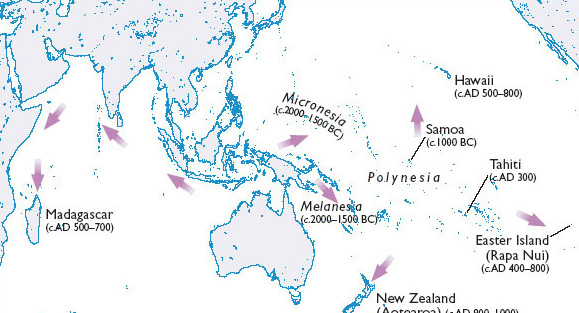
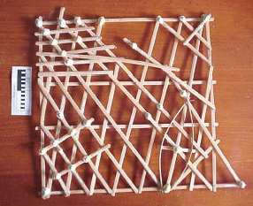
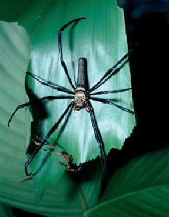

# 3 Settling islands

## 3.1 Voyages of discovery and settlement

In <a xmlns:str="http://exslt.org/strings" href="">Section 2</a>, we saw that there are momentous new and recently transformed flows that are impacting on island territories. Some flows have important precedents, and others may not be quite as novel as they first appear. In this section, we look more closely at some of the flows that have helped make, remake and sometimes unmake islands.

This takes us away from the flows that have captured recent attention, such as movement of goods or human-induced changes in climate, drawing us into the longer-term process of the formation of island territories. Beginning with the journeys that have taken human explorers and colonists to oceanic islands, we move on to other acts of settlement that are no less wondrous and impressive.

The people of Tuvalu, as we have seen from Readings A–D, are contemplating leaving their islands and shifting permanently to higher and drier ground elsewhere in the Pacific. Consequently, some islanders have already left for New Zealand. Migration, at least in this context, is a kind of flow which occurs as a response to a territory felt to be under threat or pressure. If some of the predictions presented by Conisbee and Simms (2003) in Reading 1B turn out to be accurate, the flow of migrants triggered by climate change and other forms of environmental degradation will dramatically increase over coming decades. Even without additional movements propelled by environmental causes, current rates of migration are already often referred to as ‘floods’ by people in receiving countries. Nevertheless, while there may be many new pathways and intensities of movement in the contemporary world, migration is far from being a novel form of flow.

### Activity 5

#### Question

While you have been reading the story of the threatened existence of the Tuvaluans, have you stopped to wonder how they came to be living on these islands in the first place?

1. 
How did the Tuvaluans come to be hundreds of kilometres from any other land, out in the wide open waters of the western Pacific?

2. 
Did the Tuvaluans’ ancestors once discover these islands? And, if so, where did they come from?

Europeans often talk about having ‘discovered’ many oceanic islands during an era of maritime exploration between the sixteenth and nineteenth centuries, when voyagers like Ferdinand Magellan and James Cook and their crews sailed through the Pacific. However, this is rather misleading for, as anthropologist Greg Dening (1992) reminds us, by this time the Pacific had already been thoroughly explored. As he tells the story:

<!--Quote id=quo001_001-->
>There are more than 25,000 islands in the Pacific. Yet any one of them can be lost in an immense ocean that covers a third of the globe. Remarkably, in the central Pacific where a canoe or a ship could sail for months or for 5,000 miles and never make a landfall, every mountaintop that had pushed from the ocean bed, every coral reef that had grown above the ocean surface had been discovered before the European strangers had had the courage or the knowledge or the technology to discover the sea.
>(Dening, 1992, p. 307)

Evidence suggests that the people who first populated the Pacific, whom anthropologists refer to as ‘Austronesians’, departed from eastern-most Asia and the islands off Southeast Asia. As geographer Patrick Nunn points out, leaving the mainland, or islands that are densely-packed and often visible one from another, and heading out into the open ocean where islands are hundreds or thousands of kilometres apart, would have presented an enormous challenge (Nunn, 2003). Moreover, as he reminds us, such voyages would have commenced in the context of a very different geographical imagination than the one many of us share today. As Nunn puts it: ‘It is difficult today to imagine ourselves without our knowledge of the world. We know the geography of the earth's surface, we have only to flick open an atlas to know instantly the bounds of the Pacific Basin, but the first islanders did not’ (Nunn, 2003, p. 222).

It is now believed that Austronesian peoples were the first in human history to master long-distance ocean sailing, and that they began to colonise the islands of the western Pacific some 3000–4000 years ago. Those who later continued to journey eastwards into the Pacific settled the islands of Polynesia. Known today as ‘Polynesians’, these people continued their way eastwards across the Pacific as far as South America and southwards as far as New Zealand (Aotearoa). Other Austronesians headed westwards across the Indian Ocean, eventually settling in Madagascar, off the coast of Africa (see <a xmlns:str="http://exslt.org/strings" href="">Figure 7</a>).

Figure 7 The Austronesian diaspora with estimated dates of colonisation (Source: based on Pyne, 1997, p. 419 and Fischer, 2002, Ch. 1)

For a long time, Western anthropologists and historians toyed with the idea that most islands were discovered and settled accidentally, by sailors swept away from familiar waters. However, the fact that enough men and women arrived on newly discovered islands to create viable populations, and that there is evidence that they usually arrived with a whole range of plants and animals which they relied upon for food and other needs, suggests a much more organised pattern of settlement (Hau'ofa, 1993, p. 9).

Flying over the Pacific, I have looked out of the aeroplane window, trying to spot small islands. It seems like you can fly for hours without seeing even the tiniest speck of land, which makes you wonder how those early navigators ever found their islands or, having left, ever found them again. This is especially intriguing in the case of Tuvalu and other atolls which are, in the most part, no more than a few metres above sea level.

Those who have studied traditional Pacific navigation give accounts of seafarers gradually building up, over thousands of years, knowledge of swell patterns, wave refraction, currents, prevailing winds and the position of stars. Seafarers were also familiar with more ephemeral signs – phosphorescence, the colour or shape of clouds, the presence of certain fish or birds. By reading such signs, traditional navigators could precisely locate a speck of land in a vast ocean – a practice known in nautical terms as ‘dead reckoning’. Moreover, they could still sail home in this way in cases where their vessels were storm-blown hundreds of kilometres off course (Lewis, 1994).

Marshall Islands stick ‘charts’, such as the one in <a xmlns:str="http://exslt.org/strings" href="">Figure 8</a>, are used for teaching about wave refraction around islands. Unlike most modern Western charts or maps that attempt to give a one-to-one correspondence with the area they represent, the stick chart is not intended to be in proportion to actual oceans and islands, and it does not necessarily refer to any specific area. Instead, it depicts the processes or dynamics by which swells hitting an island are refracted back into the ocean. It is for learning purposes only and is not taken to sea. It is said that traditional Marshallese seafarers could lie in the bottom of their canoes and navigate using the feel of waves and the current on the hull. This suggests that they relied less on visual recognition and cues than do most modern Western mariners.

Figure 8 Stick chart from the Marshall Islands

Amid all the contemporary talk of accelerating long-distance migration, tourism and other flows of people around the world, it is easy to overlook how far and how frequently people travelled hundreds or even thousands of years ago. In the late eighteenth century, Captain Cook noted that Polynesian ocean-going canoes could sail far faster than his own ships, and he judged that they could ‘with ease sail 40 Leagues [120 miles] a day or more’ (cited in Lewis, 1994, p. 70). More recent evidence supports Cook's estimates, pointing not only to long-distance journeys around the Indian Ocean and across the Pacific, but also to very frequent trips between neighbouring island groups.

Pacific scholar Epeli Hau'ofa speaks of Pacific islanders, prior to European contact, engaging in a constant movement of ideas, goods and people which linked distinct island groups or territories. As he explains: ‘Fiji, Samoa, Tonga, Niue, Rotuma, Tokelau, Tuvalu, Fatuna and Uvea formed a large exchange community in which wealth and people with their skills and arts circulated endlessly’ (Hau'ofa, 1993, p. 9). After much of the Pacific was colonised by Europeans, colonial administrators tried to restrict inter-island voyaging in an attempt to pin down and firm up the boundaries of various island territories. Hau'ofa tells of an earlier time: ‘the days when boundaries were not imaginary lines in the ocean, but rather points of entry that were constantly negotiated’ (Hau'ofa, 1993, p. 9).

Hau'ofa seems to be saying that islands, though they may be bounded in some respects, were certainly not closed or isolated. These were territories that were permeated by flows. Therefore, centuries and, in some cases, millennia before Europeans made their way across the world's oceans, Pacific navigators were already reworking sea and islands into a space in which human beings ‘flowed’. Although it is unlikely that they would have been able to imagine the world to be a single place – in the way it is now possible to think of the globe in its entirety – Austronesian and Polynesian voyagers succeeded in forging connections that spanned more than half of the planet's surface. In fact, with hindsight, it has been argued that these seafaring peoples made greater leaps towards globalising the world than any others, before or since (Gould, 1992, p. 109).

Looking at this long history of oceanic journeying helps to give a sense of the way human beings have been generating new flows – sometimes over very long distances – for thousands of years. These flows have been vital in establishing new territories by opening up lands for settlement. Nonetheless, it is important to see that the settling of new islands has not been achieved by humans alone. As was suggested above, Polynesian settlers travelled with a ‘portmanteau’ of useful animals and plants. Along with seedlings of the plants they needed for food and clothing, island colonists across much of the Pacific also introduced their traditional ‘feasting’ animals – pigs, dogs and chickens – to their new homes (Dening, 1992, pp. 307–8). In the case of Tuvalu, such staple foodstuffs as breadfruit, taro and banana would probably have been brought to the islands on board the canoes of inter-island voyagers.

It is worth considering more closely the dynamic relationship between territories and flows in the case of oceanic islands. We have seen in <a xmlns:str="http://exslt.org/strings" href="">Section 2.3</a> how the concept of territory helps us to conceive of islands as a weave of many different strands. Like other territories, islands are inconceivable without the input and throughput of flows and, as with the notion of territory, one of the advantages of thinking through the concept of flow is that it can be inclusive of both human and non-human elements. Thus, when we consider the ways in which territory and flow are interrelated, it is possible to address the human and the non-human together, and to recognise that they often share similar dynamics.

Considering the interaction of territory and flow encourages a view of islands as having been made, rather than simply discovered or awaiting discovery. This making is ongoing: islands remain open to the possibility of being unmade or remade. However bounteous and balmy tropical islands may sometimes appear, we should not forget that making islands is difficult and often dangerous work. Every new arrival to an island – either human or non-human – has to find some way of weaving itself into the existing fabric of island life if it is to make itself at home. On smaller islands especially, newcomers may struggle to find enough of the things they need to sustain them, while the existing pattern of island life may be deeply disturbed by even a few impetuous new arrivals. In many cases, not only have new groups of human settlers caused much damage to the islands on which they have settled, but so too have the rats, pigs, cats and other predatory species that have accompanied such humans on their oceanic voyaging (Quammen, 1996).

Yet is it enough to think of human beings, working together with their companion species, as the producers of viable island territories? Human colonists did not settle barren rocks or bare coral in the middle of the ocean. They, and the useful species they brought with them, could never have settled themselves were the islands they found not already a rich weave of living and non-living things. If the story of how the earliest oceanic voyagers established new flows between distant lands is an awe-inspiring one, no less epic are the achievements of all the other life forms which had already made themselves at home on even the most isolated oceanic islands.

## 3.2 Migrations of life

As biologist and pioneer environmentalist Rachel Carson once wrote: ‘the stocking of the islands has been accomplished by the strangest migration in earth's history – a migration that began long before man appeared on earth and is still continuing’ (Carson, 1953, p. 66). Austronesian voyagers may have been the first people to venture far into open water, but many other species, as Carson suggests, have also found ways of negotiating passages across the ocean. Arriving at pockets of land thousands of kilometres out in the Pacific, the first human voyagers encountered plants, insects, crustaceans, birds and sometimes even reptiles and mammals.

### Activity 6

#### Question

In the same way that Activity 5 asked you to ponder how the people of Tuvalu came to inhabit their islands, now give some thought to how other forms of life may have reached oceanic islands before they were able to hitch lifts on human vessels. It may take a little imagination, and an ability to take low odds and sheer fluke into account, but see if you can come up with some ideas.

This is indeed a challenging problem, and biologists, including Charles Darwin, have spent a great deal of time trying to answer it. Back in the mid nineteenth century, when Darwin was still working on his theory of evolution, biologists, or ‘natural historians’ as they were usually called, often relied on theories of land bridges to explain how different organisms found their way to islands. At this time it was already widely accepted that sea level had varied considerably over long periods of time, so that present-day islands may not always have been encircled by sea. As Darwin wrote in *The Origin of Species*, ‘authors have thus hypothetically bridged over every ocean, and have united every island to some mainland’ (Darwin, 1996, pp. 288–9, first published 1859). While agreeing that these submerged connections might explain the populating of some islands, particularly those closer to the mainland, Darwin was dubious about their extension to oceanic islands – in part, because he was well aware that many of these islands were volcanic in origin, rather than being detached outcrops of once larger continents.

This left Darwin speculating over, and experimenting with, the ways that various forms of life might have made it across oceans. He proposed that seabirds must have played a major part in the dissemination of plant life by unintentionally dispersing seeds. Following an intuition along this line, Darwin once plucked a ball of mud from the plumage of a seabird, and extracted from it enough seeds to grow 82 separate plants from five different species (Carson, 1953). He performed similar experiments with seeds that had passed through the digestive system of birds, and also gathered evidence that nuts, fruit and other seed-bearing propagules could endure lengthy immersion in sea water and still germinate successfully (Darwin, 1996, pp. 290–3, first published 1859). Later researchers have gone on to identify lightweight seeds equipped with feather- or parachute-like appendages that enable them to ascend high into the sky and to be wind blown across vast distances, as Rachael Carson (1953) recounts.

While sea-going birds and ocean and air currents could explain the dispersal of plant life, many members of the animal kingdom have posed thornier problems. The presence of land-based and frequently flightless birds on oceanic islands – such as the ill-fated dodo of Mauritius – was especially baffling. That is, until Darwin's theory of long-term evolutionary change offered a way of explaining how birds that were once capable of long-distance flight had subsequently adapted physically to a more terrestrial life. While some insects have likewise arrived with their own wing power, others have evolved ways of hitching lifts with seabirds or drifting on air currents, such as the numerous species of spider known to float or ‘balloon’ across the sea on their own silken filaments (see <a xmlns:str="http://exslt.org/strings" href="">Figure 9</a>) (Winchester, 2004; Carson, 1953).

 Figure 9 Nephila maculata: a ballooning spider

In the case of many land-based life forms, which could not conceivably have relied on wings, fins or floating ability, it was Darwin's contemporary, Alfred Wallace, who offered evidence from the field of some intriguing modes of maritime voyaging. Among the islands between the Pacific and Indian Oceans, Wallace observed large clumps of drifting vegetation, and speculated that all sorts of organisms – including mammals and reptiles – could raft across hundreds of kilometres of open sea in this way, eventually colonising new islands. However, he also recognised that this was an incredibly chancy affair, especially considering that many species rely on sexual reproduction, and that it would require a pair of organisms to complete the journey (Quammen, 1996, p. 145). Subsequent researchers have lent support to Wallace's speculations. It is now widely acknowledged that not only uprooted trees and matted vegetation but also volcanic rock, such as the eminently buoyant pumice, operate as a ‘sea going transport system’ for the propagation of island life (Barnes, 2002, p. 808).

### Defining colonisation

Colonisation refers to the process by which organisms become established in an area where they were not previously found. It is a normal and vital part of the changing distribution of life across the planet. In this sense of the word, there have been many times when human beings, like any other species, have established themselves in areas where there were previously no people. In cases where human colonisation involves the establishment of a new group of people at the expense of people previously inhabiting an area, colonisation takes on other, political meanings, not usually associated with colonisation as a biological process (Barnett, 2006).

Many of the ocean-crossing or island-hopping journeys that have brought new species to islands must have been so rare that their contribution to island life only makes sense if great reaches of geological time are taken into account. Being so discontinuous and fitful, it may be stretching the use of the concept to refer to all such forms of mobility as flows’ What is remarkable about these dispersals of non-human life is their continuity with some of the different modes or means of human migration. Polynesian seafarers, you may recall, found their way to new islands by taking advantage of winds and ocean currents, as well as taking pointers from seabirds and ocean-going life forms. These are much the same physical or elemental forces that other species have relied upon to reach new islands, albeit in a more haphazard fashion. Consequently, we might also refer to the prevailing winds and ocean currents, as well as the more regular movements of living things, as forms of ‘flow’ – flows which can be tapped into by opportunistic travellers, both human and non-human.

Islands have been shaped and woven into territories through a combination of flows of very different kinds. Without the many other organisms that have made it over the ocean, crossed the beach and performed the difficult task of weaving themselves into a workable web of life, new human arrivals could not have made a home of these islands.

### Summary

* 
Early seafarers developed the skills to take advantage of flows of wind and sea in order to colonise oceanic islands, as well as creating their own flows between islands.

* 
Other forms of life have also taken advantage of flows of wind and sea in order to cross the sea and colonise oceanic islands.

* 
Every new arrival – whether human or non-human – that crosses the ocean must weave itself into the existing territory if it is to become established on an island.

* 
Human and non-human beings often share similar dynamics in the utilisation of flows to find and shape territories.

