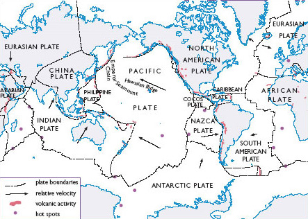

# 4 Volatile worlds

## 4.1 When climate changes

We have seen that human-induced climate change poses a challenge for people who live on islands. Such changing patterns and extremes of climate also put pressure on the other living things that are part of the make-up of island territories. However, long before human beings became aware that they could transform the flows that constitute climate, they and other species were already taking advantage of these same flows to help create the very territories that are now under threat. But have these flows themselves changed over time, even without human input? As mentioned in <a xmlns:str="http://exslt.org/strings" href="">Section 3.2</a>, it has been known at least since Darwin's day that sea levels have changed dramatically over time. This raises some interesting questions about contemporary changes in climate, and how we respond to their effects. In this section, we explore some of the ways in which the earth itself shifts, including the flows we call ‘weather’ or ‘climate’, and the very ground beneath our feet. This takes us into the realm of momentous changes that occur even without human impact or influence, which in turn raises some thorny questions for the issue of responsibility.

As you may recall from <a xmlns:str="http://exslt.org/strings" href="">Section 3.1</a>, anthropologists suggest that the early settlers of the Pacific probably departed from eastern Asia, perhaps via the islands off Southeast Asia. From here, they set out into the world's largest reach of open water, with little way of knowing what they might find.

### Activity 7

#### Question

In Activity 5, the question was posed of how the Tuvaluans came to be on their islands in the first place. You may now have some idea of how they got there, but we have not really considered the question of why. Why do you think the distant ancestors of the people who eventually arrived in Tuvalu (most likely after hundreds of years of island-hopping) left their original homelands?

Hau'ofa (1993) and other scholars familiar with the traditions of Pacific seafaring present a good case that sheer adventurousness has played a large part in Pacific voyaging. Yet this claim refers to people who have had thousands of years of experience in deep-water sailing and navigation. It may not be so useful in accounting for those first forays into the ocean, away from the sight of land.

Perhaps some pressure or stress helped to push people seawards – possibly a shortage of land or other resources. Something along these lines has been suggested by Nunn (2003), and his explanation turns out to have rather a surprising relevance to contemporary islanders threatened by the effects of climate change. Nunn proposes that it might have been the stress brought on by changing climate that first propelled people out into the ‘blue water’ of the Pacific.

It is, of course, very difficult to piece together the motivations of people who lived thousands of years ago, and so speculation is called for. Nevertheless, based on a combination of evidence from archaeology and climatology, Nunn (2003) propounds that rising sea levels caused by a cycle of long-term climatic warming may have been a major push factor.

In the aftermath of the last ice age (about 10,000 years ago), the receding and melting of glaciers would have led to rising sea levels all around the world, with serious repercussions for people who had settled into agricultural life on coastal lowlands. One likely area of displacement, a region where it is known that there were early farmers, was the coasts of East Asia, especially on the rich alluvial plains around the mouths of large rivers like the Huanghe and Yangtze in present-day China. Some of these people, Nunn suggests, may have headed out into the ocean: ‘In this scenario the first true Pacific Islanders were “environmental refugees” rather than the bold, curious adventurers they are sometimes portrayed as having been’ (Nunn, 2003, p. 220).

However, it is unlikely that everybody left the coasts and set out into the oceans, so we might amend Nunn's view and say that they may have been bold and adventurous as well as being under pressure! If we keep in mind, as Nunn encourages us to do, that those setting out into the Pacific had no way of knowing what the world into which they were heading was like, then it is conceivable that those people who ventured out into the open ocean may have been hoping to find places where the sea was not rising (Nunn, 2003, p. 22).

Another way to express this would be to say that as a certain territory came under pressure, or began to destabilise or come undone, some people began an outward flow that would eventually lead them into making new territories. As Lynas (2003) observed in Reading 1A, under current conditions of climatic change the world ‘seemed to be unravelling’. One implication of Nunn's (2003) view is that the world may have also felt like it was ‘unravelling’ in the past, perhaps many times before. Nunn's argument makes a strong claim for the ongoing impact of climatic change on the peoples of the Pacific. For the people of Tuvalu, and many other low-lying islands, climate change indeed appears to have been decisive in the past. As Nunn explains, it was only after a colder period 2000 or 3000 years ago, with resultant falls in sea level, that the land that became Tuvalu surfaced from the ocean, enabling the accumulation of sand and gravel, and coral growth that helped make the islands.

Subsequently, from around AD 750 to 1250, the Pacific experienced a phase of gradual warming known to climate change scientists as the ‘Medieval warm period’ (Nunn, 2003, p. 223). As temperatures rose, so too did sea levels. Rising sea levels would have brought salt into the fresh water beneath the ground of many islands, as it is doing at present, while declining rainfall would have increased aridity. Although such conditions would have impacted harshly on island life, there may have been some compensation as clear skies and decreased storminess seem to have encouraged long-distance voyaging – increasing inter-island contact and leading to the discovery and settlement of new islands.

Around AD 1300, this warming came to a close and a period of rapid cooling followed. In Europe, this was known as the ‘Little Ice Age’. Global cooling meant more water locked up in ice as well as a general lowering of sea water temperatures worldwide, with the result that sea level may have fallen by as much as 1.1 m between the thirteenth and sixteenth centuries. There are paintings and prints from this period of English history showing people ice-skating or walking on a frozen River Thames. While this spell of coldness may have caused considerable hardship in Europe and other temperate regions, global cooling had rather different implications for the island peoples of the Pacific. Nunn (2003) describes the likely effects of what he calls the ‘AD 1300 Event’:

<!--Quote id=quo001_002-->
>Almost all Pacific Islanders at the time lived along island coasts and, although they may have had inland food gardens, they would also have depended on crops (including coconuts) growing on coastal lowland areas. As sea level fell, so water tables fell, and many such crops would have grown and yielded less well. More importantly, these people would have been accustomed to acquiring food from nearshore coral reefs but when the sea level fell the most productive parts of these reefs would have been exposed above sea level and would have died. Likewise these people would have routinely exploited lagoonal resources for sustenance or trade, but when the sea level fell and exposed the surfaces of the nearshore reefs, this would have inhibited lagoonal water circulation resulting in turbidity and sluggishness, which in turn would have caused a deterioration in the health of lagoon ecosystems and a decline in their organic productivity.
>The cooling and the increased storminess during the AD 1300 Event would have exacerbated many of the effects described above, largely through increasing stress on various food-producing ecosystems. It is thought that within 100 years of the AD 1300 Event, the food resources readily available to coastal dwellers in the reef-fringed Pacific Islands fell by around 80 per cent.
>(Nunn, 2003, pp. 223–4)

It is difficult to piece together all the factors involved, but such changes are likely to have brought great stress and loss of life: what we might describe as a serious undoing and remaking of many Pacific island territories. Moreover, in the case of very low-lying islands like Tuvalu there was no option, as there was on larger islands, of moving inland to exploit new resources. One redeeming factor is that falling sea levels would have brought new islands and atolls to the surface, some of which were then settled (Nunn, 2003, p. 224). Such islands, however, would have been poor in resources, having not had time to develop a rich web of living organisms.

Nunn's (2003) research reminds us that climate fluctuates and varies, even without human impact. More than this, the evidence he presents makes the point that climate changes not just over millions or thousands of years, but sometimes over timescales short enough to be registered in human lifetimes or in memories passed between generations. While changing flows of air and water might currently threaten island territories like Tuvalu, we need also to consider that earlier changes have not only disrupted island life before, but may have played a pivotal role in initiating the exploration of oceans and settlement of islands. Changing climate contributes not only to the unmaking of islands, but also to their making.

We have seen that there were very different, but nonetheless parallel, experiences of cooling in the AD 1300 Event in northern temperate countries like Britain and on the tropical islands of the Pacific. It is worth considering what the implications of this might be for the way we imagine our world. In both places, at the same time, climate change exerted considerable stress. Yet, from a human perspective, these far apart territories did not share a common world. It was only towards the end of the cold phase that the first European explorers ventured into the Pacific Ocean, and it was not until several centuries later that contact between Europeans and Pacific islanders became ongoing and sustained. Therefore, in the imaginary geographies of the era – of both Europeans and islanders – it was not yet possible to experience climate change as a fully global phenomenon.

Nonetheless, as we can see through the lens of a contemporary world view, climate change in the AD 1300 Event and all other major fluctuations in climate are fully global phenomena. Climate in temperate Europe and climate in the tropical Pacific was as connected and mutually implicated then as it is now, as it has been for the estimated 4.5-billion-year existence of our planet. Thus, knowledge of human-induced climate change may be contributing to a new experience of entanglement between faraway people or places, but in another sense – a purely physical sense – our planet has always already been fully globalised.

An understanding of the globalised climatic flows that impact on oceanic islands adds further weight to the idea that the making of territories is a much more than human process and, indeed, a much more than biological or organic process. This awareness of forces and energies that are literally larger than life becomes even more pronounced when we turn to the physical processes that bring islands into existence.

## 4.2 Shifting ground

In <a xmlns:str="http://exslt.org/strings" href="">Section 3</a> and in <a xmlns:str="http://exslt.org/strings" href="">Section 4</a> so far, we have begun with the questions of how and why humans found their way to oceanic islands, and how other living things have come to make themselves at home on these same islands. The question we have yet to consider, the one that in a way underpins these other questions, is how there came to be isolated tracts of land in the middle of a vast ocean in the first place. To answer this, we need to turn to the insights of the earth sciences.

There are hints that have surfaced in previous sections of the unit about the formation of islands. As you may recall from <a xmlns:str="http://exslt.org/strings" href="">Section 4.1</a>, falling sea levels facilitated the accumulation of sand and gravel, and the coral growth that helped form the islands that are today's Tuvalu. However, in order for these processes to occur, there must already be a significant protrusion from the seabed, and it is the formation of such irregularities that directs our attention to some of the most powerful forces that have shaped, and continue to shape, our planet.

### Defining earth science

Earth science (also known as ‘geoscience’) is an all-embracing term for the sciences related to the study of the origin, structure and physical phenomena of the planet earth. It includes the study of rocks, oceans and fresh water, ice and the atmosphere, as well as the dynamics that connect these parts of the planet together.

As most earth scientists now agree, it is the movement of the vast rigid plates that make up the earth's crust – the process of plate tectonics – that is behind the formation of the major peaks and ranges that rise up from the surface of the planet. The location of these plates, and their direction of movement, can be seen in <a xmlns:str="http://exslt.org/strings" href="">Figure 10</a>.

 Figure 10 The location of tectonic plates, showing direction of plate movement and sites of volcanic activity (Source: Colling et al., 1997, p. 113)

The molten rock (or magma) that creates these tectonic plates wells up from beneath the earth's crust along submarine ridges on the seabed. In turn, this creation of new crust pushes the existing plates sideways, where they collide with other plates. When plates converge in this way, one of them will be forced downwards, deep below the earth surface, in a process of plate destruction that balances out plate creation. The immense force of one plate being driven under the other melts the crust into magma. When this occurs on continental land masses, this magma tends to erupt into volcanic mountain ranges; when it occurs under the sea, the resulting eruptions tend to give rise to an arc of volcanoes which forms the basis of oceanic islands such as those found in the western Pacific (Colling et al., 1997, pp. 114–15). These processes are depicted below.

The action of plate tectonics, showing the formation of volcanic island arcs at the meeting point of plates
<!--MEDIACONTENT--><!--ENDMEDIACONTENT-->
In the warmer reaches of the oceans, some of the work that brings the peak or ‘cone’ created by volcanic activity to the surface can be carried out by life itself. Coral, attracted to a submerged volcano, lives out its life just beneath sea level. The skeletons of coral polyps build up into solid structures of limestone over many generations, which may then be pushed above the waves by further tectonic activity to form an island or atoll.

Once a cone rises above the sea's surface, it begins to attract wandering life forms, as we saw in <a xmlns:str="http://exslt.org/strings" href="">Section 3.2</a>. Yet the same processes that produce the ground on which organisms can gain a foothold can also extinguish this life, reverting a verdant island to barrenness with a later coating of ash and lava, or annihilating the island altogether in a violent outburst or subsidence (Carson, 1953; Winchester, 2004).

The Indian Ocean tsunami of December 2004 was a reminder of the immense force of the ongoing process of plate tectonics. The waves were generated by an earthquake just north of the island of Sumatra, at a point along the juncture where the Indian Plate is being driven under at a rate of around 2.5 cm or so a year as a result of its convergence with the China Plate (often included as part of the larger Eurasian Plate). While a string of active volcanoes in the region usually provides a release for the energy generated by this ongoing collision, geologists believe that a sticking point in the convergence zone led to a gradual build-up of pressure. This in turn caused a 965-km-long section of plate to subside suddenly, displacing vast amounts of water and producing the massive swells that swept across the Indian Ocean with such devastating results.

Unlike the flows and fluctuations in global climate, which we now understand to be at least partially influenced by human activity, the geological processes that give rise to islands and other major protrusions on the earth's surface remain largely impervious to all the exertions of our species. Along with upwelling of magma, the shifting and shuddering of tectonic plates are evidence that even the ground beneath our feet is in flux. Furthermore, just as human migrations and excursions, the mobility of other living things, and the currents of air and water each constitute different kinds of flow, we might also conceive of these ongoing movements of the earth's crust as a particular kind of flow. Sometimes this flow is gradual, so slow as to be imperceptible, but at other times, as I intimated in <a xmlns:str="http://exslt.org/strings" href="">Section 1</a>, it manifests itself cataclysmically, in ways that can render our maps obsolete in minutes or seconds.

It may be that for most of us it is only at these occasional or exceptional moments of upheaval that the flow of the ground on which we construct our territories really makes itself felt. However, no less than the flows and circulations that comprise the earth's climate, the flux of plate tectonics is a fully global process in which different parts of the earth's crust work together on the planetary scale. An understanding of this geological volatility of the earth brings another dimension to the sense of territories as constantly in the making, which we have been exploring in various ways throughout this course. In a particularly powerful way, this volatility points to the contingency of any territory, and to the possibility for unmaking that is inseparable from the potential of making and remaking. There may be no better illustration of these contingencies than oceanic islands, which are forged from some of our planet's most convulsive processes, and brought to life by some of the most risky and opportunistic migrations ever undertaken.

What does this mean for the plight of islanders like the people of Tuvalu who find themselves in the front line of potentially momentous transformations of global flow? In the following section, we return to the question of human-induced climate change in relation to some of the other active processes and forces we have been examining.

## 4.3 Dilemmas of climate change

In <a xmlns:str="http://exslt.org/strings" href="">Section 4.1</a>, we looked at claims that climatic change thousands of years ago triggered the movement of people into the ocean, eventually leading to the settling of islands like Tuvalu. We have also seen that these islands only rose out of the ocean because of dynamic geological processes coupled with dramatic changes in climate and sea level.

### Activity 8

#### Question

Take a moment to consider how an understanding of the formation of oceanic islands like Tuvalu makes you feel about the current predicament of the Tuvaluans. Has it changed the way you think about human-induced global climate change and the responses or responsibilities this might entail?

The people of Tuvalu claim that carbon emissions are changing global climate. In particular, they point to the unwillingness of nation states like the USA and Australia to support the Kyoto Protocol, which seeks to reduce these emissions. The idea that the earth's natural greenhouse effect is being enhanced by a build-up in carbon and other greenhouse gases because of non-renewable energy use is fully supported by many environmental campaigners around the world, such as Molly Conisbee and Andrew Simms, the authors of *Environmental Refugees* (2003; see Reading 1B). This notion is also supported by the huge international consortium of climate scientists that comprises the IPCC. Similarly, for Nunn (2003), and many other geographers who have made a study of oceanic islands, the inherent changeability and precariousness of island life is reason not to discount human-induced climate change, but to take it very seriously indeed.

Nonetheless, perhaps unsurprisingly, there are others who see this differently. Some commentators have used the idea of the constant motion of the earth's crust to counter the argument that greenhouse gas emissions are having a significant impact on sea levels. In this regard, US climate negotiator Harlan Watson has noted the particular instability of the Pacific: ‘The South Pacific is very volcanically unstable on the sea floor … so you have some natural subsidence occurring anyway. Islands are appearing and disappearing all the time’ (cited in Kriner, 2002, p. 2). Other voices in the climate change debate have argued that because global climate fluctuates constantly, current warming is nothing out of the ordinary. Danish statistician Bjorn Lomborg, for example, has suggested that as the planet is still coming out of the Little Ice Age, a gradual warming and attendant rise of sea level is to be expected (Lomborg, 2001, p. 263). Similarly, Bill Mitchell of the Australian Tidal Facility claims that there is little evidence in the Pacific of sea level changing more rapidly than that which would be expected from gradual natural warming (Field, 2002).

It would be an oversimplification, however, to suggest that the climate change debate neatly divides itself into two opposing factions. Researchers and campaigners of all persuasions have taken the possibility of human-induced changes into account as well as the many physical variations that are not reducible to human activity, and this leaves room for very different weightings to be applied to the many variables involved.

Thinking through territories and flows does not offer any easy answers to, or any direct route out of, the dilemmas posed by the prospect of a human contribution to global environmental change. Yet it can offer a versatile way to approach any such issue that brings together human and non-human forces. Furthermore, with the kind of issues that present themselves in the contemporary world, the need to address human and non-human processes together seems to be more the rule than the exception.

### Summary

* 
There is evidence that natural fluctuations of climate may have induced the earliest human settlers of oceanic islands to head out into the ocean, and may have put later island territories under severe stress.

* 
Islands are both created and destroyed by shifts and flows of the earth's crust, forces that are largely beyond human influence.

* 
The difficulty of disentangling human impacts on global climate from natural fluctuations means that working out the human contribution to these environmental changes is a complex and contested process.

* 
While territories may appear stable or fixed, our planet is constantly in the making, all the way down to the earth's crust and the molten rock beneath it.

