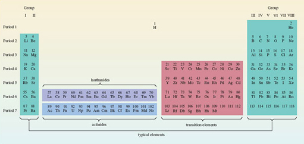
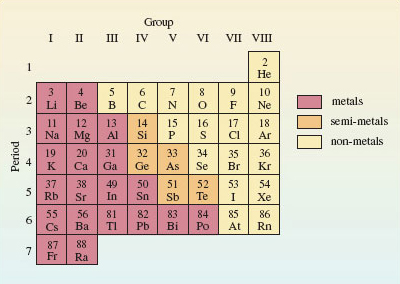

# 2 Chemical patterns are to be found in the periodic table

## 2.1 Chemical periodicity

The chemistry of the elements is immensely varied. But amidst that variety there are patterns, and the best known and most useful is chemical periodicity: if the elements are laid out in order of atomic number, similar elements occur at regular intervals.

The discovery of chemical periodicity is particularly associated with the nineteenth-century Russian chemist Dmitri Ivanovich Mendeléev (Figure 16). The periodicity is represented graphically by Periodic Tables. <a xmlns:str="http://exslt.org/strings" href="">Figure 17</a> shows the Periodic Table used in this course. Chemical periodicity is apparent from the appearance of similar elements in the same column. For example, the alkali metals appear in the first column on the left of the Table, and the noble gases in the last column on the right. Horizontal rows are called *Periods*; vertical columns are called *Groups*. The Table can be neatly divided up into blocks of elements (transition elements, lanthanides, actinides and typical elements), each with their own distinctive properties. Above each element is its atomic number. These numbers run from 1-118, 118 being the highest atomic number so far [2001] claimed for any observed atom.

							Figure 16 The hypnotic face of Dmitri Mendeléev (1834-1907) has been likened to that of Svengali or Rasputin. Such comparisons are encouraged by his insistence on having just one haircut a year. His scientific fame rests mainly on his boldness in using his Periodic Law to predict the properties of undiscovered elements. For example, after Lecoq de Boisbaudron had announced the discovery of the new element gallium in 1875, he received a letter from Mendeléev. The letter informed him that Mendeléev had already predicted the properties of gallium, and that his experimental value for its density appeared to be wrong. de Boisbaudron then redetermined the density of gallium, and found that Mendeléev's assertion was indeed correct!

							Figure 17 The complete Periodic Table used in this course. Note how the position of hydrogen has been left undecided. Some of its properties point to a position in Group I with the alkali metals; others to a position in Group VII with the halogens

Click to view larger version for Figure 17

[View document](https://www.open.edu/openlearn/ocw/mod/resource/view.php?id=26798)

This course is largely concerned with the typical elements. These occur on the extreme left and extreme right of Figure 17. It is convenient, therefore, to create from Figure 17 a mini-Periodic Table that contains the typical elements alone. By removing the transition elements, the lanthanides and actinides, and by pushing the two separate blocks of typical elements together, we arrive at Figure 18. This mini-Periodic Table consists of seven Periods and eight Groups. The seven Periods are numbered from 1 to 7, but it is more difficult to settle on the best way of labelling the Groups.

In Figure 18, they are numbered in roman numerals from I to VIII. This is the principal Group numbering scheme used in this course, but other ways of numbering the Groups are mentioned in Sections 2.2 and 2.3.

							Figure 18 A mini-Periodic Table containing the typical elements up to radium; it consists of eight columns or Groups, and seven rows or Periods. Hydrogen has been omitted for the reasons cited in the caption to Figure 17

Clear examples of chemical periodicity are revealed by Figure 18. Many involve the *valencies* of the elements. Here we use valency in the classical sense: a number that determines the ratios in which atoms combine. Table 1 shows the most important valencies of some common elements.
<table xmlns:str="http://exslt.org/strings">
<caption>
							Table 1 The most important valencies of some common elements</caption>
<tbody>
<tr><td class="highlight_" rowspan="" colspan="4">Valency</td></tr>
<tr>
<td class="highlight_" rowspan="" colspan="">1</td>
<td class="highlight_" rowspan="" colspan="">2</td>
<td class="highlight_" rowspan="" colspan="">3</td>
<td class="highlight_" rowspan="" colspan="">4</td>
</tr>
<tr>
<td class="highlight_" rowspan="" colspan="">hydrogen (H)</td>
<td class="highlight_" rowspan="" colspan="">oxygen (O)</td>
<td class="highlight_" rowspan="" colspan="">nitrogen (N)</td>
<td class="highlight_" rowspan="" colspan="">carbon (C)</td>
</tr>
<tr>
<td class="highlight_" rowspan="" colspan="">lithium (Li)</td>
<td class="highlight_" rowspan="" colspan="">sulfur (S)</td>
<td class="highlight_" rowspan="" colspan="">phosphorus (P)</td>
<td class="highlight_" rowspan="" colspan="">silicon (Si)</td>
</tr>
<tr>
<td class="highlight_" rowspan="" colspan="">sodium (Na)</td>
<td class="highlight_" rowspan="" colspan="">magnesium (Mg)</td>
<td class="highlight_" rowspan="" colspan="">aluminium (Al)</td>
<td class="highlight_" rowspan="" colspan="">tin (Sn)</td>
</tr>
<tr>
<td class="highlight_" rowspan="" colspan="">potassium (K)</td>
<td class="highlight_" rowspan="" colspan="">calcium (Ca)</td>
<td class="highlight_" rowspan="" colspan=""></td>
<td class="highlight_" rowspan="" colspan=""></td>
</tr>
<tr>
<td class="highlight_" rowspan="" colspan="">fluorine (F)</td>
<td class="highlight_" rowspan="" colspan="">barium (Ba)</td>
<td class="highlight_" rowspan="" colspan=""></td>
<td class="highlight_" rowspan="" colspan=""></td>
</tr>
<tr>
<td class="highlight_" rowspan="" colspan="">chlorine (Cl)</td>
<td class="highlight_" rowspan="" colspan=""></td>
<td class="highlight_" rowspan="" colspan=""></td>
<td class="highlight_" rowspan="" colspan=""></td>
</tr>
<tr>
<td class="highlight_" rowspan="" colspan="">bromine (Br)</td>
<td class="highlight_" rowspan="" colspan=""></td>
<td class="highlight_" rowspan="" colspan=""></td>
<td class="highlight_" rowspan="" colspan=""></td>
</tr>
<tr>
<td class="highlight_" rowspan="" colspan="">iodine (I)</td>
<td class="highlight_" rowspan="" colspan=""></td>
<td class="highlight_" rowspan="" colspan=""></td>
<td class="highlight_" rowspan="" colspan=""></td>
</tr>
</tbody>
</table>

### Question 4

#### Question

What does Table 1 suggest for the empirical formula of an oxide of tin?

#### Answer

SnO2; we start with the valencies of tin (4) and oxygen (2). Exchanging the numbers against the elements gives us tin (2) and oxygen (4). This tells us the combining ratio: two tin atoms combine with four oxygen atoms. To get the empirical formula, the ratio 2 : 4 is converted to the lowest possible whole numbers; the result is 1 : 2. So the predicted formula of the oxide of tin is SnO2.

We now list three instances of chemical periodicity in <a xmlns:str="http://exslt.org/strings" href="">Figure 18</a> that you should be able to exploit:

* 
(i) As the colour coding of Figure 18 shows, metals lie to the left, and non-metals to the right, with semi-metals in between.

* 
(ii) When an element in Figure 18 forms one or more hydrides, then across the eight columns of the Table, the valency of the element in the highest hydride (the hydride that contains most hydrogen) runs in the order 1, 2, 3, 4, 3, 2, 1, 0. Thus, nitrogen occurs in the fifth column, so its hydride is NH3 (ammonia).

* 
(iii) The empirical formulae of fluorides and normal oxides provide an especially important example of chemical periodicity. Normal oxides are compounds in which *single oxygen atoms* are combined with atoms of other elements. For most of the elements in Figure 18, the highest observed valencies are equal to the Group number of the element. This allows the empirical formulae of the highest fluorides and highest normal oxides of the elements to be predicted. Thus, aluminium occurs in Group III, so the highest fluoride is AlF3, and the highest normal oxide is Al2O3.

These generalisations are not perfect. For example, the oxide trend does not work for the elements Po, F, Br, I, He, Ne, Ar, Kr and Rn; the fluoride trend does not work for N, O, Cl, Br, or for any of the noble gases. There is a further comment on this in the next section. Nevertheless, each generalisation is true enough to be very useful.

## 2.2 The Group number of the noble gases

In <a xmlns:str="http://exslt.org/strings" href="">Figure 18</a>, the Period numbers increase steadily from 1 to 7 down the columns. It obviously seems appropriate that the Group numbers should show a similar steady increase from I to VIII across the rows. However, this numbering scheme puts the noble gases in Group VIII. As Section 2.1 makes clear, almost none of these six elements then obeys generalisation (iii). For example, with this Group numbering, generalisation (iii) predicts the formula AO4 for the highest normal oxides of the noble gases, where A represents a noble gas atom. Only for xenon is such a compound known.

The situation is improved if one changes the Group number of the noble gases from VIII to zero. This is because there are no known oxides or binary fluorides of helium, neon or argon. In the case of the noble gases, generalisation (iii) then fails only at xenon when predicting oxide formulae, and at krypton, xenon and radon when predicting fluoride formulae. So in introducing chemical periodicity through generalisations (ii) and (iii), it makes sense to number the first 7 Groups from I to VII as in Figure 18, but to use zero for the noble gases (Group 0). This was also the Group numbering favoured by Mendeléev. In this course, however, we shall use the scheme of Figure 18 in which the noble gases are designated as Group VIII, and the Group numbers increase regularly across each row. The reasons for this change are given in <a xmlns:str="http://exslt.org/strings" href="">Section 3.4</a>.

## 2.3 Elements on parade: an audiovisual interlude

Here you have the opportunity of viewing seven video sequences which show both reactions and properties of some chemical elements. The seven sequences provide examples of the way in which Periodic Tables such as <a xmlns:str="http://exslt.org/strings" href="">Figures 17</a> or <a xmlns:str="http://exslt.org/strings" href="">18</a> elicit similarities or patterns in chemical behaviour. 

The following video clip takes a look at the alkali metals.
<!--MEDIACONTENT-->Video 1NarratorThere are six alkali metals; lithium, sodium, potassium, rubidium, caesium and francium. They're all soft metals which can be cut with a knife. In air the elements quickly become coated with compounds that form on the metals' surface. Here for example is lithium. When we slice it you can see the metallic lustre, but the black coating quickly reappears.Sodium is kept under oil to prevent reaction with air. Again when we cut it the metal surface can be seen but this time corrosion occurs even more quickly.With the next alkali metal, potassium, the corrosion in air is so quick that it's hard to see the metallic lustre at all. As we go down the group the elements seem to react more quickly with air.Now let's see another reaction of the alkali metals, the reaction with water. We'll start with lithium. The metal floats on the water and reacts with it, giving off hydrogen gas.Now for sodium; the same sort of thing happens although the reaction is a bit more vigorous. All the alkali metals react with water in the same way. Let's see an equation for the reaction. Hydrogen gas is produced and the metal dissolves to give an aqueous cation with a single positive charge.Now for potassium; this time you'll see a flame. The heat given out by the reaction is produced so quickly that the hydrogen gas catches fire. It burns with a lilac flame.The next element is rubidium. this time we put a safety screen between us and the reaction. You can see that things gradually become more terrifying as we go down the group.Let's try caesium, our fifth alkali metal.<!--ENDMEDIACONTENT-->
The following video clip compares the four halogens.
<!--MEDIACONTENT-->Video 2NarratorHere are the four halogen elements, fluorine, chlorine, bromine and iodine. Fluorine on the left is almost colourless. Next comes chlorine which is greenish yellow. Fluorine and chlorine are both gases at room temperature. But bromine is a liquid and iodine is a solid; even so, they're both quite volatile. You can see the coloured vapours - orange-red above the liquid bromine and purple above the solid iodine.Whether solid, liquid or gas, the halogen elements consist of diatomic molecules; F2, Cl2, Br2 and I2.Fluorine reacts, often ferociously, with almost everything else. A stream of fluorine instantly sets iron wool on fire and it does the same thing to charcoal. Now lets see the reaction with hydrogen. There's hydrogen in the balloon. A jet of fluorine gas pierces the balloon and explodes with the hydrogen inside. Let's see it again in slow motion. Now you can see the fireball more clearly.Now the reaction between hydrogen and chlorine. I light the hydrogen at the jet and lower it into a jar of chlorine. The hydrogen carries on burning but with a pale blue flame.When the halogens react with hydrogen, the hydrogen halides are produced; HF, HCl, HBr and HI. In each compound the halogen has a valency of one. All four compounds are gases.They're also very soluble in water. Here's water swallowing a jar of hydrogen chloride.Now let's see how the halogens react with aluminium. When aluminium powder meets fluorine gas the reaction's over in a flash.To get chlorine to react with aluminium, I'll heat some foil in a stream of the gas. The white fumes are aluminium trichloride.With bromine I just drop aluminium foil into the liquid. There's a short delay but normal service is soon resumed. Once the reaction gets going it quickly takes on the appearance of the pit of hell. As with the chlorine reaction there's white smoke; that's aluminium tribromide.The reaction with iodine is just as spectacular. A little warming helps to get things moving, but once the reaction's off it needs no further assistance.The products of all four of these reactions are white solids and they're all trihalides, AlF3, AlCl3, AlBr3 and AlI3. Now aluminium is a trivalent element so in these compounds the halogens are all showing a valency of one. That valency of one is also satisfied when the halogen atoms bind to one another in the diatomic molecules with which I started this sequence.<!--ENDMEDIACONTENT-->
The following video clip shows the process of burning a diamond.
<!--MEDIACONTENT-->Video 3NarratorThis emphasis on the formulae of compounds; on the ratios in which atoms combine and what Mendeleev knew as the valencies of the elements lies at the heart of the periodic law. Without it the law would often seem ridiculous. For example look at these elements, silicon and carbon. They lie at the top of Group IV.One form of carbon is diamond. Now you may have read somewhere that diamonds are forever. After you've seen this, you'll never believe that again. (a diamond is heated and placed in liquid oxygen)So when diamonds burn they form a gas. As you can see it's quite heavy. Now we could have burned silicon in the same way but the product wouldn't have been a gas it would have been this. This is the oxide of silicon. It's some sand that I picked up on a Norfolk beach. So when carbon and silicon are burnt in oxygen the products look completely different; they have completely different structures too but they both have the same kind of formula. They're both dioxides. In both compounds there are two oxygen atoms for every carbon or silicon atom. It was this similarity in the formulae of the highest oxides that led Mendeleev to put carbon and silicon in the same group.<!--ENDMEDIACONTENT-->
The following video clip takes a look at the oxidation states of vanadium.
<!--MEDIACONTENT-->Video 4NarratorIt's not difficult to bring a little colour to the chemistry of vanadium. If I dissolve sodium vanadate in dilute acid I get this solution. It's yellow because it contains the ion (VO2)+. I'm going to shake this solution with zinc amalgam which is made by stirring up zinc with mercury. The first new product has a rich blue colour. This is the ion VO2+. More shaking gives us the bottle green tripositive ion V3+. There's one more stage and a lot of shaking to go. Eventually the lavender colour of the aqueous dipositive ion V2+ appears. Here's a shot of the starting material and our three products. Chemistry doesn't come much prettier than this.<!--ENDMEDIACONTENT-->
The following video clip provides a brief introduction to the lanthanides.
<!--MEDIACONTENT-->Video 5NarratorIn this section we give you the chance to look more closely at the lanthanide elements and their chemistry. For now let’s shrink the main table.First of all, the lanthanides are all metals. Here's a selection. Here’s lanthanum … samarium … dysprosium.If it's heated in chlorine dysprosium forms a trichloride, and all the other lanthanide metals do the same. Chlorine oxidizes all of them to the +3 oxidation state. But the simplest way of reaching this oxidation state is to dissolve the metals in dilute acid.Here's praseodymium. Hydrogen is evolved, and if the reaction is done in air, then whatever the lanthanide metal, the final product is the aqueous tripositive ion. In this case it's green.Compounds or ions in other oxidation states are much less stable. For instance the dipositive aqueous ion of samarium can be made. It's blood red. But it's quickly oxidized by water or hydrogen ions to the pale yellow tripositive ion. The highest known oxidation state of any lanthanide element is +4. The most stable example is cerium(IV) which occurs in cerium dioxide. This is almost colourless. Sulfuric acid converts the dioxide to a sulfate of cerium(IV). It consists of orange crystals. When the orange sulfate is dissolved in water, the orange tetrapositive aqueous ion is formed. But even cerium(IV) species are easily reduced to the +3 state. We'll use hydrogen peroxide as the reducing agent and add it to the orange aqueous ion. Oxygen is evolved as cerium(IV) is reduced. The colourless product is the aqueous tripositive ion of cerium.So for all of the lanthanides the +3 state is very stable to oxidation or reduction. the lanthanide series which begins with lanthanum and ends with ytterbium is a set of unusually similar elements. Take a little time to study the pictures and information that we've provided on the different metals. And as you examine the reactions with acid ask yourself how these elements differ from the reactions that you studied earlier in the transition metal program.<!--ENDMEDIACONTENT-->
The following video clip describes the oxidation states of uranium.
<!--MEDIACONTENT-->Video 6NarratorThe aqueous tripositive ion of uranium is an intense claret colour. When air is bubbled through it, oxidation occurs. A green solution of uranium(IV) is formed. Let’s take some of this uranium(IV) and add nitric acid. On heating the solution gradually turns yellow. This is a solution of the uranyl ion; uranium in oxidation state six. So these are the common oxidation states of uranium in aqueous solution. Yellow uranium(VI), green uranium(IV) and claret-coloured uranium(III).<!--ENDMEDIACONTENT-->
The following video clip describes the separation of uranium from plutonium.
<!--MEDIACONTENT-->Video 7NarratorHere's the key step in nuclear fuel reprocessing. A mixture of uranium and plutonium in kerosene oil has been shaken with hydroxylamine and nitric acid in water. Now it's all settling out. Before shaking, the kerosene solution at the top was green. Now it's yellow. That's because it now contains only uranium as yellow uranyl dinitrate. The plutonium has moved into the lower aqueous layer as blue plutonium trinitrate. When the bottom layer is run off you have a solution of the blue, aqueous, tripositive ion of plutonium<!--ENDMEDIACONTENT-->

## 2.4 Summary of Section 2

1. 
The typical elements can be displayed in a mini-Periodic Table of eight Groups and seven Periods (<a xmlns:str="http://exslt.org/strings" href="">Figure 18</a>). The Periods are numbered from 1 to 7 and the Groups are labelled I-VIII.

2. 
Metals appear on the left of this table, non-metals on the right and semi-metals in between.

3. 
In their highest fluorides and normal oxides, the valencies of the typical elements are usually equal to their Group numbers in Figure 18. In their highest hydrides, their valencies usually follow the pattern 1, 2, 3, 4, 3, 2, 1, 0 across the Period.

### Question 5

#### Question

A typical element Z from <a xmlns:str="http://exslt.org/strings" href="">Figure 18</a> is a semi-metal and forms oxides with empirical formulae ZO2 and ZO3, and a single hydride, ZH2. Identify the element, and state the Group and Period of <a xmlns:str="http://exslt.org/strings" href="">Figure 18</a> in which it lies. What is the formula of the highest fluoride of the element?

#### Answer

Z is tellurium (Te). The *highest* normal oxide ZO3 suggests (point iii of <a xmlns:str="http://exslt.org/strings" href="">Section 2.1</a>) a highest valency of six and, therefore, a Group VI element. Point ii confirms that these elements form a hydride ZH2. The only Group VI element that is a semi-metal is tellurium. It lies in Period 5. Its highest fluoride (point iii again) should have the empirical formula TeF6, and in fact it does.

