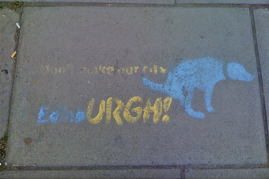

# 4  Looking after public space

Figure 2  Graffiti in Edinburgh reminding citizens to tidy up after their dogs.

While graffiti is often perceived as an eyesore damaging public spaces, in some instances it has the opposite effect. Graffiti can be welcomed as a way of brightening up derelict buildings or neglected public space, or to remind companies, councils or citizens to look after public space. An example of this is Figure 2, a stencilled graffiti which reminds dog owners in Edinburgh to pick up their dog’s waste. Another example is graffiti that appeared in the summer of 2012 on several hundreds of metres of wooden boards fencing off a derelict former fairground site at the seafront in Morecambe (see Figure 3). Over a period of several months, mystery artists gradually added a growing number of painted fish and other sea creatures to the wooden boards at night. In a leaflet that was posted to local residents, the activists, who refer to themselves as ‘MorecambeUnity’, explain: 

<!--Quote id=-->
>We live in Morecambe too and are very sad to see how our local council either ignore our area or allow it to look bad with giant blue walls and boarded up homes. … Life is tough for all of us right now, redundancies, welfare benefit cuts, and the destruction of our public services. So the way we see it, is that maybe we can make some of ‘their’ mess, look a little brighter at least.
Reference: (MorecambeUnity, 2012)

So far, neither the local council nor the local supermarket that owns the site have taken steps to remove the graffiti or prosecute its creators. According to the local newspaper *The Visitor*, the graffiti sea creatures have been very positively received by the public as a way of brightening up a local eyesore (*The Visitor*, 2012). As a local resident argues in a blog on *The Visitor*’s website:

<!--Quote id=-->
>This wall and so called graffiti is a far less crime than that perpetrated by the multi national company of […name of supermarket chain…], who have left this eye sore on our seafront for far too many years.
Reference: (‘A Westender’ in *The Visitor*, 2012)

Figure 3  Fish graffiti covering boards several hundred metres long in Morecambe. Pictures taken by Melody Treasure

