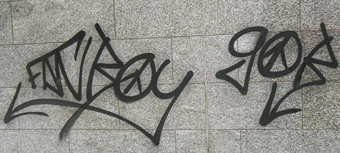
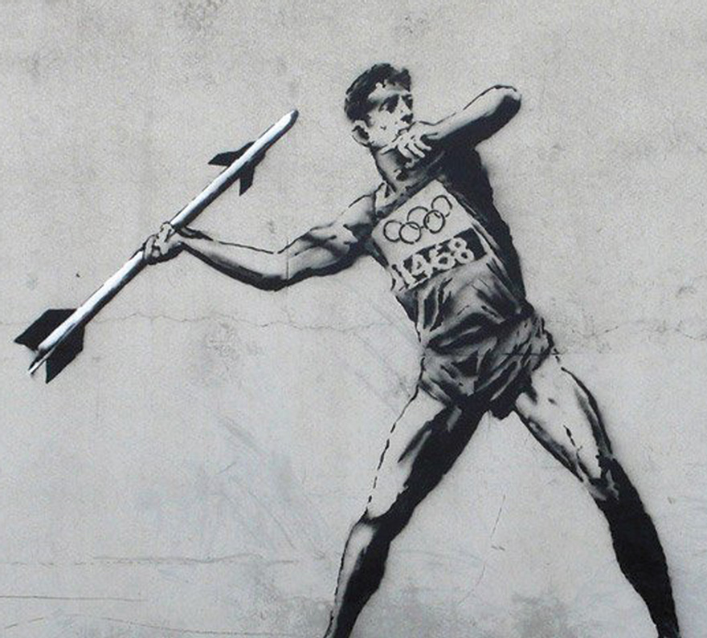

# 5  Graffiti as a form of communication

Regardless of whether or not it is recognised as art, graffiti can be understood as a form of communication.  Graffiti often involves the combination of different modes of visual communication, in particular images, symbols and written words. Graffiti can be used as form of territorial marking, personal branding, flirting, grieving, declaring love, expressing discontent or of showing support for or membership of a particular political group, football team, style of music or music subculture (most notably hip hop) and much more. People that associate themselves with particular groups or subcultures often use specific symbols, signatures or ‘tags’ in their graffiti or adopt a particular style of graffiti that can be easily recognised by members of the same group. 

### Activity 3  Reading graffiti
__Timing: Allow about 10 minutes__

#### Question

Figure 4 is a photograph of graffiti in an underpass near Milton Keynes Central train station. At the time, there were a number of copies of this particular graffiti in various locations around Milton Keynes Central (though not in this combination). Take a look at the photograph and consider what kind of message or messages these graffiti might be communicating. Make some notes in the text box below.

Figure 4  Graffiti in an underpass near Milton Keynes Central train station

#### Discussion

Of course, the answer is personal to you. Here is what a member of the course team thought: 

<!--Quote id=-->
>These are examples of stylised signatures (also known as ‘tags’), most likely written with black spray paint on a grey wall. They read as ‘FANBOY’ and ‘GOB’, which could be titles someone uses to describe themselves. They both are written in very similar style, which suggests they were written by the same person. The last letters of each word or name are extended into arrows and the Os have been turned into peace signs. (At least this is how I read this symbol, which has, for example, been adopted by the Campaign for Nuclear Disarmament (CND) as a symbol of peace. However, we do not know whether this is how this symbol is used in this context.) I have to admit that I have a fairly limited idea of message these ‘tags’ are communicating. It is likely that this combination of letters and the way they are arranged is a way of marking territory or a type of personal branding. From this picture it is not clear whether we are looking at two separate signatures or tags here, or whether both words are linked. As I mentioned above, they look like they have been written by the same person. However, I have no idea whose signature this is or what it stands for or refers to.

This form of graffiti writing ‘isn’t so much about connecting with the masses: it’s about connecting different crews, it’s an internal language, it’s a secret language. Most graffiti you can’t even read, so it’s really contained within the culture that understands it and does it.’ (Faile, artists’ collective, cited in Lewisohn, 2008, p. 15). So, in this case, unless you are a member of the group that uses this form of communication, you will be struggling to understand their ‘internal language’. 

Street art, on the other hand, ‘is more about interacting with the audience on the street and the people, the masses’ (Faile, artists’ collective, cited in Lewisohn, 2008, p. 15). The wider popular appeal of some types of graffiti is often linked to how innovative, entertaining, surprising, acceptable or relevant the messages graffiti convey are perceived to be by a wider audience. Many of Banksy’s graffiti are, for example, very popular because of the dark humour they imply and the satirical, surprising, subversive messages they convey. Banksy’s work in Figure 5, sometimes referred to as *Hackney Welcomes the Olympics*, (mentioned in the BBC News article that you were asked to read as part of <a xmlns:str="http://exslt.org/strings" href="">Activity 2</a>  ‘When does graffiti become street art?’) subverts the stereotypical image of a javelin-throwing athlete by placing a missile in the athlete’s hand. This thought-provoking image could still be interpreted in a range of different ways, but it tries to engage, rather than exclude a wider audience.

Figure 5  Bansky image

Its wider popular appeal often distinguishes street art or murals from other forms of graffiti, such as the ‘tags’ illustrated in Figure 4 from <a xmlns:str="http://exslt.org/strings" href="">Activity 3</a>. However, Peter Ferrari, who is known across the US city of Atlanta as the artist PLF, argues that the distinction between street art (or murals) and tags is not clear cut, and sees a paradox in public attitudes towards graffiti: ‘People hate the tags, but they want the murals. […] I think there is a misunderstanding, and people don’t realize that it is all connected and all related. You can’t have the mural without the tag’ (Ferrari cited in Imam, 2012).

