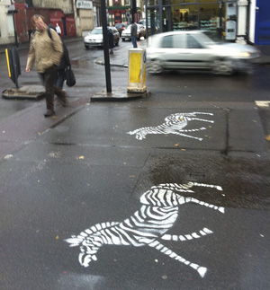
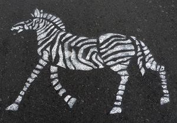

# 6  Graffiti as a form of popular protest

The following case study illustrates how graffiti has been used as an articulation of popular public protest. In 2010, anonymous activists sprayed stencilled zebras on the surface of a road in the London borough of Hackney to draw public attention to a previously unsuccessful seven year long campaign and online petition for a safe pedestrian crossing at a notoriously dangerous junction. 

Figure 6  Image of the crossing in Hackney with one of the zebras that were stencilled on the road in 2010. Photo: Alan Boyles (http://www.eastlondonlines.co.uk/2010/11/mystery-zebras-earning-their-stripes-at-hackneys-killer-crossing/)

Figure 7  Close up image of one of the Hackney zebras. Photo:  (http://www.petitionbuzz.com/petitions/claptoncrossing)

### Activity 4  ‘Mystery zebras’
__Timing: Allow 30 minutes__
<!--Heading:
            Question 1-->

#### Question

Watch the following short film ‘Hackney’s mystery zebras uncovered’, which shows how the graffiti was made, what motivated activists to make these graffiti and how people responded to them. The activists’ voices are altered and their faces covered as they do not want to be identified. While watching this short film, bear in mind the following questions and note your responses in the text boxes below.

* What __effects__ do the ‘Hackey Zebra’ graffiti have on:youthe people shown in the video?

* How were the ‘Hackey Zebras’ made? What __techniques__ are used in their production?

* What does the video say about the wider __context__ within which the ‘Hackeney Zebra’ graffiti were made, and why they were made?

* What do the creators of the graffiti say about the intended __meaning__ of the ‘Hackney Zebra’ graffiti?

### Tip:

Making notes at the same time as you are watching or listening can be tricky as you are likely to miss something. Try watching the whole video first. Jot down very briefly what you noticed that you want to capture next time. Then watch any sections you want to focus on again

<!--MEDIACONTENT--><video xmlns:str="http://exslt.org/strings" width="80%" download=""><source src="https://www.open.edu/openlearn/ocw/pluginfile.php/400935/mod_oucontent/oucontent/10336/y031_2013j_b3_u2_vid005_320x176.mp4" type="video/mp4"></source></video>

Video:  Hackney’s mystery zebras uncovered

Reference: (created by: Lucio Casenato, Hasmik Gasparyan, Sithsatree Khot-Asa and Luisa Miller)

<!--TRANSCRIPT--><table xmlns:str="http://exslt.org/strings" border="1"><tr><td>
__Speaker 1:__ *It’s almost like it was designed by road management as a symbol to tell you that a zebra crossing might be coming up because it’s immediately recognisable. It’s so simple.*;

__Speaker 2:__ *People always go through the red light, you know, trying to get that last chance to get through as well. So that takes away the 10 seconds that you have to dash across the road because someone’s coming through. It’s really the worst place that I’ve ever crossed the road.*;

__Ian Rathbone:__ *I wrote to TFL naively thinking that they would do something because it is obviously dangerous when you stand and look at it. They said they couldn’t do anything. Their reasons were that there have been no fatalities here. So it has to be that somebody dies before you actually do anything about investing in the crossing.*;

__Speaker 1:__ *It’s completely a method of re-claiming the streets. It’s very simple. You’re not hurting anyone.*;

__Speaker 3:__ *To residents who are really frustrated about the lack of crossing, what would you suggest?*;

__Ian Rathbone:__ *All they can do is to wait now.*;

__Speaker 1:__ *I was really thinking about this zebra crossing and I thought it was quite easy to make your own zebra crossing.*;

__Ian Rathbone:__ *They say this is a major road out of London. And as I said to them, is it that cars come first? And they said, would you want to stop the buses? My answer to that is people come before things.*;

__Speaker 1:__ *You just kind of reclaim things. I think that’s really important, especially when people’s voices aren’t heard. If we just painted a zebra crossing, nobody would really think twice about it. But nobody would consider, like, the fact that there is, like, a real whole network of people that have really been actively trying to get that situation fixed. The weapons, the weapons of mass construction. So stand behind me. Hide this. Yeah. Closer.*;

__Speaker 4:__ *Lovely. That’s a zebra crossing.*;

__Speaker 1:__ *What do you think? That was the police?*;

__Speaker 5:__ *Pig. Pig. Stop him. Say something in your defence.*;

[SIREN]

__Speaker 6:__ *Amazing. The kids are like, oh, that’s cool. I mean, [INAUDIBLE] zebra crossing. Oh, it’s brilliant. I hope it worked.*;

__Speaker 7:__ *That’s really cool.*;

__Speaker 8:__ *I love them. I like the wildlife on television, see?*;

__Speaker 9:__ *That’s really neat – this is a brilliant idea, actually.*;

__Speaker 8:__ *That’s a very, very, bad crossing. So it’s badly needed.*;

__Speaker 10:__ *Zebras? Lovely.*;

__Speaker 11:__ *They seem nice.*;

__Speaker 12:__ *I like the zebras. Brighten up the rainy day.*;
</td></tr></table><!--ENDTRANSCRIPT--><!--ENDMEDIACONTENT-->
* What __effects__ do the ‘Hackey Zebra’ graffiti have on:youthe people shown in the video?

#### Discussion

The answer is personal to you and there are many different ways of approaching this task. Here is what a member of the course team thought: 

<!--Quote id=-->
>The ‘Mystery zebras’ made me smile. I regard this graffiti as an example of an amusing and clever way of expressing protest, and I am also impressed by the courage of the protesters (feel free to disagree!). 
>The video also says something about the wider effects of this graffiti. It shows the artists being chased by the police with blue flashing lights and sirens. The video suggests that they were caught by the police, but it is not clear what the end result of this was (that is, whether they were arrested and/or fined). Even though the graffiti caused enough concern to the police to chase (and possibly arrest) the artists, it is also clear that the graffiti was widely welcomed by local residents (judging by the information provided in the video). The video captures a range of reactions by pedestrians, car drivers and cyclists who all respond very positively to the graffiti that mysteriously appeared overnight. The graffiti zebras draw attention to the junction and the badly-needed zebra crossing. People are also pleased with the visual effect of the graffiti and its implicit humour, given that the graffiti is in the shape of zebras, rather than the black and white stripes of an actual zebra crossing. They describe the graffiti as ‘amazing’, ‘brilliant’, ‘really cool’, ‘lovely’, ‘so nice’ and as ‘brighten[ing] up a rainy day’. 

#### Question

* How were the ‘Hackey Zebras’ made? What __techniques__ are used in their production?

#### Discussion

The video shows the artists/activists drawing and cutting out a cardboard stencil of a zebra. At night, they put the stencil on the road and use white spray paint to spray several zebras onto the black road surface. 
<!--Heading:
            Question 2-->

#### Question

* What does the video say about the wider __context__ within which the ‘Hackeney Zebra’ graffiti were made, and why they were made?

#### Discussion

This particular example of graffiti was created in the context of a campaign to improve pedestrians’ safety in Hackney, which had previously not been successful. Campaigners were looking for a way to make ‘people’s voices heard’ and convince TfL (Transport for London) to install a safe pedestrian crossing at this particular junction. 
<!--Heading:
            Question 3-->

#### Question

* What do the creators of the graffiti say about the intended __meaning__ of the ‘Hackney Zebra’ graffiti?

#### Discussion

The artists/activists explain that they chose the zebra graffiti as they perceive it as an effective way of communication that does not ‘hurt … anyone’, is ‘immediately recognisable’ and ‘so simple’. They want to take charge and ‘reclaim the streets’ by making their ‘own zebra crossing’. 

In response to the appearance of the mystery graffiti zebra on the road surface of this junction, Transport for London (TfL) was finally convinced to install an official zebra crossing there. 

