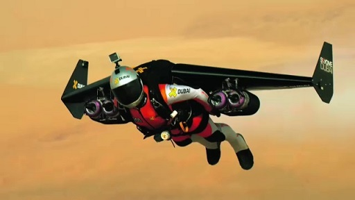
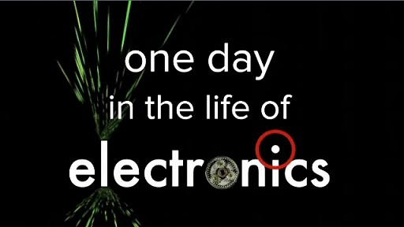
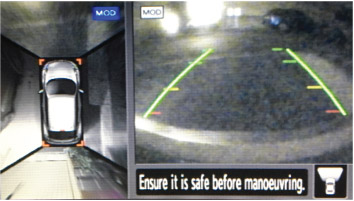
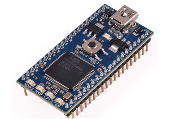
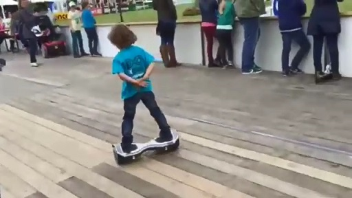

# 1 Electronics everywhere

Electronics is the art of controlling the movement of electrons in order to design components and circuits that are put together to create the technology of the modern world. Increasingly electronics is at the cutting edge of technology, as illustrated in the following video.
<!--MEDIACONTENT--><video xmlns:str="http://exslt.org/strings" width="80%" download=""><source src="https://www.open.edu/openlearn/ocw/pluginfile.php/943433/mod_oucontent/oucontent/48687/electronics-cutting-edge-t212-1-v1-1-320x176.mp4" type="video/mp4"></source></video>

Electronics at the cutting edge

<!--TRANSCRIPT--><table xmlns:str="http://exslt.org/strings" border="1"><tr><td>
__TIM DRYSDALE:__ *Electronics has come a long way in seven decades. Even more importantly, it’s helped the world develop at a pace that is unprecedented in human history.*;

__BERNIE CLARK:__ *Ray Kurzweil estimates the next 100 years will bring a rate of change equal in impact to the last 20 000 years.*;

__PHIL PICTON:__ *Electronics is behind this rapid pace of change. It powers computers that allow us to design, communicate and investigate.*;

__ARMANDO MARINO:__ *The internet can connect us to friends and relatives anywhere on the planet.*;

__JEFF JOHNSON:__ *Computer-aided design processes have advanced many fields of engineering.*;

__TIM DRYSDALE:__ *Medical technology has benefited from 3D imaging techniques that see safely inside the body using light, sound and magnetic fields.*;

__BERNIE CLARK:__ *Electronic equipment is vital to the satellites that allow us to explore the deepest reaches of space.*;

__ARMANDO MARINO:__ *It is essential to keeping humans alive and well in the International Space Station for long periods of time.*;

__TIM DRYSDALE:__ *Our understanding of the world has moved on dramatically through scientific endeavours.*;

__PHIL PICTON:__ *Large-scale investigations of the so-called God particle at the Large Hadron Collider are only possible with the aid of electronics to control the equipment.*;

__BERNIE CLARK:__ *From the smallest GPS trackers used by polar explorers to the largest of facilities on the planet … *;

__JEFF JOHNSON:__ *… the smart vehicles that criss-cross the surface of the Earth, running on autopilot …*;

__ARMANDO MARINO:__ *… to the vessels that explore the deepest reaches of space … *;

__PHIL PICTON:__ *… electronics is everywhere, and underpins the unprecedented rate of technological change.*;

__TIM DRYSDALE:__ *We learn electronics to gain insight into the technologies that touch at the heart of almost every human endeavour.*;
</td></tr></table><!--ENDTRANSCRIPT-->

<!--ENDMEDIACONTENT-->
To get an insight into the central role that electronics plays in society, watch the video below.
<!--MEDIACONTENT--><video xmlns:str="http://exslt.org/strings" width="80%" download=""><source src="https://www.open.edu/openlearn/ocw/pluginfile.php/943433/mod_oucontent/oucontent/48687/day-in-life-of-electronics-t212-1-v1-2-320x176.mp4" type="video/mp4"></source></video>

One day in the life of electronics

<!--TRANSCRIPT--><table xmlns:str="http://exslt.org/strings" border="1"><tr><td>
[MUSIC PLAYING]

[BEEPING]

[BUZZING]

[MUSIC PLAYING]

[BEEPING]

[BEEPING]

[MUSIC PLAYING]

[BEEPING]

MAN: Oh, hello, [INAUDIBLE]. Was not expecting your phone call.

[MUSIC PLAYING]

[BEEP]

[MUSIC PLAYING]
</td></tr></table><!--ENDTRANSCRIPT-->

<!--ENDMEDIACONTENT-->
This section of the course will introduce you to the sensing–logic–actuation cycle, the three aspects of which form the basis of understanding electronics.

## 1.1 Autonomous systems

Any autonomous system has three fundamental aspects: sensing the environment using sensors, reasoning through logic and information processing, and then interacting with the environment through actuators. Together, these are known as the *sensing–logic–actuation cycle*, as shown in Figure 1.

![At the bottom of this diagram is a narrow irregular horizontal shape representing the environment. Above it are three boxes, with the first one on the left, the third one on the right and the second one above and centred on the other two. The first box is labelled ‘Sensing’, the second box is labelled ‘Logic – reasoning, planning and control’, and the third box is labelled ‘Actuation’. Arrows connect the three boxes and the environment to form a continuous clockwise cycle from the environment to the sensing box to the logic box to the actuation box, and back to the environment again. This is the sensing–logic–actuation control cycle.](images/sensing-logic-actuation-t212_1-1-1.eps.jpg)

__Figure 1__  The sensing–logic–actuation control cycle for autonomous systems

Each of the three aspects of the sensing–logic–actuation cycle will be discussed briefly here.

---

Sensing
Electronic devices can sense the world, converting a wide variety of physical phenomena into electrical signals that communicate useful information. Such devices have capabilities similar to the five human senses: hearing (microphones), seeing (cameras), touch (piezoelectrics), and smell and taste (chemical sensors), although sometimes our human senses are better. However, electronic devices can sense things we cannot. For example, Figure 2 shows how ultrasound allows us to ‘see’ inside our bodies, infrared images allow us to ‘see’ patterns of heat and terahertz images allow us to see through opaque coverings.

__Figure 2__ Electronics allows us to perceive things beyond the human senses: (a) ultrasound image of an unborn baby; (b) infrared image of a house; (c) terahertz image of a tooth

The electrical signals generated by sensors can be processed in many useful ways. For instance, there are many sensors in modern cars linked to displays and alarms that inform the driver of the engine speed and temperature, whether or not the doors are properly shut, if all the passengers are wearing seatbelts, of the proximity of other vehicles when parking, and so on (Figure 3).

__Figure 3__  Distance sensors used in a car parking system

---

Logic
Sometimes the information from sensors is fed directly to a human being to act on, as in the car example. However, in many cases that information is unseen by humans and is used to control systems automatically. To do this requires the functions of reasoning and logic, which are usually carried out by logic circuits or programmable microprocessors (Figure 4). These decide what to do from one moment to the next and control the behaviour of the system.

__Figure 4__  A board with a microprocessor capable of many millions of logical operations per second

---

Actuation
Actuators are components that control the movement in an autonomous system. In many systems, actuators of various kinds are controlled to give the desired behaviour. These include electric motors of various kinds, and other means of motion such as pistons driven by compressed air.

For example, the Oxboard shown in Figure 5 has two motors. You will learn more about the Oxboard in Section 1.2.

__Figure 5__  The Oxboard has two motor-wheel actuators

## 1.2 The sensing–logic–actuation cycle in practice

Watch the video below, which is a promotional video for Oxboard showing a child riding one of their two-wheeled devices. It is remarkable how the board responds to the way the rider moves his feet and body, and how controllable it is.
<!--MEDIACONTENT--><video xmlns:str="http://exslt.org/strings" width="80%" download=""><source src="https://www.open.edu/openlearn/ocw/pluginfile.php/943433/mod_oucontent/oucontent/48687/child-riding-oxboard-t212-1-v1-3-320x176.mp4" type="video/mp4"></source></video>

A child riding an Oxboard

<!--TRANSCRIPT--><table xmlns:str="http://exslt.org/strings" border="1"><tr><td>
[BACKGROUND NOISES]

[MUSIC PLAYING IN BACKGROUND]

[BACKGROUND NOISES]

[GIGGLING]

[CHILD SPEAKING]

[MUSIC PLAYING IN BACKGROUND]

[BACKGROUND NOISES]

[BELL RINGING]

[MUSIC PLAYING IN BACKGROUND]

[BACKGROUND NOISES]
</td></tr></table><!--ENDTRANSCRIPT-->

<!--ENDMEDIACONTENT-->
Figure 6 gives some of the details of the Oxboard’s construction and use.

![On the left of this image is a description of the Oxboard, as follows:The Oxboard is a personal transporter. It is a board with two wheels, one each side. Oxboard has two built-in motors fed by a battery pack. You can go forwards or backwards with the Oxboard but also take left or right-hand bends. The compact design also ensures that you can use the Oxboard both inside and outside.The Oxboard is a clever device that reacts to how your weight is distributed. The trick is in particular to relax when standing on the Oxboard; the Oxboard will then ensure the best balance. The Oxboard wil react directly if you distribute your weight ‘unevenly’; lean forward and you will move forwards, lean to the left and the Oxboard veers to the left. etc.On the right is a photograph of the Oxboard with the following components labelled: crash bumpers; rubber mat with sensors below that sense how you are leaning on the Oxboard; battery indicators; motor, wheels and tyres; LED lights; on button; connector for charger.](images/oxboard-description-t212_1-1-6.eps.jpg)

__Figure 6__  The Oxboard product description

Think about the sensing–logic–actuation cycle for the Oxboard transporter system. The board has sensors to detect the way the rider moves his feet and body. It uses logic to compute all the complicated forces associated with the motion; based on that information, it controls the two actuators (motor-driven wheels) to transport the rider in his desired direction.
<!--SAQ id=-->

### SAQ 1

#### Question

Draw a sensing–logic–actuation cycle for the Oxboard transporter using <a xmlns:str="http://exslt.org/strings" href="">Figure 1</a> as a template.

#### Answer

A possible answer is shown in Figure 7.

![This is a sensing–logic–actuation cycle for the Oxboard. The sensing box contains the words ‘Sensors – detect position of rider, various forces, speed, etc.’ The logic box contains the words ‘Logic – calculation of forces, reasoning, planning and control used to decide what power to apply to the motors’. The actuation box contains the words ‘Actuation – the motors turn the wheels to create forces keeping the rider upright and moving in the desired direction’. The environment shape at the bottom contains the words ‘Environment – flat ground’ and ‘Rider in charge’, meaning that the rider is in the environment of the machine, and that the machine responds through its sensors to how the rider leans his body.](images/oxboard-sensing-logic-actuation-t212_1-1-7.eps.jpg)

__Figure 7__  The sensing–logic–actuation control cycle for the Oxboard transporter

<!--ENDSAQ-->
