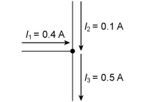

# 2 Basic theory of electrical circuits

Now that you have seen some of the applications of electronics through the sensing–logic–actuation cycle, let’s return to fundamentals.

In what follows, you will look at one of the most important components in electronics: the resistor. This is an example of a *passive component* – a component that does not supply its own electricity. First, however, let’s review some basic electrical quantities.

Note that the term DC means direct current such as that in a circuit powered by a battery. In contrast, the term AC means alternating current as provided by electrical mains suppliers.

## 2.1  Basic electrical quantities

The international standard units, *Système international d'unités* (SI units), that are commonly used for electrical quantities include coulombs, amperes, volts, ohms, watts and joules.

The fundamental unit of electricity is the negative charge of the electron or the positive charge of an ionised atom that has lost a single electron (resulting from the positive charge on the protons in the nucleus outnumbering that of the remaining electrons).

Electrical charge is measured in coulombs (symbol C). The charge on a proton is approximately 1.6 × 10−19 C, while the charge on an electron is the same magnitude but has the opposite sign (approximately −1.6 × 10−19 C). An electrical current is a flow of electric charge, measured in amperes (symbol A), where a current of one ampere is a total charge of one coulomb flowing in one second. Ampere is often abbreviated to amp.

In a circuit, positive and negative electric charges typically flow in the opposite direction to each other, as shown in Figure 8. This course will use conventional current flow, the predominant convention in the electronics industry, which is indicated in the direction taken by positive charges. In metal wires, the current is carried by electrons, which move in the opposite direction. This was not known at the time the convention was established.

![Part (a) shows a schematic circuit with a battery, lamp and switch.Part (b) shows the same circuit but with symbols for the components.The battery, lamp and switch are connected together by straight lines representing wires.The symbol for a battery is two parallel lines, one longer than the other, oriented at right angles to the wire connections. The longer line represents the positive terminal and the shorter line the negative terminal.The symbol for a lamp is a large circle containing a cross that looks like an X.The symbol for a switch is two small circles with a gap between them. A straight line starts at the left circle and ends at a point above the right circle, showing the switch is open. If ‘pushed down’, this line would close the switch and complete the circuit.Both (a) and (b) show electrons flowing from the negative to the positive battery terminal, and current flowing the other way.](images/current-flow-t212_1-2-1.eps.jpg)

__Figure 8__  Current flow in an example circuit showing a light bulb (lamp) powered by a battery: (a) schematic using pictures to represent the components; (b) the same circuit using standard circuit schematic symbols. By convention, current flows in the opposite direction to the flow of electrons.

A quantity closely related to current is voltage. Voltage is a measure of the potential difference between two points. A potential difference of one volt (symbol V) will drive a coulomb of charge through a resistance of one ohm every second. Note that we usually refer to current flowing *through* a component such as a resistor, but to the voltage being *across* the component (because two points are required to define the voltage). Voltage can be expressed as the energy per coulomb of charge (J C−1).

## 2.2  Relationships between quantities

For many materials, current and voltage are directly proportional to each other over a wide range of values, with the resistance as the constant of proportionality, so

 voltage = current × resistance

Such materials are said to obey *Ohm’s law* and are said to be ohmic. However, not all materials are ohmic in nature.

As current flows through a circuit, it transfers energy. When it flows through a material that has a non-zero resistance, this energy is used (for instance, to light a bulb or run a motor) or dissipated as heat (which is why electronics circuits sometimes feel warm, and why computers need cooling fans). As in every other context, the rate of change of energy is known as power, and can be measured in watts (symbol W).

In the context of an electrical current flowing through a resistor, the power used or dissipated can be calculated by multiplying the current flowing through it by the potential difference across the resistor, giving

 power (watts) = current (amps) × potential difference (volts)

Before you move on, Table 1 recaps the electrical quantities mentioned so far, their units and how they relate to each other.
<table xmlns:str="http://exslt.org/strings">
<caption>__Table 1__  Electrical quantities and their units</caption>
<tbody>
<tr>
<th>Quantity</th>
<th>Unit</th>
<th>Equation</th>
</tr>
<tr>
<td class="highlight_" rowspan="" colspan="">energy</td>
<td class="highlight_" rowspan="" colspan="">joules, J</td>
<td class="highlight_" rowspan="" colspan=""> </td>
</tr>
<tr>
<td class="highlight_" rowspan="" colspan="">voltage (potential difference)</td>
<td class="highlight_" rowspan="" colspan="">
volts, V

or

energy per charge, joules per coulomb, J C−1
</td>
<td class="highlight_" rowspan="" colspan=""> </td>
</tr>
<tr>
<td class="highlight_" rowspan="" colspan="">current</td>
<td class="highlight_" rowspan="" colspan="">
amps, A

or

charge per second, coulombs per second, C s−1
</td>
<td class="highlight_" rowspan="" colspan=""> </td>
</tr>
<tr>
<td class="highlight_" rowspan="" colspan="">power</td>
<td class="highlight_" rowspan="" colspan="">
watts, W

or

energy per second, joules per second, J s−1
</td>
<td class="highlight_" rowspan="" colspan="">power = voltage × current</td>
</tr>
<tr>
<td class="highlight_" rowspan="" colspan="">resistance</td>
<td class="highlight_" rowspan="" colspan="">ohms, Ω</td>
<td class="highlight_" rowspan="" colspan="">resistance = voltage ÷ current</td>
</tr>
</tbody>
</table>

All the quantities listed in Table 1 can be measured in larger or smaller multiples of their standard unit using SI prefixes, which make it easier to read values at a glance. Some of these are listed in Table 2.
<table xmlns:str="http://exslt.org/strings">
<caption>__Table 2__  Common prefixes for SI units</caption>
<tbody>
<tr>
<th>Prefix</th>
<th>Symbol</th>
<th>Multiple of standard unit</th>
<th>Example</th>
</tr>
<tr>
<td class="highlight_" rowspan="" colspan="">micro</td>
<td class="highlight_" rowspan="" colspan="">µ</td>
<td class="highlight_" rowspan="" colspan="">one millionth</td>
<td class="highlight_" rowspan="" colspan="">10−6
</td>
<td class="highlight_" rowspan="" colspan="">microamp, µA</td>
</tr>
<tr>
<td class="highlight_" rowspan="" colspan="">milli</td>
<td class="highlight_" rowspan="" colspan="">m</td>
<td class="highlight_" rowspan="" colspan="">one thousandth</td>
<td class="highlight_" rowspan="" colspan="">10−3
</td>
<td class="highlight_" rowspan="" colspan="">millivolt, mV</td>
</tr>
<tr>
<td class="highlight_" rowspan="" colspan="">kilo</td>
<td class="highlight_" rowspan="" colspan="">k</td>
<td class="highlight_" rowspan="" colspan="">one thousand</td>
<td class="highlight_" rowspan="" colspan="">103
</td>
<td class="highlight_" rowspan="" colspan="">kilo-ohm, kΩ</td>
</tr>
<tr>
<td class="highlight_" rowspan="" colspan="">mega</td>
<td class="highlight_" rowspan="" colspan="">M</td>
<td class="highlight_" rowspan="" colspan="">one million</td>
<td class="highlight_" rowspan="" colspan="">106
</td>
<td class="highlight_" rowspan="" colspan="">megawatt, MW</td>
</tr>
</tbody>
</table>

As you gain experience in electronics, try to notice the values of currents, voltages and other quantities for the components you see, and note the associated effects they are having on the circuit. This will help you to choose values when you design, and to troubleshoot when designs or circuits do not work.

## 2.3 Ohm’s law and Kirchhoff ’s laws

Circuit behaviour follows some fundamental laws that allow you to calculate the expected values of voltage, current and resistance at any point in a circuit. These laws will now be explored mathematically.

---

Ohm’s law
Ohm’s law states that voltage=current×resistance. This can also be written as
current=voltageresistance
or, in symbols,
I=VR
The algebraic symbol for current, I, comes from the French word *intensité*.

---

Kirchhoff ’s laws

---

### Kirchhoff ’s first law (the current law)

At any junction, or node, in an electrical circuit, the sum of the currents flowing into the node is equal to the sum of the currents flowing out of the node.

This is the same as saying that charge can neither be stored at, nor dispensed from, these nodes. This is a useful rule of thumb – it helps when thinking about problems to be able to distinguish between places where energy can and cannot be stored.

This law is illustrated in Figure 9, where the sum of the currents in the inputs to the node equals the current out.

__Figure 9__  Kirchhoff’s first law

---

---

### Kirchhoff ’s second law (the loop or mesh law)

When direction is taken into account, the sum of the potential differences around any closed circuit or network is zero. This is illustrated in Figure 10, which is a screenshot taken from an online circuit simulation package called Multisim Live. Here, starting with the battery, the voltages around the circuit are 6.0 V − 1.0 V − 3.0 V − 2.0 V = 0 V.

![This is a circuit diagram showing a 6 volt battery connected to three resistors in series. The resistors have the values 10 ohms, 30 ohms and 20 ohms in that order. Voltage probes show that the voltage before the first resistor is 6 volts; between the first and second resistors it is 5 volts; between the second and third resistors it is 2 volts; and after the third resistor it is 0 volts. Thus the potential difference across the battery is 6 volts, the potential difference across the first resistor is minus 1 volt, the potential difference across the second resistor is minus 3 volts, and the potential difference across the third resistor is minus 2 volts.](images/kirchhoffs-second-law-t212_1-2-3.tif.png)

__Figure 10__  Illustration of Kirchhoff’s second law (screenshot from Multisim Live)

---

---

Series and parallel networks (combining the laws)
The ordering of the components, and how they are connected, is important in a circuit. For example, two components (here resistors) can be arranged in two different ways, as shown in Figure 11. A circuit in which the current must take a single path, going through first one component and then the other in *series*, is shown in Figure 11(a); a circuit in which the current splits and takes two *parallel* paths at the same time is shown in Figure 11(b).

__Figure 11__  Circuit schematics showing two resistors arranged in (a) series and (b) parallel

By combining Ohm’s and Kirchhoff’s laws, it can be shown that:

* 
the total resistance R of n resistors in series is given by
R=R1+R2+⋯+Rn

* 
the total resistance R of n resistors in parallel is given by
R=11R1+1R2+⋯+1Rn
<!--SAQ id=-->

### SAQ 2

#### Question

In Figure 11, let R1=470⁢ Ω and R2=1.3⁢ kΩ. To three significant figures:

1. What is their resistance in series?

2. What is their resistance in parallel?

#### Answer

1. In series, the combined resistance isR1+R2=(470+1300)⁢ Ω=1770⁢ Ω.

2. 
In parallel, the combined resistance is

 11R1+1R2=11470⁢ Ω+11300⁢ Ω11R1+1R2=10.00212…+0.000769…⁢ Ω11R1+1R2=10.00289…⁢ Ω=345⁢ Ω

to three significant figures.

Alternatively, note that for two resistors in parallel,

 11R1+1R2=1R2+R1R1R2=R1R2R1+R2

so the resistance in parallel can be written simply as

 470×1300470+1300⁢ Ω=611⁢ 0001770⁢ Ω=345⁢ Ω (to 3 s.f.)

<!--ENDSAQ-->

## 2.4 Colour coding and standard resistor values

Conventional fixed resistors have coloured bands showing their value. These can be decoded using Table 3. For example, a resistor with four bands where the coding is yellow (4), violet (7), red (× 100) and brown (1%) has a resistance of

 (47 Ω × 100) ± 1% = 4700 Ω ± 47 Ω

There is a similar five-band scheme where there are three instead of two digits in the resistance value, and a six-band scheme that also gives temperature information. Sometimes it can be hard to see these colour values on the resistors and a multimeter is used to check them.

__Table 3__  The four-band colour-coding scheme for resistors

Resistors are required across a range of millions of ohms. To keep costs low, manufacturers have defined ‘standard’ sets of resistor values such as those shown in Table 4 for resistors with a tolerance of ±5%.

__Table 4__  Standard resistor values in ohms (±5%)

The standard or *preferred* values shown in Table 4 are chosen such that whatever value resistance is required, there is one within 5% of the specified value. Fixed resistors’ costs are usually very low.

