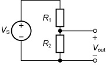
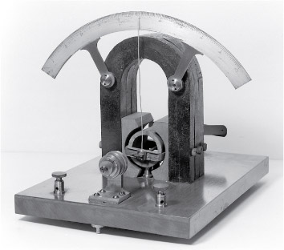

# 3 Some fundamental circuits

By combining resistors in different ways, some circuits can be created that are very important in electronics. This section will look at two of these, the voltage divider and the Wheatstone bridge, before introducing a new component in the form of an operational amplifier (op-amp).

## 3.1 Voltage dividers

Voltage dividers are widely used in electronic circuits to create a reference voltage, or to reduce the amplitude of a signal. Figure 12 shows a voltage divider. The value of Vout can be calculated from the values of VS, R1 and R2.

__Figure 12__  A voltage divider circuit

In the first instance, let’s assume that Vout is not connected to anything (for voltage dividers it is always assumed that negligible current flows through Vout). This means that, according to Kirchhoff’s first law, the current flowing through R1 is the same as the current flowing through R2. Ohm’s law allows you to calculate the current through R1. It is the potential difference across that resistor, divided by its resistance. Since the voltage VS is distributed over two resistors, the potential drop over R1 is VR1=VS−Vout.

The current through R1 (IR1) is given by
IR1= (VS−Vout)R1 
Similarly, the current through R2 is given by
IR2= VoutR2 
Kirchoff’s first law tells you that IR1=IR2, and therefore
VoutR2=(VS−Vout)R1
Multiplying both sides by R1 and by R2 gives
R1Vout=R2⁢ (VS−Vout)
Then multiplying out the brackets on the right-hand side gives
R1Vout=R2VS−R2Vout
This can be rearranged to
R1Vout+R2Vout=R2VS
giving
(R1+R2)Vout=R2VS
and therefore the fundamental result is obtained:
Vout=R2VS(R1+R2)<!--SAQ id=-->

### SAQ 3

#### Question

Suppose VS = 24 V and R2 = 100 Ω. You want Vout = 6 V. What value of R1 do you need?

#### Answer

Rearranging the equation for Vout gives
Vout(R1+R2)=R2VS
and therefore
R1+R2=R2VSVout
which means the equation for R1 is
R1=R2VSVout−R2
Substituting in the values given,
R1=100⁢ Ω×24⁢ V6⁢ V−100⁢ Ω=400⁢ Ω−100⁢ Ω=300⁢ Ω<!--ENDSAQ-->

## 3.2 The Wheatstone bridge

Originally developed in the nineteenth century, a Wheatstone bridge provided an accurate way of measuring resistances without being able to measure current or voltage values, but only being able to detect the presence or absence of a current. A simple galvanometer, as illustrated in Figure 13, could show the absence of a current through the Wheatstone bridge in either direction. The long needle visible in the centre of the galvanometer would deflect to one side or the other if any current was detected, but show no deflection in the absence of a current.

__Figure 13__  An early galvanometer showing magnet and rotating coil

Figure 14(a) shows a circuit made of four resistors forming a Wheatstone bridge. Its purpose here is to show whether there is any current flowing between Vleft and Vright. Figure 14(b) shows an equivalent way of drawing the circuit.

__Figure 14__  Equivalent examples of a Wheatstone bridge

The bridge is said to be *balanced* (that is, no current flows through the bridge and the needle of the galvanometer shows no deflection) if the voltages Vleft and Vright are equal. It can be shown that the bridge is balanced if, and only if, R1R2=R3R4, as follows.

When Vleft−Vright=0 then Vleft=Vright. Then the Wheatstone bridge can be viewed as two voltage dividers, R1 and R2 on the left and R3 and R4 on the right. Applying the voltage divider equation gives Vleft=R2(R1+R2)VS and Vright=R4(R3+R4)VS.

So
R2(R1+R2)=R4(R3+R4)
and
R2(R3+R4)=R4(R1+R2)
Multiplying out the brackets gives
R2R3+R2R4=R4R1+R4R2
which simplifies to
R2R3=R4R1
and
R3R4=R1R2
So, if R4 were unknown, R1, R2 and R3 could be chosen so that the needle of a galvanometer showed no deflection due to the current. Then
R4=R2×R3R1<!--SAQ id=-->

### SAQ 4

#### Question

Assume the Wheatstone bridge shown in Figure 14 is balanced. If R1=1000⁢ Ω, R2=10⁢ kΩ and R3=50⁢ Ω, what is the resistance of R4?

#### Answer

By the formula given in the text,
R4=R2×R3R1=10⁢ 000×501000⁢ Ω=500⁢ Ω<!--ENDSAQ-->

## 3.3  Operational amplifier circuits

Operational amplifiers are a fundamental component in electronics. This section focuses on a classic amplifying device, the 741 op-amp.

As shown in Figure 15(a), the op-amp symbol has five terminals. The terminals *V*+ and *V*− are used for the input and they control the output, usually as an amplified signal on *V*out. The op-amp is built using several resistors and other components called transistors. All these transistors and resistors are packed inside the very small package you can see in Figure 15(b). A dot and a dent on top of the package are generally used to identify the orientation of the package and therefore the pin number. You can also see these marked on the configuration diagram shown in Figure 15(c).

![Part (a) shows the symbol for an op-amp. This is a large triangle with two input wires entering one side. One input terminal is labelled with a + sign and the other with a − sign. An output wire exits the apex of the triangle opposite to the input side. Finally, two more wires enter the other two sides of the triangle, with a direction parallel to the input side. These are the wires that provide power from the power supply.Labels have been added to the symbol to indicate the names that are generally used for the potentials. The input wires bring potentials V+ (for the + input) and V− (for the – input). The output wire provides a potential Vout. The power wires bring potentials VS+ and VS−.Part (b) is a photograph of an op-amp in a package. It is a small black box with eight metallic legs (or pins), like a little bug with two extra legs. The rectangular top of the package has an indentation on one short side and a small circle in one corner near this indentation. Text on the package reads ‘M8420, LM, 741CN’.Part (c) shows the diagram that we can use to understand the correspondence between the pins and the op-amp terminals. It is a rectangle with a triangular indentation marked on the top edge and a black dot in the top left-hand corner. This is used to orient the diagram with respect to the real package.The four pins on the left are labelled, from top to bottom:1 offset null2 inverting input V−3 non-inverting input V+4 negative voltage VS−The four pins on the right are labelled, from top to bottom:8 pin not used7 positive voltage VS+6 output Vout5 offset nullInside the rectangle there is an op-amp symbol, and the wires are shown connecting the pins to the appropriate op-amp terminals. In this case, the – input is shown above the + input in the op-amp symbol.](images/op-amp-t212_1-3-4.eps.jpg)

__Figure 15__  (a) Symbol for an op-amp; (b) the 741 op-amp package; (c) top view of an LM741 dual inline package (DIL), showing internal configuration and pin connections

---

### Dual power supplies

On the op-amp symbol, the vertical lines marked *V*S+ and *V*S− are very important, since, as already mentioned, they are the op-amp’s connection to a power supply. However, when there is no room for confusion, the two vertical lines leading to the power source (*V*S+ and *V*S−) are sometimes omitted from the symbol.

Often a mains dual power supply provides the positive and negative voltages required for an op-amp. Alternatively, you could decide to use batteries to power the op-amp. Since batteries always give a positive voltage, how can they deliver a negative voltage? Figure 16 shows how two batteries can be connected to an op-amp to deliver positive and negative voltages.

![This shows two rectangular 9 volt batteries arranged so that their terminals are on the right. The batteries are placed one above the other so that the terminals from top to bottom read + (1), − (2), + (3), − (4). The − (2) and + (3) terminals (that is, the negative terminal of one battery and the positive terminal of the other) are connected to each other and the potential of the node is called Vmid. By convention, this is considered to be ground.The top + (1) battery terminal is connected to the positive power supply terminal of an op-amp. This connection is called VS+ and is shown to have a positive voltage (9 volts) with respect to Vmid. The bottom − (4) battery terminal is connected to the negative power supply terminal of the same op-amp. This connection is called VS− and is shown to have a negative voltage (minus 9 volts) with respect to Vmid.](images/op-amp-t212_1-3-5.eps.jpg)

__Figure 16__  Black box representation of the 741 op-amp, showing the power supplies

---

## 3.4  Designing a sensor circuit

Figure 17 is a screenshot taken from Multisim Live, showing a circuit with four parts. On the right is a light-emitting diode (LED) and a 470 Ω resistor, R5. On the left there is a device called a light-dependent resistor (LDR). This is labelled R2 and forms a voltage divider with a fixed resistor R1. The resistance of the LDR has been measured as 380 Ω in full ambient light and 1.5 kΩ in the dark. We want the LED to switch on when the environment begins to darken and the resistance of R2 is 680 Ω or more. (Note that U1 is the label that Multisim Live gives to the op-amp.)

![This is a circuit drawn in Multisim Live. On the left, it shows a Wheatstone bridge with a light-dependent resistor (LDR). The resistances are as follows:top left, R1 = 680 Ωbottom left, R2 = 1000 Ω (this is the LDR)top right, R3 = 100 kΩbottom right, R4 = 100 kΩ.An op-amp is connected to the terminals of the Wheatstone bridge. The connection node with the LDR (between R1 and R2) says ‘4.5 V or more when dark’, while the connection node with resistors (between R3 and R4) says ‘4.5 V reference voltage’. So the voltage that will vary is on the branch containing the LDR. The op-amp is powered by two constant voltage sources of 9 V each. They are arranged as shown in Figure 16. The output of the op-amp is connected in series with an LED (which appears to be lit) and a resistor with label R5 = 470 Ω. The resistor is connected to ground.](images/op-amp-circuit-t212_1-3-6.eps.jpg)

__Figure 17__  Circuit diagram for an open-loop op-amp switching an LED (screenshot from Multisim Live)

The resistors R3 and R4 form another voltage divider, which will provide a ‘reference’ signal. Both R3 and R4 have resistance 100 kΩ. Battery V1 provides 9 V, so the reference voltage is
9⁢ V×R4(R3+R4)=9⁢ V×100⁢ 000⁢ Ω(100⁢ 000+100⁢ 000)⁢ Ω=4.5⁢ V
If R1 is set to 680 Ω and variable resistor R2 is also 680 Ω, the voltage at A will be the same as the reference voltage, because
9⁢ V×R2(R1+R2)=9⁢ V×680⁢ Ω(680+680)⁢ Ω=4.5⁢ V
As it gets darker, this voltage will increase.

This circuit is shown implemented as a breadboard in Figure 18. When it gets dark and the sensor receives less light, the LED illuminates as required.

![This is a photograph of a breadboard on which the circuit shown in Figure 17 has been constructed. The op-amp is a black rectangle with eight pins. The resistors are small beige components with stripes to show their value (as described in Table 3), and the light-dependent resistor is a circular component with a red photosensitive stripe on the top surface. The LED is a small red cylinder.Two photos of the breadboard are shown, one in light conditions (where the LED is not illuminated) and one in dark conditions (where it is).](images/op-amp-breadboard-circuit-t212_1-3-7.eps.jpg)

__Figure 18__  Breadboard circuit for the open-loop op-amp: (a) in light conditions, the LED is not illuminated; (b) when it gets dark, the LED is illuminated

