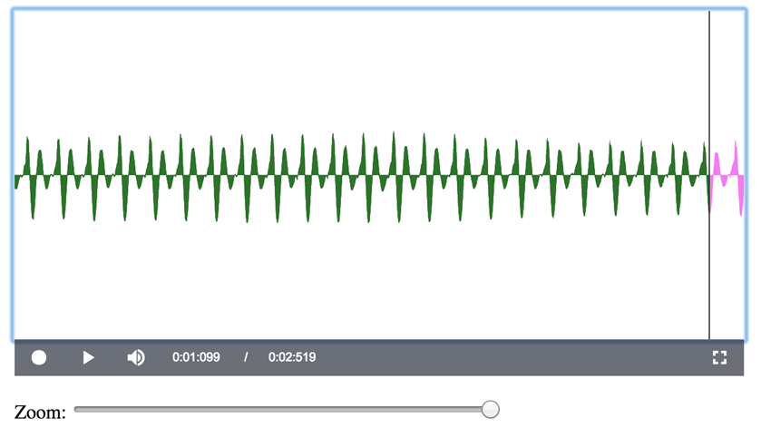
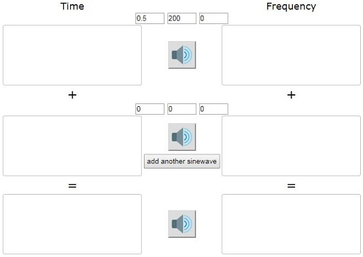

# 4  Signals and signal processing

The last section in this course focuses on signals, in particular sound signals. You will investigate how sounds can be recorded, analysed and reproduced. By the end of the section, you will return to the op-amp and see how it can be used to amplify a sound or other signal.

## 4.1  High-fidelity sound reproduction and electronics

Recording and reproducing sound has been one of the great drivers for innovation in electronics. What we perceive to be sound is vibrating air causing our eardrums to vibrate. For example, consider a guitar string vibrating 440 times per second, causing 440 high–low pressure waves to be transmitted through the air. This wave causes your eardrum to vibrate 440 times per second, which your brain interprets as the note A.

A device such as a microphone converts the highs and lows of the air pressure wave into a high and low voltage wave that represents the sound wave as an electrical analogue, oscillating between high and low voltages 440 times per second. When that electrical wave becomes the input to a loudspeaker, the speaker’s cone vibrates back and forth 440 times per second, creating a sound wave that you would hear as the note A.

In a perfect world, the sound made by a loudspeaker would be exactly the same as the original sound, with perfect fidelity. In practice, converting the sound to voltages and back to sound is an imperfect process, and some distortion or extraneous noise is inevitable. This is particularly notable with telephones, which usually have relatively low fidelity and distort the sound of our voices. For reproducing music, engineers try to make the fidelity as high as possible – and some people are prepared to pay a lot of money for high-fidelity equipment, or hi-fi systems as they are called. This aesthetic demand has driven much electronics research for nearly a century. Miniaturisation, low power consumption and computational load are also drivers of innovation, as can be seen with increasingly powerful and smaller mobile phones that last longer and longer between charges.

## 4.2  Recording sounds

Interactive 1 will allow you to see what ‘real’ sounds that you make yourself look like as waves. To get started, right-click on the link below the image to open the interactive in a new tab, then click on the large microphone symbol at the centre of the interactive. The first time you do this, you may see a pop-up window asking for permission to use your microphone – click on the appropriate button to allow this. Then try making some sounds. You will see a pink line moving.

![This is an interactive that may be used to record sound and display a visual representation of it on the screen. The recorded sound is shown as a series of vertical pink lines between positive and negative voltages, representing the sound amplitude. The horizontal bunching of these lines represents frequency. When the sound is played, a vertical cursor moves from left to right across the screen to show the user where they are in the recording. The control bar is at the bottom with two buttons, Record and Play, on the left, followed by some numbers that show the position of the cursor and the total length of the recording. At the right of the control bar is a Full Screen button. Below the control bar is a Zoom slider that allows the user to zoom in to the visual representation at the current location of the cursor. Because this interactive changes visually according to the nature of the recorded sound, you may need a sighted helper to describe the results to you.](images/recording-sound-t212_1.jpg)

[__Interactive 1__  Recording and viewing a sound](https://www2.open.ac.uk/openlearn/t212_4-2/) (Ctrl+right-click to open this link in a new window).

To record a sound, click on the record button (the circle) at the bottom left of the interactive. As an example, Figure 19 shows the wave produced by humming a low note.

__Figure 19__  Voltage wave produced by humming a low note

To make the picture, the microphone on the computer ‘sampled’ the sound 44 100 times per second and drew a pink line from 0 V to the value sampled. Because there are so many samples and the screen has limited resolution, some of the lines get overdrawn by others and merge to form solid blocks of colour.

It is quite hard to see the details of the wave at this resolution, but the interactive allows you to click on the wave and move the ‘zoom’ slider from left to right. Figure 20 shows the result of doing this to the wave in Figure 19. Notice that at the bottom of the wave, there are 24 long downward spikes with a shorter downward spike in between each pair. The long spike represents what is called the *fundamental frequency* of the recorded voice, and the shorter spike is what is called a *harmonic*.

![This is a screenshot from Interactive 1, showing what happens when the user zooms in to the visual representation of the recorded sound in Figure 19. It shows a sine-like waveform with peaks and troughs above and below zero volts. There are equally spaced longer spikes at the fundamental frequency, with smaller spikes in between as the first harmonic. An upward spike is followed by a downward spike, making one oscillation of the wave. There are 23 of these oscillations across the window. The cursor is positioned on the leftmost downward spike and the numbers on the control bar read 0:00:877 / 0:02:519.](images/soundwave-t212_1-4-2.tif.png)

__Figure 20__  Zooming in to the wave from Figure 19

The interactive can also be used to measure the time between the spikes and therefore calculate the frequencies. To do this, click your mouse on the tip of the leftmost spike and note the numbers at the bottom of the interactive to the right of the loudspeaker icon. The first of these numbers is the time that the spike was recorded. Then click on the tip of the rightmost spike and note this number again. The difference between the two times divided by the number of gaps between the spikes gives you the time period between any pair of spikes, from which you can calculate the frequency.

For example, you can see from Figure 20 that clicking on the leftmost spike shows the numbers 0:00:877 / 0:02:519 at the bottom of the interactive. Therefore that spike was recorded at 0:00:877. Clicking on a spike at the right of the interactive, as shown in Figure 21, shows that it was recorded at 0:01:099. There are 22 gaps between the long spikes in this example, so the time period between any pair of spikes is (0:01:099 − 0:00:877)/22 = (1.099 − 0.877)/22 = 0.01 seconds. Thus, since the period for one oscillation of the long spikes is 0.01, there are 1/0.01 = 100 spikes per second and the frequency is 100 vibrations per second. Engineers use the term hertz (Hz) for ‘times per second’, so the fundamental frequency of this recorded hum is 100 Hz.

__Figure 21__  Calculating the fundamental frequency

<!--SAQ id=-->

### SAQ 5

#### Question

A recording of an electric toothbrush shows the time at the top of a peak on the left as 0.219 seconds (Figure 22(a)) and the time at the top of a peak on the right as 0.452 seconds (Figure 22(b)). How many gaps between peaks occur between these two times? What is the period of this wave (that is, the length of time between any two consecutive peaks)? What is the frequency of vibration of this electric toothbrush?

__Figure 22__  Recording of an electric toothbrush: time at the top of a peak on (a) the left and (b) the right

#### Answer

There are 61 inter-peak gaps between the two measured times, so the period for one vibration of the electric toothbrush is (0.452 − 0.219)/61 = 0.003820 seconds. The frequency is the reciprocal of this, 1/0.003820 = 262 Hz. So the toothbrush vibrates 262 times per second.
<!--ENDSAQ-->
Keep the interactive open, because you will need it in the next section.

## 4.3  Recording and analysing speech

Generally, sound waves are much more complicated than a wave made by humming a single note or the sound made by an electric toothbrush. For example, Figure 23 shows the waveforms generated by someone saying ‘yes’ followed by ‘no’. Let this be called *Recording A*.

__Figure 23__  Recording A: ‘yes’ followed by ‘no’

<!--SAQ id=-->

### SAQ 6

#### Question

Each of the bursts of sound shown in Figure 24 is another recording of a person saying either ‘yes’ or ‘no’. Let this be called *Recording B*. Comparing Recording B with Recording A, which of the bursts of sound in Recording B is ‘yes’ and which is ‘no’?

__Figure 24__  Recording B

#### Answer

The left sound burst in Recording A has a long tail, presumably caused by the long ‘s’ sound at the end of ‘yes’. The right sound burst does not have this tail. In Recording B, the right sound burst has a tail but the left sound burst does not. From this, it can be guessed (correctly) that the left sound burst in Recording B is ‘no’ and the right sound burst is ‘yes’.
<!--ENDSAQ-->
The fact that different words result in different wave patterns underlies the technology of speech recognition. This technology has evolved to a high performance level over the last half century, but it has overcome some formidable problems. For example, are one person’s speech patterns the same as another’s?

Return to Interactive 1 (which you should still have open in a separate tab) and spend five or ten minutes experimenting by making your own sounds. If you hum a low note, are you able to calculate its frequency? Can you distinguish the patterns when you say ‘yes’ and ‘no’? Are your ‘yes’ and ‘no’ wave patterns similar to those shown in Figure 23?

When you have finished, close the interactive.

## 4.4  Signals and sine waves

Interactive 2 shows a signal based on a sine wave, sin(2π*ft*), where *f* is the frequency of the wave and *t* is time. Here the frequency of the wave is *f* = 200 Hz. The *period* of the wave, *T*, is the time between successive peaks; in this case, *T* = 5 ms (milliseconds). As would be expected, *T* = 1/*f* = 1/200 = 0.005 s. Similarly, *f* = 1/*T* = 1/0.005 = 200 Hz.

The signal is written as

 *s*(*t*) = *A* sin(2π*ft* + *ϕ*)

where *A* is called the *amplitude* of the wave, i.e. the largest value of the wave above or below the horizontal axis. Here it is set to *A* = 0.5.

*ϕ* is the *phase* of the wave, which means how far the wave is shifted to the left or the right. Here it is set to 0, since the wave goes through the origin and is not shifted either left or right.

Right-click on the image below to open the interactive in a new tab, then press the loudspeaker button to hear what the signal sounds like.
<!--MEDIACONTENT-->

__Interactive 2__  Investigating a sine wave

<!--ENDMEDIACONTENT--><!--SAQ id=-->

### SAQ 7

#### Question

1. Change *A* to 1.0 and play the sound. What do you observe?

2. Change *f* to 400 and play the sound. What do you observe?

3. Change *ϕ* to π/2 and play the sound. (You can enter a phase of π/2 into the interactive as 90 degrees.) What do you observe?

#### Answer

1. The wave is displayed with twice the height and the sound is louder.

2. The wave is displayed with the lines much closer vertically, and the sound is at a higher pitch (it is an octave higher than before).

3. The wave is moved along by a quarter of its period. Now it has the highest value at *t* = 0, where previously it was 0 at *t* = 0. However, it sounds the same.
<!--ENDSAQ-->

## 4.5  Making signals from combinations of sine waves

Right-click on the image below to open Interactive 3 in a new tab, then change the values for the top two waves so that the frequency of the first is 440 Hz and the frequency of the second is 660 Hz. Make the amplitude of both 0.5.

The wave at the bottom is formed by combining these two waves, by adding their values for each value of *t*.

Click on the loudspeaker button for each of the top two waves and listen to the resulting sounds. Then click on the loudspeaker button for the bottom wave and listen to its sound.
<!--MEDIACONTENT-->

__Interactive 3__  Combining sine waves

<!--ENDMEDIACONTENT--><!--SAQ id=-->

### SAQ 8

#### Question

1. Is the composite signal at the bottom a sine wave?

2. What is the ratio of the frequencies of the sine waves at the top?

3. Does the combined signal sound pleasant with the single sine waves in harmony?

4. Do you think there is any relationship between the ratio of the frequencies and the notes harmonising?

#### Answer

1. No, the combined signal is not a sine wave. It has a more complicated shape.

2. The ratio of the frequencies is 440:660 or 2:3.

3. This is a subjective question, but you may agree that it sounds as if the individual waves do combine to make a harmonised sound.

4. Generally, in music, notes with frequencies in simple proportions harmonise with each other.
<!--ENDSAQ--><!--SAQ id=-->

### SAQ 9

#### Question

Keep the frequency of the first wave at 440 Hz and its amplitude at 0.5. Change the frequency of the second wave to 880 Hz and change its amplitude to −0.17 (don’t overlook the minus). What is the shape of the resulting wave?

#### Answer

The resulting wave has a triangular shape, as shown in Figure 25. This could be called a ‘sawtooth’ wave.

![This is a screenshot from Interactive 3, showing just the bottom wave. As usual, the horizontal axis shows time from 0 to 20 milliseconds and the vertical axis shows voltage from minus 1 to 1 volt. The wave looks like a zig-zag that starts at 0, rises diagonally up to a maximum of approximately 0.6 volts and then falls diagonally down to a minimum of approximately minus 0.6 volts, before rising diagonally back up to 0 and repeating. This cycle occurs just under 9 times. The diagonal lines have a slight ‘wobble’ to them, but this is a reasonable approximation to a sawtooth wave.](images/sawtooth-wave-t212_1-4-7.tif.png)

__Figure 25__  Sawtooth wave

<!--ENDSAQ-->
Keep the interactive open, because you will need it in the next section.

---

The square wave challenge
The wave shown in Figure 26 approximates what is called a ‘square’ or ‘rectangular’ wave. The challenge is to design this wave using sine waves as components.

![This is a screenshot from Interactive 3, showing just the bottom wave. As usual, the horizontal axis shows time from 0 to 20 milliseconds and the vertical axis shows voltage from minus 1 to 1 volt. There are 8 oscillations of a ‘rectangular’ shaped wave in which the ‘flat’ tops and bottoms of the wave have small ripples corresponding to the high-frequency components. The vertical sides of the rectangles slope left to right a bit as they go down from 0.6 volts to minus 0.6 volts, and slope the other way as the graph rises from minus 0.6 volts to 0.6 volts. This is quite a convincing approximation to a rectangular wave.](images/square-wave-t212_1-4-8.tif.png)

__Figure 26__  Approximation to a square wave

To make this wave using Interactive 3 (which you should still have open in a separate tab), start with two sine waves, the first having *A* = 0.7 and *f* = 400 Hz, and the second having *A* = 0.2 and *f* = 1200 Hz. This will give something similar to the wave shown in Figure 27, which is a good start.

![This is another screenshot from Interactive 3, showing just the bottom wave. As usual, the horizontal axis shows time from 0 to 20 milliseconds and the vertical axis shows voltage from minus 1 to 1 volt. Figures 27 to 29 show how the ‘rectangular’ wave is made by adding higher-frequency sine waves.Here there are two sine waves. The second, higher-frequency wave causes depressions in the tops and bottoms of the lower-frequency wave, effectively ‘chopping’ a bit off the bottom and top to make it more rectangle-like.](images/square-wave-t212_1-4-9.tif.png)

__Figure 27__  Combination of two sine waves

To make the top and bottom smoother requires sine waves with other frequencies. To get another sine wave, click on the ‘add another sine wave’ button below the second sine wave. Set the frequency of this to *f* = 2000 Hz.
<!--SAQ id=-->

### SAQ 10

#### Question

Suggest an appropriate value of *A* for the wave with frequency *f* = 2000 Hz.

#### Answer

Setting *A* = 0.1 gives the wave shown in Figure 28. This is closer to what is desired.

__Figure 28__  Combination of three sine waves

<!--ENDSAQ-->
To finish this challenge requires one more sine wave. Click again on the ‘add another sine wave’ button to get a fourth sine wave. Set its frequency to *f* = 2800 Hz.
<!--SAQ id=-->

### SAQ 11

#### Question

Suggest an appropriate value of *A* for the wave with frequency *f* = 2800 Hz.

#### Answer

Setting *A* = 0.05 gives the wave shown in Figure 29. This is even closer to the desired square wave.

__Figure 29__  Combination of four sine waves

<!--ENDSAQ-->
You can now close the interactive.

In the square wave challenge, the shape of the wave was made closer to that required by adding higher frequencies with decreasing amplitudes. This is a general principle behind a very powerful theory for representing and processing signals.

## 4.6  From the time domain to the frequency domain

In the previous sections, you saw that complicated waveforms can be created by combining simple sine waves in a systematic way. Remarkably, *any* waveform can be represented as a combination of sine waves of appropriately chosen amplitude (loudness), frequency (pitch) and phase. This result, demonstrated by the French mathematician and physicist Joseph Fourier (1768–1830), lies at the heart of the design of electronic systems to reproduce high-fidelity sound.

The most familiar representation of waves is in what is called the *time domain*, i.e. the changing value of the signal through time. As you have seen, complicated waves can be formed from combinations of sine waves of given frequency and amplitude. This allows another representation in what is called the *frequency domain*. To see this, enter the following waves into Interactive 4:

* Wave 1: *A* = 0.7, *f* = 110 Hz

* Wave 2: *A* = 0.2, *f* = 330 Hz

* Wave 3: *A* = 0.1, *f* = 550 Hz

* Wave 4: *A* = 0.05, *f* = 770 Hz.
<!--MEDIACONTENT-->

__Interactive 4__  Waves represented in the time domain and the frequency domain

<!--ENDMEDIACONTENT--><!--SAQ id=-->

### SAQ 12

#### Question

1. What is the shape of the combined waveform?

2. What do you see to the right of the combined waves, in the ‘frequency domain’?

#### Answer

1. The shape approximates a square wave, as shown in the previous section.

2. Read the following.
<!--ENDSAQ-->
Figure 30 shows the composite wave formed from the four sine waves listed above. On the right of this is a graph showing amplitude against frequency. There is a vertical line of height *A* = 0.7 corresponding to frequency *f* = 110 Hz, a vertical line of height *A* = 0.2 corresponding to *f* = 330 Hz, a vertical line of height *A* = 0.1 corresponding to *f* = 550 Hz and a vertical line of length *A* = 0.05 corresponding to *f* = 770 Hz. This set of lines is called the *frequency spectrum* of the signal on the left.

__Figure 30__  Transforming a signal in the time domain into the frequency domain

One of the many problems with reproducing sound is that the desired sound may be contaminated by noise. For example, if you record a video and commentary on your phone in a crowded place, you will record what you want (you speaking) but also what you may not want (the hubbub surrounding you). Engineers talk about the part of the recording that is wanted as the *signal* and the part that is not wanted as *noise.*

For example, suppose you are recording yourself playing the piano and an emergency vehicle goes past with its high-pitched siren blaring. By using electronics, it may be possible to *filter out* that unwanted noise, or at least make it a lot less intrusive.

To represent noise, add a fifth sine wave to your signal with *A* = 0.3 and *f* = 935 Hz. This distorts the signal, as shown in Figure 31. Click on the loudspeaker button and you will hear that the sound is now quite discordant. It is not very clear what the noise is doing in the time-domain representation on the left, but the rogue frequency of 935 Hz can be seen clearly as a vertical bar of length 0.3 in the frequency-domain representation on the right. Now it is easy to imagine that one could take a pair of scissors and snip out that unwanted part of the composite signal in the frequency domain, before reassembling everything as the ‘cleaned’ signal in the time domain.

![This is a screenshot from Interactive 4 showing the same graphs as Figure 30, but this time a ‘noise’ wave has been added. This is shown in the frequency domain as a vertical line at 935 hertz that is between the first two lines (110 and 330 hertz) in height. On the left, the wave has been disrupted from its almost square appearance and now has lots of large high-frequency peaks and troughs. This time when the loudspeaker button is pressed, the high-frequency ‘noise’ is heard as background to the harmonious square wave.](images/time-frequency-domain-t212_1-4-13.tif.png)

__Figure 31__  Noise with frequency *f* = 935 Hz shows clearly in the frequency domain

Apart from removing unwanted noise, Fourier’s theory can also be used to manipulate signals in the frequency domain to give interesting new aesthetic results when the signals in the time domain are played through a loudspeaker. This has stimulated research and technology that has been widely used in the music industry for more than half a century, since the invention of the electric guitar.

## 4.7  Signals and noise

In this section, you will see some remarkable applications of the ideas in the preceding sections. To get going, right-click on the link below the image to open Interactive 5 in a new tab, then – if necessary – click on the microphone icon to enable the interactive to use your computer’s microphone.

If there is a tick in the ‘Use logarithmic Y scale on FFT’ box, click on it to remove it.

If there is a tick in the ‘Add noise tone’ box beneath the ‘zoom’ slider, click on the box to remove it.

![This is an interactive that can be used to record sound and display a visual representation of it in both the time and frequency domains. It can also be used to add a noise tone to the sound and then apply filters to remove it again. Because this interactive changes visually according to the nature of the recorded sound, you may need a sighted helper to describe the results to you.The top half of the interactive contains the recorded signal in the time and frequency domains. On the left is the original signal. Similar to the interactives in previous weeks, this is displayed on a graph of amplitude against time, and looks like a series of pink vertical lines. The Record, Play and volume control buttons and time details are below the graph, with the Zoom slider underneath. At the bottom are two tick boxes labelled ‘Add noise tone’ and ‘Override noise tone’.On the right is the amplitude plot of the fast Fourier transform of the original signal. This is displayed on a graph of amplitude against frequency, with the frequency ranging from 0 to just under 7 kilohertz. Below the graph is a tick box labelled ‘Use logarithmic Y scale on FFT’. Underneath this are two sliders, the right cutoff and the left cutoff, and at the bottom is a series of radio buttons labelled ‘Low-pass’, ‘High-pass’, ‘Bandpass’ and ‘Notch’. Next to these radio buttons is a button labelled ‘Apply filters’.The bottom half of the interactive contains the filtered signal, and only displays any content once the ‘Apply filters’ button has been clicked. On the left is a graph of amplitude against time, and on the right is a FFT plot. These graphs use the same scale and colouring as the top two graphs, and show the effect of the chosen filter on the original signal.](images/fast-fourier-transform-t212_1.jpg)

[__Interactive 5__  Recording sounds and adding noise](https://www2.open.ac.uk/openlearn/t212_w10/) (Ctrl+right-click to open this link in a new window).

When you are ready, press the record button (the circle), say the word ‘yes’, then click on the square button to stop recording. Your screen should now be similar to Figure 32.

![This is a screenshot from Interactive 5, showing a recording of the word ‘yes’. This appears on the left-hand graph as a set of fuzzy pink lines in an ellipse shape, followed by a dense, lower-amplitude tail corresponding to the hiss in ‘yes’.On the right-hand graph (the frequency-domain representation) is a series of vertical blue lines. These are quite high for the lower frequencies, to about 1 kilohertz, but there are smaller vertical blue lines (about one-eighth the amplitude of the lower-frequency waves) for all the frequencies, with the largest bunched around 4 kilohertz.](images/time-frequency-domain-t212_1-4-14.tif.png)

__Figure 32__  A recording of ‘yes’ in the time domain, transformed into the frequency domain

Tick the ‘Add noise tone’ box by clicking on it. Also tick the ‘Override noise tone’ by clicking on it. This will give a ‘Noise frequency’ slider. Move this to the right until the figure in the box is about 1200 Hz. This will add a sine wave with this frequency as noise to your sound. Look at the frequency spectrum on the right and you will see a peak close to 1200 Hz. Note that as you move the slider, the position of this peak will change, but for the moment make sure it is set at around 1200 Hz.

Now click on the play button (the triangle) and you will hear your ‘yes’ played back with a whistling noise in the background. Your screen should be similar to that shown in Figure 33.

__Figure 33__  ‘Yes’ with a rogue component at 1221 Hz acting as noise

Keep the interactive open with your ‘yes’ recording in it. In the next section, you will see how the noise you added can be ‘clinically’ removed, restoring the signal to almost exactly what it was without the noise.

## 4.8  Filtering

Filtering is the art of removing parts of a signal that are not required and retaining those parts that are required. The four main kinds of filter are shown in Figure 34. For example, a notch filter will remove the noise at the 1200 Hz peak.

![This is four repeats of the frequency-domain representation from Figure 33. In each case, part of the graph is shaded to show what would be removed by the filter.In part (a), a small vertical section is shaded around the 1.221 kilokertz line.In part (b), everything at a higher frequency than just above the 1.221 kilohertz line is shaded.In part (c), everything at a lower frequency than just below the 1.221 kilohertz line is shaded.In part (d), everything is shaded except for a small vertical section around the 1.221 kilokertz line.](images/filter-types-t212_1-4-16.tif.png)

__Figure 34__  Types of filter: (a) notch filter – the frequencies in the shaded area are removed; (b) low-pass filter – high frequencies (in the shaded area) are removed, low frequencies are ‘passed’; (c) high-pass filter – low frequencies (in the shaded area) are removed, high frequencies are ‘passed’; (d) band-pass filter – low and high frequencies (in the shaded area) are removed, those in the remaining band are ‘passed’

You should still have Interactive 5 open in a separate tab, containing your recording of the word ‘Yes’ with an added noise tone of 1200 Hz. Select the ‘Notch’ button and use the ‘Right cutoff’ and ‘Left cutoff’ sliders to create a notch filter, as shown in Figure 34(a). Then click on the ‘Apply filters’ button next to the ‘Notch’ button.

Your result should be similar to that shown in Figure 35. As you can see, the noise has been removed without doing too much damage to the original signal.

__Figure 35__  ‘Yes’ plus rogue 1221 Hz component, with notch filter applied

<!--SAQ id=-->

### SAQ 13

#### Question

Click on the play button (the triangle) at the bottom left of the interactive to play the filtered signal.

1. Was the noise removed as you listened to your signal?

2. Was the signal damaged, giving low-fidelity reproduction?

#### Answer

1. You should have found that the noise added to the signal was removed completely.

2. The filtered version of your signal should sound exactly the same as the original, or very close to it.

If this experiment did not work well for you, please try it again. It should work robustly and the results can be remarkable.
<!--ENDSAQ--><!--SAQ id=-->

### SAQ 14

#### Question

Click on the ‘Bandpass’ button and then click on the ‘Apply filters’ button. What do you see and hear now?

#### Answer

In the time-domain representation of the filtered sound, you are likely to see only a solid band of noise. When you click on the play button, you should hear only the noise – your ‘yes’ should have been completely filtered out.
<!--ENDSAQ--><!--SAQ id=-->

### SAQ 15

#### Question

Click on the ‘Low-pass’ button and then click on the ‘Apply filters’ button. What do you see and hear now?

#### Answer

In the time-domain representation of the filtered sound, you should see everything below the right cutoff filtered in, including the noise. This time the ‘yes’ will be muffled because the higher frequencies were lost.
<!--ENDSAQ--><!--SAQ id=-->

### SAQ 16

#### Question

Click on the ‘High-pass’ button and then click on the ‘Apply filters’ button. What do you see and hear now?

#### Answer

In the time-domain representation of the filtered sound, you should see everything above the left cutoff filtered in, including the noise. This time the ‘yes’ will be muffled because the lower frequencies were lost.
<!--ENDSAQ--><!--SAQ id=-->

### SAQ 17

#### Question

Select ‘High-pass’ and change the left cutoff to about 3 kHz. Click on ‘Apply filters’. Does this filter in or out any discernible part of the ‘yes’ sound?

#### Answer

The high-pass filter should remove the noise and most of the ‘yes’ sound, but you may find that the ‘s’ part can still be heard clearly. This supports the earlier conjecture that the tail of the ‘yes’ sound is the relatively high-frequency ‘sss’ as the word ends.
<!--ENDSAQ-->
When you first looked at the recordings of ‘yes’ and ‘no’ on this course, it was noted that they have different shapes in the time domain and that this might be useful for speech recognition. As can be seen in Figure 36, ‘yes’ and ‘no’ also have different patterns in the frequency domain and this too is useful for speech recognition.

__Figure 36__  ‘Yes’ and ‘no’ in the frequency domain: (a) ‘yes’ has a pattern with many high-frequency components; (b) ‘no’ has a pattern with few high-frequency components

You can now close the interactive.

## 4.9  Amplifying signals

Most of the electrical signals that record sounds are very weak. For example, a guitar pickup generates electricity as the metal string vibrates in a magnetic field. The amount of electricity that can be generated in this way is limited and typical voltages are in the order of 100 mV. To become useful, this signal needs to be *amplified*. This means, literally, that the amplitude of the signal has to be increased.

One way to amplify a signal is to use an operational amplifier (op-amp) with two resistors connected to form an amplifying feedback circuit, as shown in Figure 37.

![The electrical circuit to create a weak wave has three alternating current generators vertically in series on the left. From bottom to top, these are labelled V1, V2 and V3. They have frequencies of 400, 1200 and 2000 hertz, and corresponding amplitudes of 0.07 volts, 0.02 volts and 0.01 volts. These waves combine to form a more complicated wave that approximates a square wave.On the right is an op-amp in a non-inverting amplifier circuit, with the wave created by the alternating current generators providing Vin. The feedback resistors are set to R1 equals 100 ohms and R2 equals 900 ohms. The output of the amplifier, Vout, is on the right with a green voltage probe attached. The input to the amplifier circuit has a blue voltage probe attached after the three AC voltage generators and before the op-amp input.](images/op-amp-amplifier-t212_1-4-19.tif.png)

__Figure 37__  Circuit to generate and amplify a weak signal (screenshot from Multisim Live)

The *gain* of the amplifier is defined to be
G=VoutVin
where Vin is the input voltage and Vout is the output voltage. For this kind of circuit, the gain is given by the formula
G=R1+R2R1
The circuit in Figure 37 is made using the Multisim Live simulation package. The three circular objects on the left are here used to generate a signal. *V1* generates a voltage sine wave with amplitude 0.07 V and frequency 400 Hz. *V2* generates a voltage sine wave with amplitude 0.02 V and frequency 1200 Hz. *V3* generates a voltage sine wave with amplitude 0.01 V and frequency 2000 Hz. Together, they generate the very weak signal shown in Figure 38.

__Figure 38__  The waveform to be amplified (screenshot from Multisim Live)

<!--SAQ id=-->

### SAQ 18

#### Question

1. What is the gain for the circuit shown in Figure 37?

2. What would the resistor R2 have to be to make the gain 100?

#### Answer

1. G=(100+900) Ω100⁢ Ω=10

2. 
Rearranging the equation for G in terms of R2 gives
R2=GR1−R1=R1(G−1)
So for a gain of 100, with R1 = 100 Ω,
R2=100⁢ Ω×(100−1)=9900⁢ Ω
<!--ENDSAQ-->
The original circuit shown in Figure 37 gives the result shown in Figure 39.

__Figure 39__  The signal (blue) and the amplified signal (green) (screenshot from Multisim Live)

Op-amps are able to amplify signals many thousands of times. Here the amplification is by a gain factor of 10 so that the signal and the amplified signal can both be seen on the same scale. Typically a signal of 100 mV would be amplified by a factor of 50 or more to bring the result to the order of magnitude ±5 V. Some signals from sensors are much weaker and may require a gain in the order of hundreds or even thousands.

This concludes your lightning visit to the world of electronic signals and filtering. You have seen how effectively noise can be removed from a signal, and how different sounds (such as ‘yes’ and ‘no’) appear in both the time and the frequency domain. As well as investigating the theoretical properties of signals, you have seen how they can be amplified using op-amps. If you are interested in going further, a version of the Multisim Live simulator can be used online at no cost – see [www.multisim.com](https://www.multisim.com).

