# 2 The basics

## 2.1 The staff

The idea of placing notes on a set of horizontal lines – the __staff –__to show the relationship of various pitches with each other – __staff notation__ – emerged in western music towards the end of the ninth century. Originally, each pitch was allocated its own line, but the Italian music theorist, Guido of Arezzo, who lived during the early eleventh century, suggested that lines should be drawn for *every other* pitch, so that alternate pitches sat *on* the lines and the remaining pitches were placed in the intervening spaces *between* the lines.

This principle was soon adopted and has remained in force in traditional western music notation to the present day. The number of lines included in the staff has varied depending on the range of the music being notated. However, the norm has evolved as the five-line staff, shown in Example 1.

__Example 1__

As shown in Example 2, if we place pitches in the form of note heads on the staff, information about the relationship of the pitches with each other is produced.

__Example 2__

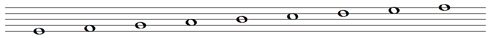

## 2.2 Clefs

As it stands, the first note in Example 2 could be any pitch we care to choose.

__Example 2 (repeated)__

So if we wish to specify a particular pitch or series of pitches we need some sort of guide – a sign that will enable us to indicate the specific pitch. That sign is supplied by a __clef__ (from the Latin, *clavis*, meaning ‘key’). From the eleventh century onwards, several Roman letters, including c and f, were used systematically for clefs, with g subsequently becoming increasingly common. In a stylised form, g, with flamboyant curls and flourishes, is still used as the __treble__ or __G clef__, and signifies that a note placed on the second line from the bottom is G (see Example 3).

__Example 3__

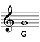
<!--MEDIACONTENT--><!--ENDMEDIACONTENT-->
And this is not any G, but specifically the one *above*__middle C__. (We’ll come to an explanation of middle C in a moment.)

As Example 4 shows, the other notes are named with letters from the alphabet, A–G, with A returning after G has been reached.

__Example 4__

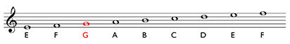
<!--MEDIACONTENT--><!--ENDMEDIACONTENT-->
Notice that as the notes are placed higher and higher up the staff, the pitch becomes higher and higher as well. Notice too that we read music from left to right, and with a whole page of music, from top to bottom. This reflects the way we read words in western culture.

The letter, f, in a stylised form and in a mirror image, is now used as the __bass __or __F clef__.It signifies that a note placed on the second line from the top is F, and specifically the F *below* middle C (see Example 5).

__Example 5__

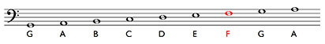
<!--MEDIACONTENT--><!--ENDMEDIACONTENT-->

## 2.3 The great staff

We can call a staff with a treble clef a __treble staff__ for short, and a staff with a bass clef a __bass staff__. And if we place the former above the latter and insert an additional line in between, we create what is called the __great__ (or grand) __staff__ as shown in Example 6.

__Example 6__

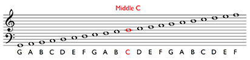
<!--MEDIACONTENT--><!--ENDMEDIACONTENT-->
There are two points about the great staff. Firstly, it demonstrates the relationship between the bass and treble staves. Secondly, the additional line at the midway point is the line for middle C. The central importance in the great staff of the middle C line is one reason for middle C’s name, and its position roughly halfway along the keyboard is another.

## 2.4 Middle C and ledger lines

Sometimes keyboard music has been notated using very large staves. However, if you have too many lines, the staff is not easy to read. Therefore, with keyboard music, the treble and bass staves are conventionally separated out – there is a substantial gap between the bottom line of the treble staff and the top line of the bass staff and there is no middle C line. Instead, middle C is notated using a __ledger line__. Middle C has its own little section of staff, long enough to make the position of the note clear, and this has to be written in for each of its appearances.

While this separation of the upper and lower staves is a good idea because it helps visual orientation, it has a drawback. And that is that middle C can be notated on both staves, in different positions on each staff. Example 7 shows that (i) the different visual positions of middle C on each staff represent one and the same sound and (ii) the gradual incline of the pattern of the notes as the pitch rises is fractured temporarily.

__Example 7__

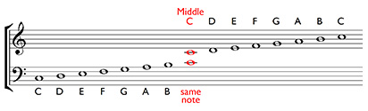
<!--MEDIACONTENT--><!--ENDMEDIACONTENT-->
Other notes close to middle C can also be notated on either staff by using more and more ledger lines (Example 8).

__Example 8__

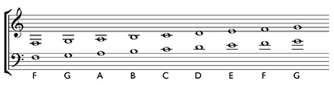
<!--MEDIACONTENT--><!--ENDMEDIACONTENT-->
Choosing which staff to use depends on the context. For instance, if you were notating a violin part, you would need the treble staff. So if you wanted to write the lowest note on the violin, the lower G on the top staff in Example 8, you would need the G that sits below the upper staff and has two ledger lines.

The concept of ledger lines can also be applied at the top of the treble staff and at the bottom of the bass staff (Example 9).

__Example 9__

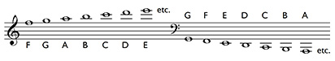
<!--MEDIACONTENT--><!--ENDMEDIACONTENT-->
However, the more ledger lines you use, the more difficult it is to read the notes at a glance, and you have to ‘count up’ the ledger lines – together with the spaces between them – to work out what the note is, and this can be a laborious process.

Example 10 shows all the note names mentioned above.

__Example 10__

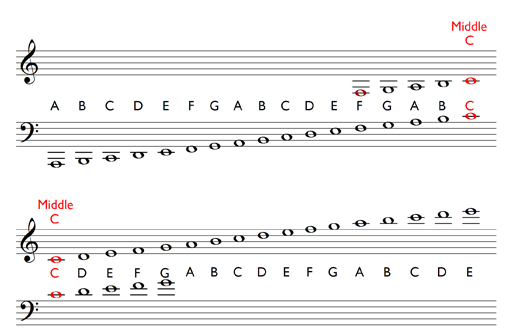

## 2.5 Writing notes

Although much of the note-writing in *Inside music* involves using the software package, Sibelius First, it is worthwhile considering briefly the conventions used when writing staff notation by hand on manuscript paper (the name for pages with staves printed on them). Fundamentally, when writing music, you are trying to communicate with a reader and legibility is therefore important.

You should bear in mind the following guidelines when writing notes on paper.

* __Note heads__ are oval in shape (some open, some filled in – we’ll see the reason for this later) and should sit centrally on a line or in a space so that no confusion can arise as to the pitch notated.

* Most notes also need __stems__, and these should be vertical and should be roughly the same height as the height of the staff.

* In addition, note stemsshould go down on the left-hand side for note heads on the top two lines of the staff and in the top two spaces, and up on the right-hand side for note heads on the bottom two lines and in the bottom two spaces. Stems for note heads on the middle line can go up or down.

* Ledger lines should run parallel to the lines of the staff.

Example 11 provides examples of these points.

__Example 11__

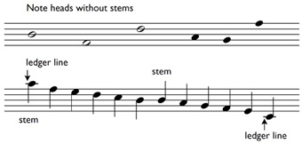

## 2.6 Reading notes

How do you become proficient at reading notes? This takes time and practice. You really need to practise for a few minutes each day, identifying notes on both the treble and bass staves, including notes that are written both above and below these staves with up to three ledger lines.

However, there is a tradition with staff notation of using mnemonics to remember the names of the notes on the staves. Two of these are impossible to beat: __FACE__ for the spaces on the treble staff from bottom to top, and __A__ll __C__ows __E__at __G__rass for the spaces on the bass staff from bottom to top (Example 12).

__Example 12__

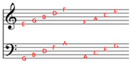

For the lines on the staves, from bottom to top, perhaps you could create your own mnemonic based on the letters E… G… B… D… F… for the treble staff and G… B… D… F… A… for the bass.

Mnemonics are useful and help accelerate the learning process.

## 2.7 Review 1

Once you feel you are familiar with the position of the notes on the treble and bass staves, try the following activities.

If you find these activities difficult, do not be disheartened. Remember that in order to be able to read the names of notes at a glance requires practice over a period of time. Some people find reading symbolic languages easier than others, but everyone has to spend some time in order to become familiar with note names. Of course, if you play an instrument and read notation on a daily basis, then that is a great help when learning note names. However, don’t forget the usefulness of mnemonics and trainers (Section 10). In addition, regular application, a little at a time, is the best approach.

Group 1 tests your knowledge of writing notes, Groups 2–4 test your reading of note names on the treble and bass staves and Groups 5 and 6 test your reading of notes with up to three ledger lines.

---

Group 1: writing notes

### Activity

#### Question

Which of the following statements is correct? (There are several correct answers.)

Note heads are circular in shape.

A stem for a note head on the second space from the top of the staff goes down on the right-hand side.

A stem for a note head on the second space from the top of the staff goes down on the left-hand side.

Ledger lines are horizontal.

A stem for a note head on the bottom line of the staff goes up on the left-hand side.

A stem for a note head on the middle line of the staff can go up or down.

Note heads are oval in shape.

Group 1: writing notes

### Activity

#### Question

Which of the following statements is correct? (There are several correct answers.)

Note heads are circular in shape.

A stem for a note head on the second space from the top of the staff goes down on the right-hand side.

A stem for a note head on the second space from the top of the staff goes down on the left-hand side.

Ledger lines are horizontal.

A stem for a note head on the bottom line of the staff goes up on the left-hand side.

A stem for a note head on the middle line of the staff can go up or down.

Note heads are oval in shape.

---

Group 2: identifying note names on the treble staff

### Activity 1

#### Question

Which note is C?

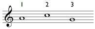

1

2

3

#### Answer

2 is correct. On the treble staff, the pitch in the third space from the bottom is C.

1 is incorrect. On the treble staff, the pitch in the second space from the bottom is A.

3 is incorrect. On the treble staff, the pitch on the second line from the bottom is G.

### Activity 2

#### Question

Which note is D?

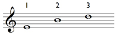

1

2

3

#### Answer

3 is correct. On the treble staff, the pitch on the fourth line from the bottom is D.

1 is incorrect. On the treble staff, the pitch on the bottom line is E.

2 is incorrect. On the treble staff, the pitch on the middle line is B.

### Activity 3

#### Question

Which note is G?

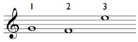

1

2

3

#### Answer

1 is correct. On the treble staff, the pitch on the second line from the bottom is G.

2 is incorrect. On the treble staff, the pitch in the bottom space is F.

3 is incorrect. On the treble staff, the pitch in the top space is E.

### Activity 4

#### Question

Which note is F?

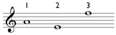

1

2

3

#### Answer

3 is correct. On the treble staff, the pitch on the top line is F.

1 is incorrect. On the treble staff, the pitch in the second space from the bottom is A.

2 is incorrect. On the treble staff, the pitch on the bottom line is E.

Group 2: identifying note names on the treble staff

### Activity 1

#### Question

Which note is C?

1

2

3

#### Answer

2 is correct. On the treble staff, the pitch in the third space from the bottom is C.

1 is incorrect. On the treble staff, the pitch in the second space from the bottom is A.

3 is incorrect. On the treble staff, the pitch on the second line from the bottom is G.

### Activity 2

#### Question

Which note is D?

1

2

3

#### Answer

3 is correct. On the treble staff, the pitch on the fourth line from the bottom is D.

1 is incorrect. On the treble staff, the pitch on the bottom line is E.

2 is incorrect. On the treble staff, the pitch on the middle line is B.

### Activity 3

#### Question

Which note is G?

1

2

3

#### Answer

1 is correct. On the treble staff, the pitch on the second line from the bottom is G.

2 is incorrect. On the treble staff, the pitch in the bottom space is F.

3 is incorrect. On the treble staff, the pitch in the top space is E.

### Activity 4

#### Question

Which note is F?

1

2

3

#### Answer

3 is correct. On the treble staff, the pitch on the top line is F.

1 is incorrect. On the treble staff, the pitch in the second space from the bottom is A.

2 is incorrect. On the treble staff, the pitch on the bottom line is E.

---

Group 3: identifying note names on the bass staff

### Activity 1

#### Question

Which note is E?

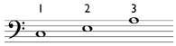

1

2

3

#### Answer

2 is correct. On the bass staff, the pitch in the third space from the bottom is E.

1 is incorrect. On the bass staff, the pitch in the second space from the bottom is C.

3 is incorrect. On the bass staff, the pitch on the top line is A.

### Activity 2

#### Question

Which note is A?

1

2

3

#### Answer

1 is correct. On the bass staff, the pitch in the bottom space is A.

2 is incorrect. On the bass staff, the pitch on the fourth line from the bottom is F.

3 is incorrect. On the bass staff, the pitch in the top space is G.

### Activity 3

#### Question

Which note is D?

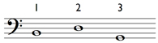

1

2

3

#### Answer

2 is correct. On the bass staff, the pitch on the middle line is D.

1 is incorrect. On the bass staff, the pitch on the second line from the bottom is B.

3 is incorrect. On the bass staff, the pitch on the bottom line is G.

### Activity 4

#### Question

Which note is A?

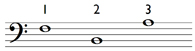

1

2

3

#### Answer

3 is correct. On the bass staff, the pitch on the top line is A.

1 is incorrect. On the bass staff, the pitch on the fourth line from the bottom is F.

2 is incorrect. On the bass staff, the pitch on the second line from the bottom is B.

Group 3: identifying note names on the bass staff

### Activity 1

#### Question

Which note is E?

1

2

3

#### Answer

2 is correct. On the bass staff, the pitch in the third space from the bottom is E.

1 is incorrect. On the bass staff, the pitch in the second space from the bottom is C.

3 is incorrect. On the bass staff, the pitch on the top line is A.

### Activity 2

#### Question

Which note is A?

1

2

3

#### Answer

1 is correct. On the bass staff, the pitch in the bottom space is A.

2 is incorrect. On the bass staff, the pitch on the fourth line from the bottom is F.

3 is incorrect. On the bass staff, the pitch in the top space is G.

### Activity 3

#### Question

Which note is D?

1

2

3

#### Answer

2 is correct. On the bass staff, the pitch on the middle line is D.

1 is incorrect. On the bass staff, the pitch on the second line from the bottom is B.

3 is incorrect. On the bass staff, the pitch on the bottom line is G.

### Activity 4

#### Question

Which note is A?

1

2

3

#### Answer

3 is correct. On the bass staff, the pitch on the top line is A.

1 is incorrect. On the bass staff, the pitch on the fourth line from the bottom is F.

2 is incorrect. On the bass staff, the pitch on the second line from the bottom is B.

---

Group 4: identifying clefs for notes on both the treble and bass staves

### Activity 1

#### Question

Match ‘Treble clef’ and ‘Bass clef’ to the notes to make them A and D.

Treble clef

 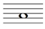 

Bass clef

 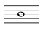 

### Activity 2

#### Question

Match ‘Treble clef’ and ‘Bass clef’ to the notes to make them C and F.

Bass clef

 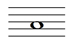 

Treble clef

 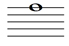 

### Activity 3

#### Question

Match ‘Treble clef’ and ‘Bass clef’ to the notes to make them E and A.

Treble clef

 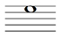 

Bass clef

 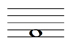 

### Activity 4

#### Question

Match ‘Treble clef’ and ‘Bass clef’ to the notes to make them G and F.

Bass clef

 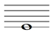 

Treble clef

 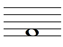 

Group 4: identifying clefs for notes on both the treble and bass staves

### Activity 1

#### Question

Match ‘Treble clef’ and ‘Bass clef’ to the notes to make them A and D.

Treble clef

  

Bass clef

  

### Activity 2

#### Question

Match ‘Treble clef’ and ‘Bass clef’ to the notes to make them C and F.

Bass clef

  

Treble clef

  

### Activity 3

#### Question

Match ‘Treble clef’ and ‘Bass clef’ to the notes to make them E and A.

Treble clef

  

Bass clef

  

### Activity 4

#### Question

Match ‘Treble clef’ and ‘Bass clef’ to the notes to make them G and F.

Bass clef

  

Treble clef

  

---

Group 5: identifying note names of notes with ledger lines

### Activity 1

#### Question

Which note is A?

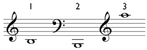

1

2

3

#### Answer

1 is incorrect. The pitch that sits below the first ledger line below the treble staff is B.

2 is incorrect. The pitch that sits below the second ledger line below the bass staff is B.

3 is correct. The pitch on the first ledger line above the treble staff is A.

### Activity 2

#### Question

Which note is E?

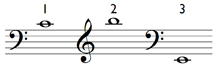

1

2

3

#### Answer

3 is correct. The pitch on the first ledger line below the bass staff is E.

1 is incorrect. The pitch on the first ledger line above the bass staff is C.

2 is incorrect. The pitch above the first ledger line above the treble staff is B.

### Activity 3

#### Question

Which note is D?

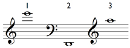

1

2

3

#### Answer

2 is correct. The pitch below the first ledger line below the bass staff is D.

1 is incorrect. The pitch on the third ledger line above the treble clef is E.

3 is incorrect. The pitch on the first ledger line above the treble clef is A.

Group 5: identifying note names of notes with ledger lines

### Activity 1

#### Question

Which note is A?

1

2

3

#### Answer

1 is incorrect. The pitch that sits below the first ledger line below the treble staff is B.

2 is incorrect. The pitch that sits below the second ledger line below the bass staff is B.

3 is correct. The pitch on the first ledger line above the treble staff is A.

### Activity 2

#### Question

Which note is E?

1

2

3

#### Answer

3 is correct. The pitch on the first ledger line below the bass staff is E.

1 is incorrect. The pitch on the first ledger line above the bass staff is C.

2 is incorrect. The pitch above the first ledger line above the treble staff is B.

### Activity 3

#### Question

Which note is D?

1

2

3

#### Answer

2 is correct. The pitch below the first ledger line below the bass staff is D.

1 is incorrect. The pitch on the third ledger line above the treble clef is E.

3 is incorrect. The pitch on the first ledger line above the treble clef is A.

---

Group 6: identifying more note names of notes with ledger lines

### Activity 1

#### Question

Are the two notes below at the same sounding pitch?

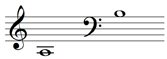

Yes

No

The note on the second ledger line below the treble staff is the A below middle C; the note above the top line of the bass staff is the B below middle C.

### Activity 2

#### Question

Are the two notes below at the same sounding pitch?

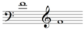

Yes

They are both the F above middle C.

No

Group 6: identifying more note names of notes with ledger lines

### Activity 1

#### Question

Are the two notes below at the same sounding pitch?

Yes

No

The note on the second ledger line below the treble staff is the A below middle C; the note above the top line of the bass staff is the B below middle C.

### Activity 2

#### Question

Are the two notes below at the same sounding pitch?

Yes

They are both the F above middle C.

No

