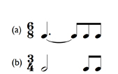
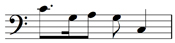

# 3 Rhythm and metre

## 3.1 Time values

As well as a pitch name, each note has a rhythmic value, called a time value, note value or duration. Those most commonly found in present-day usage are shown in Example 13.

__Example 13__

Notice that in order to differentiate these symbols for time values:

* all have stems apart from the semibreve

* the note heads of the semibreve and minim are open, whereas those for the shorter values are filled in

* the quaver has a __flag__ (or tail), always drawn on the right-hand side of the stem, the semiquaver has two flags and the demisemiquaver, three.

You will probably have noticed too that the duration of each time value is half that of the one above. Therefore two minims last the same duration as a semibreve; two crotchets last the same duration as a minim; and so on. This also means that *four* crotchets last the same duration as a semibreve, as do *eight* quavers or *sixteen* semiquavers. Example 14 maps out these relationships:

__Example 14__

## 3.2 Triplets

In Section 3.1, Example 14, you saw that as you move down the list of time values from semibreve to semiquaver, each successive time value is half the length of the one above (for example, you saw that a quaver is half the length of a crotchet). However, you can divide a time value not only by two but by any number you want. The most frequent division you will come across, the next in frequency to the default division of two, is where a time value is divided into three equal components – say a crotchet divided into three quavers or a minim divided into three crotchets. This is called a triplet. As you can see and hear in Example 15, the crotchet is divided into three triplet quavers, the minim into three triplet crotchets.

__Example 15__

<!--MEDIACONTENT--><!--ENDMEDIACONTENT-->
At this stage, you needn’t worry about this in any detail. However, notice in Example 15 how triplets are notated with a figure three over or under the relevant notes, the figure often being combined with either a curved line or square bracket.

## 3.3 Time signatures

The rhythm of a piece of western music – whether it is simple or complex – is underpinned by a steady pulse or __beat__, and these beats are grouped together to give the music’s __metre__. The music examples in this section include a click track to help you follow the beats. The most common groupings are in twos, threes and fours and these groupings are created by a pattern of stronger and weaker stresses. Thus, a three-beat pattern would consist of strong-weak-weak beats. In notated music, each group is marked out by a __bar line__ – so from now on we will talk about how many beats there are in each __bar__.

__Time signatures__, which consist of two numbers aligned vertically, are placed at the opening of a piece of music to signify which metre is being used. (The time signature is then omitted for the rest of the piece, unless it is changed to another.) In the time signatures discussed in this section, the lower figure can be understood as the value of each beat expressed in relation to a semibreve (whole note). The number 2 represents a minim (half note), 4 represents a crotchet (quarter note), 8 represents a quaver (eighth note), and so on. The upper figure tells you the number of beats in the bar.

* __In 2/4 there are two crotchets per bar__. The lower number, 4, represents a crotchet because there are 4 crotchets (quarter notes) in a semibreve (whole note), and the upper number tells you that there are 2 beats, i.e. two crotchets, in a bar.

* __In 3/2 there are three minims per bar__. The lower number, 2, represents a minim because there are 2 minims (half notes) in a semibreve, and the upper number tells you that there are 3 beats, i.e minims, in a bar.

* __In 3/8 there are three quavers per bar__. The lower number, 8, represents a quaver because there are 8 quavers (eighth notes) in a semibreve, and the upper number tells you that there are 3 beats, i.e. quavers, in a bar.

Example 16 summarises the meaning of these three time signatures.

__Example 16__

Example 17 shows various straightforward rhythms in different time signatures.

__Example 17__

<!--MEDIACONTENT--><!--ENDMEDIACONTENT-->
Notice in Example 17 that 4/4 can also be written as C (__Common time__), and 2/2 as a C with a vertical stroke through it (__alla breve__). Notice too that each bar includes the correct number of time values to make up the required number of beats shown by the upper number of the time signature, and that each bar’s group of beats is marked off with a __bar line__ for ease of reading. Finally, the concluding bar line is written as a __double bar__.

Consider Example 17 carefully, spending as much time as you need in order to become proficient at adding together the number of beats in each bar, as signified by the top number of the time signature. (Pay particular attention when there are shorter values present such as quavers and semiquavers.) Additionally, make sure that you have identified the beat correctly as shown by the bottom number in the time signature – is it a minim (2), a crotchet (4) or a quaver (8)?

## 3.4 Review 2

The following activities begin with Group 1 – a series of activities that asks you to identify note values. In Group 2, one or more time values from a bar has been omitted, and you will therefore have to work out what they are. You need to be absolutely sure as to the length of each time value and how each fits together with the other time values in each bar.

---

Group 1: time values

### Activity 1

#### Question

Which of the following statements is correct?

A minim has an open note head and a stem.

A crotchet lasts twice as long as a quaver.

Four semiquavers equal two crotchets in length.

A semibreve lasts as long as four crotchets.

A quaver has a flag drawn on the left-hand side of the stem.

Six triplet quavers equal two crotchets in length.

A demisemiquaver has three flags.

Group 1: time values

### Activity 1

#### Question

Which of the following statements is correct?

A minim has an open note head and a stem.

A crotchet lasts twice as long as a quaver.

Four semiquavers equal two crotchets in length.

A semibreve lasts as long as four crotchets.

A quaver has a flag drawn on the left-hand side of the stem.

Six triplet quavers equal two crotchets in length.

A demisemiquaver has three flags.

---

Group 2: identifying omitted time value(s)

### Activity 1

#### Question

Which single time value is required at the place marked with the asterisk?

quaver

crotchet

minim

#### Answer

The time signature, 2/4, has two crotchet beats per bar. Since the first bar contains only one crotchet, another is needed.

### Activity 2

#### Question

Which single time value is required at the place marked with the asterisk?

crotchet

minim

semibreve

#### Answer

The time signature, 4/4, has four crotchet beats per bar. Since the second bar contains no rhythmic value, a semibreve (which is equal to four crotchets) is needed.

### Activity 3

#### Question

Which single time value is required at the place marked with the asterisk?

quaver

crochet

minim

#### Answer

The time signature, 3/4, has three crotchet beats per bar. Since the third bar contains only one crotchet, a minim (which is equal to two crotchets) is needed.

### Activity 4

#### Question

Which single time value is required at each of the places marked with asterisks?

quaver/crotchet

quaver/minim

crotchet/minim

#### Answer

The time signature, 2/4, has two crotchet beats per bar. Since the second bar contains only a crotchet and a quaver, another quaver is needed to make up the two crotchet beats. The third bar lacks a value and therefore a minim (which is equal to two crotchets) is required.

### Activity 5

#### Question

Which single time value is required at each of the places marked with asterisks?

crotchet/minim

crotchet/semibreve

minim/semibreve

#### Answer

The time signature, 4/4, has four crotchet beats per bar. Since the first bar contains only two crotchets, a minim (which is equal to two crotchets) is needed. The third bar lacks a value and therefore a semibreve (which is equal to four crotchets) is required.

### Activity 6

#### Question

Which single time value is required at each of the places marked with asterisks?

minim/quaver

crotchet/quaver

minim/crotchet

#### Answer

The time signature, 3/4, has three crotchet beats per bar. Since the first bar contains only a crotchet, a minim (which is equal to two crotchets) is required. The second bar contains only a minim (which equals two crotchets) and a quaver, and therefore another quaver is needed to make up the three crotchet beats.

### Activity 7

#### Question

Which single time value is required at the place marked with an asterisk?

semiquaver

quaver

crotchet

#### Answer

The time signature, 3/8, has three quaver beats per bar. Since the first bar includes only two quavers and a semiquaver, another semiquaver is needed to make up the three quaver beats.

### Activity 8

#### Question

Which single time value is required at the place marked with an asterisk?

crotchet

minim

semibreve

#### Answer

The time signature, 3/2, has three minim beats per bar. Since the second bar includes only one minim, a semibreve (which equals two minims) is needed to make up the three minim beats.

Group 2: identifying omitted time value(s)

### Activity 1

#### Question

Which single time value is required at the place marked with the asterisk?

quaver

crotchet

minim

#### Answer

The time signature, 2/4, has two crotchet beats per bar. Since the first bar contains only one crotchet, another is needed.

### Activity 2

#### Question

Which single time value is required at the place marked with the asterisk?

crotchet

minim

semibreve

#### Answer

The time signature, 4/4, has four crotchet beats per bar. Since the second bar contains no rhythmic value, a semibreve (which is equal to four crotchets) is needed.

### Activity 3

#### Question

Which single time value is required at the place marked with the asterisk?

quaver

crochet

minim

#### Answer

The time signature, 3/4, has three crotchet beats per bar. Since the third bar contains only one crotchet, a minim (which is equal to two crotchets) is needed.

### Activity 4

#### Question

Which single time value is required at each of the places marked with asterisks?

quaver/crotchet

quaver/minim

crotchet/minim

#### Answer

The time signature, 2/4, has two crotchet beats per bar. Since the second bar contains only a crotchet and a quaver, another quaver is needed to make up the two crotchet beats. The third bar lacks a value and therefore a minim (which is equal to two crotchets) is required.

### Activity 5

#### Question

Which single time value is required at each of the places marked with asterisks?

crotchet/minim

crotchet/semibreve

minim/semibreve

#### Answer

The time signature, 4/4, has four crotchet beats per bar. Since the first bar contains only two crotchets, a minim (which is equal to two crotchets) is needed. The third bar lacks a value and therefore a semibreve (which is equal to four crotchets) is required.

### Activity 6

#### Question

Which single time value is required at each of the places marked with asterisks?

minim/quaver

crotchet/quaver

minim/crotchet

#### Answer

The time signature, 3/4, has three crotchet beats per bar. Since the first bar contains only a crotchet, a minim (which is equal to two crotchets) is required. The second bar contains only a minim (which equals two crotchets) and a quaver, and therefore another quaver is needed to make up the three crotchet beats.

### Activity 7

#### Question

Which single time value is required at the place marked with an asterisk?

semiquaver

quaver

crotchet

#### Answer

The time signature, 3/8, has three quaver beats per bar. Since the first bar includes only two quavers and a semiquaver, another semiquaver is needed to make up the three quaver beats.

### Activity 8

#### Question

Which single time value is required at the place marked with an asterisk?

crotchet

minim

semibreve

#### Answer

The time signature, 3/2, has three minim beats per bar. Since the second bar includes only one minim, a semibreve (which equals two minims) is needed to make up the three minim beats.

## 3.5 Dots and ties

In Section 3.1, Example 14 we outlined the time values of each type of note. Here is a reminder of those note values:

__Example 14 (repeated)__

However, a time value of each type of note can be lengthened (and therefore changed) through the use of:

* a __dot__ or

* a __tie__.

A dot after any value extends that value by half as much again. Therefore a dotted crotchet lasts for a crotchet plus a half a crotchet (i.e. a quaver). In other words, as shown in Example 18, it lasts for the duration of three quavers in total.

__Example 18__

The dot is placed to the right of the note head, in the same space if the note head is in a space, or above the line if a note head is on a line. Example 19 summarises these principles.

__Example 19__

As you learned in Section 3.3, bar lines mark off groups of beats according to the time signature. In 4/4 time, therefore, there cannot be any more than four beats per bar. If we want to extend a time value where the lengthened value crosses a bar line, a tie can be used, as shown in Example 20. In this particular example, the effect of the tie is the same as if we had used a dot: the value of the minim is increased by a half (because it is joined to a crotchet which is half the value of a minim).

__Example 20__

<!--MEDIACONTENT--><!--ENDMEDIACONTENT-->
However, as shown in Example 21, a tie can also be used to increase a value by a different fraction. So as Example 21 (a) shows, a minim can be tied to a quaver, the quaver being a quarter of the minim’s value; and as shown in Example 21 (b), a crotchet can be tied to a semiquaver, the semiquaver being a quarter of the crotchet’s value. Either can take place within a bar or across a bar line.

__Example 21__

<!--MEDIACONTENT--><!--ENDMEDIACONTENT-->
You can tie any number of adjacent notes together in this way – but the tied notes must always have the same pitch. The ties must also be placed on the ‘outside’ of the note heads as you can see in Example 21.

## 3.6 Grouping and beaming notes

So far, when writing notes with flags such as quavers and semiquavers, each one has been written separately. However, for ease of reading, groups of quavers and semiquavers are joined or ‘beamed’ together. Thus, the previous example should more properly be written as shown in Example 22. In Example 22 (a) the two quavers are beamed together with a single beam, and in Example 22 (b) the four semiquavers are beamed together with a double beam. (Demisemiquavers would need a triple beam.)

__Example 22__

<!--MEDIACONTENT--><!--ENDMEDIACONTENT-->
In Example 22 (a) and (b) __the beaming joins together notes that belong to a single beat__, and this is a useful rule of thumb to follow when beaming notes together, especially with more complex examples, as demonstrated in Example 23, which shows one line of music twice – once unbeamed (Example 23 [a]) and once beamed (Example 23 [b]).

__Example 23__

<!--MEDIACONTENT--><!--ENDMEDIACONTENT-->
However, the following groupings shown in Example 24 are also used. Although these groupings break the ‘show each beat’ rule, they are treated as conventions.

### Conventions that break the ‘show each beat rule’

* __Example 24 (a)__ Where there is a complete set of quavers in a bar of 2/4, these can be beamed together with one beam rather than with two beams as two sets of two quavers. A similar convention is allowed for a complete set of quavers in a bar of 3/4 – only one beam is needed.

* __Example 24 (b)__ In 3/4, where four quavers ‘replace’ a minim, only one beam is needed instead of two.

* __Example 24 (c) __Similarly, in 4/4, where four quavers ‘replace’ a minim, only one beam is needed instead of two. However, in 4/4, the beam joining the four quavers cannot extend across the middle of the bar.

* __Example 24 (d)__ In 3/8, all quavers and semiquavers in a bar can be beamed together.

__Example 24__

There are several exceptions to the ‘show each beat’ rule here and it will take you time to absorb them. Perhaps the best way to tackle this is to pause for a moment or two and examine __Examples 23 and 24__ carefully once more so that you become familiar with how the beaming looks visually. Sometimes visual information can be easier to access than verbal information, particularly if the latter is extensive and detailed. So pause for a little now, and make an effort to familiarise yourself visually with the beaming patterns.

## 3.7 Review 3

Now try the activities in Group 1 on time signatures and beaming covered so far in this section. What is the time signature for each of the five bars? First of all, identify the beat – is it a minim, crotchet or quaver? Then count how many beats there are in the bar. Where relevant, thinking about the beaming might help you.

---

Group 1: identifying time signatures

### Activity

#### Question

Match the time signatures, 3/2, 2/4, 3/4, 4/4 and 3/8 to bar numbers 1–5.

3/4

__Bar 1__  

2/4

__Bar 2__  

4/4

__Bar 3__  

3/2

__Bar 4__  

3/8

__Bar 5__  

#### Answer

__Bar 1__: 3/4 There are three crotchet beats made up from a minim plus two quavers.

__Bar 2__: 2/4 The beaming shows two crotchet beats.

__Bar 3__: 4/4 The time values add up to four crotchets in total. Notice that the first two quavers cannot be beamed together since the beam would cross the middle of the bar.

__Bar 4__: 3/2 The dotted minim plus crotchet gives two minims and the bar is completed with another minim.

__Bar 5__: 3/8 There are three quaver beats. Notice that the four semiquavers plus the quaver can all be beamed together.

Group 1: identifying time signatures

### Activity

#### Question

Match the time signatures, 3/2, 2/4, 3/4, 4/4 and 3/8 to bar numbers 1–5.

3/4

__Bar 1__  

2/4

__Bar 2__  

4/4

__Bar 3__  

3/2

__Bar 4__  

3/8

__Bar 5__  

#### Answer

__Bar 1__: 3/4 There are three crotchet beats made up from a minim plus two quavers.

__Bar 2__: 2/4 The beaming shows two crotchet beats.

__Bar 3__: 4/4 The time values add up to four crotchets in total. Notice that the first two quavers cannot be beamed together since the beam would cross the middle of the bar.

__Bar 4__: 3/2 The dotted minim plus crotchet gives two minims and the bar is completed with another minim.

__Bar 5__: 3/8 There are three quaver beats. Notice that the four semiquavers plus the quaver can all be beamed together.

## 3.8 More time signatures: compound time

The time signatures considered up to now – 2/4, 3/4, 4/4, 2/2, 3/2 and 3/8 – are all examples of __simple time__. In simple time, each beat can always be divided into twos, or multiples of two. And simple time signatures are described fully according to how many beats in a bar there are as follows:

* 2/4 and 2/2 are called __simple duple time__ since there are two beats to each bar

* 3/8, 3/4 and 3/2 are called __simple triple time__ since there are three beats to each bar, and

* 4/4 is called __simple quadruple time __since there are four beats to each bar.

Example 25 a shows a bar of 3/4 time, where there are three beats to the bar, and each beat is divided into two.

__Example 25 (a)__

<!--MEDIACONTENT--><!--ENDMEDIACONTENT-->
When the beat is divided into threes, the term __compound time__ is used.

For example:

* in 6/8, there are 6 quavers per bar, but these 6 quavers are grouped in two groups of three – so it is called __compound duple time__. 6/4 is also called compound duple time, there are 6 crotchets per bar and these 6 crotchets are grouped in two sets of three.

* In 9/8 there are 9 quavers per bar, grouped in three groups of three – so it is called __compound triple time__.

* In 12/8 time there are 12 quavers per bar, grouped in four groups of three – so it is called __compound quadruple time__.

Example 25 (b) shows a bar of 6/8 time. There are __two__ beats to the bar, and each beat is divided into three.

__Example 25 (b)__

<!--MEDIACONTENT--><!--ENDMEDIACONTENT-->
But what is the reason for this different way of grouping the notes in each beat in compound time? This is because in compound time signatures, the beat is a dotted note such as a dotted minim (in say, 6/4) or a dotted crotchet (in, say, 6/8) rather than a minim or a crotchet in simple time signatures such as 3/2 or 3/4. We can see how this affects the beat division if we consider the bars of 3/4 time and 6/8 time together.

__Examples 25 (a) and (b)__

<!--MEDIACONTENT--><!--ENDMEDIACONTENT-->
If we count the number of quavers in a bar of 3/4 and in a bar of 6/8, the answer is the same, six. However, in 3/4 there are __three crotchet beats__ per bar, each beat divided into two quavers. In 6/8 there are __two dotted crotchet beats __per bar, each beat divided into three quavers. So 3/4 is simple triple time and 6/8 is compound duple time. In both art and popular music, composers have explored the variable beat produced by moving between these two time signatures.

## 3.9 Grouping and beaming notes in compound time

As with grouping notes within a single beat in simple time, beaming together quavers and semiquavers that belong to a single beat is a useful guideline to follow when grouping notes together in compound time. As you learned in the previous section, the beat in such compound time signatures as 6/8 or 9/8 is the dotted crotchet (equivalent to three quavers), so with these time signatures all quavers and semiquavers within a beat must be beamed in groups of three quavers. Example 26 shows how several notes that comprise a single beat are beamed together in 6/8 time.

__Example 26__

<!--MEDIACONTENT--><!--ENDMEDIACONTENT-->
As you can see from Example 26, the extent of the beat is always shown in the beaming – each group of beamed notes adds up to three quavers (a dotted crotchet). Beaming together quavers in groups which do *not* add up to three quavers would suggest a different time signature where the extent of the beat is a different time value. Thus the rhythm in 6/8 in Example 27 (a) cannot be written as in Example 27 (b), because Example 27 (b) suggests 3/4 time. In Example 27 (b) the quavers are beamed together in twos rather than threes, and this signifies a crotchet beat and hence 3/4.

__Example 27__

When we consider time values that last for two beats rather than a single one in compound time, the ‘show the dotted beat rule’ no longer applies. For instance, time values that last for two beats in 6/8, 9/8 and 12/8 are written as Example 28 (a) rather than Example 28 (b).

__Example 28__

Hence, a note lasting a full bar in 6/8 is written as shown in Example 29.

__Example 29__

<!--MEDIACONTENT--><!--ENDMEDIACONTENT-->
Finally, notice that a note lasting a full bar in 9/8 time is written as shown in Example 30, and in 12/8 time as in Example 31.

__Example 30__

__Example 31__

As with beaming in simple time, you can see that there is a set of conventions to follow when beaming in compound time. So, once again, take a few moments to study carefully the visual patterns involved in Examples 26 and 27.

## 3.10 Review 4

The following three groups of activities focus on identifying simple and compound time signatures, and time values in compound time.

---

Group 1: identifying compound time signatures

### Activity 1

#### Question

Match the time signatures, 6/8, 9/8 and 12/8 to bar numbers 1–3.

When identifying compound time signatures, count how many dotted crotchet beats there are in a bar. Don’t forget that a dotted crotchet is equivalent to three quavers and that thinking about the beaming might help you.

6/8

__Bar 1__  

9/8

__Bar 2__  

12/8

__Bar 3__  

#### Answer

__Bar 1__ – __6/8__. There are two dotted-crotchet beats in the bar. The beam joining the first three notes shows conveniently the extent of the first beat, and the straightforward crotchet/quaver rhythm comprises the second beat.

__Bar 2__ – __9/8__. Despite the rhythmic complexity introduced by the ties, the beaming clearly shows three dotted-crotchet beats.

__Bar 3__ – __12/8__. Notice that the rhythmic value that extends through the first two full dotted-crotchet beats is notated with a dotted minim (not two tied dotted crotchets), but the division of the second pair of dotted-crotchet beats has to be shown using a tie.

Group 1: identifying compound time signatures

### Activity 1

#### Question

Match the time signatures, 6/8, 9/8 and 12/8 to bar numbers 1–3.

When identifying compound time signatures, count how many dotted crotchet beats there are in a bar. Don’t forget that a dotted crotchet is equivalent to three quavers and that thinking about the beaming might help you.

6/8

__Bar 1__  

9/8

__Bar 2__  

12/8

__Bar 3__  

#### Answer

__Bar 1__ – __6/8__. There are two dotted-crotchet beats in the bar. The beam joining the first three notes shows conveniently the extent of the first beat, and the straightforward crotchet/quaver rhythm comprises the second beat.

__Bar 2__ – __9/8__. Despite the rhythmic complexity introduced by the ties, the beaming clearly shows three dotted-crotchet beats.

__Bar 3__ – __12/8__. Notice that the rhythmic value that extends through the first two full dotted-crotchet beats is notated with a dotted minim (not two tied dotted crotchets), but the division of the second pair of dotted-crotchet beats has to be shown using a tie.

---

Group 2: identifying simple and compound time signatures

### Activity 1

#### Question

When identifying simple and compound time signatures, identify the beat first – is it, for example, a minim? Then count how many beats there are in the bar. Remember, too, to consider the beaming.

Match the time signatures, 3/2, 2/4, 3/4, 4/4, 6/8, 9/8 to bar numbers 1–6.

3/2

__Bar 1__  

4/4

__Bar 2__  

6/8

__Bar 3__  

3/4

__Bar 4__  

9/8

__Bar 5__  

2/4

__Bar 6__  

#### Answer

__Bar 1__:3/2 There are three minim beats in the bar.

__Bar 2__:4/4 There are four crotchet beats in the bar. Notice that the beaming for the quavers cannot extend across the middle of the bar.

__Bar 3__:6/8 The beaming shows the first dotted-crotchet beat, and the second consists of a quaver/crotchet rhythm.

__Bar 4__:3/4 Six quavers in 3/4 can all be beamed together. In 6/8 the beaming of the quavers would have to show the division of the bar into two dotted crotchets: the first three quavers and the last three would be beamed separately.

__Bar 5__:9/8 The beat is a dotted crotchet and there are three of them.

__Bar 6__:2/4 Despite the rhythmic complexity, the beaming shows two crotchet beats.

Group 2: identifying simple and compound time signatures

### Activity 1

#### Question

When identifying simple and compound time signatures, identify the beat first – is it, for example, a minim? Then count how many beats there are in the bar. Remember, too, to consider the beaming.

Match the time signatures, 3/2, 2/4, 3/4, 4/4, 6/8, 9/8 to bar numbers 1–6.

3/2

__Bar 1__  

4/4

__Bar 2__  

6/8

__Bar 3__  

3/4

__Bar 4__  

9/8

__Bar 5__  

2/4

__Bar 6__  

#### Answer

__Bar 1__:3/2 There are three minim beats in the bar.

__Bar 2__:4/4 There are four crotchet beats in the bar. Notice that the beaming for the quavers cannot extend across the middle of the bar.

__Bar 3__:6/8 The beaming shows the first dotted-crotchet beat, and the second consists of a quaver/crotchet rhythm.

__Bar 4__:3/4 Six quavers in 3/4 can all be beamed together. In 6/8 the beaming of the quavers would have to show the division of the bar into two dotted crotchets: the first three quavers and the last three would be beamed separately.

__Bar 5__:9/8 The beat is a dotted crotchet and there are three of them.

__Bar 6__:2/4 Despite the rhythmic complexity, the beaming shows two crotchet beats.

---

Group 3: identifying omitted time values in compound time

### Activity 1

#### Question

Which single time value is required at each of the places marked with asterisks?

crotchet/dotted crotchet

crotchet/crotchet

dotted crotchet/dotted crotchet

#### Answer

The time signature, 6/8, has two dotted-crotchet beats per bar. In the first bar, following the first dotted-crotchet beat which is conveniently beamed, we need a crotchet to make up the second dotted-crotchet beat. The three quavers that open the second bar add up to another dotted-crotchet beat and therefore we need a dotted crotchet to complete the bar.

### Activity 2

#### Question

Which single time value is required at each of the places marked with asterisks?

dotted crotchet/dotted semibreve

dotted minim/semibreve

dotted minim/dotted semibreve

#### Answer

The time signature, 12/8, has four dotted-crotchet beats per bar. In the first bar, since two dotted-crotchet beats are already present, another two are required. A single time value for this would be a dotted minim. The time value that would extend throughout the second bar is a dotted semibreve.

### Activity 3

#### Question

Which single time value is required at each of the places marked with asterisks?

crotchet/quaver

crotchet/dotted crotchet

crotchet/crotchet

#### Answer

The time signature, 9/8, has three dotted-crotchet beats per bar. Since, in the first bar, the fourth and fifth quavers are not beamed together, they are showing the division between the second and third beats. Therefore the second beat needs a crotchet before the fourth quaver to make up the second dotted-crotchet beat and the third beat needs a crotchet after the fifth quaver to make up the third dotted-crotchet beat.

Group 3: identifying omitted time values in compound time

### Activity 1

#### Question

Which single time value is required at each of the places marked with asterisks?

crotchet/dotted crotchet

crotchet/crotchet

dotted crotchet/dotted crotchet

#### Answer

The time signature, 6/8, has two dotted-crotchet beats per bar. In the first bar, following the first dotted-crotchet beat which is conveniently beamed, we need a crotchet to make up the second dotted-crotchet beat. The three quavers that open the second bar add up to another dotted-crotchet beat and therefore we need a dotted crotchet to complete the bar.

### Activity 2

#### Question

Which single time value is required at each of the places marked with asterisks?

dotted crotchet/dotted semibreve

dotted minim/semibreve

dotted minim/dotted semibreve

#### Answer

The time signature, 12/8, has four dotted-crotchet beats per bar. In the first bar, since two dotted-crotchet beats are already present, another two are required. A single time value for this would be a dotted minim. The time value that would extend throughout the second bar is a dotted semibreve.

### Activity 3

#### Question

Which single time value is required at each of the places marked with asterisks?

crotchet/quaver

crotchet/dotted crotchet

crotchet/crotchet

#### Answer

The time signature, 9/8, has three dotted-crotchet beats per bar. Since, in the first bar, the fourth and fifth quavers are not beamed together, they are showing the division between the second and third beats. Therefore the second beat needs a crotchet before the fourth quaver to make up the second dotted-crotchet beat and the third beat needs a crotchet after the fifth quaver to make up the third dotted-crotchet beat.

