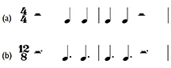
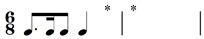

# 4 Rests

## 4.1 Values and dots

Just as sound is important in music, so is silence, and therefore every time value has an equivalent symbol for silence – a __rest__. Here they are in Example 32:

__Example 32__

Notice that the number of flags on the quaver, semiquaver and demisemiquaver rests is the same as the number of flags for their respective time values. In addition, the crotchet, quaver, semiquaver and demisemiquaver rests sit in the middle of the staff.

The same principle regarding dots applies to rests as well as to time values – the dot makes the rest half as long again. And the dot is placed after the rest in the third space from the bottom. Example 33 shows these principles in action.

__Example 33__

## 4.2 Grouping rests

When grouping notes, we saw that the main aim was to achieve ease of reading. The same applies when grouping rests, although there are some exceptions to this rule, which are explained below. Generally, however, the rule of __showing each beat __still applies. Thus, in a bar of 3/4, a crotchet is not followed by a minim rest, but by two crotchet rests, as shown in Example 34 (a). And a crotchet and quaver are followed, not by a dotted crotchet rest, but by a quaver and a crotchet rest, as shown in Example 34 (b). Each beat is shown clearly.

__Example 34__

<!--MEDIACONTENT--><!--ENDMEDIACONTENT-->

### Grouping rests: the exceptions to the ‘show each beat’ rule

__In a bar of 4/4, if two crotchets are either preceded or followed by two crotchets-worth of rests, then a minim rest can be used__ – as Example 35 (a) shows. This rule reflects the rule for beaming four quavers in 4/4, since, as we noted in Section 3.6, you can beam together a minims-worth of quavers.

__In 4/4, you also cannot group rests across the middle of a bar.__ Crotchets at each end of a 4/4 bar are separated by two crotchet rests and not a minim rest, as shown in Example 35 (b). This is a similar concept to the rules for beaming quavers in 4/4 – you cannot beam across the middle of a bar.

__Example 35__

<!--MEDIACONTENT--><!--ENDMEDIACONTENT-->
__Where rests are included that total less than a beat, you need to group in half-beats__. Therefore, two semiquavers at each end of a crotchet beat should be separated by two semiquaver rests, not a quaver rest, as shown in Example 36 (a). And a single opening semiquaver should be followed by a semiquaver rest and then a quaver rest, as shown in Example 36 (b).

__Example 36__

<!--MEDIACONTENT--><!--ENDMEDIACONTENT-->

Again, as with the previous discussions of grouping note values, this grouping of rests might seem unnecessarily complicated. But the overall aim with grouping both note values and rests is to try to ensure that the graphic layout on the page is as easily readable as possible (once, that is, you have learned the rules and the exceptions to the rules!). Therefore, the design of staff notation has evolved so that the reader can recognise not only each individual note, but ‘blocks’ of information, such as that contained in each beat, or even in each bar. This helps to facilitate the reading process, which is particularly important in fast tempos.

## 4.3 Grouping rests in compound time

In compound time, you should follow the ‘show each beat’ principle as in simple time. As you learned in Section 3.8, when dealing with such compound time signatures as 6/8, 9/8 and 12/8, the beat is a dotted crotchet, so each beat’s rest can be written either as a dotted crotchet rest or as a crotchet rest followed by a quaver rest, as in Example 37.

Example 37

<!--MEDIACONTENT--><!--ENDMEDIACONTENT-->
However, in 12/8, which has four beats per bar like 4/4, two dotted crotchet-beat rests at either the beginning or the end of the bar can be written as dotted minim rests, as in Example 38.

__Example 38__

<!--MEDIACONTENT--><!--ENDMEDIACONTENT-->
You can see the parallel with 4/4 – Example 39 shows the 4/4 example (Example 35) compared with the 12/8 example.

__Example 39__

<!--MEDIACONTENT--><!--ENDMEDIACONTENT-->

## 4.4 More on grouping rests

In general __it is better to write as few rests as possible bearing in mind the show each beat rule __(and with such small time values as semiquaver rests, the show each half beat rule shown in Section 4.2 in Example 36). When you have to read more than three or four quaver or semiquaver rests in a row, or indeed a mixture of these, it is difficult to assess quickly just how long the cumulative length of these rests should be. Therefore, providing you follow the rules for grouping and the exceptions to these, use as few rests as possible.

Occasionally, and rather intriguingly, you can have a rest within a beat that is beamed, as shown in Example 40. This makes the beat easier to read.

__Example 40__

<!--MEDIACONTENT--><!--ENDMEDIACONTENT-->
Finally, the only saving grace about grouping rests, is:

For every time signature we’ve discussed, __a rest for a whole bar is a semibreve rest__, even for compound time signatures.

With the grouping of rests it takes time to become adept at organising each beat correctly. As with beaming, you will become familiar with how rests are grouped through looking at music on a regular basis. You will find that you gradually absorb the visual patterns created by the grouping of rests to the point where you can spot immediately a rest that has been used incorrectly. But this takes time, of course. Even so, try the following three groups of activities in which you are asked to identify missing rests. These exercises will help you to come to grips with at least some of the conventions involved.

## 4.5 Review 5

---

Group 1: identifying a single omitted rest in simple time

### Activity 1

#### Question

Which single rest is required at the place marked with the asterisk?

quaver rest

crotchet rest

minim rest

#### Answer

Since the two crotchets take up the first half of the first bar in 4/4, the second half can have a minim rest.

### Activity 2

#### Question

Which single rest is required at the place marked with the asterisk?

quaver rest

crotchet rest

minim rest

#### Answer

Since there is already a minim in the second bar, a crotchet rest is needed in 3/4 to make three crotchet beats overall.

### Activity 3

#### Question

Which single rest is required at the place marked with the asterisk?

semiquaver rest

quaver rest

crotchet rest

#### Answer

The second beat in the first bar already contains a semiquaver together with a quaver. Therefore a semiquaver rest is needed to complete the second beat.

Group 1: identifying a single omitted rest in simple time

### Activity 1

#### Question

Which single rest is required at the place marked with the asterisk?

quaver rest

crotchet rest

minim rest

#### Answer

Since the two crotchets take up the first half of the first bar in 4/4, the second half can have a minim rest.

### Activity 2

#### Question

Which single rest is required at the place marked with the asterisk?

quaver rest

crotchet rest

minim rest

#### Answer

Since there is already a minim in the second bar, a crotchet rest is needed in 3/4 to make three crotchet beats overall.

### Activity 3

#### Question

Which single rest is required at the place marked with the asterisk?

semiquaver rest

quaver rest

crotchet rest

#### Answer

The second beat in the first bar already contains a semiquaver together with a quaver. Therefore a semiquaver rest is needed to complete the second beat.

---

Group 2: identifying two single omitted rests in either compound or simple time

### Activity 1

#### Question

Which single rest is required at each of the places marked with asterisks?

semiquaver rest/dotted minim rest

quaver rest/dotted minim rest

quaver rest/semibreve rest

#### Answer

The second beat in the first bar consists of a crotchet and therefore needs a quaver rest to make up the dotted crotchet beat in 6/8. For the second bar, a whole bar’s rest in 6/8 is written as a semibreve rest.

### Activity 2

#### Question

Which single rest is required at each of the places marked with asterisks?

quaver rest/semibreve rest

quaver rest/dotted minim rest

semiquaver rest/dotted minim rest

#### Answer

Since the time values in the first bar add up to two and a half crotchet beats, a quaver rest is required to complete the bar. For the second bar, a whole bar’s rest in 3/4 is written as a semibreve rest.

Group 2: identifying two single omitted rests in either compound or simple time

### Activity 1

#### Question

Which single rest is required at each of the places marked with asterisks?

semiquaver rest/dotted minim rest

quaver rest/dotted minim rest

quaver rest/semibreve rest

#### Answer

The second beat in the first bar consists of a crotchet and therefore needs a quaver rest to make up the dotted crotchet beat in 6/8. For the second bar, a whole bar’s rest in 6/8 is written as a semibreve rest.

### Activity 2

#### Question

Which single rest is required at each of the places marked with asterisks?

quaver rest/semibreve rest

quaver rest/dotted minim rest

semiquaver rest/dotted minim rest

#### Answer

Since the time values in the first bar add up to two and a half crotchet beats, a quaver rest is required to complete the bar. For the second bar, a whole bar’s rest in 3/4 is written as a semibreve rest.

---

Group 3: identifying three single omitted rests in either simple or compound time

### Activity 1

#### Question

Which single rest is required at each of the places marked with asterisks?

crotchet rest/quaver rest/dotted crotchet rest

crotchet rest/crotchet rest/crotchet rest

quaver rest/quaver rest/dotted crotchet rest

#### Answer

Since the first and third beats in the first bar consist of two dotted crotchets, the two missing rests need to add up to a dotted crotchet – a crotchet rest plus a quaver rest – thereby completing the bar in 9/8. The second bar also consists of time values that total two dotted crotchets and therefore a dotted crotchet rest is needed to make up the bar.

### Activity 2

#### Question

Which single rest is required at each of the places marked with asterisks?

crotchet rest/crotchet rest/minim rest

quaver rest/quaver rest/dotted minim rest

quaver rest/crotchet rest/dotted minim rest

#### Answer

Since the beat is a dotted crotchet in 12/8, the first beat needs a quaver rest to complete it, and the fourth beat a crotchet rest. (Notice how in the first bar the two quavers are not beamed together. Therefore the second quaver marks the beginning of the fourth beat.) A dotted minim rest, which lasts for two dotted crotchet beats, is required to complete the second bar, which already includes a dotted minim extending across the first two dotted crotchet beats in the bar.

### Activity 3

#### Question

Which single rest is required at each of the places marked with asterisks?

semiquaver rest/quaver rest/quaver rest

semiquaver rest/semiquaver rest/quaver rest

quaver rest/semiquaver rest/crotchet rest

#### Answer

Since the first beat in the first bar begins and ends with a semiquaver, two semiquaver rests are needed to make up the first crotchet. (Remember the guideline: where rests totalling less than a beat are included, group in half-beats.) And since the first beat in the second bar begins with a quaver, a quaver rest is needed to make up the crotchet beat.

Group 3: identifying three single omitted rests in either simple or compound time

### Activity 1

#### Question

Which single rest is required at each of the places marked with asterisks?

crotchet rest/quaver rest/dotted crotchet rest

crotchet rest/crotchet rest/crotchet rest

quaver rest/quaver rest/dotted crotchet rest

#### Answer

Since the first and third beats in the first bar consist of two dotted crotchets, the two missing rests need to add up to a dotted crotchet – a crotchet rest plus a quaver rest – thereby completing the bar in 9/8. The second bar also consists of time values that total two dotted crotchets and therefore a dotted crotchet rest is needed to make up the bar.

### Activity 2

#### Question

Which single rest is required at each of the places marked with asterisks?

crotchet rest/crotchet rest/minim rest

quaver rest/quaver rest/dotted minim rest

quaver rest/crotchet rest/dotted minim rest

#### Answer

Since the beat is a dotted crotchet in 12/8, the first beat needs a quaver rest to complete it, and the fourth beat a crotchet rest. (Notice how in the first bar the two quavers are not beamed together. Therefore the second quaver marks the beginning of the fourth beat.) A dotted minim rest, which lasts for two dotted crotchet beats, is required to complete the second bar, which already includes a dotted minim extending across the first two dotted crotchet beats in the bar.

### Activity 3

#### Question

Which single rest is required at each of the places marked with asterisks?

semiquaver rest/quaver rest/quaver rest

semiquaver rest/semiquaver rest/quaver rest

quaver rest/semiquaver rest/crotchet rest

#### Answer

Since the first beat in the first bar begins and ends with a semiquaver, two semiquaver rests are needed to make up the first crotchet. (Remember the guideline: where rests totalling less than a beat are included, group in half-beats.) And since the first beat in the second bar begins with a quaver, a quaver rest is needed to make up the crotchet beat.

