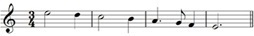

# 5 Pitch

## 5.1 Notes of the bass and treble staves: a reminder

Having considered rhythm, metre and rests in Sections 3 and 4, we can now return to the discussion of pitch, begun in Section 2, and examine how scales and key signatures are formed.

In Section 2 you’ll remember that we looked at the treble and bass staves and the role of clefs. We also identified note names from the bottom of the bass staff to the top of the treble staff. Finally we looked at the use of ledger lines up to a maximum of three, both above and below the treble and bass staves. Here, as a reminder, is the complete range of notes that we identified.

__Example 10 (repeated)__

## 5.2 Semitones and tones, and the scale of C major

If we take a section of the complete range of notes we named, starting at middle C and proceeding up to one of the other Cs, we have the ascending __scale of C major__ (Example 41).

__Example 41__

<!--MEDIACONTENT--><!--ENDMEDIACONTENT-->
Visually, the steady progression of the note heads climbing up the staff suggests that the note heads and the sounds that they signify are equidistant from each other. This idea seems reinforced if you play the scale on a keyboard – you simply play up the white notes from middle C up to the next C.

However, you will spot immediately from Example 42 that there are black notes on the keyboard as well as the white ones. You will also notice that although these are set back from the white ones, they alternate with the white ones, or at least do so for much of the time.

__Example 42__

<!--MEDIACONTENT--><!--ENDMEDIACONTENT-->
For instance, you can see from Example 42 that there is a black note between the C and the D, and then another one between the D and the E. But there isn’t one between the E and the F. As we shall see in a moment, this is crucial.

The distance between two notes is called an __interval__, and the interval between the C and the black note set slightly back and to its right is a __semitone__. The interval between this black note and the D is also a semitone. Two semitones add up to a larger interval, called a __tone__, and so, because we have gone up two semitones in total, the interval between C and D is a tone. The interval between D and E is also a tone – we’ve seen that there is also a black note set between these two notes. However, between E and F there is no black note, and so the interval here is only a semitone.

If we now continue up the scale to the next C, we can identify the intervals between each pair of notes:
<table xmlns:str="http://exslt.org/strings">
<caption>Notes of the C major scale</caption>
<tbody>
<tr>
<td class="highlight_" rowspan="" colspan="">C–D</td>
<td class="highlight_" rowspan="" colspan="">Tone</td>
<td class="highlight_" rowspan="" colspan=""></td>
</tr>
<tr>
<td class="highlight_" rowspan="" colspan="">D–E</td>
<td class="highlight_" rowspan="" colspan="">Tone</td>
<td class="highlight_" rowspan="" colspan=""></td>
</tr>
<tr>
<td class="highlight_" rowspan="" colspan="">E–F</td>
<td class="highlight_" rowspan="" colspan="">Semitone</td>
<td class="highlight_" rowspan="" colspan="">no black note in between</td>
</tr>
<tr>
<td class="highlight_" rowspan="" colspan="">F–G</td>
<td class="highlight_" rowspan="" colspan="">Tone</td>
<td class="highlight_" rowspan="" colspan=""></td>
</tr>
<tr>
<td class="highlight_" rowspan="" colspan="">G–A</td>
<td class="highlight_" rowspan="" colspan="">Tone</td>
<td class="highlight_" rowspan="" colspan=""></td>
</tr>
<tr>
<td class="highlight_" rowspan="" colspan="">A–B</td>
<td class="highlight_" rowspan="" colspan="">Tone</td>
<td class="highlight_" rowspan="" colspan=""></td>
</tr>
<tr>
<td class="highlight_" rowspan="" colspan="">B–C</td>
<td class="highlight_" rowspan="" colspan="">Semitone</td>
<td class="highlight_" rowspan="" colspan="">no black note in between</td>
</tr>
</tbody>
</table>

This pattern of tones and semitones – we can represent it symbolically as __T T S T T T S__ – provides the structure of the C major scale, and all major scales. It is therefore a good idea to memorise this structure (which is called the __intervallic structure__ of the major scale).

## 5.3 Semitones and tones, and the scale of G major

We saw in the previous section that if we start at middle C and follow the T T S T T T S pattern we generate the scale of C major. Middle C (and any other C) in the C major scale is called the __tonic__ or __key note__ – it tells you the key. What if we start on a different note, a different tonic? If we begin on G instead and follow the same intervallic structure, we generate the following notes:
<table xmlns:str="http://exslt.org/strings">
<caption>Notes of the G major scale</caption>
<tbody>
<tr>
<td class="highlight_" rowspan="" colspan="">G–A</td>
<td class="highlight_" rowspan="" colspan="">Tone</td>
</tr>
<tr>
<td class="highlight_" rowspan="" colspan="">A–B</td>
<td class="highlight_" rowspan="" colspan="">Tone</td>
</tr>
<tr>
<td class="highlight_" rowspan="" colspan="">B–C</td>
<td class="highlight_" rowspan="" colspan="">Semitone</td>
</tr>
<tr>
<td class="highlight_" rowspan="" colspan="">C–D</td>
<td class="highlight_" rowspan="" colspan="">Tone</td>
</tr>
<tr>
<td class="highlight_" rowspan="" colspan="">D–E</td>
<td class="highlight_" rowspan="" colspan="">Tone</td>
</tr>
<tr>
<td class="highlight_" rowspan="" colspan="">E–F♯</td>
<td class="highlight_" rowspan="" colspan="">Tone</td>
</tr>
<tr>
<td class="highlight_" rowspan="" colspan="">F♯–G</td>
<td class="highlight_" rowspan="" colspan="">Semitone</td>
</tr>
</tbody>
</table>

The notes generated are the same as for C major, except for one. There is an F♯ instead of an F. (Example 43).

__Example 43__

<!--MEDIACONTENT--><!--ENDMEDIACONTENT-->
The qualifying label, ‘sharp’, indicates that the note has been raised a semitone, and this is represented by the symbol, #, placed *before* the note and on the same line or in the same space as the note head. We needed to raise the F a semitone to F♯ because the interval required at this point in the pattern is a tone. E–F, as we know from our examination of the scale of C major, is only a semitone; we therefore need an additional semitone to make up the tone required by the pattern, T T S T T __T__ S. And a tone above E is not F, but F♯.

### Summary: tones, semitones and scales

1. The intervallic structure for all major scales is T T S T T T S.

2. We can therefore use this pattern to generate a major scale starting on any note – after our examination of C major, we tried a G.

3. The major scales generated, apart from C major, will use a mixture of white and black notes on a keyboard.

## 5.4 Major scales having key signatures with sharps

Example 44 shows the major scales starting on C, G, D, A and E.

__Example 44__

<!--MEDIACONTENT--><!--ENDMEDIACONTENT-->
Notice, firstly, that:

If we compare two scales that lie next to each other in the list, for instance, C major and G major, __the only different note in the lower scale is the *seventh* note__.

Both scales contain Cs, Ds, Es and so on, but in G major, we have F♯ (and not F as in C major) and this F♯ is the seventh note up the G major scale. Similarly, the note in D major that is different from those in G major is C♯, also the seventh note, and so on.

Secondly, notice that:

__In each scale, the number of notes prefaced by sharps increases by one each time__. C major has none, G major has one note prefaced by a sharp, D major two, A major three and E major four.

In order to avoid writing a sharp before every F in, say, a piece in G major (that is, a piece based on the scale of G major), a __key signature__, as shown in Example 45, is supplied at the beginning of each staff. At the opening of a piece, the key signature comes after the clef but before the time signature. The patterning of the sharps in the key signatures is logical, at least as far as four sharps. However, only the F♯ on the top line of the treble staff is shown, not the F♯ in the bottom space, and, similarly, only the C♯ in the third space from the bottom is written in, not the C♯ on the first ledger line below the staff. Although this is far from logical, it at least simplifies the visual information being presented.

__Example 45__

Before leaving this section, have another look at Example 44, and confirm how each scale is generated by the T T S T T T S pattern. Also, identify which notes need sharps in the different scales. Then consider the key signatures in Example 45 and how these relate to the scales in Example 44.

## 5.5 Semitones and tones and the scale of F major

So far, the scales we have discussed have, apart from C major, included notes prefaced by sharps. However, if we start a scale on notes different from those we’ve already tried, the generating pattern T T S T T T S can involve the use of __flats__ instead of sharps. You’ll remember that a sharp*raises* a note by a semitone; conversely, a flat, shown by the symbol, ♭ , *lowers* a note by a semitone. As with the sharp sign, #, the flat sign, ♭, is written *before* the note to which it applies, and is placed on the same line or in the same space as the note head. Both sharps and flats are called __accidentals__ and will be covered in more detail in Section 6.

Here is the series of notes generated if we start on F:
<table xmlns:str="http://exslt.org/strings">
<caption>Notes of the F major scale</caption>
<tbody>
<tr>
<td class="highlight_" rowspan="" colspan="">F–G</td>
<td class="highlight_" rowspan="" colspan="">Tone</td>
</tr>
<tr>
<td class="highlight_" rowspan="" colspan="">G–A</td>
<td class="highlight_" rowspan="" colspan="">Tone</td>
</tr>
<tr>
<td class="highlight_" rowspan="" colspan="">A–B♭</td>
<td class="highlight_" rowspan="" colspan="">Semitone</td>
</tr>
<tr>
<td class="highlight_" rowspan="" colspan="">B♭–C</td>
<td class="highlight_" rowspan="" colspan="">Tone</td>
</tr>
<tr>
<td class="highlight_" rowspan="" colspan="">C–D</td>
<td class="highlight_" rowspan="" colspan="">Tone</td>
</tr>
<tr>
<td class="highlight_" rowspan="" colspan="">D–E</td>
<td class="highlight_" rowspan="" colspan="">Tone</td>
</tr>
<tr>
<td class="highlight_" rowspan="" colspan="">E–F</td>
<td class="highlight_" rowspan="" colspan="">Semitone</td>
</tr>
</tbody>
</table>

Here, the only note that is different from those in C major is the B♭. (C major has B.) But B♭ was necessary here because the third interval in the T T __S__ T T T S pattern is a semitone, not a tone, and therefore the note a semitone below B is required, i.e. B♭, not B. On a keyboard, as you can see from Example 46, this is the black note set back between A and B.

__Example 46__

<!--MEDIACONTENT--><!--ENDMEDIACONTENT-->
You may have wondered why one black note is a sharp (as we saw with F♯) and another is a flat, the B♭. The answer is that notes on a keyboard can be called different things depending on their context. Major (and, as we shall see, minor) scales are __seven-note __(__heptatonic__) scales, and each note has a different letter name. Thus, the seven letter names in F major are F G A B(♭) C D E. They are not called F G A A(♯) C D E, because this would mean A comes twice and there is no B. On the keyboard, then, B♭ and A♯ are the same note, but when writing the scale of F major, B♭ is used, not A♯.

## 5.6 Major scales having key signatures with flats

Example 47 shows the major scales starting on C, F, B♭, E♭ and A♭.

__Example 47__

<!--MEDIACONTENT--><!--ENDMEDIACONTENT-->
Again, as with the group of major scales with sharps in Example 44, there are two points worth noting.

Firstly:

If we compare two scales that lie next to each other in the list, for instance, C major and F major, __the only different note in the lower scale is the *fourth* note__.

Both scales contain Cs, Ds, Es and so on, but in F major, we have B♭ (and not B as in C major), and this B♭ is the fourth note up the F major scale. Similarly, the note in B flat major that is different from those in F major is E♭, also the fourth note, and so on.

Secondly:

In each scale, __the number of different notes prefaced by flats increases by one each time__. C major has none, F major has one note prefaced by a flat, B flat major two, E flat major three and A flat major four.

Example 48 shows the key signatures for these keys.

__Example 48__

Now that we have discussed the major scales with up to four sharp and four flat key signatures, have a look at the summary chart of these scales and their key signatures in Example 49. Work through this chart at a pace that allows you to pass quickly over those scales that you feel you know, but spend more time over those you are less sure of. Always bear in mind the overriding principle – T T S T T T S.

__Example 49__

<!--MEDIACONTENT--><!--ENDMEDIACONTENT-->
Now try the following two activities that assess your knowledge of key signatures of up to four flats or four sharps, and of the major scales that have these key signatures.

## 5.7 Review 6

---

Group 1: identifying key signatures of up to four sharps or four flats

### Activity 1

#### Question

Match the keys of C major, G major, D major, A major, F major, A flat major to the key signatures below.

G major

  

F major

  

A major

  

C major

  

A flat major

  

D major

  

#### Answer

__G major__ The key signature for G major has one sharp.

__F major__ The key signature for F major has one flat.

__A major __The key signature for A major has three sharps.

__C major__ The key signature for C major has neither sharps nor flats.

__A flat major__ The key signature for A flat major has four flats.

__D major__ The key signature for D major has two sharps.

Group 1: identifying key signatures of up to four sharps or four flats

### Activity 1

#### Question

Match the keys of C major, G major, D major, A major, F major, A flat major to the key signatures below.

G major

  

F major

  

A major

  

C major

  

A flat major

  

D major

  

#### Answer

__G major__ The key signature for G major has one sharp.

__F major__ The key signature for F major has one flat.

__A major __The key signature for A major has three sharps.

__C major__ The key signature for C major has neither sharps nor flats.

__A flat major__ The key signature for A flat major has four flats.

__D major__ The key signature for D major has two sharps.

---

Group 2: identifying major scales with key signatures of up to four sharps and four flats

### Activity 1 

#### Question

Match the key signatures of one sharp, two sharps, one flat, two flats to the major scales below. With each activity, don’t forget to check which clef is being used. Each scale starts on its tonic or key note.

Two sharps

  

Two flats

  

One flat

  

One sharp

  

#### Answer

__D major __ You need to add a key signature of two sharps to make this a D major scale beginning on the tonic.

__B flat major__ You need to add a key signature of two flats to make this a B flat major scale beginning on the tonic.

__F major__ You need to add a key signature of one flat to make this an F major scale beginning on the tonic.

__G major__ You need to add a key signature of one sharp to make this a G major scale beginning on the tonic.

Group 2: identifying major scales with key signatures of up to four sharps and four flats

### Activity 1 

#### Question

Match the key signatures of one sharp, two sharps, one flat, two flats to the major scales below. With each activity, don’t forget to check which clef is being used. Each scale starts on its tonic or key note.

Two sharps

  

Two flats

  

One flat

  

One sharp

  

#### Answer

__D major __ You need to add a key signature of two sharps to make this a D major scale beginning on the tonic.

__B flat major__ You need to add a key signature of two flats to make this a B flat major scale beginning on the tonic.

__F major__ You need to add a key signature of one flat to make this an F major scale beginning on the tonic.

__G major__ You need to add a key signature of one sharp to make this a G major scale beginning on the tonic.

## 5.8 Minor scales: the natural form

The major scale is only one of the group of scales used in both western art and western popular music as the basis of composition. Another is the __minor scale__. As we’ve seen, the major scale has only one form generated by the intervallic pattern, T T S T T T S. By contrast, the minor scale has three forms, which all use the same key signature:

1. natural

2. melodic

3. harmonic.

We know that the key signature for C major has no sharps or flats. For the A minor scale, this is the same. Here is the __natural__ form of the scale:

__Example 50__

<!--MEDIACONTENT--><!--ENDMEDIACONTENT-->
You’ll notice that it is similar to the major scale in that it can be played on a keyboard using only the white notes. The only difference is that it begins not on C, but on A. However, this alters the intervallic structure. Instead of T T S T T T S, we get:
<table xmlns:str="http://exslt.org/strings">
<caption>The intervallic structure of the natural form of the A minor scale</caption>
<tbody>
<tr>
<td class="highlight_" rowspan="" colspan="">A–B</td>
<td class="highlight_" rowspan="" colspan="">Tone</td>
</tr>
<tr>
<td class="highlight_" rowspan="" colspan="">B–C</td>
<td class="highlight_" rowspan="" colspan="">Semitone</td>
</tr>
<tr>
<td class="highlight_" rowspan="" colspan="">C–D</td>
<td class="highlight_" rowspan="" colspan="">Tone</td>
</tr>
<tr>
<td class="highlight_" rowspan="" colspan="">D–E</td>
<td class="highlight_" rowspan="" colspan="">Tone</td>
</tr>
<tr>
<td class="highlight_" rowspan="" colspan="">E–F</td>
<td class="highlight_" rowspan="" colspan="">Semitone</td>
</tr>
<tr>
<td class="highlight_" rowspan="" colspan="">F–G</td>
<td class="highlight_" rowspan="" colspan="">Tone</td>
</tr>
<tr>
<td class="highlight_" rowspan="" colspan="">G–A</td>
<td class="highlight_" rowspan="" colspan="">Tone</td>
</tr>
</tbody>
</table>

We can represent this symbolically as __T S T T S T T__.

## 5.9 Minor scales: the melodic and harmonic forms

The second form of the A minor scale, the __melodic__ form, has two types of intervallic structure – the ascending structure is different from the descending structure. The descending pattern is the same as the natural form covered in the previous section. The ascending pattern is as shown below:
<table xmlns:str="http://exslt.org/strings">
<caption>The intervallic structure of the melodic form of the A minor scale (ascending). The descending structure is the same as for the natural form of the minor scale</caption>
<tbody>
<tr>
<td class="highlight_" rowspan="" colspan="">A–B</td>
<td class="highlight_" rowspan="" colspan="">Tone</td>
</tr>
<tr>
<td class="highlight_" rowspan="" colspan="">B–C</td>
<td class="highlight_" rowspan="" colspan="">Semitone</td>
</tr>
<tr>
<td class="highlight_" rowspan="" colspan="">C–D</td>
<td class="highlight_" rowspan="" colspan="">Tone</td>
</tr>
<tr>
<td class="highlight_" rowspan="" colspan="">D–E</td>
<td class="highlight_" rowspan="" colspan="">Tone</td>
</tr>
<tr>
<td class="highlight_" rowspan="" colspan="">E–F♯</td>
<td class="highlight_" rowspan="" colspan="">Tone</td>
</tr>
<tr>
<td class="highlight_" rowspan="" colspan="">F♯–G♯</td>
<td class="highlight_" rowspan="" colspan="">Tone</td>
</tr>
<tr>
<td class="highlight_" rowspan="" colspan="">G♯–A</td>
<td class="highlight_" rowspan="" colspan="">Semitone</td>
</tr>
</tbody>
</table>

Symbolically, this ascending structure can be represented as __T S T T T T S__.

Example 51 shows the A minor melodic scale, both ascending and descending.

__Example 51__

<!--MEDIACONTENT--><!--ENDMEDIACONTENT-->
In the ascending version, notice that the need to raise both the F and the G to F♯ and G♯ respectively does not affect the key signature – these sharpened notes are simply ignored. Instead, when F♯s or G♯s are required in the music, the sharps have to be written in for each note, or at least as often as is necessary. We’ll consider the guidelines for how to deal with this in Section 6 on accidentals and we’ll also discuss the role of another accidental, the natural, shown by the symbol ♮. In Example 51, the bracketed naturals remind us that, whereas in the ascending scale the F and G become F♯ and G♯ respectively, in the descending form the G and F remain as G and F.

The third and final form of the A minor scale is the __harmonic__ minor (which has the same intervallic structure both ascending and descending). It contains elements from both the ascending form of the melodic minor (the G♯) and the descending form (the F). The consequence of this is that the interval between F and G♯ is a tone plus a semitone, an interval that we haven’t met in a scale before:
<table xmlns:str="http://exslt.org/strings">
<caption>The intervallic structure of the harmonic form of the A minor scale. The structure is the same both ascending and descending</caption>
<tbody>
<tr>
<td class="highlight_" rowspan="" colspan="">A–B</td>
<td class="highlight_" rowspan="" colspan="">Tone</td>
</tr>
<tr>
<td class="highlight_" rowspan="" colspan="">B–C</td>
<td class="highlight_" rowspan="" colspan="">Semitone</td>
</tr>
<tr>
<td class="highlight_" rowspan="" colspan="">C–D</td>
<td class="highlight_" rowspan="" colspan="">Tone</td>
</tr>
<tr>
<td class="highlight_" rowspan="" colspan="">D–E</td>
<td class="highlight_" rowspan="" colspan="">Tone</td>
</tr>
<tr>
<td class="highlight_" rowspan="" colspan="">E–F</td>
<td class="highlight_" rowspan="" colspan="">Semitone</td>
</tr>
<tr>
<td class="highlight_" rowspan="" colspan="">F–G♯</td>
<td class="highlight_" rowspan="" colspan="">Tone + semitone</td>
</tr>
<tr>
<td class="highlight_" rowspan="" colspan="">G♯–A</td>
<td class="highlight_" rowspan="" colspan="">Semitone</td>
</tr>
</tbody>
</table>

Symbolically, this ascending structure can be represented as __T S T T S T + S S__.

The A minor harmonic scale is shown in Example 52. Again, the need to raise the G to G♯ does not affect the key signature, which, as you know, has no sharps or flats.

__Example 52__

<!--MEDIACONTENT--><!--ENDMEDIACONTENT-->
It is true that minor scales are more complicated than major ones. However, the differences between the three forms are less complex than a quick glance might suggest. If we compare the three forms of the A minor scale (see Example 53), you can see that these differences relate to only two questions: (i) whether the sixth note and/or seventh note up the scale is sharpened, and (ii) whether the ascending and descending forms of the scale are the same. So the differences are not as great as it might first appear. The first five notes of each of the three forms (when ascending, and the last five notes when descending) are exactly the same, and, as noted earlier, the descending form of the melodic minor has the same intervallic structure as the natural minor.

__Example 53__

## 5.10 Relative minor and relative major

Because the scales of C major and A minor have the same key signature, they are clearly related. Indeed, the key of A minor is called the __relative minor__ of C major. Conversely, C major is called the __relative major__ of A minor. If we look at the relationship between C and A on a keyboard in Example 54, we can count the number of semitones between them (it’s quicker to do this counting from C down to A rather than C up to the higher A). The result is three – C–B, B–B♭, B♭–A. So the relative minor of a major key, and the minor key that has the same key signature, is *three semitones *lower than its major counterpart.

By following this principle, we can work out the relative minor key of G major, the second major key we examined in Section 5.3. Look at Example 54 again. Three semitones down from G, namely: G–F♯, F♯–F and F–E is E. E minor is thus the relative minor of G major and has the same key signature, one sharp.

__Example 54__

If we now follow the intervallic patterns we discovered in the various forms of the minor scale – the pattern of the natural form was T S T T S T T, for instance – we can generate the three forms of the E minor scale shown in Example 55. Fundamentally, we have only one different note from those we had in the scale of A minor, the F♯. However, with the three different forms (natural, harmonic and melodic) the same question arises with regards to the sixth and seventh notes up the scale – should one or both be sharpened or not?

__Example 55__

<!--MEDIACONTENT--><!--ENDMEDIACONTENT-->
You can find a summary chart of the minor scales with up to four-sharp and four-flat key signatures in Example 56. Study this carefully – minor scales, especially those with three or four flats or sharps, are more difficult to grasp than their relative-major counterparts. So take time over this.

__Example 56__

<!--MEDIACONTENT--><!--ENDMEDIACONTENT-->
The following two activities assess your knowledge of minor key signatures of up to four flats and four sharps, and of the minor scales that have these key signatures. Try them now.

## 5.11 Review 7

---

Group 1: identifying minor key signatures of up to four sharps or four flats

### Activity 1

#### Question

Match the keys of C minor, G minor, D minor, E minor, B minor, F minor to the key signatures.

E minor

  

D minor

  

G minor

  

C minor

  

F minor

  

B minor

  

#### Answer

__E minor __The key signature for E minor has one sharp. Remember that if you wrote out the three forms of the E minor scale, you would have to consider whether to sharpen the sixth and/or seventh notes of the different forms of the scale. If you wish, refer to the chart of minor scales (Example 56) to check how to write out the three forms of this scale.

__D minor __The key signature for D minor has one flat. As in the previous example, if you wrote out the three forms of the D minor scale, you would have to consider whether to sharpen the sixth and/or seventh notes of the different forms of the scale. Note that, since the sixth note of the scale is B♭, to sharpen it, i.e. to raise it a semitone, would bring you to B (not B♯). Check this by referring to the chart of minor scales (Example 56).

__G minor __The key signature for G minor has two flats. You might want to refer to the chart of minor scales (Example 56) to check how to write out the three forms of this scale.

__C minor__ The key signature for C minor has three flats. You might wish to refer to the chart of minor scales (Example 56) to check how to write out the three forms of this scale.

__F minor__ The key signature for F minor has four flats. Refer to the chart of minor scales (Example 56) to check how to write out the three forms of this scale.

__B minor__ The key signature for B minor has two sharps. If you wish, refer to the chart of minor scales (Example 56) to check how to write out the three forms of this scale.

Group 1: identifying minor key signatures of up to four sharps or four flats

### Activity 1

#### Question

Match the keys of C minor, G minor, D minor, E minor, B minor, F minor to the key signatures.

E minor

  

D minor

  

G minor

  

C minor

  

F minor

  

B minor

  

#### Answer

__E minor __The key signature for E minor has one sharp. Remember that if you wrote out the three forms of the E minor scale, you would have to consider whether to sharpen the sixth and/or seventh notes of the different forms of the scale. If you wish, refer to the chart of minor scales (Example 56) to check how to write out the three forms of this scale.

__D minor __The key signature for D minor has one flat. As in the previous example, if you wrote out the three forms of the D minor scale, you would have to consider whether to sharpen the sixth and/or seventh notes of the different forms of the scale. Note that, since the sixth note of the scale is B♭, to sharpen it, i.e. to raise it a semitone, would bring you to B (not B♯). Check this by referring to the chart of minor scales (Example 56).

__G minor __The key signature for G minor has two flats. You might want to refer to the chart of minor scales (Example 56) to check how to write out the three forms of this scale.

__C minor__ The key signature for C minor has three flats. You might wish to refer to the chart of minor scales (Example 56) to check how to write out the three forms of this scale.

__F minor__ The key signature for F minor has four flats. Refer to the chart of minor scales (Example 56) to check how to write out the three forms of this scale.

__B minor__ The key signature for B minor has two sharps. If you wish, refer to the chart of minor scales (Example 56) to check how to write out the three forms of this scale.

---

Group 2: identifying minor scales with key signatures of up to four sharps and four flats

### Activity 1

#### Question

Match the key signatures of one sharp, two sharps, one flat, three flats to the scales below.

With each activity, don’t forget to check which clef is being used. Each scale starts on the tonic or key-note.

One flat

  

Two sharps

  

One sharp

  

Three flats

  

#### Answer

__D minor__ You need to add a key signature of one flat to make this a D minor scale starting on the tonic. The C♯ in the second bar is the sharpened seventh making this the harmonic form of the D minor scale.

__B minor__ You need to add a key signature of two sharps to make this a B minor scale starting on the tonic. Both the sixth and seventh notes of the scale are sharpened which means that this is the ascending melodic form of the scale.

__E minor__ You need to add a key signature of one sharp to make this an E minor scale starting on the tonic. Neither the sixth nor seventh notes of the scale are sharpened making this the descending melodic or natural form of the scale (remember that both the natural and the melodic forms of the scale have the same descending pattern).

__C minor__ You need to add a key signature of three flats to make this a C minor scale starting on the tonic. Both the sixth and seventh notes of the scale are sharpened, i.e. raised a semitone – the key signature has A♭ and B♭ but the scale requires A and B – and therefore this is the ascending melodic form of the scale.

Group 2: identifying minor scales with key signatures of up to four sharps and four flats

### Activity 1

#### Question

Match the key signatures of one sharp, two sharps, one flat, three flats to the scales below.

With each activity, don’t forget to check which clef is being used. Each scale starts on the tonic or key-note.

One flat

  

Two sharps

  

One sharp

  

Three flats

  

#### Answer

__D minor__ You need to add a key signature of one flat to make this a D minor scale starting on the tonic. The C♯ in the second bar is the sharpened seventh making this the harmonic form of the D minor scale.

__B minor__ You need to add a key signature of two sharps to make this a B minor scale starting on the tonic. Both the sixth and seventh notes of the scale are sharpened which means that this is the ascending melodic form of the scale.

__E minor__ You need to add a key signature of one sharp to make this an E minor scale starting on the tonic. Neither the sixth nor seventh notes of the scale are sharpened making this the descending melodic or natural form of the scale (remember that both the natural and the melodic forms of the scale have the same descending pattern).

__C minor__ You need to add a key signature of three flats to make this a C minor scale starting on the tonic. Both the sixth and seventh notes of the scale are sharpened, i.e. raised a semitone – the key signature has A♭ and B♭ but the scale requires A and B – and therefore this is the ascending melodic form of the scale.

