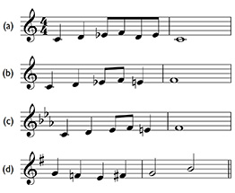
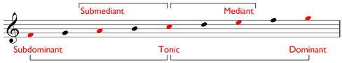
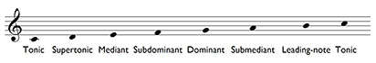
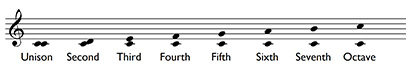
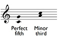
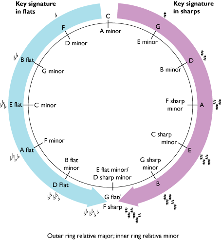

# 6 Accidentals, degrees of the scale and intervals

During the discussion of scales, several topics were touched upon that now need a little further explanation:

1. accidentals

2. degrees of the scale

3. intervals.

We’ll begin this section with accidentals.

## 6.1 Accidentals

While examining the structures of the G major and F major scales, we noted that the symbol for the sharp is a #, and that for the flat, a ♭. These symbols are called __accidentals__. With the discussion of minor scales, you discovered the third accidental you need to know, the __natural__, ♮. You will have noticed it in some of the music examples and in the chart of minor scales in the previous section (Example 56).

While the role of the sharp is to raise a note a semitone, and the flat is to lower a note a semitone, the natural ‘cancels’ a previous sharp or flat. It lowers a sharpened note by a semitone, or raises a flattened note by a semitone. Naturals can therefore be used in a particular bar to cancel sharps or flats that have appeared earlier in the bar. Naturals can also be used to cancel sharps or flats that appear in the key signature. As you know, sharps or flats in a key signature dictate which notes are sharpened or flattened throughout a piece (unless the key signature is changed at some point), but you can use naturals to cancel the sharps or flats of notes as you proceed.

## 6.2 Accidentals in practice

Let’s look at some examples to see how accidentals work in practice. In Example 57 (a), the key signature is for C major (no sharps or flats), but we want to have E♭ s. We therefore add a flat before the first E to lower it a semitone to E♭. Accidentals, unless cancelled, last throughout a bar, and so the second E will also be an E♭.

If we want to write an E♮ rather than an E♭ later during the bar as in Example 57 (b), we have to cancel the earlier flat by writing a natural before the second E.

__Example 57__

<!--MEDIACONTENT--><!--ENDMEDIACONTENT-->
Example 57 (c) will produce exactly the same melody as Example 57 (b), but uses the C minor key signature. The first E will be E♭ because of the E♭ in the key signature (and does not therefore need a flat), but the second E will need a natural to raise it a semitone from E♭ to E♮.

Finally, in Example 57 (d), the first F needs a natural to cancel the effect of the F♯ in the key signature, but the second F then needs a sharp to cancel the effect of the natural before the first F.

Three final points (which mostly reinforce what you’ve learned already):

### Accidentals in practice: summary

* Notice that we use ‘sharpen’ to mean ‘raise by a semitone’. So, we can say: ‘We need to sharpen A♮ to become A♯’. But we can also say: ‘We need to sharpen A♭ to become A♮’. (We saw this principle in operation in the previous activity, in the D minor answer for Group 1 Activity 1 in the previous review.) Conversely, we use ‘flatten’ to mean ‘lower by a semitone’.

* When identifying notes without accidentals, it is tempting to say simply, ‘This is C’. However, always remember that this is a shorthand for saying, ‘This is C♮’.

* Key signatures consist of groups of accidentals that are either sharps or flats. There is never a mixture.

## 6.3 Identifying the degrees of the scale

During the discussion of scales I needed to talk about not only accidentals but also degrees of the scale. I needed to be able to identify certain degrees of the scale, and therefore used a phrase such as ‘sixth or seventh note up the scale’. However, there are several ways of referring to the degrees of the scale:

* the ordinal numbers already noted

* cardinal numbers with carets above; and

* names that reflect the importance of a particular note within a scale.

Here are the different systems displayed side by side, assuming that the scale is ascending:
<table xmlns:str="http://exslt.org/strings">
<caption>Relationships of the names for the degrees of the scale</caption>
<tbody>
<tr>
<th>Ordinals</th>
<th>Cardinals, with carets above</th>
<th>Names</th>
</tr>
<tr>
<td class="highlight_" rowspan="" colspan="">First degree</td>
<td class="highlight_" rowspan="" colspan="">1̂</td>
<td class="highlight_" rowspan="" colspan="">Tonic, or key note</td>
</tr>
<tr>
<td class="highlight_" rowspan="" colspan="">Second</td>
<td class="highlight_" rowspan="" colspan="">2̂</td>
<td class="highlight_" rowspan="" colspan="">Supertonic</td>
</tr>
<tr>
<td class="highlight_" rowspan="" colspan="">Third</td>
<td class="highlight_" rowspan="" colspan="">3̂</td>
<td class="highlight_" rowspan="" colspan="">Mediant</td>
</tr>
<tr>
<td class="highlight_" rowspan="" colspan="">Fourth</td>
<td class="highlight_" rowspan="" colspan="">4̂</td>
<td class="highlight_" rowspan="" colspan="">Subdominant</td>
</tr>
<tr>
<td class="highlight_" rowspan="" colspan="">Fifth</td>
<td class="highlight_" rowspan="" colspan="">5̂</td>
<td class="highlight_" rowspan="" colspan="">Dominant</td>
</tr>
<tr>
<td class="highlight_" rowspan="" colspan="">Sixth</td>
<td class="highlight_" rowspan="" colspan="">6̂</td>
<td class="highlight_" rowspan="" colspan="">Submediant</td>
</tr>
<tr>
<td class="highlight_" rowspan="" colspan="">Seventh</td>
<td class="highlight_" rowspan="" colspan="">7̂</td>
<td class="highlight_" rowspan="" colspan="">Leading note</td>
</tr>
</tbody>
</table>

The names of the notes in the scale need explanation. In tonal music the most important note in the scale is the __tonic__ or __key note__. In the scale of C major, for instance, the tonic, as you know, is C: the tonic signifies the key of the scale. The second most important note is the __dominant__, the fifth degree of the scale (see Example 58). Note that in this example the C major scale is notated from F, via C up to G so that the relationships between the names for the degrees of the scale are more clearly expressed.

__Example 58__

Next comes the __subdominant__, which has a ‘mirror’ position to that of the dominant. The dominant is five notes *above* the tonic; the subdominant is five notes *below* (*sub*, Latin for ‘under’). The __mediant__ sits between the tonic and the dominant (*medius*, Latin for ‘middle’), and the __submediant__ between the tonic and the (lower) subdominant. The __supertonic__ lies immediately above the tonic (*super*, Latin for ‘above’, ‘over’), and, finally, the __leading-note__ rises up to the tonic (see Example 59).

__Example 59__

<!--MEDIACONTENT--><!--ENDMEDIACONTENT-->

## 6.4 Intervals

The final topic that arose during the discussion of scales was intervals. We noted how major scales are constructed from two intervals, the semitone and the tone, and how the harmonic form of the minor scale includes another interval, the tone plus semitone, i.e. three semitones. There is no reason why you couldn’t, in theory, count up larger and larger intervals in semitones. However, as the size of intervals increases, identifying them by counting semitones becomes impractical.

To make things easier, intervals are identified by labels that consist of two determinants, __quality __and__ number__. You can calculate the number of an interval by regarding the lower note as the tonic and then counting up the degrees of the scale. Thus, as shown in Example 60, the interval C–E would be a third, C–G a fifth and C–B a seventh. C to the same C is a __unison__; C to the C eight notes higher, an __octave__. Note that the two notes in the interval can be sounded together as a __harmonic interval__, or in succession as a __melodic interval__.

__Example 60__

<!--MEDIACONTENT--><!--ENDMEDIACONTENT-->
The quality of an interval can be __perfect__, __major__,__minor__, __augmented__ or __diminished__.

So, for instance, you can have a perfect fourth, a major third, an augmented sixth.

However, for our purposes, here I comment only on the __perfect fifth__, which consists of seven semitones, e.g. C–G in the C major scale, and the __minor third__, which consists of three semitones, e.g. A–C in the A minor scale (see Example 61).

__Example 61__

<!--MEDIACONTENT--><!--ENDMEDIACONTENT-->

## 6.5 The perfect fifth, the minor third and the circle of fifths

---

### The perfect fifth

While discussing scales, you might have wondered why I described them in the order I chose. From a starting point of C major, the pattern for major scales with sharp key signatures was G, D, A and E, with the key signature for each scale adding an additional sharp to the previous one. The pattern for major scales with flat key signatures was F, B♭, E♭ and A♭, with the key signature for each scale adding an additional flat to the previous one. You might have guessed that this gradual increase in the size of the key signatures governed my choice. And you would have been right.

But my choice was also governed by the related fact that each successive major scale with a sharp key signature starts on the note a *perfect fifth* above the previous one, and each successive scale with a flat key signature starts on the note a *perfect fifth* below the previous one. So G major, with one sharp in its key signature, begins on the note a perfect fifth *above* C, which has no sharps or flats in its key signature. And D major, with two sharps in its key signature, begins on the note a perfect fifth *above* G. And so on. Conversely, F major, with one flat in its key signature, begins on the note a perfect fifth *below* C, and B♭ major, with two flats in its key signature, begins on the note a perfect fifth *below* F. And so on.

This sequence of keys, extended to cover a whole series, is better understood as a diagram, the circle of fifths, shown in Figure 1.

The major keys sit outside the circle and their corresponding relative minors (which have the same key signature) inside the circle. You should take a little time to explore this diagram (although bear in mind that you need a working knowledge of major and minor keys of only up to four sharps and four flats before you start *Inside music*).

__Figure 1 The circle of fifths__

---

---

### The minor third

---

As you may remember, and as shown in the diagram of the circle of fifths above, the tonic of a relative minor scale can be found by counting down three semitones from the tonic of its major equivalent, for instance, the tonic of C major down to the tonic of A minor. This interval, A–C, consisting of three semitones, we can now name as a __minor third__.

