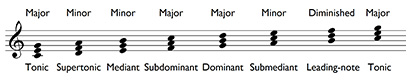

# 7 Harmony: the triad

Our discussion of intervals, notably harmonic intervals, is the first time in this course that we have moved from discussion of one sound at a time to two sounding together. But the exploration of the combination of sounds to form harmony is one of western music’s major contributions to music worldwide, and we therefore need to consider a basic feature of harmony, the triad.

A __triad__ is, as its name implies, a collection of three notes sounding together. Triads are constructed from two thirds placed one on top of the other. Starting from C, for instance, and in C major, a triad would also include the notes E and G; starting from G, the notes B and D. Triads can, in fact, be constructed on any note of the scale, as shown in Example 63. In order to identify these triads, you can simply use the names of the degrees of the scale on which they are constructed. Therefore C–E–G in C major is the __tonic triad__ since it is built on the tonic, C; D–F–A in C major is the __supertonic triad__ since it is built on the supertonic, D. And so on.

__Example 63__

<!--MEDIACONTENT--><!--ENDMEDIACONTENT-->
The three notes in the triad, from the bottom up, are called the __root__ (since this is the basis of the triad), the __third__ and the __fifth__. The fifth is (except in one case, in the triad on the leading-note) a perfect fifth.

Notice in Example 63 that the intervals of a third that are used to construct triads are sometimes major (i.e. consisting of four semitones) or minor (i.e. consisting of three semitones). Thus with the tonic triad, C–E–G, the lower interval, C–E, is a major third but the upper interval, E–G, is a minor third. However, with the supertonic triad, D–F–A, the lower interval, D–F, is a minor third but the upper interval, F–A, is a major third. Triads are labelled as major or minor depending on this arrangement.

* Where the major third is the lower interval, as in the tonic, subdominant and dominant triads, the triad is a __major triad__.

* Where the minor third is the lower interval as in the supertonic, mediant and submediant triads, the triad is a __minor triad__.

The triads in a minor key follow a different pattern of major and minor; these will be explained in *Inside music*, as will the triad on the leading-note, which in both major and minor keys is a __diminished triad__.

A good deal of the material in *Inside music* deals with harmony. So spend some time familiarising yourself with triads, their names, and how they are constructed from major and minor thirds – it will be time well spent.

