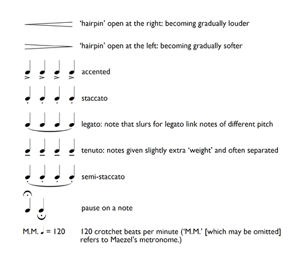
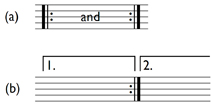

# 8 Scores: performance directions

So far, we have considered such elements of notation as pitch and rhythm, but there are other instructions on scores (notated music) relating to performance that you need to be able to understand. These can be divided into five main categories:

1. dynamics

2. tempo

3. articulation

4. expression

5. special signs.

The first thing to note about performance directions is that almost all of them are relative rather than absolute. This means that while bearing their meaning in mind, performers interpret them within limits. The second thing to note is that the meaning of some performance directions has changed over time. Indeed, some performance directions have even had more than one meaning during a particular period. For instance, from the seventeenth century to the middle of the eighteenth century, *presto* could mean either fast, or faster than *allegro*. And, finally, although the performance directions listed here are selected from the traditional Italian ones, a comprehensive collection would have to include performance directions in other languages too.

## 8.1 A selected list of performance directions

<table xmlns:str="http://exslt.org/strings">
<caption>Dynamics</caption>
<tbody>
<tr>
<th>Direction</th>
<th>Interpretation</th>
</tr>
<tr>
<td class="highlight_" rowspan="" colspan="">fff</td>
<td class="highlight_" rowspan="" colspan="">louder than ff</td>
</tr>
<tr>
<td class="highlight_" rowspan="" colspan="">ff (fortissimo)</td>
<td class="highlight_" rowspan="" colspan="">very loud</td>
</tr>
<tr>
<td class="highlight_" rowspan="" colspan="">f (forte)</td>
<td class="highlight_" rowspan="" colspan="">loud</td>
</tr>
<tr>
<td class="highlight_" rowspan="" colspan="">mf (mezzo forte)</td>
<td class="highlight_" rowspan="" colspan="">(literally) half loud</td>
</tr>
<tr>
<td class="highlight_" rowspan="" colspan="">mp (mezzo piano)</td>
<td class="highlight_" rowspan="" colspan="">(literally) half soft</td>
</tr>
<tr>
<td class="highlight_" rowspan="" colspan="">p (piano)</td>
<td class="highlight_" rowspan="" colspan="">soft</td>
</tr>
<tr>
<td class="highlight_" rowspan="" colspan="">pp (pianissimo)</td>
<td class="highlight_" rowspan="" colspan="">very soft</td>
</tr>
<tr>
<td class="highlight_" rowspan="" colspan="">ppp</td>
<td class="highlight_" rowspan="" colspan="">softer than pp</td>
</tr>
<tr>
<td class="highlight_" rowspan="" colspan=""></td>
<td class="highlight_" rowspan="" colspan=""></td>
</tr>
<tr>
<td class="highlight_" rowspan="" colspan="">crescendo (cresc.)</td>
<td class="highlight_" rowspan="" colspan="">gradually becoming louder</td>
</tr>
<tr>
<td class="highlight_" rowspan="" colspan="">decrescendo (decresc.)</td>
<td class="highlight_" rowspan="" colspan="">gradually becoming softer</td>
</tr>
<tr>
<td class="highlight_" rowspan="" colspan="">diminuendo (dim.)</td>
<td class="highlight_" rowspan="" colspan="">gradually becoming softer</td>
</tr>
<tr>
<td class="highlight_" rowspan="" colspan="">sf/sfz (sforzando)</td>
<td class="highlight_" rowspan="" colspan="">(literally) forced: sudden loudness accentuating a note</td>
</tr>
</tbody>
</table>
<table xmlns:str="http://exslt.org/strings">
<caption>Tempo</caption>
<tbody>
<tr>
<th>Direction</th>
<th>Translation</th>
<th>Interpretation</th>
</tr>
<tr>
<td class="highlight_" rowspan="" colspan="">largo</td>
<td class="highlight_" rowspan="" colspan="">large, broad</td>
<td class="highlight_" rowspan="" colspan="">very slowly</td>
</tr>
<tr>
<td class="highlight_" rowspan="" colspan="">larghetto</td>
<td class="highlight_" rowspan="" colspan="">diminutive of largo</td>
<td class="highlight_" rowspan="" colspan="">slow, but not as slow as largo</td>
</tr>
<tr>
<td class="highlight_" rowspan="" colspan="">grave</td>
<td class="highlight_" rowspan="" colspan="">heavy, serious</td>
<td class="highlight_" rowspan="" colspan="">very slow, solemn</td>
</tr>
<tr>
<td class="highlight_" rowspan="" colspan="">adagio</td>
<td class="highlight_" rowspan="" colspan="">at ease, leisurely</td>
<td class="highlight_" rowspan="" colspan="">slowly, or very slowly</td>
</tr>
<tr>
<td class="highlight_" rowspan="" colspan="">lento</td>
<td class="highlight_" rowspan="" colspan="">slow</td>
<td class="highlight_" rowspan="" colspan="">slowly</td>
</tr>
<tr>
<td class="highlight_" rowspan="" colspan="">andante</td>
<td class="highlight_" rowspan="" colspan="">at a walking pace</td>
<td class="highlight_" rowspan="" colspan="">at a medium walking pace</td>
</tr>
<tr>
<td class="highlight_" rowspan="" colspan="">andantino</td>
<td class="highlight_" rowspan="" colspan="">diminutive of andante</td>
<td class="highlight_" rowspan="" colspan="">slightly faster than andante, although sometimes slightly slower</td>
</tr>
<tr>
<td class="highlight_" rowspan="" colspan="">moderato</td>
<td class="highlight_" rowspan="" colspan="">moderate, restrained</td>
<td class="highlight_" rowspan="" colspan="">moderately</td>
</tr>
<tr>
<td class="highlight_" rowspan="" colspan="">allegretto</td>
<td class="highlight_" rowspan="" colspan="">diminutive of allegro</td>
<td class="highlight_" rowspan="" colspan="">fairly quick, but not as quick as allegro</td>
</tr>
<tr>
<td class="highlight_" rowspan="" colspan="">vivace</td>
<td class="highlight_" rowspan="" colspan="">flourishing, full of life</td>
<td class="highlight_" rowspan="" colspan="">lively</td>
</tr>
<tr>
<td class="highlight_" rowspan="" colspan="">allegro</td>
<td class="highlight_" rowspan="" colspan="">merry, cheerful</td>
<td class="highlight_" rowspan="" colspan="">fast</td>
</tr>
<tr>
<td class="highlight_" rowspan="" colspan="">presto</td>
<td class="highlight_" rowspan="" colspan="">ready, prompt</td>
<td class="highlight_" rowspan="" colspan="">very fast (although originally only fast)</td>
</tr>
</tbody>
</table>
<table xmlns:str="http://exslt.org/strings">
<caption></caption>
<tbody>
<tr>
<th>Direction</th>
<th>Interpretation</th>
</tr>
<tr>
<td class="highlight_" rowspan="" colspan="">accelerando (accel.)</td>
<td class="highlight_" rowspan="" colspan="">gradually becoming quicker</td>
</tr>
<tr>
<td class="highlight_" rowspan="" colspan="">a tempo</td>
<td class="highlight_" rowspan="" colspan="">in time</td>
</tr>
<tr>
<td class="highlight_" rowspan="" colspan="">ma non troppo</td>
<td class="highlight_" rowspan="" colspan="">but not too much</td>
</tr>
<tr>
<td class="highlight_" rowspan="" colspan="">rallentando (rall.)</td>
<td class="highlight_" rowspan="" colspan="">gradually becoming slower</td>
</tr>
<tr>
<td class="highlight_" rowspan="" colspan="">ritardando (rit. or ritard.)</td>
<td class="highlight_" rowspan="" colspan="">gradually becoming slower</td>
</tr>
<tr>
<td class="highlight_" rowspan="" colspan="">ritenuto (rit. or riten.)</td>
<td class="highlight_" rowspan="" colspan="">(literally) held back: a more localised slowing down</td>
</tr>
</tbody>
</table>
<table xmlns:str="http://exslt.org/strings">
<caption>Articulation</caption>
<tbody>
<tr>
<th>Direction</th>
<th>Interpretation</th>
</tr>
<tr>
<td class="highlight_" rowspan="" colspan="">legato</td>
<td class="highlight_" rowspan="" colspan="">smoothly</td>
</tr>
<tr>
<td class="highlight_" rowspan="" colspan="">semi-staccato</td>
<td class="highlight_" rowspan="" colspan="">a little detached, less so than staccato</td>
</tr>
<tr>
<td class="highlight_" rowspan="" colspan="">staccato (stacc.)</td>
<td class="highlight_" rowspan="" colspan="">detached</td>
</tr>
<tr>
<td class="highlight_" rowspan="" colspan="">tenuto</td>
<td class="highlight_" rowspan="" colspan="">held</td>
</tr>
</tbody>
</table>
<table xmlns:str="http://exslt.org/strings">
<caption>Expression</caption>
<tbody>
<tr>
<th>Direction</th>
<th>Interpretation</th>
</tr>
<tr>
<td class="highlight_" rowspan="" colspan="">agitato</td>
<td class="highlight_" rowspan="" colspan="">agitated</td>
</tr>
<tr>
<td class="highlight_" rowspan="" colspan="">cantabile</td>
<td class="highlight_" rowspan="" colspan="">in a singing style</td>
</tr>
<tr>
<td class="highlight_" rowspan="" colspan="">dolce</td>
<td class="highlight_" rowspan="" colspan="">sweet</td>
</tr>
<tr>
<td class="highlight_" rowspan="" colspan="">espressivo (espress. or espr.)</td>
<td class="highlight_" rowspan="" colspan="">expressive</td>
</tr>
<tr>
<td class="highlight_" rowspan="" colspan="">grazioso</td>
<td class="highlight_" rowspan="" colspan="">graceful</td>
</tr>
<tr>
<td class="highlight_" rowspan="" colspan="">leggiero</td>
<td class="highlight_" rowspan="" colspan="">light</td>
</tr>
<tr>
<td class="highlight_" rowspan="" colspan="">molto</td>
<td class="highlight_" rowspan="" colspan="">very, much</td>
</tr>
<tr>
<td class="highlight_" rowspan="" colspan="">poco</td>
<td class="highlight_" rowspan="" colspan="">a little</td>
</tr>
<tr>
<td class="highlight_" rowspan="" colspan="">semplice</td>
<td class="highlight_" rowspan="" colspan="">simple</td>
</tr>
<tr>
<td class="highlight_" rowspan="" colspan="">senza</td>
<td class="highlight_" rowspan="" colspan="">without</td>
</tr>
<tr>
<td class="highlight_" rowspan="" colspan="">sostenuto</td>
<td class="highlight_" rowspan="" colspan="">sustained</td>
</tr>
<tr>
<td class="highlight_" rowspan="" colspan="">subito</td>
<td class="highlight_" rowspan="" colspan="">sudden</td>
</tr>
</tbody>
</table>

### Special signs

## 8.2 Following piano scores

The music examples you have studied so far have been written on only one staff, and you have been able to hear the corresponding sounds for many of the examples. However, as you become proficient at reading music, you may want to tackle scores such as piano scores, where you need to be aware of two staves being used simultaneously. Furthermore, you may want to follow piano scores while listening to the music.

What does ‘follow’ mean in this context? Well, it certainly doesn’t mean that you have to register consciously every notated detail of the passage in the score as you listen. Rather, it means that you need to be able to synchronise in a general way what your eye is seeing on the score and what your ear is hearing in the music. At first, even that might not be possible. The relentless progress of the music might be too much for you to cope with. This is to be expected. Even at a basic level, following a score needs practice. You need to become familiar with the idea of scanning the notation as you hear the music, of focusing on the melody while being aware of the accompaniment, of identifying on the score points at which, for whatever reason, the music does something substantially different from what it had been doing previously.

In order to prepare yourself for following a score, think about the following:

* What is the extent of the passage you wish to follow? Glance through the passage quickly noting the opening and closing bars.

* What is the speed of the music? – see the tempo marking – and how many beats are there in a bar? – see the time signature.

* Are there any repeated passages? These will be marked in two ways, either (a) with repeat marks (if the player has to repeat a passage from the beginning, the opening repeat marks are omitted); or (b) first- and second-time bars (Example 64).

* Do you need to turn a page? If so, try to imagine what is happening in the music for a few bars after the page turn so that, when you turn, you are not caught out.

__Example 64__

## 8.3 Following piano scores in practice

As you follow the two staves of a piano score, the upper staff will use, for the most part, the treble clef (and be played by the pianist’s right hand), and the lower staff, the bass clef (and be played by the pianist’s left hand). Basically, you need to follow the upper staff, because this is usually where the melody is. Concentrate on the way the rise and fall of the melody is reflected in the higher or lower position of the note heads on the staff. The ups and downs of the melody should correspond to the ‘undulations’ of the notated melody line. As you become familiar with both the sound and sight of a passage, you will be able to keep an eye on both the melody and the accompaniment as the music progresses. You will also be able to spot if the melody moves down to the lower staff, which happens from time to time.

In addition, keep a look out on the score for the changes in dynamics that you hear, or for places where there are rests in both staves. Sudden changes of loudness in the music or moments of silence, might help you to keep abreast of where you should be on the score, or help you find yourself if you are lost. Be prepared, too, for a possible change of clef, particularly with the lower staff. If the majority of notes that appear on the lower stave are above middle C, then a composer will more than likely change the clef from the bass to the treble.

Don’t be disheartened if you can’t follow a score at your first attempt. You will need several attempts (for each score) simply to become familiar with both the music and the score, and this needs a little time. But as you practise following scores, you will gradually become more proficient, and you will be able to understand more and more of the notation you are ‘reading’ and how this relates to the sounds you are hearing.

