# 9 Review

As a final review, the following four groups of activities contain questions that relate to a selection of the different features of staff notation.

## Group 1: identifying various different elements

Mozart, Piano Concerto in C minor, K491

### Activity 1

#### Question

What is the meaning of the tempo indication Larghetto?

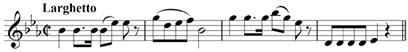

very slow

smoothly

slow, but not as slow as largo.

#### Answer

Largo means very slow, and the Italian term for ‘smoothly’ is legato.

### Activity 2

#### Question

What key is the melody in?

E flat major

A flat major

C minor

#### Answer

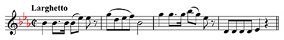
<!--MEDIACONTENT--><!--ENDMEDIACONTENT-->
All the notes in the melody are contained within the scale of E flat major, and B naturals are absent, suggesting that C minor, the minor key with the same key signature as E flat major, is unlikely. A flat major is incorrect since it has a key signature of four flats, not three.

### Activity 3

#### Question

Which melodic interval (number only) occurs between the last note in bar 2 and the first note in bar 3?

octave

sixth

seventh

#### Answer

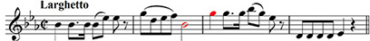
<!--MEDIACONTENT--><!--ENDMEDIACONTENT-->
The last note in the second bar is a B♭ and the first in bar 3, a G. If we count up the scale starting from the B flat (B♭–C–D–E♭–F–G) we find that the interval is a sixth.

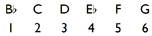

### Activity 4

#### Question

What is the note name of the fourth note in bar 3?

B♭

B

A♭

#### Answer

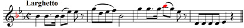
<!--MEDIACONTENT--><!--ENDMEDIACONTENT-->
On the treble staff the note sitting on the first ledger line above the staff is a B. However, the key signature of three flats signifies that all Bs in this extract (unless modified by accidentals) are B♭s.

### Activity 5

#### Question

Which degree of the scale is the D in the fourth bar?

submediant

leading note

supertonic

#### Answer

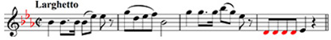
<!--MEDIACONTENT--><!--ENDMEDIACONTENT-->
Since the melody is in E flat major with E♭ as the tonic, D is the seventh note up from E♭ (E♭–F–G–A♭–B♭–C–D). It is therefore the leading note.

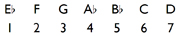

## Group 2: identifying various different elements

Gershwin, ‘I got rhythm’

### Activity 1

#### Question

What key is the melody in? (The asterisk signifies a missing rest, which you’ll be asked to identify in Activity 5.)

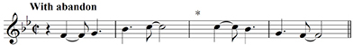

G minor

F major

B flat major

#### Answer

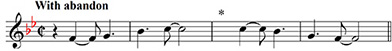
<!--MEDIACONTENT--><!--ENDMEDIACONTENT-->
The two-flat key signature suggests either B flat major or its relative minor, G minor. There is no F♯, the leading note in G minor, and therefore B flat major seems more likely. F major is incorrect since it has a key signature of only one flat.

### Activity 2

#### Question

What does the time signature of C with a vertical stroke through it mean?

There are four crotchet beats in the bar

There are two minim beats in the bar

There are two semibreve beats in the bar

#### Answer

C with a vertical stroke through it is an alternative way of writing the time signature 2/2, where the lower figure 2 represents a minim beat and the upper figure specifies the number of beats in the bar, i.e. 2.

### Activity 3

#### Question

Which degree of the scale is the F in the first bar?

submediant

dominant

subdominant

#### Answer

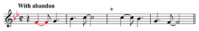
<!--MEDIACONTENT--><!--ENDMEDIACONTENT-->
Since the melody is in B flat major with B♭ as the tonic, the F is the fifth note up from B♭ (B♭–C–D–E♭–F). It is therefore the dominant.

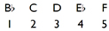

### Activity 4

#### Question

What is the curved line above the two Cs in the second bar?

a tie

a slur

#### Answer

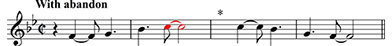
<!--MEDIACONTENT--><!--ENDMEDIACONTENT-->
A tie joins consecutive notes that are the same, and is a rhythmic device. Its use here means that the first C, a quaver, is tied to the next C giving an overall time value of quaver plus minim.

### Activity 5

#### Question

Which rest is required at the place marked with an asterisk?

dotted crotchet rest

crotchet rest

quaver rest

#### Answer

Although the time signature has two minim beats, it is easier to work out the required rest by counting in crotchets. In bar 3, the first C tied to the second produces a dotted crotchet and this is followed by another dotted crotchet. The two dotted crotchets added together equal three crotchets. Therefore we need a crotchet rest to make up a total of four crotchets for the bar.

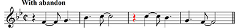
<!--MEDIACONTENT--><!--ENDMEDIACONTENT-->

## Group 3: identifying various different elements

Beethoven, Symphony No. 6 in F major, Op. 68 (‘Pastoral’)

### Activity 1

#### Question

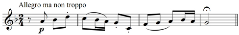

What is the meaning of the tempo indication *Allegro ma non troppo*?

fast

fast but not too much

fast with vigour

#### Answer

Traditionally, the English equivalent for the Italian tempo indication *Allegro ma non troppo* is Fast but not too much. Fast is *Allegro*, and Fast with vigour, *Allegro con brio*.

### Activity 2

#### Question

Which degree of the scale is the D in the first bar? (Identify the key of the melody first.)

dominant

submediant

subdominant

#### Answer

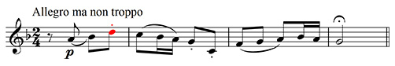
<!--MEDIACONTENT--><!--ENDMEDIACONTENT-->
Correct. Since the melody is in F major with F as the tonic, the D is the sixth note up from F (F–G–A–B♭–C–D). It is therefore the submediant.

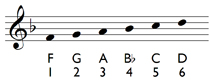

### Activity 3

#### Question

What does the dot under the middle C in the second bar signify?

The note is to be played staccato.

The rhythmic value of the note is lengthened by a half.

The note is to be played tenuto.

#### Answer

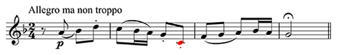
<!--MEDIACONTENT--><!--ENDMEDIACONTENT-->
The position of the dot is crucial. Below or above the note head signifies that this dot is a sign for staccato. A dot after the note head means that it is associated with rhythm – the note’s rhythmic value would then be lengthened by a half. A tenuto mark is a short line, not a dot, either above or below the note head.

### Activity 4

#### Question

Which melodic interval (number only) is created by the middle C and the following note?

third

fourth

fifth

#### Answer

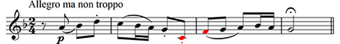
<!--MEDIACONTENT--><!--ENDMEDIACONTENT-->
The second note, its note head placed in the lowest space of the treble stave, is an F. Therefore if we count up the scale from the middle C to the F (middle C–D–E–F) we find that the interval is a fourth.

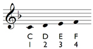

### Activity 5

#### Question

What does the sign above the G in the final bar indicate?

The note should be played getting gradually softer.

The note should be played with an accent.

The player should pause on this note.

#### Answer

The sign above the G is a pause mark. Refer to Special signs for the sign for getting gradually softer (a ‘hairpin’), and the sign for an accent.

## Group 4: identifying triads in major keys

Note that you will need to work out which major key is being used first.

### Activity 1

#### Question

Match Tonic triad in E flat major, Subdominant triad in A major, Tonic triad in D major to the triads below.

Tonic triad in D major

 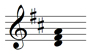 

Tonic triad in E flat major

 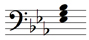 

Subdominant triad in A major

 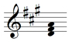 

#### Answer

__Tonic triad in D major__. The key signature of two sharps signifies the major key of D major. The notes of the triad, the root, third and fifth, are D F♯ A, which means that this is the tonic triad in D major.

__Tonic triad in E flat major__. The key signature of three flats signifies the major key of E flat major. Bearing in mind that this is the bass stave, the notes of the triad, the root, third and fifth, are E♭ G B♭, which means that this is the tonic triad in E flat major.

__Subdominant triad in A major__. The key signature of three sharps signifies the major key of A major. The notes of the triad, the root, third and fifth, are D F♯ A. Since the root, the D, is the fourth above the tonic, A, it is the subdominant note, and therefore the triad is the subdominant triad in A major.

