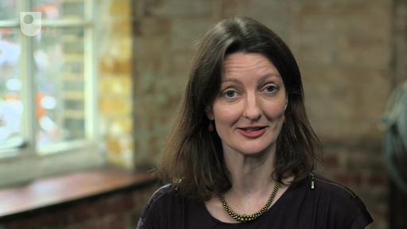

# Introduction

Welcome to *Learn to code for data analysis*! This course has been written to show how a little bit of code can go a long way in making sense of the increasingly vast amounts of open data available online.

If you’re used to the manual approach of copying and pasting formulas in spreadsheets, you’ll see that writing a few lines of code to manipulate data can be quicker, less error-prone, and more powerful.

*Please note: in the following video, where reference is made to a study ‘week’, this corresponds to Weeks 1 and 2 of this course.*
<!--MEDIACONTENT--><video xmlns:str="http://exslt.org/strings" width="80%" download=""><source src="https://www.open.edu/openlearn/ocw/pluginfile.php/1393338/mod_oucontent/oucontent/71687/ou_futurelearn_learn_to_code_vid_1001.mp4" type="video/mp4"></source></video><!--TRANSCRIPT--><table xmlns:str="http://exslt.org/strings" border="1"><tr><td>
__RUTH ALEXANDER:__ **;

Hello. I'm Ruth Alexander a journalist with the BBC. I work on the Radio 4 programmes 'Money Box' and 'More or Less'. I'll be introducing each week of this course which will show you how you can write code to work with data. Writing computer programmes is a way of learning what sorts of data computers can represent, how they can make decisions about data and what they can do as a result. You'll be using a notebook style of programming that helps you keep track of each data manipulation step as it happens. Each week of this course is organised around a small data analysis project. You'll get a notebook with exercises to work through and test your coding.

The week will end with a quiz to help you consolidate your learning. Programming requires practise so do have a go at all the exercises and quiz questions and get involved in the discussions. We'll also suggest ways for you to extend each week's project if you have the time. As you'll see if we put the data into the right sort of format a single line of code can do a lot of work with it. The few and short lines of code you'll be writing over the coming weeks employ exactly the same principles used in software developed for any purpose be it games or online shopping.

This week you'll learn some of those general programming principles, how to apply them to data analysis and how to use and share notebooks. Enjoy.
</td></tr></table><!--ENDTRANSCRIPT-->

<!--ENDMEDIACONTENT-->
You will write code in a programming language called Python, named after the comedy group Monty Python. Python is very popular for teaching programming, but is also widely used in professional software development.

The notebooks Ruth mentions in the video use an environment (like a program) called Jupyter, which allows you to write notebooks that include Python code. Jupyter is used by many scientists and data analysts as part of their workflow. Although you will use Python and Jupyter at a basic level, you will be learning tools used by the pros.

Python, Jupyter and other software you will need to take part in the course are included in the Anaconda distribution (like a package). You’ll have an opportunity to download the software in the next step.

For now, think about your goals are for taking this course. Do you have any previous coding or data analysis experience, e.g. with spreadsheets? Perhaps you want to find more efficient ways of working with data, or perhaps you’re intrigued by the idea of what code is and how it can possibly help you work with data.

The Open University would really appreciate a few minutes of your time to tell us about yourself and your expectations for the course before you begin, in our optional [start-of-course survey](https://www.surveymonkey.co.uk/r/BOCSTARTlearntocode). Participation will be completely confidential and we will not pass on your details to others.

We hope you enjoy the course!

* Michel Wermelinger

* Rob Griffiths

* Tony Hirst

