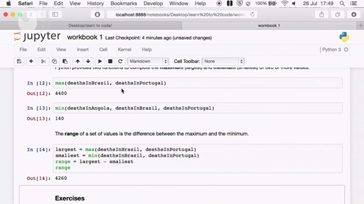

# 1 Install the software


To code in the course notebooks that Ruth mentioned in the video you’ll need to install some software.

We’re going use a program called Jupyter that opens in your web browser and allows you to write notebooks that include Python code. Jupyter and other software you will need to take part in the course are freely available and you have two options.


---


### Online CoCalc service

The advantages of using CoCalc are that you don’t have to install any software and you can work on the course exercises from anywhere there is an internet connection. The disadvantages are that you will need a good internet connection, running the code in your notebook may take time if there are many simultaneous users on CoCalc and you may occasionally lose the latest changes you make in your notebook, because the service will periodically reset.

However, since notebooks are regularly auto-saved, the risk of losing work should be rather small. CoCalc offers a paid plan that has better performance and stability than the free plan. The Open University and the authors have no commercial affiliation with CoCalc.


---


---


### Install Anaconda package

The other option is to install on your laptop or desktop the free Anaconda package, which includes all necessary software for this course. If you plan to work on this course from multiple computers, you will need to install Anaconda on each one. You can use cloud storage, like Dropbox, to keep your notebooks in sync across machines. Anaconda doesn’t have the limitations of CoCalc, so we recommend you use Anaconda if you are going to work on this course always from the same computer.

You should now read the [ instructions for installing Anaconda or creating a CoCalc project ](http://www.open.edu/openlearn/learn-to-code-installation)for this course. Don’t forget to test everything is working, as explained in the instructions.

The installation of Anaconda is different for Windows, Macs and Linux. Please follow the appropriate instructions.

We advise you to accept the pre-filled defaults suggested during the installation process.


---


---


### Notebooks

Each week you will use two notebooks (and any necessary data files): an exercise notebook and a project notebook. The notebooks are this course’s programming environment, where you will do your own coding.

The exercise notebook contains all the code shown throughout the week, so that you can try it out for yourself, any time you wish. The exercise notebook also contains all the week’s exercises. You will be able to solve several exercises just by slightly modifying our code.

The project notebook contains the week’s written-up data analysis project, including all necessary code. If you have the extra time, you’re encouraged to modify the project notebooks to write up your own data analyses.

You should now download from [here](https://github.com/mwermelinger/Learn-to-code-for-data-analysis) the notebooks and data files needed for the whole course. 

You’ll open the notebooks using Jupyter, which is part of Anaconda and CoCalc. You will learn how to use notebooks later this week, after you’ve seen what Python code looks like.

Note: please ensure that you abide by any terms and conditions associated with these pieces of software.


---


## 1.1 Start with a question


Data analysis often starts with a question or with some data.


__Figure 1__


A question leads to data that can answer it, and looking at the available data helps to make a question precise or may trigger new questions, which, in turn, may require further data. Data analysis is thus often an iterative process: the questions determine which data to obtain, and the data influences which questions to ask and what the scope of the analysis is. How this week’s project came about is an example of such an iterative process.

I (Michel) was watching a news programme mentioning the fight against tuberculosis (TB) as part of the United Nations Millenium Development Goals. Wishing to know how serious TB is, I browsed the World Health Organization (WHO) website and found a dataset with the number of TB cases and deaths per country per year, from 2007 to 2013. This in turn raised the question of whether a high (or low) number could be mainly due to the country having a large (or small) population. Some more browsing revealed the WHO also has population data from 1990 to 2013.

That was enough data for the fuzzy question: how serious is TB? It was time to make it precise. I chose to measure the effect of TB in terms of deaths, which led to the following questions:

* What is the total, smallest, largest, and average number of deaths due to TB?

* What is the death rate (number of deaths divided by population) of each country?

* Which countries have the smallest and largest number of deaths?

* Which countries have the smallest and largest death rate?

Answering these questions for the whole world and for seven years (2007–2013) would be a bit too much for this initial project. A subset was needed. I decided to take only the latest data for 2013 and, being Portuguese, to focus on the Portuguese-speaking countries. One of them, Brazil, is part of the BRICS group of major emerging economies, so for more diversity the other four countries would be included too: Russia, India, China and South Africa. The project was finally defined! I’ve added links to the data below if you’d like to take a look!


### Activity 1 What would you ask?


#### Question

Before you embark on coding the analysis to get answers, what other questions could be asked of the datasets described?

What countries would you be interested in? What groups of countries might be interesting to analyse?

Note down some of your questions so that you can come back to them later.


[WHO POPULATION - DATA BY COUNTRY (LATEST YEAR)](https://github.com/mwermelinger/Learn-to-code-for-data-analysis/raw/master/1_Having_a_go_at_it/WHO%20POP%20TB%20all.xls)

[WHO TB MORTALITY AND PREVALENCE - DATA BY COUNTRY (2007 - PRESENT)](https://github.com/mwermelinger/Learn-to-code-for-data-analysis/raw/master/1_Having_a_go_at_it/WHO%20POP%20TB%20some.xls)

Next, I’ll explain how I started to organise the information.


## 1.2 Variables and assignments


With the choice of data and questions confirmed, the coding can begin.


__Figure 2__


To introduce the basics of coding, I will show you a very simple approach, only suitable for the smallest of datasets. Please bear with me. In the second part of the week I will show you the proper approach. Read through this step and the next – __you’re not expected to write code just yet__. In Exercise 1, a bit further on in this week, you’ll be asked to start writing code.

Ok, let’s start. I want the computer to calculate the total number of deaths in 2013. For the computer to do that, it must first be told what is the number of deaths in each country in that year. I’ll start with my home country.

__`In []:`__


```bash

deathsInPortugal = 100
```


The ‘In[]’ line is Jupyter’s way of saying that what follows is code I typed in. And there it is: the first line of code! It is a command to the computer that could be translated to English as: ‘find in the attic an empty box, put the number 100 in the box, and write “deathsInPortugal” on the box’. (Aren’t you glad Python is more succinct than English?) In coding jargon, the attic is the computer’s memory, boxes are called __variables__ (I’ll explain why shortly), what’s written on a box is the variable’s __name__ , and storing a value in a variable is called an __assignment__.

By naming the boxes, I can later ask the computer to show the value in box ``thingamajig`` or take the values in boxes ``stuff`` and ``moreStuff`` and add them together.

To see what’s inside a box, I can just write the name of the box on a line of its own. Jupyter will write the variable’s value on the screen, preceded by ‘Out[]’, to clearly mark the output generated by the code. When you start to use the Jupyter notebooks, you will see numbers inside the square brackets, i.e. In[1], In[2], etc., to indicate in which order the various pieces of code are being executed. Here we have omitted the numbers to avoid confusion between what you see here and what you see in your notebook.

__`In []:`__


```bash

deathsInPortugal
```


__`Out[]:`__


```bash

100
```


Each assignment is written on a line of its own. The computer executes the assignments line by line, from top to bottom. Thus, the program would continue as follows:

__`In []:`__


```bash

deathsInPortugal = 100
deathsInAngola = 200
deathsInBrazil = 300
```


I don’t think I need to continue, you get the gist.

By the way, all numbers so far are fictitious. If I use real data, taken from the World Health Organization website, you’ll see a difference.

__`In []:`__


```bash

deathsInPortugal = 140
deathsInAngola = 6900
deathsInBrazil = 4400
deathsInPortugal
```


__`Out[]:`__


```bash

140
```


Notice what happened. When a value is assigned to an already existing variable, the value stored in that variable is unceremoniously chucked away and replaced by the new value. In the example, the second group of assignments replaced the values assigned by the first group and thus the current value of ``deathsInPortugal`` is 140 and no longer 100. That’s why the storage boxes are called variables: their content can vary over time.

To sum up, a __variable__ is a named storage for values and an __assignment__ takes the value on the right hand side of the equal sign (=) and stores it in the variable on the left-hand side.

In the next section, you will find out the importance of naming in Python.


## 1.3 The art of naming


Python is relatively flexible about what you name your variables but rather picky about the format of names.


__Figure 3__


I could have chosen `` deaths_in_Brazil_in_2013, deathsBrazil,DeathsBrazil, dB `` or even ``stuff`` for my variables. If a box in your attic were labeled ``dB`` or ``stuff`` though, would you know what it contains a year later? So, although you can, it’s better not to use cryptic, general, or very long names.

You can’t use spaces to separate words in a name, you can’t start a name with a digit and names are case-sensitive, i.e. ``deathsBrazil`` and ``DeathsBrazil`` are not the same variable. Making one of those mistakes will result in a __syntax error__ (when the computer doesn’t understand the line of code) or a __name error__ (when the computer doesn’t know of any variable with that name).

Let’s see some examples. (Remember that you’re not expected to write any code for this step.) The first example has spaces between the words, the second example has a digit at the start of the name, and the third example changes the case of a letter, resulting in an unknown name. The kind of error is always at the end of the error message.

``In []:``


```bash

deaths In Portugal = 140
File "<ipython-input-7-ded1a063fe45>", line 1
deaths In Portugal = 140
^
SyntaxError: invalid syntax
```


``In []:``


```bash

2013deathsInPortugal = 140
File "<ipython-input-8-af085101fcfc>", line 1
2013deathsInPortugal = 140
^
SyntaxError: invalid syntax
```


``In []:``


```bash

deathsinPortugal
---------------------------------------

NameError Traceback (most recent call last)

<ipython-input-9-7d3c81b4fb34> in <module ()
----> 1 deathsinPortugal
NameError: name ‘deathsinPortugal’ is not defined
```


Note that Jupyter doesn’t write any ``Out[]`` because the code is wrong and thus doesn’t generate any output.

In this course, to make names shorter to help fit lines of code on small screens, we’ll use capitalisation instead of underscores to separate the different words of a name, as shown in the code so far. Such practice is called __camel case__ independently of the name having __`oneHump`__ (‘dromedary case’ just doesn’t sound good, does it?) or __`moreThanTwoHumps`__. The convention in Python is to start variable names with lower case and we’ll stick to it.

In the next section, download the notebook for this week and work through the first exercise – your first line of code!


##  1.4 Downloading the notebook and trying the first exercise 


So far, I’ve done the coding and you’ve read along. Booooring. It’s time to use the Jupyter notebooks and work on the first exercise in the course.


### Exercise 1 Variables and assignments


#### Question

If you haven’t yet installed the software package or created an account on CoCalc, do it now using these [instructions](http://www.open.edu/openlearn/learn-to-code-installation)!

Open the Exercise notebook 1, and put it in the folder you created. (You’ll open the data later and learn how to use it in the notebook.)

Once you have installed the file, watch the video to learn how to work with Jupyter notebooks and complete Exercise 1. Pause the video frequently to repeat the demonstrated steps in your notebook. Throughout the week you’ll be directed back to the notebook to complete the other exercises.
<!--MEDIACONTENT--><video xmlns:str="http://exslt.org/strings" width="80%" download=""><source src="https://www.open.edu/openlearn/ocw/pluginfile.php/1393338/mod_oucontent/oucontent/71687/ou_futurelearn_learn_to_code_vid_1046.mp4" type="video/mp4"></source></video><!--TRANSCRIPT--><table xmlns:str="http://exslt.org/strings" border="1"><tr><td>
__NARRATOR:__ * In this screencast I'm going to introduce you to Jupyter Notebooks. First you'll need to start the Anaconda launcher. This screencast was done on a Mac. However, the same process applies to Windows. If you're a Linux user, you'll need to use the command line as described in the installation instructions. To follow along on your computer, make sure you have created a folder for this course, and that it contains the exercise notebook for this week. This screencast uses earlier versions of the exercise notebook, and of the Anaconda software than you downloaded, so don't worry that things look slightly different. *;
* Do not click on 'Update' buttons in the Anaconda Launcher, because you should use the version you installed to avoid compatibility problems with the notebooks of this course. Once the Anaconda launcher has booted up, launch the ipython notebook. Whenever you see a circle, the mouse has been clicked. After a couple of screens you should see Jupyter running in a browser, and the contents of your home folder. Navigate to the folder you created, and open the relevant notebook. The first thing to appreciate is that Jupyter notebook consists of a sequence of individual cells. You can see the individual cells as I click on the left of each one. Each cell can contain text or code. *;
* Before starting any exercises, you should execute all the code already in the notebook. I'll explain why in a moment. Go to the 'Cell' menu and select 'Run all'. As the notebook executes all code, it may automatically scroll to a different part of the notebook. Just scroll back to the start. Go to the first exercise. It asks you to add assignments for more countries into the preceding code cell. To select a cell, click to the left of it. A grey border shows the currently selected cell. To edit a cell, click inside it. The border becomes green to show the cell is in editing mode. *;
* Once inside the cell press 'Enter' a couple of times to put the cursor on a new line, then start typing an appropriate variable name, say 'deaths in Russia'. Once you've start typing, names that have been used within the notebook can be accessed via the Tab key. So once you've typed 'de' press the Tab key to get some auto-complete suggestions. Use the arrow keys to scroll through the options and press 'Enter' to select the appropriate option. In this case I'll accept the first suggestion in the list and edit it to complete the assignment. Next start a new line and just enter the new variable name you've just added. Remember to use auto-complete to avoid spelling mistakes. *;
* Now we can run the code. To execute only the current code cell, click on the 'Play' button. The results appear below the code cell in a line titled 'Out'. If you wish to split a cell, for example to separate the supplied code from the code you are adding, then put the cursor where you want to split the cell, go to the 'Edit' menu and select 'Split Cell'. It's easy to move cells around - for example we can cut a selected cell......and then paste it below another cell that you select. To save a snapshot of the notebook, called a checkpoint, click the 'Save and Checkpoint' button. *;
* If things go horribly wrong, you can revert the notebook to the last checkpoint by using the 'Revert to Checkpoint' option in the 'File' menu. To finish your session, go to the 'File' menu and select 'Close and Halt'. It is very important to note that opening a notebook does not execute any code cells. Any code output was saved from the previous session. So if I reopen the workbook and execute the code in the second cell alone, I'll get an error, because in this session (that is since the notebook was opened again) the first cell hasn't been executed and therefore the computer doesn't recognise the variable name 'deaths in Portugal'. And that's why you should run all code after opening a notebook! *;
* It's easy to add your own notes to the notebook. For example if I select the first cell......and then click on the plus button, I can insert a new cell below the current one. By default, a new cell is a code cell. Select 'Markdown' to change it to a text cell. To edit a text cell, double-click inside the cell. Text is written in Markdown, a very simple formatting system. Here are some examples of what Markdown can do - pay attention to how prefixing or surrounding words with simple characters is all the information needed to format the text. *;
* Also note the way a word or phrase to be hyperlinked is surrounded with square brackets and immediately followed by the URL, in round brackets. Once the text is written, click the 'Play' button to see the formatted text in the cell. The 'Help' menu contains links to information about Jupyter notebooks and Markdown formatting. As you get used to Jupyter, take a look at the keyboard shortcuts, as they will help you to work more efficiently. *;
</td></tr></table><!--ENDTRANSCRIPT-->


<!--ENDMEDIACONTENT-->


If you haven’t yet installed Jupyter and Anaconda, do it now using these [instructions](http://www.open.edu/openlearn/learn-to-code-installation).


## 1.5 Expressions


I’ve told the computer the deaths in Angola, Brazil and Portugal. I can now ask it to add them together to obtain the total deaths.

``In []:``


```bash

deathsInAngola + deathsInBrazil + deathsInPortugal
```


``Out[]:``


```bash

11440
```


A fragment of code that has a value is called an __expression__. Calculating the value of an expression is called __evaluating__ the expression. If the expression is on a line of its own, the Jupyter notebook displays its value, as above.

The value of an expression can of course be assigned to a variable.

``In []:``


```bash


totalDeaths = deathsInAngola + deathsInBrazil + deathsInPortugal

```


Note that no value is displayed because the whole line of code is not an expression, it’s a __statement__ , a command to the computer. In this case the statement is an assignment. You will see another kind of statement later this week.

To see the value, you learned that you must write the variable’s name.

``In []:``


```bash

totalDeaths
```


``Out[]:``


```bash

11440
```


This is really just a special case of the general rule that writing an expression on its own shows its value. A variable (which stores a value) is just an example of an expression (which is anything that has a value).

I can now write an expression to compute the average number of deaths: it’s the total divided by the number of countries.

``In []:``


```bash

totalDeaths / 3
```


``Out[]:``


```bash

3813.3333333333335
```


Python has of course all four arithmetic __operators__ : addition (+), division (/), subtraction (-) and multiplication (*). I’ll use the last two later in the week. Python follows the conventional operator precedence: multiplication and division before addition and subtraction, unless parentheses are used to change the order. For example, (3+4)/2 is 3.5 but 3+4/2 is 5.


__Figure 4__


Now practice writing expressions and complete Exercise 2 in the notebook.


### Exercise 2 Expressions


#### Question

Go back to the Exercise notebook 1 you used in Exercise 1. In Exercise 2 you’ll see an example of operator precedence and practise writing expressions.

If you’re using Anaconda, remember that to open the notebook you’ll need to navigate to it using Jupyter. Whether you’re using Anaconda or CoCalc, once the notebook is open, run all the code before doing the exercise.

Writing code for the first time can be difficult but stick with it.


In the next section, you will find out about functions.


## 1.6 Functions


After the total and the average, next on my to-do list is to calculate the largest number of deaths.


__Figure 5__


This will be the __maximum__. It takes another single line of code to calculate it.

``In []:``


```bash


max(deathsInAngola, deathsInBrazil, deathsInPortugal)

```


``Out[]:``


```bash

6900
```


In this expression, __`max()`__ is a function – the parenthesis are a reminder that the name __`max`__ doesn’t refer to a variable. A __function__ is a piece of code that calculates ( __returns__ ) a value, given zero or more values (the function’s __arguments__ ). In this case, __`max()`__ has three arguments and returns the greatest of them. Actually, __`max()`__ can calculate the maximum of two, three, four or more values.

``In []:``


```bash

max(deathsInBrazil, deathsInPortugal)
```


``Out[]:``


```bash

4400
```


The expressions above are function __calls__. I’m calling the __`max()`__ function with three or two arguments, and the value of the expression is the value returned by the function. A function is called by writing its name, followed by the arguments, within parentheses and separated by commas. Function names follow the same rules as variable names.

As you might expect, Python also has a function to calculate the smallest (minimum) of two or more values.

``In []:``


```bash


min(deathsInAngola, deathsInBrazil, deathsInPortugal)

```


``Out[]:``


```bash

140
```


The value returned by a function call can be assigned to a variable. Here is an example, which calculates the __range__ of deaths. The range of a set of values is the difference between the largest and the smallest of them.

``In []:``


```bash


largest = max(deathsInAngola, deathsInBrazil, deathsInPortugal)


smallest = min(deathsInAngola, deathsInBrazil, deathsInPortugal)

range = largest - smallest
range
```


``Out[]:``


```bash

6760
```


### Exercise 3 Functions

Identify different types of error (some of you may have experienced those already…) in Exercise 3. You’ll need to use the Week 1 notebook to answer question three.


#### Question

__ 1. If the function name is misspelled as Min, what kind of error is it? __

A syntax error

Writing `Min(…, …)` instead of `min(…, …)` is not a syntax error, because both have the form of a function call. Names can use uppercase letters.

Take a look at <a xmlns:str="http://exslt.org/strings" href="">The art of naming</a>.

A name error

The computer will understand than `Min(…, …)` is a function call but doesn’t know of any function with that name. Remember that names are case-sensitive.

Take a look at <a xmlns:str="http://exslt.org/strings" href="">The art of naming</a>.


#### Question

__ 2. If a parenthesis or comma is forgotten, what kind of error is it? __

A name error

A parenthesis or comma is unrelated to how names are written.

Take a look at <a xmlns:str="http://exslt.org/strings" href="">The art of naming</a>.

A syntax error

A function call requires two parentheses around the arguments, and one comma between successive arguments. Forgetting any of them therefore deviates from the syntax of the Python language.

Take a look at <a xmlns:str="http://exslt.org/strings" href="">Functions</a>.


#### Question

__ 3. Use Exercise 3 in the Week 1 exercise notebook to answer this question. __

__ What is the range of deaths among the BRICS countries (Brazil, Russia, India, China, South Africa)? __

4400

This is the minimum value (for Brazil), not the range.

Take a look at <a xmlns:str="http://exslt.org/strings" href="">Functions</a>.

65480

This is the average number of deaths, not the range.

Take a look at <a xmlns:str="http://exslt.org/strings" href="">Expressions</a>.

240000

This is the maximum value (for India), not the range.

Take a look at <a xmlns:str="http://exslt.org/strings" href="">Functions</a>.

327400

This is the total number of deaths not the range.

Take a look at <a xmlns:str="http://exslt.org/strings" href="">Functions</a>.

235600

The range is the maximum value (240 thousand for India) minus the minimum value (4400 for Brazil).


## 1.7 Comments


Last on my to-do list is the death rate, which is the number of deaths divided by the population.


__Figure 6__


A quick glance at the WHO website tells me Portugal’s population in 2013.

``In []:``


```bash

populationOfPortugal = 10608
```


Wait a minute! This can’t be right. I know Portugal isn’t a large country, but ten and a half thousand people is ridiculous. I look more carefully at the WHO website. Oh, the value is given in thousands of people; it’s 10 million and 608 thousand people. I could change the assignment to

``In []:``


```bash

populationOfPortugal = 10608000
```


but that could give the impression that the population had been counted exactly, whereas it’s more likely the number is an estimate based on a previous census. It also makes it easier to check my code against the WHO data if I use the exact same numbers.

I will therefore keep the original assignment but make a note of the unit, using a __comment__ , a piece of text that documents what the code does.

``In []:``


```bash

# population unit: thousands of inhabitants
populationOfPortugal = 10608
# deaths unit: inhabitants
deathsInPortugal = 140
```


A comment starts with a hash sign __(#)__ and goes until the end of the line. Computers ignore all comments, they just execute the code. Comments are your insurance policy: they help you understand your own code if you come back to it after a long break.

I can now compute the death rate, making sure I first convert the population into number of inhabitants, the same unit as deaths.

``In []:``


```bash

deathsInPortugal / (populationOfPortugal * 1000)
```


``Out[]:``


```bash

1.3197586726998491e-05
```


The death rate (roughly 140 people in 10 million) is a very small number, not very practical to display and reason about. Looking again at the WHO website, I note that other indicators, like TB prevalence, are given per 100 thousand inhabitants. I will do the same for the death rate. Since the population is already in thousands, dividing the deaths by the population gives me the number of deaths per thousand people. Thus, the number of deaths per 100 thousand people must be 100 times higher than that.

``In []:``


```bash

# death rate: deaths per 100 thousand inhabitants
deathsInPortugal * 100 / populationOfPortugal
```


``Out[]:``


```bash

1.3197586726998491
```


This finishes the basics of coding needed for this week. It took less than 30 lines of code…

Test this out for yourself in Exercise 4 of the Week 1 exercise notebook.


### Exercise 4 Comments


#### Question

Complete the short exercise on the death rate in Exercise 4 in the Week 1 Exercise notebook.

Remember that once the notebook is open, run all the code, before doing the exercise.


## 1.8 Values have units


Before I move on, let me explain the importance of using comments to record units of measurement.


__Figure 7__


Values are not just numbers, they have units: degrees Celsius, number of inhabitants, thousands of gallons, etc. Always make a note of the units the value refers to, using comments. This makes it easier to check whether the expressions are right. Disregarding the units will lead to wrong calculations and results.


### Activity 2


#### Question

Have you come across ‘horror stories’ that have happened due to mistakes in the unit of measurement?

Think through what happened and consider what you have learned from them.


