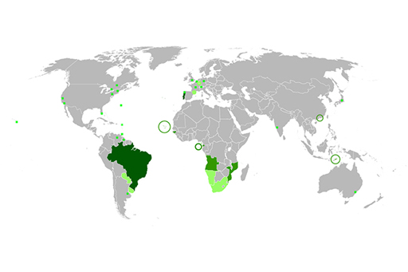

# 2 Writing up the analysis

__Figure 4__  A map identifying Portuguese speaking countries

Once you’ve done your analysis, you may want to record it or share it with others. The best way is to write up what you’ve discovered.

There is no right or wrong way to write up data analysis but the important thing is to present the answers to the questions you had. To keep things simple, I suggest the following structure:

1. A descriptive title

2. An introduction setting the context and stating what you want to find out with the data.

3. A section detailing the source(s) of the data, with the code to load it into the notebook.

4. One or more sections showing the processes (calculating statistics, sorting the data, etc.) necessary to address the questions.

5. A conclusion summarising your findings, with qualitative analysis of the quantitative results and critical reflection on any shortcomings in the data or analysis process.

You don’t need to explain your code, but it’s helpful to write the text in such a way that even readers who know nothing about Python or pandas can follow your analysis.

You can see how I’ve written up the analysis by opening this week’s project notebook, which you can open in project_1: Deaths by tuberculosis .

In the next section, amend this project to produce your own version.

## 2.1 Practice project

__Figure 5__

Here’s a quick project for you, which is about looking at TB deaths in *all* countries.

### Activity 1 The project

#### Question

1. Open the data file WHO POP TB all.xls . Do __not__ open or edit this file, to avoid changing its encoding. If you want to see the contents of the file, make a copy and look at the copy.

2. Open the project notebook.

3. If you’re using CoCalc do the following two steps: Click on the File menu and select ‘Download as’ and then ‘IPython notebook (.ipynb)’.On your computer, rename the downloaded file so that it includes your name, e.g. ‘TB deaths all world – Michel Wermelinger.ipynb’. Then upload the renamed notebook to CoCalc and open it.

4. If you’re using Anaconda do the following two steps: Click on the File menu and select ‘Make a copy’.Click on the title of the new notebook (‘project 1-Copy1’) to rename it. Make sure to include your name in the file name, e.g. ‘TB deaths all world – Michel Wermelinger’.

5. In the new notebook, add your name to mine and update the date.

6. Edit the first code cell: change the file name to ‘WHO POP TB all.xls’, in order to load the data for all countries in the world.

7. Run all cells in the notebook. This might take a little while.

8. Add one line of code at the end to sort the table by the death rate, so that it’s easy to see the least and most affected countries.

9. Go through the notebook and change any text (in particular the conclusions) to reflect the new results.

10. Save and then close and halt the notebook.

If you happen to know how to use a spreadsheet application, then you can do a personal project: open the Excel file, remove all countries you are not interested in, and then do the analysis only for the remaining subset.

You might like to share your experience of working on this project with friends, family or colleagues.

## 2.2 Sharing your project notebook

__Figure 6__

Sharing work is a great way to solve problems and learn from others.

You are encouraged to share the analysis notebook that you created in the previous section. There are a few different ways you can do this. I will only mention two, sharing and publishing, depending on whether you want people to be able to change your notebook or only read it.

If you don’t mind people editing and extending your notebook, like you have done with mine, then you’ll need to give them the notebook file (e.g. ‘TB deaths all world – Michel Wermelinger.ipynb’) and all necessary data files (just the ‘WHO POP TB all.xls’ in this case). There are many ways you can share files with other people. One of the simplest is to create a zip archive, upload it to a cloud service like Dropbox or Google Drive, and publicise the download link. You could also share the link on your social media or via email.

If the intended recipients don’t have the necessary software (Python, pandas and Jupyter) or you don’t want anybody to change your notebook, you can still publish the analysis in read-only mode, i.e. people can read the text and code, see the resulting tables and numbers, but can’t modify anything.

To do this, open your project notebook, run all the cells, double-check that there are no error messages and that all values and tables are shown as you want them to be, and save the notebook (without closing it).

If you use Anaconda, export the notebook by clicking ‘Download as’ in the ‘File’ menu and selecting the option you prefer. I prefer HTML because it looks much nicer. You can then share the single PDF or HTML file as before, by email, via Dropbox or Google Drive, on your blog and via a link.

If you use CoCalc, just click on the ‘Publish’ button on the right side above your notebook, and you will get after a little while the link that you can share with others. Anyone can then read your notebook, even if they don’t have a CoCalc account. For example, look at my [Project 1](https://cloud.sagemath.com/projects/ff47a32e-e177-4d13-ad9a-625c859cc20b/files/Week_1_project.html) (it’s best to right-click and open this link in a new tab).

Now choose the sharing or publishing method, and get sharing!

