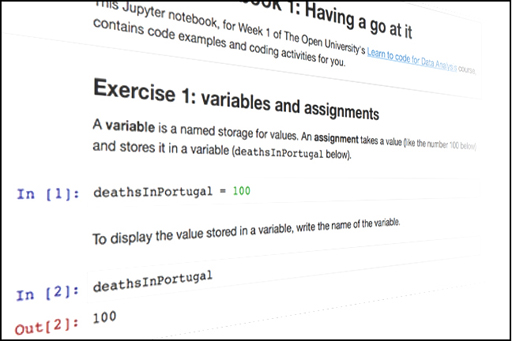

# 4 Summary

__Figure 7__

This week you used Jupyter notebooks to write and execute simple programs with Python and the pandas module. You've learned how to:

* load a table from an Excel file

* select a column, and compute some simple statistics (like the total, minimum and median) about it. 

* create a new column with values calculated from other columns

* sort a table by one of its columns.

Next week you will learn further ways to manipulate dataframes, in particular to clean data. You will also produce your first data chart, showing variations of values over time.

---

### Futher reading
* [WHO population – data by country (2013)](http://apps.who.int/gho/data/node.main.POP107?lang=en) [link]()
* [ WHO mortality and prevalence – data by country (2007 – present) ](http://apps.who.int/gho/data/node.country) [link]()

---

## 4.1 Week 1 and 2 glossary

Here are alphabetical lists, for quick look up, of what this week introduced.

---

### Programming and data analysis concepts

An __assignment__ is a statement of the form ``variable = expression`` . It evaluates the expression and stores its value in the variable. The variable is created if it doesn’t exist. Each assignment is written on its own line.

__CamelCase__ is a naming style in which names made of various words have each word capitalized, except possibly the first.

A __comment__ is a note about the code. It starts with the hash sign (#) and goes until the end of the line.

A __dataframe__ is the pandas representation of a table.

An __expression__ is a fragment of code that can be __evaluated__ , i.e. that has a value, like a variable name.

A __file not found__ error occurs if the computer can’t find the given file, e.g. because the name is misspelled or because it’s in another folder.

A __function__ takes zero or more __arguments__ (values) and __returns__ (produces) a value.

A __function call__ is an expression of the form ``functionName(argument1, argument2, …).``

An __import statement__ of the form ``from module import`` * loads all the code from the given module.

The __maximum__ and __minimum__ of a set of values is the largest and smallest value, respectively.

The __mean__ of a set of numbers is the sum of those numbers divided by how many there are.

The __median__ of a set of numbers is the number in the middle, i.e. half of the numbers are below the median and half are above.

A __method__ is a function that can only be called in a certain context, like a dataframe or a column.

A __method call__ is an expression of the form ``context.methodName(argument1, argument2, ...).``

A __module__ is a package of various pieces of code that can be used individually.

A __name__ is a case-sensitive sequence of letters, digits and underscores. Names cannot start with a digit. Function, variable and module names usually start with lowercase.

A __name error__ occurs if the computer doesn’t recognize a name, e.g. if it was misspelled.

An __operator__ is a symbol that represents some operation on one or two expressions, e.g. the four basic arithmetic operators.

The __range__ of a set of values is the difference between the maximum and the minimum.

A __reserved__ word cannot be used as a name. Jupyter shows reserved words in green boldface.

A __statement__ is a command for the computer to do something, e.g. to assign a value or to import some code.

A __string__ is a verbatim piece of text, surrounded by quotes. Jupyter shows strings in red.

A __syntax error__ occurs if the computer can’t understand the code because it is not in the expected form, e.g. if a reserved word is used instead of a name or some punctuation is missing.

A __variable__ is a named storage for values.

---

---

### Reserved words

* ``from``

* ``import``

---

---

### Functions and methods

``max(value1, value2, …)`` returns the maximum of the given values.

``column.max()`` returns the maximum value in the column.

``min(value1, value2, …)`` returns the minimum of the given values.

``column.min()`` returns the minimum value in the column.

``column.mean()`` returns the mean of the values in the column.

``column.median()`` returns the median of the values in the column.

``column.sum()`` returns the total of the values in the column.

``dataFrame.sort_values(columnName)`` takes a string with a column’s name and returns a new dataframe, in which rows are sorted in ascending order according to the values in the given column.

``read_excel(fileName)`` takes a string with an Excel file name, reads the file, and returns a dataframe representing the table in the file.

---

