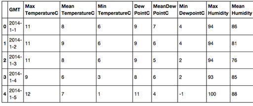
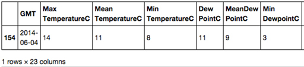
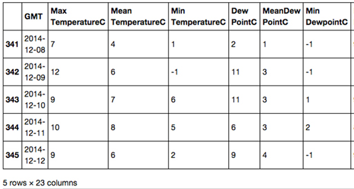

# 1 Loading the weather data


You have learned some more about Python and the pandas module and tried it out on a fairly small dataset. You are now ready to explore a dataset from the Weather Underground.


__Figure 1__


Open the file London_2014.csv and save it in the disk folder or CoCalc project you created in Week 1.

__Do not be tempted to open this file with Excel__ as this application will attempt to localise the data in the file, i.e. use your country’s local data formats, which will make much of what follows rather incomprehensible! You can if you like open the file with a simple text editor, but __do not make any changes__.

The CSV file can be loaded into a dataframe by executing the following code:

``In []:``


```bash

from pandas import *
london = read_csv('London_2014.csv')
london.head()
```


``Out[]:``





__Figure 2__


* Note that the right hand side of the table has been cropped to fit on the page. *

In the next section, you’ll find out how to remove rogue spaces.


---


### Important notice for learners outside of the EU

The Weather Underground automatically localises data based on from what country it detects you are accessing the web site. So, for example, if you are accessing the website from the USA wind speeds will be in MPH rather than km/h and temperatures in Fahrenheit rather than Celsius.

In order to change the settings so that the data is in European format you will need to click on the ‘head and shoulders’ icon on the top right of the Weather Underground web page and create a free Weather Underground account.

Once you have created an account, click on the ‘cog’ icon on the top right of the web page. Then:

* click on the C button to select Celsius

* click on ‘More Settings’ and select Units: metric

* click on ‘Save My Preferences’.

Now, when you download the data, temperatures will be in Celsius and wind speeds in km/h etc.


---


## 1.1 Removing rogue spaces


One of the problems often encountered with CSV files is rogue spaces before or after data values or column names.


__Figure 3__


You learned earlier, in What is a CSV file? , that each value or column name is separated by a comma. However, if you opened ‘London_2014.csv’ in a text editor, you would see that in the row of column names sometimes there are spaces after a comma:

<!--Quote id=-->
>GMT,Max TemperatureC,Mean TemperatureC,Min TemperatureC,Dew PointC,MeanDew PointC,Min DewpointC,Max Humidity, Mean Humidity, Min Humidity, Max Sea Level PressurehPa, Mean Sea Level PressurehPa, Min Sea Level PressurehPa, Max VisibilityKm, Mean VisibilityKm, Min VisibilitykM, Max Wind SpeedKm/h, Mean Wind SpeedKm/h, Max Gust SpeedKm/h,Precipitationmm, CloudCover, Events,WindDirDegrees


For example, there is a space after the comma between ``Max Humidity`` and ``Mean Humidity``. This means that when ``read_csv()`` reads the row of column names it will interpret a space after a comma as part of the next column name. So, for example, the column name after ``'Max Humidity'`` will be interpreted as ``' Mean Humidity'`` rather than what was intended, which is ``'Mean Humidity'``. The ramification of this is that code such as:

`london[['Mean Humidity']]`

will cause a key error (see Selecting a column ), as the column name is confusingly ``' Mean Humidity`` '.

This can easily be rectified by adding another argument to the ``read_csv()`` function:

`skipinitialspace=True`

which will tell ``read_csv()`` to ignore any spaces after a comma:

``In []:``


```bash


london = read_csv('London_2014.csv', skipinitialspace=True)

```


The rogue spaces will no longer be in the dataframe and we can write code such as:

``In []:``

`london[['Mean Humidity']].head()`

``Out[]:``
<table xmlns:str="http://exslt.org/strings">
<caption></caption>
<tbody>
<tr>
<th></th>
<th>__Mean Humidity__</th>
</tr>
<tr>
<td class="highlight_" rowspan="" colspan="">0</td>
<td class="highlight_" rowspan="" colspan="">86</td>
</tr>
<tr>
<td class="highlight_" rowspan="" colspan="">1</td>
<td class="highlight_" rowspan="" colspan="">81</td>
</tr>
<tr>
<td class="highlight_" rowspan="" colspan="">2</td>
<td class="highlight_" rowspan="" colspan="">76</td>
</tr>
<tr>
<td class="highlight_" rowspan="" colspan="">3</td>
<td class="highlight_" rowspan="" colspan="">85</td>
</tr>
<tr>
<td class="highlight_" rowspan="" colspan="">4</td>
<td class="highlight_" rowspan="" colspan="">88</td>
</tr>
</tbody>
</table>

Note that a ``skipinitialspace=True`` argument won’t remove a trailing space at the end of a column name.

Next, find out about extra characters and how to remove them.


## 1.2 Removing extra characters


If you opened London_2014.csv in a text editor once again and looked at the last column name you would see that the name is'WindDirDegrees

'.

What has happened here is that when the dataset was exported from the Weather Underground website an html line break ``(
)`` was added after the line of column headers which ``read_csv()`` has interpreted as the end part of the final column’s name.


__Figure 4__


In fact, the problem is worse than this, let’s look at some values in the final column:

``In []:``

`london[['WindDirDegrees
']].head()`

``Out[]:``
<table xmlns:str="http://exslt.org/strings">
<caption></caption>
<tbody>
<tr>
<th></th>
<th>__ WindDirDegrees 
__</th>
</tr>
<tr>
<td class="highlight_" rowspan="" colspan="">0</td>
<td class="highlight_" rowspan="" colspan="">186
</td>
</tr>
<tr>
<td class="highlight_" rowspan="" colspan="">1</td>
<td class="highlight_" rowspan="" colspan="">214
</td>
</tr>
<tr>
<td class="highlight_" rowspan="" colspan="">2</td>
<td class="highlight_" rowspan="" colspan="">219
</td>
</tr>
<tr>
<td class="highlight_" rowspan="" colspan="">3</td>
<td class="highlight_" rowspan="" colspan="">211
</td>
</tr>
<tr>
<td class="highlight_" rowspan="" colspan="">4</td>
<td class="highlight_" rowspan="" colspan="">199
</td>
</tr>
</tbody>
</table>

It’s seems there is an html line break at the end of each line. If I opened ‘London_2014.csv’ in a text editor and looked at the ends of all lines in the file this would be confirmed.

Once again I’m not going to edit the CSV file but rather fix the problem in the dataframe. To change ``'WindDirDegrees
'`` to ``'WindDirDegrees'`` all I have to do is use the ``rename()`` method as follows:

``In []:``

`
london = london.rename(columns={'WindDirDegrees
':'WindDirDegrees'})
`

Don’t worry about the syntax of the argument for ``rename()`` , just use this example as a template for whenever you need to change the name of a column.

Now I need to get rid of those pesky ``
`` html line breaks from the ends of the values in the ``'WindDirDegrees'`` column, so that they become something sensible. I can do that using the string method ``rstrip()`` which is used to remove characters from the end or ‘rear’ of a string, just like this:

``In []:``

`
london['WindDirDegrees'] = london['WindDirDegrees'].str.rstrip('
')
`

Again don’t worry too much about the syntax of the code and simply use it as a template for whenever you need to process a whole column of values stripping characters from the end of each string value.

Let’s display the first few rows of the ' ``WindDirDegrees`` ' to confirm the changes:

``In []:``

`london[['WindDirDegrees']].head()`

``Out[]:``
<table xmlns:str="http://exslt.org/strings">
<caption></caption>
<tbody>
<tr>
<th></th>
<th>__WindDirDegrees__</th>
</tr>
<tr>
<td class="highlight_" rowspan="" colspan="">0</td>
<td class="highlight_" rowspan="" colspan="">186</td>
</tr>
<tr>
<td class="highlight_" rowspan="" colspan="">1</td>
<td class="highlight_" rowspan="" colspan="">214</td>
</tr>
<tr>
<td class="highlight_" rowspan="" colspan="">2</td>
<td class="highlight_" rowspan="" colspan="">219</td>
</tr>
<tr>
<td class="highlight_" rowspan="" colspan="">3</td>
<td class="highlight_" rowspan="" colspan="">211</td>
</tr>
<tr>
<td class="highlight_" rowspan="" colspan="">4</td>
<td class="highlight_" rowspan="" colspan="">199</td>
</tr>
</tbody>
</table>


## 1.3 Missing values


As you heard in the video at the start of the week, missing values (also called null values) are one of the reasons to clean data.


__Figure 5__


Finding missing values in a particular column can be done with the column method ``isnull()`` , like this:

``In []:``

`london['Events'].isnull()`

The above code returns a series of Boolean values, where ``True`` indicates that the corresponding row in the ``'Events'`` column is missing a value and ``False`` indicates the presence of a value. Here are the last few rows from the series:


```bash

...
360 False
361 True
362 True
363 True
364 False
Name: Events, dtype: bool
```


If, as you did with the comparison expressions, you put this code within square brackets after the dataframe’s name, it will return a new dataframe consisting of all the rows without recorded events (rain, fog, thunderstorm, etc.):

``In []:``

`london[london['Events'].isnull()]`

As you will see in Exercise 4 of the exercise notebook, this will return a new dataframe with 114 rows, showing that more than one in three days had no particular event recorded. If you scroll the table to the right, you will see that all values in the ``'Events'`` column are marked ``NaN`` , which stands for ‘Not a Number’, but is also used to mark non-numeric missing values, like in this case (events are strings, not numbers).

Once you know how much and where data is missing, you have to decide what to do: ignore those rows? Replace with a fixed value? Replace with a computed value, like the mean?

In this case, only the first two options are possible. The method call ``london.dropna()`` will drop (remove) all rows that have a missing (non-available) value somewhere, returning a new dataframe. This will therefore also remove rows that have missing values in other columns.

The column method ``fillna()`` will replace all non-available values with the value given as argument. For this case, each NaN could be replaced by the empty string.

``In []:``


```bash

london['Events'] = london['Events'].fillna('')
ondon[london['Events'].isnull()]
```


The second line above will now show an empty dataframe, because there are no longer missing values in the events column.

As a final note on missing values, pandas ignores them when computing numeric statistics, i.e. you don’t have to remove missing values before applying ``sum(), median()`` and other similar methods.

Learn about checking data types of each column in the next section.


## 1.4 Changing the value types of columns


The function ``read_csv()`` may, for many reasons, wrongly interpret the data type of the values in a column, so when cleaning data it’s important to check the data types of each column are what is expected, and if necessary change them.

The data type of every column in a dataframe can be determined by looking at the dataframe’s ``dtypes`` attribute, like this:

``In []:``

`london.dtypes`

``Out[]:``


```bash

GMT object
Max TemperatureC int64
Mean TemperatureC int64
Min TemperatureC int64
Dew PointC int64
MeanDew PointC int64
Min DewpointC int64
Max Humidity int64
Mean Humidity int64
Min Humidity int64
Max Sea Level PressurehPa int64
Mean Sea Level PressurehPa int64
Min Sea Level PressurehPa int64
Max VisibilityKm int64
Mean VisibilityKm int64
Min VisibilitykM int64
Max Wind SpeedKm/h int64
Mean Wind SpeedKm/h int64
Max Gust SpeedKm/h float64
Precipitationmm float64
CloudCover float64
Events object
WindDirDegrees object
dtype: object
```


In the above output, you can see the column names to the left and to the right the data types of the values in those columns.

* ``int64`` is the pandas data type for whole numbers such as ``55`` or ``2356``

* ``float64`` is the pandas data type for decimal numbers such as ``55.25`` or ``2356.00``

* ``object`` is the pandas data type for strings such as ``'hello world'`` or ``'rain'``

Most of the column data types seem fine, however two are of concern, ``'GMT'`` and ``'WindDirDegrees'`` , both of which are of type ``object.`` Let’s take a look at ``'WindDirDegrees'`` first.


---


###  Changing the data type of the 'WindDirDegrees' column 

The ``read_csv()`` method has interpreted the values in the ``'WindDirDegrees'`` column as strings (type ``object`` ). This is because in the CSV file the values in that column had all been suffixed with that html line break string ``
`` so ``read_csv()`` had no alternative but to interpret the values as strings.

The values in the ``'WindDirDegrees'`` column are meant to represent wind direction in terms of degrees from true north (360) and meteorologists always define the wind direction as the direction the wind is coming from. So if you stand so that the wind is blowing directly into your face, the direction you are facing names the wind, so a westerly wind is reported as 270 degrees. The compass rose shown below should make this clearer:


__Figure 6__ A compass rose 


We need to be able to make queries such as ‘Get and display the rows where the wind direction is greater than 350 degrees’. To do this we need to change the data type of the ‘WindDirDegrees’ column from object to type ``int64``. We can do that by using the ``astype()`` method like this:

``In []:``

`
london['WindDirDegrees'] = london['WindDirDegrees'].astype('int64')
`

Now all the values in the ``'WindDirDegrees'`` column are of type ``int64`` and we can make our query:

``In []:``

`london[london['WindDirDegrees'] &gt; 350]`

``Out[]:``


__Figure 7__


* Note that the ``'WindDirDegrees'`` column is on the far right of the table and the right of the table has been cropped to fit on the page. *


---


---


### Changing the data type of the ‘GMT’ column

Recall that I noted that the ``'GMT'`` column was of type ``object`` , the type pandas uses for strings.

The ``'GMT'`` column is supposed to represent dates. It would be helpful for the date values not to be strings to make it possible to make queries of the data such as ‘Return the row where the date is 4 June 2014’.

Pandas has a function called ``to_datetime()`` which can convert a column of ``object`` (string) values such as those in the ``'GMT'`` column into values of a proper date type called ``datetime64`
,
` just like this:

``In []:``


```bash

london['GMT'] = to_datetime(london['GMT'])

#Then display the types of all the columns again so we

#can check the changes have been made.
london.dtypes
```


``Out[]:``


```bash

GMT datetime64[ns]
Max TemperatureC int64
Mean TemperatureC int64
Min TemperatureC int64
Dew PointC int64
MeanDew PointC int64
Min DewpointC int64
Max Humidity int64
Mean Humidity int64
Min Humidity int64
Max Sea Level PressurehPa int64
Mean Sea Level PressurehPa int64
Min Sea Level PressurehPa int64
Max VisibilityKm int64
Mean VisibilityKm int64
Min VisibilitykM int64
Max Wind SpeedKm/h int64
Mean Wind SpeedKm/h int64
Max Gust SpeedKm/h float64
Precipitationmm float64
CloudCover float64
Events object
WindDirDegrees int64
dtype: object
```


From the above output, we can confirm that the ``'WindDirDegrees'`` column type has been changed from ``object`` to ``int64`` and that the ``'GMT'`` column type has been changed from ``object`` to ``datetime64``.

To make queries such as ‘Return the row where the date is 4 June 2014’ you’ll need to be able to create a ``datetime64`` value to represent June 4 2014. It cannot be:

`london[london['GMT'] == '2014-1-3']`

because ‘2014-1-3’ is a string and the values in the ‘GMT’ column are of type ``datetime64``. Instead you must create a ``datetime64`` value using ``thedatetime()`` function like this:

`datetime(2014, 6, 4)`

In the function call above, the first integer argument is the year, the second the month and the third the day.

Let’s try the function out by executing the code to ‘Return the row where the date is 4 June 2014’:

``In []:``

`london[london['GMT'] == datetime(2014, 6, 4)]`

``Out[]:``





__Figure 8__


* Note that the right side of the table has been cropped to fit on the page. *

You can also now make more complex queries involving dates such as ‘Return all the rows where the date is between 8 December 2014 and 12 December 2014’, like this:

``In []:``

c


```bash

london[(london['GMT'] >= datetime(2014, 12, 8)) 
    & (london['GMT'] <= datetime(2014, 12, 12))]
```


``Out[]:``





__Figure 9__


*Note that the right side of the table has been cropped to fit on the page. *


### Exercise 4 Display rows from dataframe


#### Question

Now try Exercise 4 in the Exercise notebook 2.

If you’re using Anaconda instead of CoCalc, remember that to open the notebook you’ll need to navigate to the notebook using Jupyter.

Once the notebook is open, run the existing code in the notebook before you start the exercise. When you’ve completed the exercise, save the notebook. If you need a quick reminder of how to use Jupyter, watch again the video in Week 1 Exercise 1.


---


