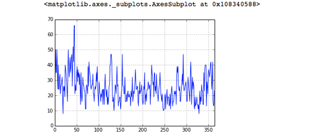
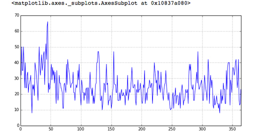
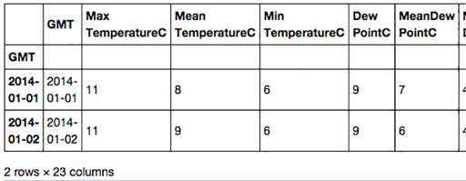
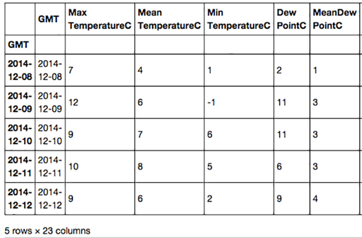

# 2 Every picture tells a story


It can be difficult and confusing to look at a table of rows of numbers and make any meaningful interpretation especially if there are many rows and columns.

Handily, pandas has a method called ``plot()`` which will visualise data for us by producing a chart.

Before using the ``plot()`` method, the following line of code must be executed (once) which tells Jupyter to display all charts inside this notebook, immediately after each call to ``plot():``

``In []:``

`%matplotlib inline`

To plot ``‘Max Wind SpeedKm/h`` ’, it’s as simple as this code:

``In []:``

`london['Max Wind SpeedKm/h'].plot(grid=True)`

``Out[]:``





__Figure 10__


The ``grid=True`` argument makes the gridlines (the dotted lines in the image above) appear, which make values easier to read on the chart. The chart comes out a bit small, so you can make it bigger by giving the ``plot()`` method some extra information. The figsize units are inches.

``In []:``

`
london['Max Wind SpeedKm/h'].plot(grid=True, figsize=(10,5))
`

``Out[]:``





__Figure 11__


That’s better! The argument given to the ``plot()`` method, ``figsize=(10,5)`` simply tells ``plot()`` that the x-axis should be 10 units wide and the y-axis should be 5 units high. In the above graph the x-axis (the numbers at the bottom) shows the dataframe’s index, so 0 is 1 January and 50 is 18 February.

The y-axis (the numbers on the side) shows the range of wind speed in kilometres per hour. It is clear that the windiest day in 2014 was somewhere in mid-February and the wind reached about 66 kilometers per hour.

By default, the ``plot()`` method will try to generate a line, although as you’ll see in a later week, it can produce other chart types too.


### Exercise 5 Every picture tells a story


#### Question

Now try Exercise 5 in the Exercise notebook 2.

If you’re using Anaconda, remember that to open the notebook you’ll need to navigate to the notebook using Jupyter.


## 2.1 Changing a dataframe’s index


We have seen that by default every dataframe has an integer index for its rows which starts from 0.

The dataframe we’ve been using, ``london`` , has an index that goes from ``0`` to ``364``. The row indexed by ``0`` holds data for the first day of the year and the row indexed by ``364`` holds data for the last day of the year. However, the column ``'GMT'`` holds ``datetime64`` values which would make a more intuitive index.

Changing the index to ``datetime64`` values is as easy as assigning to the dataframe’s ``index`` attribute the contents of the ``'GMT'`` column, like this:

``In []:``


```bash

london.index = london['GMT']
#Display the first 2 rows
london.head(2)
```


``Out[]:``





__Figure 12__


* Note that the right of the table has been cropped to fit on the page. *

Notice that the ``'GMT'`` column still remains and that the index has been labelled to show that it has been derived from the ``'GMT'`` column.

You can still access a row using the ``iloc`` attribute, so to get the first line in the dataframe you can simply execute:

``In []:``

`london.iloc[0]`

``Out[]:``


```bash

GMT 2014-01-01 00:00:00
Max TemperatureC 11
Mean TemperatureC 8
Min TemperatureC 6
Dew PointC 9
MeanDew PointC 7
Min DewpointC 4
Max Humidity 94
Mean Humidity 86
Min Humidity 73
Max Sea Level PressurehPa 1002
Mean Sea Level PressurehPa 993
Min Sea Level PressurehPa 984
Max VisibilityKm 31
Mean VisibilityKm 11
Min VisibilitykM 2
Max Wind SpeedKm/h 40
Mean Wind SpeedKm/h 26
Max Gust SpeedKm/h 66
Precipitationmm 9.91
CloudCover 4
Events Rain
WindDirDegrees 186
Name: 2014-01-01 00:00:00, dtype: object
```


But now you can now also use the ``datetime64`` index to get a row using the dataframe’s ``loc`` attribute, like this:

``In []:``

`london.loc[datetime(2014, 1, 1)]`

``Out[]:``


```bash

GMT 2014-01-01 00:00:00
Max TemperatureC 11
Mean TemperatureC 8
Min TemperatureC 6
Dew PointC 9
MeanDew PointC 7
Min DewpointC 4
Max Humidity 94
Mean Humidity 86
Min Humidity 73
Max Sea Level PressurehPa 1002
Mean Sea Level PressurehPa 993
Min Sea Level PressurehPa 984
Max VisibilityKm 31
Mean VisibilityKm 11
Min VisibilitykM 2
Max Wind SpeedKm/h 40
Mean Wind SpeedKm/h 26
Max Gust SpeedKm/h 66
Precipitationmm 9.91
CloudCover 4
Events Rain
WindDirDegrees 186
Name: 2014-01-01 00:00:00, dtype: object
```


A query such as ‘Return all the rows where the date is between 8 December and 12 December’ which you did before (and can still do) with:

``In []:``


```bash

london[(london['GMT'] >= datetime(2014, 12, 8))
    & (london['GMT'] <= datetime(2014, 12, 12))]
```


can now be done more succinctly like this:

``In []:``


```bash


london.loc[datetime(2014,12,8) : datetime(2014,12,12)]


#The meaning of the above code is get the rows between

#and including the indices datetime(2014,12,8) and
#datetime(2014,12,12)
```


``Out[]:``





__Figure 13__


* Note that the right of the table has been cropped to fit on the page. *

Because the table is in date order, we can be confident that only the rows with dates between 8 December 2014 and 12 December 2014 (inclusive) will be returned. However if the table had not been in date order, we would have needed to sort it first, like this:

`london = london.sort_index()`

Now there is a ``datetime64`` index, let’s plot ' ``Max Wind SpeedKm/h`` 'again:

``In []:``

`
london['Max Wind SpeedKm/h'].plot(grid=True, figsize=(10,5))
`

``Out[]:``


__Figure 14__


Now it is much clearer that the worst winds were in mid-February.


### Exercise 6 Changing a dataframe’s index


#### Question

Now try Exercise 6 in the Exercise notebook 2.


## 2.2 The project


Your project this week is to find out what would have been the best two weeks of weather for a 2014 vacation in a capital of a BRICS country.


__Figure 15__


I’ve written up my analysis of the best two weeks of weather in London, UK, which you can open in project: 2: Holiday weather.

The structure is very simple: besides the introduction and the conclusions, there is one section for each step of the analysis – obtaining, cleaning and visualising the data.

Once you’ve worked through my analysis you should open a dataset for just one of the BRICS capitals: Brasilia, Moscow, Delhi, Beijing or Cape Town. The choice of capital is up to you. You should then work out the best two weeks, according to the weather, to choose for a two-week holiday in your chosen capital city.

Download the dataset for your chosen location as follows:

* Right click on the name of your chosen capital city above

* Choose to save the file via ‘Download Linked File As...’ Save the file with its default name to your downloads folder.

* If necessary, rename the file so that it has a .csv extension.

* Finally, move or copy te file to the disk folder or SageMathCloud by Cocalc project you created in Week 1.

Once again, __do not open the file with Excel__ , but you could take a look using a text editor.

In my project, because I’m in London, which is often cold and rainy, I was looking for a two week period that had relatively high temperatures and little rain. If you choose a capital in a particularly hot and dry country you will probably be looking for relatively cool weather and low humidity.

Note that the London file has the dates in a column named ‘GMT’ whereas in the BRICS files they are in a column named ‘Date’. You will need to change the Python code accordingly. You should also change the name of the variable, London, according to the capital you choose.

