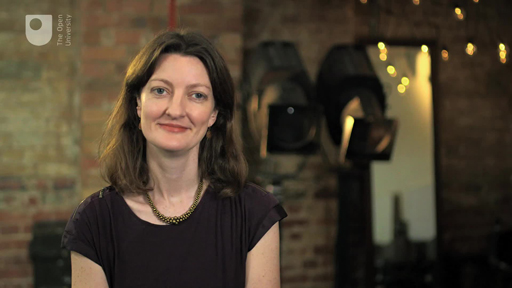

# Introduction

Welcome to Week 5.

*Please note: in the following video, where reference is made to a study ‘week’, this corresponds to Weeks 5 and 6 of this course.*
<!--MEDIACONTENT--><video xmlns:str="http://exslt.org/strings" width="80%" download=""><source src="https://www.open.edu/openlearn/ocw/pluginfile.php/1393338/mod_oucontent/oucontent/71687/ou_futurelearn_learn_to_code_vid_1003.mp4" type="video/mp4"></source></video><!--TRANSCRIPT--><table xmlns:str="http://exslt.org/strings" border="1"><tr><td>
__RUTH ALEXANDER:__ *So far you've looked at one data set at a time. Data analysis becomes more interesting when multiple data sets are put together. Data sets can be combined in various ways and for different reasons. The simplest option is to combine the same kind of data. One possible reason is to aggregate information. For example, data on the incidence of a disease is collected by regional health services, aggregated by governments at national level, and further aggregated by international agencies like the World Health Organisation. Another reason is to slice data in a different way. For example weather data sets for different years can be combined to see if a particular month is getting hotter or wetter over the decades. *;
*Using multiple data sets makes it more likely for the data to not be in the format you need. For example, if one data set provides temperatures in Fahrenheit and the other in Celsius you'll need to convert one unit to the other to combine both data sets. This is where the power of programming really begins to show. As you'll see this week Python allows you to code your own data transformations. Combining different types of data is even more interesting. For example to really appreciate the effect of changes in the minimum wage amount over time it can be combined with the cost of living or the number of people on the minimum wage over the same period. *;
*Combing different types of data requires that they share at least one uniquely identifying characteristic. For example, the minimum wage and the cost of living must all be about the same country or the same period of time. So that's what we'll be covering this week. How to transform data so that it can then be combined on some common characteristic. I hope you enjoy it. *;
</td></tr></table><!--ENDTRANSCRIPT-->

<!--ENDMEDIACONTENT-->
In Week 1 you worked on a dataset that combined two different World Health Organization datasets: population and the number of deaths due to tuberculosis.

They could be combined because they share a common attribute: the countries. This week you will learn the techniques behind the creation of such a combined dataset.

