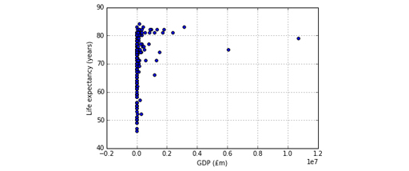
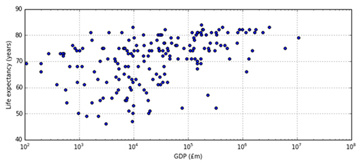

# 2 Correlation


To see if life expectancy grows when the GDP increases I will use a statistical measure known as the __Spearman rank correlation coefficient__.


__Figure 3__


It’s a number between -1 and 1 that describes how well two indicators correlate, in the following sense.

* A value of 1 means that if I rank (sort) the data from smallest to largest value in one indicator, it will also be in ascending order according to the other indicator. In other words, if one indicator grows, so does the other.

* A value of -1 means a perfect inverse rank relation: if I sort the data from smallest to largest according to one indicator, I will see it is sorted from largest to smallest in the other indicator. When one indicator goes up, the other goes down.

* A value of 0 means there is no rank relation between the two indicators.

A positive value smaller than 1 (or a negative value larger than -1) means there is some direct (or inverse) correlation, but it is not systematic across the whole dataset.

The __p-value__ indicates how significant the result is, in a particular technical sense. To say a correlation is statistically significant doesn’t necessarily mean it is important or strong in the real world, but only that there is reasonable statistical evidence that there is some kind of relationship. Typically, the obtained correlation coefficient is considered statistically significant if the p-value is below 0.05.

The pandas module doesn’t calculate complex statistics. There are other modules in the Anaconda distribution for that. In particular, ``scipy`` (Scientific Python) has a stats module that provides the ``spearmanr()`` function. The function takes as arguments the two columns of data to correlate. Contrary to the functions you’ve seen so far, it returns two values instead of one: the correlation and the p-value. To store both values, simply use a pair of variables, written in parenthesis.

To show the results in a nicer way, I will use the Python ``print()`` function, which displays its arguments in a single line.

``In []:``


```bash

from scipy.stats import spearmanr 
gdpColumn = gdpVsLife[GDP]
lifeColumn = gdpVsLife[LIFE]
(correlation, pValue) = spearmanr(gdpColumn, lifeColumn)
print('The correlation is', correlation)
if pValue < 0.05: 
        print('It is statistically significant.') 
else:
        print('It is not statistically significant.')
```


``Out[]:``


```bash

The correlation is 0.493179132478.
It is statistically significant.
```


Although there is a statistically significant direct correlation (life expectancy grows as GDP grows), it isn’t strong.

A perfect (direct or inverse) correlation doesn’t mean there is any cause-effect between the two indicators. A perfect direct correlation between life expectancy and GDP would only state that the higher the GDP, the higher the life expectancy. It would not state that the higher expectancy is due to the GDP. Correlation is not causation.


### Exercise 10 Correlation


#### Question

Calculate the correlation between GDP and population in Exercise 10 in the Exercise notebook 3.

Remember to run the existing code in the notebook before you start the exercise. When you’ve completed the exercise, save the notebook.


## 2.1 Scatterplots


Statistics can be misleading. A coefficient of zero only states there is no ranking relation between the indicators, but there might be some other relationship.

In the next example, the correlation between x and y is zero, but they are clearly related (y is the square of x).

``In []:``


```bash

table = [ [-2,4], [-1,1], [0,0], [1,1], [2,4] ]
data = DataFrame(columns=['x', 'y'], data=table)

(correlation, pValue) = spearmanr(data['x'], data['y'])

print('The correlation is', correlation)
data
```


``Out[]:``

`The correlation is 0.0`
<table xmlns:str="http://exslt.org/strings">
<caption></caption>
<tbody>
<tr>
<th></th>
<th>x</th>
<th>y</th>
</tr>
<tr>
<td class="highlight_" rowspan="" colspan="">0</td>
<td class="highlight_" rowspan="" colspan="">-2</td>
<td class="highlight_" rowspan="" colspan="">4</td>
</tr>
<tr>
<td class="highlight_" rowspan="" colspan="">1</td>
<td class="highlight_" rowspan="" colspan="">-1</td>
<td class="highlight_" rowspan="" colspan="">1</td>
</tr>
<tr>
<td class="highlight_" rowspan="" colspan="">2</td>
<td class="highlight_" rowspan="" colspan="">0</td>
<td class="highlight_" rowspan="" colspan="">0</td>
</tr>
<tr>
<td class="highlight_" rowspan="" colspan="">3</td>
<td class="highlight_" rowspan="" colspan="">1</td>
<td class="highlight_" rowspan="" colspan="">1</td>
</tr>
<tr>
<td class="highlight_" rowspan="" colspan="">4</td>
<td class="highlight_" rowspan="" colspan="">2</td>
<td class="highlight_" rowspan="" colspan="">4</td>
</tr>
</tbody>
</table>

It’s therefore best to complement the quantitative analysis with a more qualitative view provided by a chart. In the case of correlations, __scatterplots__ will do very nicely. Each country is a dot plotted at the x and y coordinates corresponding to the GDP and life expectancy values.

``In []:``


```bash

%matplotlib inline

gdpVsLife.plot(x=GDP, y=LIFE, kind='scatter', grid=True)

```


``Out[]:``

`
&lt;matplotlib.axes._subplots.AxesSubplot at 0x10e2e6eb8&gt;
`





__Figure 4__


This graph is not very useful. The GDP difference between the poorest and richest countries is so vast that the whole chart is squashed to fit all GDP values on the x-axis. It is best to use a __logarithmic scale__ , where the axis values don’t increase by a constant interval (10, 20, 30, for example), but by a multiplicative factor (10, 100, 1000, 10000, etc.). The parameter ``logx`` has to be set to ``True`` to get a logarithmic scale on the x-axis. Moreover, let’s make the chart a bit wider, by using the ``figsize`` parameter you saw last week.

``In []:``


```bash

gdpVsLife.plot(x=GDP, y=LIFE, kind='scatter', grid=True, 
              logx=True, figsize = (10, 4))
```


``Out[]:``

`
&gt;matplotlib.axes._subplots.AxesSubplot at 0x10e400588&gt;
`





__Figure 5__


The major tick marks in the x-axis go from 10 <sup xmlns:str="http://exslt.org/strings">2</sup> (that’s a one followed by two zeros, hence 100) to 10 <sup xmlns:str="http://exslt.org/strings">8</sup> (that’s a one followed by eight zeros, hence 100,000,000) million pounds, with the minor ticks marking the numbers in between. For example, the eight minor ticks between 10 <sup xmlns:str="http://exslt.org/strings">2</sup> and 10 <sup xmlns:str="http://exslt.org/strings">3</sup> represent the values 200 (2 × 10 <sup xmlns:str="http://exslt.org/strings">2</sup> ), 300 (3 × 10 <sup xmlns:str="http://exslt.org/strings">2</sup> ), and so on until 900 (9 × 10 <sup xmlns:str="http://exslt.org/strings">2</sup> ). As a further example, the country with the lowest life expectancy is on the second minor tick to the right of 10 <sup xmlns:str="http://exslt.org/strings">3</sup> , which means its GDP is about 3 × 10 <sup xmlns:str="http://exslt.org/strings">3</sup> (three thousand) million pounds.

Countries with a GDP around 10 thousand (10 <sup xmlns:str="http://exslt.org/strings">4</sup> ) millions of pounds have a wide range of life expectancies, from under 50 to over 80, but the range tends to shrink both for poorer and for richer countries. Countries with the lowest life expectancy are neither the poorest nor the richest, but those with highest expectancy are among the richer countries.


### Exercise 11 Scatterplots


#### Question

Practise using Scatterplots in Exercise11 in the Exercise notebook 3.


## 2.2 My project


I’ve written up my analysis of this week’s project in the notebook you can open this in your downloaded files.


__Figure 6__


The structure is very simple: besides the introduction and the conclusions, there is one section for each step of the analysis – downloading, cleaning, transforming, and merging the data, then calculating and visualising the correlation.

Open Project 4: Life expectancy

If you have time, extend my project to answer different questions or create your own project in the activity below.


### Activity 1
<!--Heading:
            Extend the project-->

#### Question

Make a copy of the Project 3: GDP and Life expectancy and change it to answer one or more of the following questions:

* To what extent do the ten countries with the highest GDP coincide with the ten countries with the longest life expectancy?

* Which are the two countries in the right half of the plot (higher GDP) with life expectancy below 60 years? What factors could explain their lower life expectancy compared to countries with similar GDP? 
Hint: use the filtering techniques you learned in Week 2 to find the two countries.


* Redo the analysis using the countries’ GDP per capita (i.e. per inhabitant) instead of their total GDP. If you’ve done the workbook exercises, you already have a column with the population data. 
Hint: write an expression involving the GDP and population columns, as you learned in Calculating over columns in Week 1.
 Think about the units in which you display GDP per capita.

* Redo the analysis using the indicator suggested at the end of the project notebook.
<!--Heading:
            Create your own project-->

#### Question

If you have more time, create a completely new project and choose another two of the hundreds of World Bank indicators and see if there is any correlation between them. If there is a choice of similar indicators, choose one that leads to meaningful comparisons between countries.

Look at the results you obtained and take a few moments to assess how they differ from mine.


