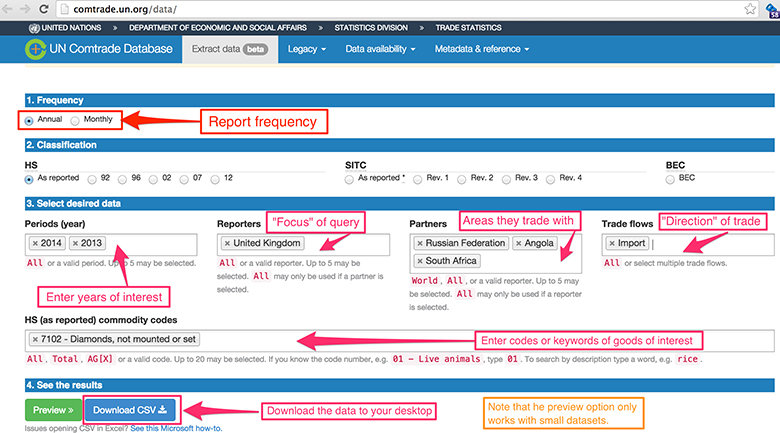
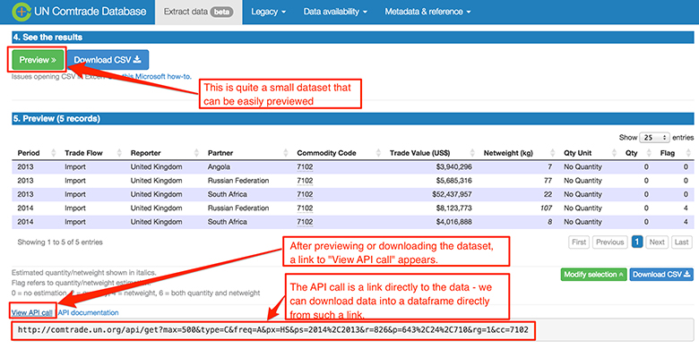

# 1 I spy with my little eye


One of the ways you are shown for loading World Bank data into the notebook in Week 7, was to use the ``download ()`` function.


__Figure 1__


One way to find out for yourself what sorts of argument a function expects is to ask it. Running a code cell containing a question mark (?) followed by a function name should pop up a help area in the bottom of the notebook window. (Close it using the x in the top right hand corner of the panel.)

``In []:``


```bash

from pandas.io.wb import download
?download
```


The function documentation tells you that you can enter a list of one or more country names using standard country codes as well as a date range. You can also calculate a date range from a single date to show the ``N`` years of data leading up to a particular year.

Note that if you are using the CoCalc free plan, you will not be able to use the ``download ()`` function to download the data directly from the World Bank API, although you will still be able to inspect the documentation associated with the function.

``In []:``


```bash

YEAR = 2013
GDP_INDICATOR = 'NY.GDP.MKTP.CD'

gdp = download(indicator=GDP_INDICATOR, country=['GB','CN'], start=YEAR-5, end=YEAR)

gdp = gdp.reset_index()
gdp
```


``Out[]:``
<table xmlns:str="http://exslt.org/strings">
<caption></caption>
<tbody>
<tr>
<th></th>
<th>country</th>
<th>year</th>
<th>NY.GDP.MKTP.CD</th>
</tr>
<tr>
<td class="highlight_" rowspan="" colspan="">__0__</td>
<td class="highlight_" rowspan="" colspan="">China</td>
<td class="highlight_" rowspan="" colspan="">2013</td>
<td class="highlight_" rowspan="" colspan="">9.490603e+12</td>
</tr>
<tr>
<td class="highlight_" rowspan="" colspan="">__1__</td>
<td class="highlight_" rowspan="" colspan="">China</td>
<td class="highlight_" rowspan="" colspan="">2012</td>
<td class="highlight_" rowspan="" colspan="">8.461623e+12</td>
</tr>
<tr>
<td class="highlight_" rowspan="" colspan="">__2__</td>
<td class="highlight_" rowspan="" colspan="">China</td>
<td class="highlight_" rowspan="" colspan="">2011</td>
<td class="highlight_" rowspan="" colspan="">7.492432e+12</td>
</tr>
<tr>
<td class="highlight_" rowspan="" colspan="">__3__</td>
<td class="highlight_" rowspan="" colspan="">China</td>
<td class="highlight_" rowspan="" colspan="">2010</td>
<td class="highlight_" rowspan="" colspan="">6.039659e+12</td>
</tr>
<tr>
<td class="highlight_" rowspan="" colspan="">__4__</td>
<td class="highlight_" rowspan="" colspan="">China</td>
<td class="highlight_" rowspan="" colspan="">2009</td>
<td class="highlight_" rowspan="" colspan="">5.059420e+12</td>
</tr>
<tr>
<td class="highlight_" rowspan="" colspan="">__5__</td>
<td class="highlight_" rowspan="" colspan="">China</td>
<td class="highlight_" rowspan="" colspan="">2008</td>
<td class="highlight_" rowspan="" colspan="">4.558431e+12</td>
</tr>
<tr>
<td class="highlight_" rowspan="" colspan="">__6__</td>
<td class="highlight_" rowspan="" colspan="">United Kingdom</td>
<td class="highlight_" rowspan="" colspan="">2013</td>
<td class="highlight_" rowspan="" colspan="">2.678173e+12</td>
</tr>
<tr>
<td class="highlight_" rowspan="" colspan="">__7__</td>
<td class="highlight_" rowspan="" colspan="">United Kingdom</td>
<td class="highlight_" rowspan="" colspan="">2012</td>
<td class="highlight_" rowspan="" colspan="">2.614946e+12</td>
</tr>
<tr>
<td class="highlight_" rowspan="" colspan="">__8__</td>
<td class="highlight_" rowspan="" colspan="">United Kingdom</td>
<td class="highlight_" rowspan="" colspan="">2011</td>
<td class="highlight_" rowspan="" colspan="">2.592016e+12</td>
</tr>
<tr>
<td class="highlight_" rowspan="" colspan="">__9__</td>
<td class="highlight_" rowspan="" colspan="">United Kingdom</td>
<td class="highlight_" rowspan="" colspan="">2010</td>
<td class="highlight_" rowspan="" colspan="">2.407857e+12</td>
</tr>
<tr>
<td class="highlight_" rowspan="" colspan="">__10__</td>
<td class="highlight_" rowspan="" colspan="">United Kingdom</td>
<td class="highlight_" rowspan="" colspan="">2009</td>
<td class="highlight_" rowspan="" colspan="">2.308995e+12</td>
</tr>
<tr>
<td class="highlight_" rowspan="" colspan="">__11__</td>
<td class="highlight_" rowspan="" colspan="">United Kingdom</td>
<td class="highlight_" rowspan="" colspan="">2008</td>
<td class="highlight_" rowspan="" colspan="">2.791682e+12</td>
</tr>
</tbody>
</table>

Although many datasets that you are likely to work with are published in the form of a single data table, such as a single CSV file or spreadsheet worksheet, it is often possible to regard the dataset as being made up from several distinct subsets of data.

In the above example, you will probably notice that each country name appears in several rows, as does each year. This suggests that we can make different sorts of comparisons between different groupings of data using just this dataset. For example, compare the total GDP of each country calculated over the six years 2008 to 2013 using just a single line of code:

``In []:``

`
gdp.groupby('country')['NY.GDP.MKTP.CD'].aggregate(sum)
`

``Out[]:``


```bash

country
China             4.110217e+13
United Kingdom    1.539367e+13
Name: NY.GDP.MKTP.CD, dtype: float64
```


Essentially what this does is to say ‘for each country, find the total GDP’.

The total combined GDP for those two countries in each year could be found by making just one slight tweak to our code (can you see below where I made the change?):

``In []:``

`
gdp.groupby('year')['NY.GDP.MKTP.CD'].aggregate(sum)
`

``Out[]:``


```bash

year
2008    7.350113e+12
2009    7.368415e+12
2010    8.447515e+12
2011    1.008445e+13
2012    1.107657e+13
2013    1.216878e+13
Name: NY.GDP.MKTP.CD, dtype: float64
```


That second calculation probably doesn’t make much sense in this particular case, but what if there was another column saying which region of the world each country was in? Then, by taking the data for all the countries in the world, the total GDP could be found for each region by grouping on *both* the year *and* the region.

Next, you will consider ways of grouping data.


## 1.1 Ways of grouping data


Think back to the weather dataset you used in Week 3 , how might you group that data into several distinct groups? What sorts of comparisons could you make by grouping just the elements of that dataset? Or how might you group and compare the GDP data?


__Figure 2__


One thing the newspapers love to report are weather ‘records’, such as the ‘hottest June ever’ or the wettest location in a particular year as measured by total annual rainfall, or highest average monthly rainfall. How easy is it to find that information out from the data?

Or with the GDP data, if countries were assigned to economic groupings such as the European Union, or regional groupings such as Africa, or South America, how would you generate information such as lowest GDP in the EU or highest GDP in South America?

This week you will learn how to split data into groups based on particular features of the data, and then generate information about each separate group, across all of the groups, at the same time.


### Activity 1 Grouping data


#### Question

Based on the data you have seen so far, or some other datasets you may be aware of, what other ways of grouping data can you think of, and why might grouping data that way be useful?


## 1.2 Data that describes the world of trade


A news article from the *Guardian* announcing a gloomy export outlook for UK manufacturers (see the link below), got me wondering about what sorts of thing different countries actually export.

For example, it might surprise you that India was the world’s largest exporter by value of unset diamonds in 2014 (24 billion US dollars worth), or that Germany was the biggest importer of chocolate (over $2.5 billion worth) in that same year.

National governments all tend to publish their own trade figures, but the UN also collect data from across the world. In particular, the UN’s global trade database, Comtrade, contains data about import and export trade flows between countries for a wide range of goods and services.


__Figure 3__


So if you’ve ever wondered where your country imports most of its T-shirts from, or exports most of its municipal waste to, Comtrade is likely to have the data.

In the next section, you will find out about the Comtrade data.


## 1.3 Exploring the world of export data


The Comtrade Data Extraction interface provides a user interface for selecting, previewing and exporting data from the Comtrade database.


### Activity 2 Exploring export data


#### Question

Open the [Comtrade Data Extraction interface](http://comtrade.un.org/data/) and keep it open alongside this page. You’ll explore the options and preview some data.





__Figure 4:__ Comtrade Data Extraction interface 


In the text area marked __HS (as reported) commodity codes__ , start to enter the name of various goods and services. You should see suggestions regarding different goods and services that Comtrade records trade flow data for.

If you don’t select too much data, you should be able to get a preview of the data by clicking the green ‘Preview’ button. Notice that the interface allows you to sort the data by a particular column, which provides a quick way of finding the countries that export most, or least, goods by value.

If you selected ‘All’ reporters, you will probably notice that a decreasing sort on the ‘Trade Value’ column always has ‘World’ at the top: in the ‘All’ reports dataset, individual country reports and reports from ‘areas not elsewhere specified’ (‘nes’) are complemented by the ‘World’ report which represents a sum total of those other values.

The user interface is rather complicated at first glance, but with a bit of trial and error you should be able to work out:

* how to display trade flows between a particular country (the ‘Reporter’) and a particular country or region of the world (the ‘Partners’)

* how to limit the display to show just imports, or exports, between ‘Reporter(s)’ and ‘Partner(s)’

* how to display data for different years

* how to display data for different months in a particular year, or all the months in a particular year.

You might notice that the commodities codes are organised hierarchically, i.e. a code breaks down into further sub-codes. For example:

* 3825 – Residual products of the chemical or allied industries 382510 – Municipal waste382520 – Sewage sludge382530 – Clinical waste…

Adding up the results from the next level down on a particular code should generate trade value totals that correspond to the higher level totals, rounding errors aside. This means that if you want to focus on the subcategories of a particular commodity type, you may well be able to do so.

For a particular category of goods, and a reporting period of a single month or year, select your country as the reporter and ‘All’ as the partner.

Does the range of goods and services listed within the database surprise you?


Keep the Comtrade webpage open as you’ll use it again in the next section.


## 1.4 Getting data from the Comtrade API


Hopefully, you have a few ideas about data you’d like to explore from the Comtrade database.

In the previous section, I managed to identify a set of data that describes the amount of unset diamonds (commodity code 7102) imported into the UK from the Russian Federation, Angola and South Africa in 2013 and 2014.





__Figure 5__ Comtrade Data Extraction interface 


You can export the data you have selected as a CSV file that will be downloaded to your own computer by clicking on the *Download CSV* button. You may find it useful to change the filename of the downloaded file to something more meaningful than the comtrade.csv default name.

If you moved the downloaded CSV file into the same folder as your Exercise notebook 4 (that you’ll download later), you could use the following command to load the data into a pandas dataframe:

``In []:``


```bash

filename='comtrade.csv

' df=read_csv(filename, dtype={'Commodity Code':str, 'Reporter Code':str })

```


The ‘Commodity Code’ and ‘Reporter Code’ values are explicitly read in as a string ``(str)`` otherwise codes like 0401 will be returned as the number 401.

One of the problems of working with real data like this is that it may not be just the data you want. The data returned from Comtrade includes several columns that are essentially surplus to requirements for the reports you will produce. I suggest that you clean the dataframes so that they contain at most the following key columns: ‘Year’, ‘Period’, ‘Trade Flow’, ‘Reporter’, ‘Partner’, ‘Commodity’, ‘Commodity Code’, ‘Trade Value (US$)’.

``In []:``


```bash


COLUMNS = ['Year', 'Period','Trade Flow','Reporter','Partner', 'Commodity','Commodity Code','Trade Value (US$)']

df=df[COLUMNS]
```


To avoid conflating data relating to all countries (the ‘World’ partner), and each separate country, create separate dataframes for each, using the comparison operators introduced in Week 3.

``In []:``


```bash

world = df[df['Partner'] == 'World']
countries = df[df['Partner'] != 'World']
```


---


### A More Direct Way of Getting the Data

Just as there was a method for downloading data directly from the World Bank, there is also a more direct way of getting the Comtrade data into a dataframe – directly from the Comtrade website. You might have noticed that when you downloaded the file from the Comtrade website, a link appeared on the site labelled ‘View API Call’.

An API is an ‘application programming interface’ that provides a means for one computer to talk to another ‘in machine terms’. When you extracted data from the World Bank, you were calling the World Bank API using a set of functions provided by the pandas library. Behind the scenes, these functions create URLs (that is, web addresses) that call the World Bank API and allow requests to be made directly from it, putting the response into a pandas dataframe.

In the case of Comtrade, clicking the *View API Link* reveals a URL that requests the data you selected in the search form as a data file, though not, by default, as a CSV data file.

This link can be used to download data directly into a pandas dataframe from Comtrade, although you will need to make a couple of modifications to the URL first. In particular, change the max value to 5000 (to increase the amount of data returned by each request) and add ``&amp;fmt=csv`` to the end of the URL to ensure that the data is returned in a CSV format.

For example, if you copied the URL:

http://comtrade.un.org/api/get?max=500&amp;type=C&amp;freq=M&amp;px=HS&amp;ps=2015&amp;r=826&amp;p=all&amp;rg=1%2C2&amp;cc=0401%2C0402

you would need to modify it as follows:

http://comtrade.un.org/api/get?max= __5000__ &amp;type=C&amp;freq=M&amp;px=HS&amp;ps=2015&amp;r=826&amp;p=all&amp;rg=1%2C2&amp;cc=0401%2C0402 __&amp;fmt=csv__

You can then load the data in using the panda ``read_csv()`` function.

* Note that if you are using the CoCalc free plan, you will not be able to download data directly from the Comtrade API into a pandas dataframe. *

Set the datatypes as shown using the ``dtype`` argument to ensure that the codes are read in correctly.

``In []:``


```bash


URL='http://comtrade.un.org/api/get?max=5000&type=C&freq=A&px=HS&ps=2014%2C2013%2C2012&r=826&p=all&rg=all&cc
=0401%2C0402&fmt=csv'


df=read_csv(URL, dtype={'Commodity Code':str, 'Reporter Code':str})

```


Having downloaded the data, you should then separate out the World data as before.

If you want to save a copy of data downloaded into pandas directly from the Comtrade API, call the ``to_csv()`` method on your dataframe, pasting in the filename you want to save the file under, and setting ``index=False`` so that the dataframe’s automatically introduced index column is not included. For example:

`
countries.to_csv('saved_country_data_example.csv', index=False)
`

The file will be saved in the same folder as the notebook.


---


## 1.5 Practice getting data


### Exercise 1 Getting data from API


#### Question

In Exercise 1, identify a dataset from the [Comtrade Data Extraction interface](http://comtrade.un.org/data/) selecting one or more commodity codes and a single reporter that are of interest to you and import the data into pandas.

Open the exercise notebook 4 and save it in the disk folder or the CoCalc project you created in Week 1. You should also open the comtrade_pivot.html comtrade_milk_uk_monthly_14.csv files and save them into the same folder or project.

Remember to run the existing code in the notebook before you start the exercise. When you’ve completed the exercise, save the notebook. If you need a quick reminder of how to use Jupyter watch again the video in Week 1 Exercise 1.

For the commodities and reporter you chose, find out which countries are the biggest partners in recent years in terms of import and export trade flows.


