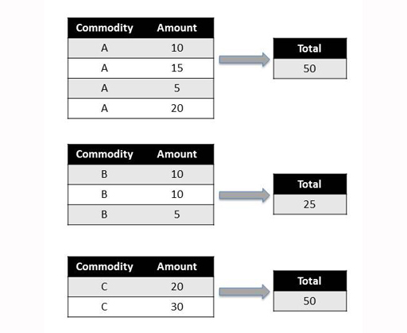

# 1 The split-apply-combine pattern


In the  exercise in Week 7, you downloaded data from Comtrade that could be described as ‘heterogenous’ or mixed in some way. For example, the same dataset contained information relating to both imports and exports.

To find the partner countries with the largest trade value in terms of exports means filtering the dataset to obtain just the rows containing export data and then ranking those. Finding the largest import partner requires a sort on just the import data.


__Figure 1__


But what if you wanted to find out even more refined information? For example:

* the total value of exports of product X from the UK to those countries on a year by year basis (group the information by year and then find the total for each year)

* the total value of exports of product X from the UK to each of the partner countries by year (group the information by country and year and then find the total for each country/year pairing)

* the average value of exports across all the countries on a month by month basis (group by month, then find the average value per month)

* the average value of exports across each country on a month by month basis (group by month and country, then find the average value over each country/month pairing)

* the difference month on month between the value of imports from, or exports to, each particular country over the five year period (group by country, order by month and year, then find the difference between consecutive months).

In each case, the original dataset needs to be separated into several subsets, or groups of data rows, and then some operation performed on those rows. To generate a single, final report would then require combining the results of those operations in a new or extended dataframe.

This sequence of operations is common enough for it to have been described as the ‘split-apply-combine’ pattern. The sequence is to:

* ‘split’ an appropriately shaped dataset into several components

* ‘apply’ an operator to the rows contained within a component

* ‘combine’ the results of applying to operator to each component to return a single combined result.

You will see how to make use of this pattern using pandas next.


## 1.1 Splitting a dataset by grouping


‘Grouping’ refers to the process of splitting a dataset into sets of rows, or ‘groups’, on the basis of one or more criteria associated with each data row.

Grouping is often used to split a dataset into one or more distinct groups. Each row in the dataset being grouped around can be assigned to one, and only one, of the derived groups. The rows associated with a particular group may be accessed by reference to the group or the same processing or reporting operation may be applied to the rows contained in each group on a group by group basis.


__Figure 2__


The rows do not have to be ‘grouped’ together in the original dataset – they could appear in any order in the original dataset (for example, a commodity A row, followed by a two commodity B rows, then another commodity A row, and so on). However, the order in which each row appears in the original dataset will typically be reflected by the order in which the rows appear in each subgroup.

Let’s see how to do that in pandas. Create a simple dataframe that looks like the full table in the image above:

``In []:``


```bash

data=[['A',10],['A',15],['A',5],['A',20],
              ['B',10],['B',10],['B',5],
              ['C',20],['C',30]] 
df=DataFrame(data=data, columns=["Commodity","Amount"])
df
```


``Out[]:``
<table xmlns:str="http://exslt.org/strings">
<caption></caption>
<tbody>
<tr>
<th></th>
<th>Commodity</th>
<th>Amount</th>
</tr>
<tr>
<td class="highlight_" rowspan="" colspan="">__0__</td>
<td class="highlight_" rowspan="" colspan="">A</td>
<td class="highlight_" rowspan="" colspan="">10</td>
</tr>
<tr>
<td class="highlight_" rowspan="" colspan="">__1__</td>
<td class="highlight_" rowspan="" colspan="">A</td>
<td class="highlight_" rowspan="" colspan="">15</td>
</tr>
<tr>
<td class="highlight_" rowspan="" colspan="">__2__</td>
<td class="highlight_" rowspan="" colspan="">A</td>
<td class="highlight_" rowspan="" colspan="">5</td>
</tr>
<tr>
<td class="highlight_" rowspan="" colspan="">__3__</td>
<td class="highlight_" rowspan="" colspan="">A</td>
<td class="highlight_" rowspan="" colspan="">20</td>
</tr>
<tr>
<td class="highlight_" rowspan="" colspan="">__4__</td>
<td class="highlight_" rowspan="" colspan="">B</td>
<td class="highlight_" rowspan="" colspan="">10</td>
</tr>
<tr>
<td class="highlight_" rowspan="" colspan="">__5__</td>
<td class="highlight_" rowspan="" colspan="">B</td>
<td class="highlight_" rowspan="" colspan="">10</td>
</tr>
<tr>
<td class="highlight_" rowspan="" colspan="">__6__</td>
<td class="highlight_" rowspan="" colspan="">B</td>
<td class="highlight_" rowspan="" colspan="">5</td>
</tr>
<tr>
<td class="highlight_" rowspan="" colspan="">__7__</td>
<td class="highlight_" rowspan="" colspan="">C</td>
<td class="highlight_" rowspan="" colspan="">20</td>
</tr>
<tr>
<td class="highlight_" rowspan="" colspan="">__8__</td>
<td class="highlight_" rowspan="" colspan="">C</td>
<td class="highlight_" rowspan="" colspan="">30</td>
</tr>
</tbody>
</table>

Next, use the ``groupby()`` method to group the dataframe into separate groups of rows based on the values contained within one or more specified ‘key’ columns. For example, group the rows according to what sort of commodity each row corresponds to as specified by the value taken in the ‘Commodity’ column.

``In []:``

`grouped = df.groupby('Commodity')`

The number and ‘names’ of the groups that are identified correspond to the unique values that can be found within the column or columns (which will be referred to as the ‘key columns’) used to identify the groups.

You can see what groups are available with the following method call:

``In []:``

`grouped.groups.keys()`

``Out []:``

`['A', 'C', 'B']`

The ``get_group()`` method can be used to grab just the rows associated with a particular group.

``In []:``

`grouped.get_group('B')`

``Out []:``
<table xmlns:str="http://exslt.org/strings">
<caption></caption>
<tbody>
<tr>
<th></th>
<th>Commodity</th>
<th>Amount</th>
</tr>
<tr>
<td class="highlight_" rowspan="" colspan="">__4__</td>
<td class="highlight_" rowspan="" colspan="">B</td>
<td class="highlight_" rowspan="" colspan="">10</td>
</tr>
<tr>
<td class="highlight_" rowspan="" colspan="">__5__</td>
<td class="highlight_" rowspan="" colspan="">B</td>
<td class="highlight_" rowspan="" colspan="">10</td>
</tr>
<tr>
<td class="highlight_" rowspan="" colspan="">__6__</td>
<td class="highlight_" rowspan="" colspan="">B</td>
<td class="highlight_" rowspan="" colspan="">5</td>
</tr>
</tbody>
</table>

Datasets can also be grouped against multiple columns. For example, if there was an extra ‘Year’ column in the above table, you could group against just the commodity, exactly as above, to provide access to rows by commodity; just the year, setting ``grouped = df.groupby( 'Year' );`` or by both commodity and year, passing in the two grouping key columns as a list:

`grouped = df.groupby( ['Commodity','Year'])`

The list of keys associated with the groups might then look like [(‘A’, 2015), (‘A’, 2014), (‘B’, 2015), (‘B’, 2014)]. The rows associated with the group corresponding to commodity A in 2014 could then be retrieved using the command:

`grouped.get_group( ('A',2014) )`

This may seem to you like a roundabout way of filtering the dataframe as you did in Week 2; but you’ll see that the ability to automatically group rows sets up the possibility of then processing those rows as separate ‘mini-dataframes’ and then combining the results back together.


### Exercise 2 Grouping data


#### Question

Work through Exercise 2 in the Week 4 notebook.

As you complete the tasks, think about these questions:

* For your particular dataset, how did you group the data and what questions did you ask of it? Which countries were the major partners of your reporter country for the different groupings?

* With the ability to group data so easily, what other sorts of questions would you like to be able to ask?


## 1.2 Looking at apply and combine operations


Having split a dataset by grouping, an operation is ‘applied’ to each group.


__Figure 3__


The operation often takes one of two forms:

* a ‘summary’ operation, in which a summary statistic based on the rows contained within each group is generated. A single value is returned for each group, for example, the group median or mean, the number of rows in the group, or the maximum or minimum value in the group. The final result will have *M* rows, one for each of the M groups created by the split (that is, . ``groupby()`` ) operation.

* a ‘filtering’ or ‘filtration’ operation, in which groups of rows are retained or discarded based on a particular property of the group as a whole. For example, only groups of rows where the sum of all the values in the group is above some threshold are retained. The effect is that each group keeps the same number of rows, but the resulting dataset (after combination, see below) may contain fewer groups than the original.

The results of applying the summary or filtration operation are then combined to provide a single output dataframe.

In the next section, you will see how to apply a variety of summary operations, and in a later step examples of filtration operations.


## 1.3 Summary operations


Summary, or aggregation, operations are used to produce a single summary value or statistic, such as the group average, for each separate group.

Find the ‘total’ amount within each group using a __summary__ operation:





__Figure 4__


To apply a summary operator to each group, such as a function to find the mean value of each group, and then automatically combine the results into a single output dataframe, pass the name of the function in to the ``aggregate()`` method. Note that pandas will try to use this operator to summarise each column in the grouped rows separately if there is more than one column that can be summarised. So for example, if there was a ‘Volume’ column, it would also return total volumes.

Let’s use again the example dataframe defined earlier:

``In []:``

`df`

``Out[]:``
<table xmlns:str="http://exslt.org/strings">
<caption></caption>
<tbody>
<tr>
<th></th>
<th>Commodity</th>
<th>Amount</th>
</tr>
<tr>
<td class="highlight_" rowspan="" colspan="">0</td>
<td class="highlight_" rowspan="" colspan="">A</td>
<td class="highlight_" rowspan="" colspan="">10</td>
</tr>
<tr>
<td class="highlight_" rowspan="" colspan="">1</td>
<td class="highlight_" rowspan="" colspan="">A</td>
<td class="highlight_" rowspan="" colspan="">15</td>
</tr>
<tr>
<td class="highlight_" rowspan="" colspan="">2</td>
<td class="highlight_" rowspan="" colspan="">A</td>
<td class="highlight_" rowspan="" colspan="">5</td>
</tr>
<tr>
<td class="highlight_" rowspan="" colspan="">3</td>
<td class="highlight_" rowspan="" colspan="">A</td>
<td class="highlight_" rowspan="" colspan="">20</td>
</tr>
<tr>
<td class="highlight_" rowspan="" colspan="">4</td>
<td class="highlight_" rowspan="" colspan="">B</td>
<td class="highlight_" rowspan="" colspan="">10</td>
</tr>
<tr>
<td class="highlight_" rowspan="" colspan="">5</td>
<td class="highlight_" rowspan="" colspan="">B</td>
<td class="highlight_" rowspan="" colspan="">10</td>
</tr>
<tr>
<td class="highlight_" rowspan="" colspan="">6</td>
<td class="highlight_" rowspan="" colspan="">B</td>
<td class="highlight_" rowspan="" colspan="">5</td>
</tr>
<tr>
<td class="highlight_" rowspan="" colspan="">7</td>
<td class="highlight_" rowspan="" colspan="">C</td>
<td class="highlight_" rowspan="" colspan="">20</td>
</tr>
<tr>
<td class="highlight_" rowspan="" colspan="">8</td>
<td class="highlight_" rowspan="" colspan="">C</td>
<td class="highlight_" rowspan="" colspan="">30</td>
</tr>
</tbody>
</table>

Group the data by commodity type and then apply the ``sum`` operation and combine the results in an output dataframe. The grouping elements are used to create index values in the output dataframe.

``In []:``


```bash

grouped=df.groupby('Commodity')
grouped.aggregate(sum)
```


``Out[]:``
<table xmlns:str="http://exslt.org/strings">
<caption></caption>
<tbody>
<tr>
<th></th>
<th>Amount</th>
</tr>
<tr>
<th>Commodity</th>
<td class="highlight_" rowspan="" colspan=""></td>
</tr>
<tr>
<td class="highlight_" rowspan="" colspan="">__A__</td>
<td class="highlight_" rowspan="" colspan="">50</td>
</tr>
<tr>
<td class="highlight_" rowspan="" colspan="">__B__</td>
<td class="highlight_" rowspan="" colspan="">25</td>
</tr>
<tr>
<td class="highlight_" rowspan="" colspan="">__C__</td>
<td class="highlight_" rowspan="" colspan="">50</td>
</tr>
</tbody>
</table>

In this case, the ``aggregate()`` method applies the sum summary operation to each group and then automatically combines the results. For a __summary__ operation such as this, the resulting combined dataframe contains as many rows as there were groups created by the splitting ``.groupby()`` operation.


__Figure 5__


The slightly more general ``apply()`` method can also be substituted for the ``aggregate()`` method and will similarly take the rows associated with each group, apply a function to them, and return a combined result.

The ``apply()`` method can be really handy if you have defined a function of your own that you want to apply to just the rows associated with each group. Simply pass the name of the function to the ``apply()`` method and it will then call your function, once per group, on the sets of rows associated with each group.

For example, find the top two items by ‘Amount’ in each group:

``In []:``


```bash

def top2byAmount(g): 
        return g.sort_values('Amount', ascending=False).head(2)
grouped.apply(top2byAmount)
```


``Out[]:``
<table xmlns:str="http://exslt.org/strings">
<caption></caption>
<tbody>
<tr>
<th></th>
<th></th>
<th>Amount</th>
</tr>
<tr>
<td class="highlight_" rowspan="" colspan="">__Commodity__</td>
<td class="highlight_" rowspan="" colspan=""></td>
<td class="highlight_" rowspan="" colspan=""></td>
</tr>
<tr>
<td class="highlight_" rowspan="" colspan="">__A__</td>
<td class="highlight_" rowspan="" colspan="">3</td>
<td class="highlight_" rowspan="" colspan="">20</td>
</tr>
<tr>
<td class="highlight_" rowspan="" colspan=""></td>
<td class="highlight_" rowspan="" colspan="">1</td>
<td class="highlight_" rowspan="" colspan="">15</td>
</tr>
<tr>
<td class="highlight_" rowspan="" colspan="">__B__</td>
<td class="highlight_" rowspan="" colspan="">4</td>
<td class="highlight_" rowspan="" colspan="">10</td>
</tr>
<tr>
<td class="highlight_" rowspan="" colspan=""></td>
<td class="highlight_" rowspan="" colspan="">5</td>
<td class="highlight_" rowspan="" colspan="">10</td>
</tr>
<tr>
<td class="highlight_" rowspan="" colspan="">__C__</td>
<td class="highlight_" rowspan="" colspan="">8</td>
<td class="highlight_" rowspan="" colspan="">30</td>
</tr>
<tr>
<td class="highlight_" rowspan="" colspan=""></td>
<td class="highlight_" rowspan="" colspan="">7</td>
<td class="highlight_" rowspan="" colspan="">20</td>
</tr>
</tbody>
</table>

The second index column containing the numbers 3, 1, 4 etc., contains the original index value of each row.

In Week 3 the ``apply()`` method was called on a column, to apply the given function to each cell. Here it was called on a grouped dataframe, to apply the given function to each group.


### Exercise 3 Experimenting with split-apply-combine


#### Question

Work through Exercise 3 in your Exercise notebook 4 to practise the summary operations.

As you complete the tasks, think about these questions:

* For your dataset, which months saw the highest and lowest levels of trade activity? Did there appear to be any seasonal behaviour?

* When graphically comparing total trade flows from the leading partner countries to the World total, did it look as if any partners particularly dominated that area of trade? If you have time, find news reports discussing why this should be the case.


## 1.4 Filtering groups


Being able to group rows according to some criterion and then apply various operations to those groups is a very powerful technique.

However, there may be occasions when you only want to work with a subset of the groups that can be extracted from a single dataset based on a particular group property. For example, it might require that:

* groups that contain a minimum number of rows, such as countries that engage in trade around a particular commodity with a minimum number of partner countries

* groups for whom a summary statistic meets certain conditions (for example, the total value of exports for a particular commodity exceeds a particular threshold value, or whose minimum or maximum value are below a certain value)

* a ranking of the groups based on a particular summary statistic, such as the total trade value, that returns only the top five or bottom three groups according to that ranking.

In the following example, where groups are selected based on group size, a filtering operation is applied to limit an original dataset so that it includes just those groups containing at least three rows, combining the rows from the selected groups back together again to produce the output dataset:


__Figure 6__


In pandas, groups can be filtered based on their group properties using the ``filter()`` method. Using the example dataframe again:

``In []:``

`df`

``Out[]:``
<table xmlns:str="http://exslt.org/strings">
<caption></caption>
<tbody>
<tr>
<th></th>
<th>Commodity</th>
<th>Amount</th>
</tr>
<tr>
<td class="highlight_" rowspan="" colspan="">__0__</td>
<td class="highlight_" rowspan="" colspan="">A</td>
<td class="highlight_" rowspan="" colspan="">10</td>
</tr>
<tr>
<td class="highlight_" rowspan="" colspan="">__1__</td>
<td class="highlight_" rowspan="" colspan="">A</td>
<td class="highlight_" rowspan="" colspan="">15</td>
</tr>
<tr>
<td class="highlight_" rowspan="" colspan="">__2__</td>
<td class="highlight_" rowspan="" colspan="">A</td>
<td class="highlight_" rowspan="" colspan="">5</td>
</tr>
<tr>
<td class="highlight_" rowspan="" colspan="">__3__</td>
<td class="highlight_" rowspan="" colspan="">A</td>
<td class="highlight_" rowspan="" colspan="">20</td>
</tr>
<tr>
<td class="highlight_" rowspan="" colspan="">__4__</td>
<td class="highlight_" rowspan="" colspan="">B</td>
<td class="highlight_" rowspan="" colspan="">10</td>
</tr>
<tr>
<td class="highlight_" rowspan="" colspan="">__5__</td>
<td class="highlight_" rowspan="" colspan="">B</td>
<td class="highlight_" rowspan="" colspan="">10</td>
</tr>
<tr>
<td class="highlight_" rowspan="" colspan="">__6__</td>
<td class="highlight_" rowspan="" colspan="">B</td>
<td class="highlight_" rowspan="" colspan="">5</td>
</tr>
<tr>
<td class="highlight_" rowspan="" colspan="">__7__</td>
<td class="highlight_" rowspan="" colspan="">C</td>
<td class="highlight_" rowspan="" colspan="">20</td>
</tr>
<tr>
<td class="highlight_" rowspan="" colspan="">__8__</td>
<td class="highlight_" rowspan="" colspan="">C</td>
<td class="highlight_" rowspan="" colspan="">30</td>
</tr>
</tbody>
</table>

For example, the dataframe can be filtered to return just the rows from groups where there is a maximum number of rows in the group.

As a reference point, count how many rows are associated with each group.

``In []:``


```bash

grouped = df.groupby('Commodity')
grouped.aggregate(len)
```


``Out[]:``
<table xmlns:str="http://exslt.org/strings">
<caption></caption>
<tbody>
<tr>
<th></th>
<th>Amount</th>
</tr>
<tr>
<td class="highlight_" rowspan="" colspan="">__Commodity__</td>
<td class="highlight_" rowspan="" colspan=""></td>
</tr>
<tr>
<td class="highlight_" rowspan="" colspan="">__A__</td>
<td class="highlight_" rowspan="" colspan="">4</td>
</tr>
<tr>
<td class="highlight_" rowspan="" colspan="">__B__</td>
<td class="highlight_" rowspan="" colspan="">3</td>
</tr>
<tr>
<td class="highlight_" rowspan="" colspan="">__C__</td>
<td class="highlight_" rowspan="" colspan="">2</td>
</tr>
</tbody>
</table>

The ``filter()`` method uses a function that returns a boolean ( ``True`` or ``False`` ) value to decide whether or not to filter through the rows associated with a particular group.

As with the ``apply()`` method, provide the ``filter()`` method with just a function name in order to pass each group to that function. For example, define a function that says whether or not a group contains three or fewer rows and use that as a basis for filtering the original dataset.

``In []:``


```bash

def groupsOfAtMostThreeRows(g): 
        return len(g) <= 3 
grouped.filter(groupsOfAtMostThreeRows)
```


``Out[]:``
<table xmlns:str="http://exslt.org/strings">
<caption></caption>
<tbody>
<tr>
<th></th>
<th>Commodity</th>
<th>Amount</th>
</tr>
<tr>
<td class="highlight_" rowspan="" colspan="">__4__</td>
<td class="highlight_" rowspan="" colspan="">B</td>
<td class="highlight_" rowspan="" colspan="">10</td>
</tr>
<tr>
<td class="highlight_" rowspan="" colspan="">__5__</td>
<td class="highlight_" rowspan="" colspan="">B</td>
<td class="highlight_" rowspan="" colspan="">10</td>
</tr>
<tr>
<td class="highlight_" rowspan="" colspan="">__6__</td>
<td class="highlight_" rowspan="" colspan="">B</td>
<td class="highlight_" rowspan="" colspan="">5</td>
</tr>
<tr>
<td class="highlight_" rowspan="" colspan="">__7__</td>
<td class="highlight_" rowspan="" colspan="">C</td>
<td class="highlight_" rowspan="" colspan="">20</td>
</tr>
<tr>
<td class="highlight_" rowspan="" colspan="">__8__</td>
<td class="highlight_" rowspan="" colspan="">C</td>
<td class="highlight_" rowspan="" colspan="">30</td>
</tr>
</tbody>
</table>

Alternatively, all the rows in a group can be filtered on an aggregate property of the group such as the sum total, or maximum, minimum or mean value, from one of the columns.

``In []:``


```bash

#Consider the following total amounts by group
grouped.aggregate(sum)
```


``Out[]:``
<table xmlns:str="http://exslt.org/strings">
<caption></caption>
<tbody>
<tr>
<th></th>
<th>Amount</th>
</tr>
<tr>
<td class="highlight_" rowspan="" colspan="">__Commodity__</td>
<td class="highlight_" rowspan="" colspan=""></td>
</tr>
<tr>
<td class="highlight_" rowspan="" colspan="">__A__</td>
<td class="highlight_" rowspan="" colspan="">50</td>
</tr>
<tr>
<td class="highlight_" rowspan="" colspan="">__B__</td>
<td class="highlight_" rowspan="" colspan="">25</td>
</tr>
<tr>
<td class="highlight_" rowspan="" colspan="">__C__</td>
<td class="highlight_" rowspan="" colspan="">50</td>
</tr>
</tbody>
</table>

``In []:``


```bash

pivot_table(df,
               index=['Commodity','Partner'], 
               values='Amount', 
               aggfunc=sum)
```


``Out[]:``
<table xmlns:str="http://exslt.org/strings">
<caption></caption>
<tbody>
<tr>
<th></th>
<th>Commodity</th>
<th>Amount</th>
</tr>
<tr>
<td class="highlight_" rowspan="" colspan="">__0__</td>
<td class="highlight_" rowspan="" colspan="">A</td>
<td class="highlight_" rowspan="" colspan="">10</td>
</tr>
<tr>
<td class="highlight_" rowspan="" colspan="">__1__</td>
<td class="highlight_" rowspan="" colspan="">A</td>
<td class="highlight_" rowspan="" colspan="">15</td>
</tr>
<tr>
<td class="highlight_" rowspan="" colspan="">__2__</td>
<td class="highlight_" rowspan="" colspan="">A</td>
<td class="highlight_" rowspan="" colspan="">5</td>
</tr>
<tr>
<td class="highlight_" rowspan="" colspan="">__3__</td>
<td class="highlight_" rowspan="" colspan="">A</td>
<td class="highlight_" rowspan="" colspan="">20</td>
</tr>
<tr>
<td class="highlight_" rowspan="" colspan="">__7__</td>
<td class="highlight_" rowspan="" colspan="">C</td>
<td class="highlight_" rowspan="" colspan="">20</td>
</tr>
<tr>
<td class="highlight_" rowspan="" colspan="">__8__</td>
<td class="highlight_" rowspan="" colspan="">C</td>
<td class="highlight_" rowspan="" colspan="">30</td>
</tr>
</tbody>
</table>

The ability to filter datasets based on group properties means that large datasets can more easily be limited to just those rows associated with groups of rows that are deemed to be relevant in some way.


### Exercise 4 Filtering groups


#### Question

Use the Exercise notebook 4 to practise filtering in Exercise 4.

As you complete the tasks, think about other questions you could ask of your data using the filter command.


