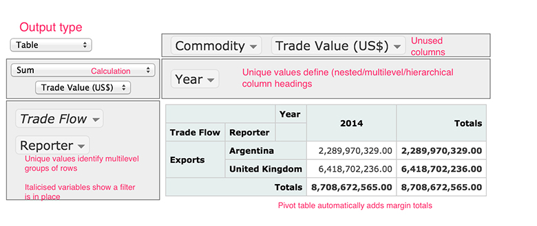

# 2 Pivot tables


One of the most useful, if poorly understood, features offered by many spreadsheet applications is the ‘pivot table’.

Pivot tables provide a way of creating summary reports over particular parts of a dataset, reshaping the data into grouped rows, itemised columns, and summary values within each group and item.

The screenshot of the interactive pivot table shown below, based on a widget originally created by Nicolas Krutchen at Datacritic, contains a small fragment of the Comtrade data describing milk imports to the UK.

The pivot table is organised as follows:





__Figure 7__


You can see how the ‘Trade Flow’ and ‘Reporter’ columns are used to group the data, with each row representing a separate group. In addition, the values in the ‘Year’ column are broken out to create separate columns (although in this example there is only data for one year, and hence one ‘Year’ column, 2014). The function that is applied to the grouped data is a ``sum`` operation, and it is applied to the selected ‘Trade Value (US$)’ column in the original dataset. A marginal total value is calculated by summing across all the columns. The ‘Commodity’ and ‘Trade Value (US$)’ columns, while part of the original dataset, are not directly used to define the pivot table’s structure; that is, they are not used to set the row or column index header labels in the displayed pivot table.

In terms of the split-apply-combine pattern, the pivot table operates as follows:

* the column names from the original dataframe that are listed in the rows panel on the left hand side of the interactive pivot table split the data into a set of groups, with each row specifying a group

* the pivot table’s columns are set according to the unique values associated with the specified columns from the orignal dataframe; these break the data down into yet smaller groups that are associated with each cell.

The selected operator is then applied to each cell level group, the results combined and an appropriately structured output table is displayed.

To create a pivot table report for a dataset, typically three actions will be needed:

* identify what elements will appear as the row index values – that is, how the rows will be grouped. Typically, groups will be created based on the unique values within a single column or a combination of values, one from each of multiple grouping columns.

* identify what elements will appear as column headings. Again, the column heading may just be the unique values of a single variable, or combined values across multiple grouping columns.

* identify what numbers will be reported on. This step may often break down into two smaller steps: to count the number of rows associated with a particular combination of row and column index values, select the count operationto perform an operation on the value of cells in another column, select that column and then identify what operation to apply to it. For example, find the sum or mean values of a numerical quantity associated with rows keyed by the row and column index values, or count the number of unique values of a particular variable in rows identified by those key values.

In addition, one or more ‘filters’ can be added to the selection of row and column index values, either limiting which unique values in each key column to report on, or, by default, selecting them all.

It is often easier to understand how a pivot table is organised by using it interactively. You’ll get a chance to do this in the next exercise.


### Exercise 5 Interactive pivot table


#### Question

If you haven’t already, open the comtrade_pivot.html and save it into the same folder as the Exercise notebook 4. Then either re-run all the notebook cells, or just run the cell that contains the interactive pivot table.

Configuring a pivot table requires paying careful attention to the selection of row (grouping) values, columns (reported values) and summary (aggregating) function.

How easy did you find it to use the interactive pivot table? Could you work out how to select the row and column labels in order to ask particular questions of the data? What sorts of questions did you try to ask?


## 2.1 Pivot tables in pandas


The interactive pivot table provides a convenient way of exploring a relatively small dataset directly within a web browser. (A python package is also available that allows interactive pivot tables to be created directly from a pandas dataframe.)


__Figure 8__


You can also achieve a similar effect using code, one-line-at-a-time. In this step, you will learn how to ask – and answer – questions of a similar form to the ones you raised using the interactive pivot table, but this time using programming code.

There are several reasons why you might want to automate pivot table operations you might previously have done by hand. These include:

* having a record of all the steps used to perform a particular task, or analysis, which can be useful if you need to check or provide evidence about what you have done (transparency)

* being able to repeat the task automatically; this is particularly useful if you need to perform the same task repeatedly – for example, generating a new summary report each time a dataset is updated with new weekly or daily figures

* being able to apply one analysis to another dataset. For example, you might want to produce the same sort of pivot table reports to similarly organised datasets but differently populated datasets (for example, Comtrade datasets that refer to different groups of countries and/or different commodity types).

In order to use the interactive pivot table, you had to identify:

* what column(s) in the dataset to use to define the row groupings in the pivot table

* what column(s) in the dataset to use to define the column groupings in the pivot table

* what column in the dataset to use as the basis for the pivot table summary function

* what summary function to use.

The process is similar when it comes to using pivot tables in pandas. Indeed, you might find it useful to use the interactive pivot table to help you identify just what needs to go where in order to generate a particular report using the pandas pivot table.


---


### Working with pandas pivot tables

Let’s start by creating a sample dataset that includes several different columns that can be grouped around. The code below defines the dataframe column by column, instead of row by row as you have learned before.

``In []:``


```bash


df = DataFrame({"Commodity":["A","A","A","A","B","B","B","C","C"],

"Amount":[10,15,5,20,10,10,5,20,30],
"Partner":["P","P","Q","Q","P","P","Q","P","Q"],
"Flow":["X","Y","X","Y","X","Y","X","X","Y"]})
df
```


``Out[]:``
<table xmlns:str="http://exslt.org/strings">
<caption></caption>
<tbody>
<tr>
<th></th>
<th>Commodity</th>
<th>Partner</th>
<th>Flow</th>
<th>Amount</th>
</tr>
<tr>
<td class="highlight_" rowspan="" colspan="">__0__</td>
<td class="highlight_" rowspan="" colspan="">A</td>
<td class="highlight_" rowspan="" colspan="">P</td>
<td class="highlight_" rowspan="" colspan="">X</td>
<td class="highlight_" rowspan="" colspan="">10</td>
</tr>
<tr>
<td class="highlight_" rowspan="" colspan="">__1__</td>
<td class="highlight_" rowspan="" colspan="">A</td>
<td class="highlight_" rowspan="" colspan="">P</td>
<td class="highlight_" rowspan="" colspan="">Y</td>
<td class="highlight_" rowspan="" colspan="">15</td>
</tr>
<tr>
<td class="highlight_" rowspan="" colspan="">__2__</td>
<td class="highlight_" rowspan="" colspan="">A</td>
<td class="highlight_" rowspan="" colspan="">Q</td>
<td class="highlight_" rowspan="" colspan="">X</td>
<td class="highlight_" rowspan="" colspan="">5</td>
</tr>
<tr>
<td class="highlight_" rowspan="" colspan="">__3__</td>
<td class="highlight_" rowspan="" colspan="">A</td>
<td class="highlight_" rowspan="" colspan="">Q</td>
<td class="highlight_" rowspan="" colspan="">Y</td>
<td class="highlight_" rowspan="" colspan="">20</td>
</tr>
<tr>
<td class="highlight_" rowspan="" colspan="">__4__</td>
<td class="highlight_" rowspan="" colspan="">B</td>
<td class="highlight_" rowspan="" colspan="">P</td>
<td class="highlight_" rowspan="" colspan="">X</td>
<td class="highlight_" rowspan="" colspan="">10</td>
</tr>
<tr>
<td class="highlight_" rowspan="" colspan="">__5__</td>
<td class="highlight_" rowspan="" colspan="">B</td>
<td class="highlight_" rowspan="" colspan="">P</td>
<td class="highlight_" rowspan="" colspan="">Y</td>
<td class="highlight_" rowspan="" colspan="">10</td>
</tr>
<tr>
<td class="highlight_" rowspan="" colspan="">__6__</td>
<td class="highlight_" rowspan="" colspan="">B</td>
<td class="highlight_" rowspan="" colspan="">Q</td>
<td class="highlight_" rowspan="" colspan="">X</td>
<td class="highlight_" rowspan="" colspan="">5</td>
</tr>
<tr>
<td class="highlight_" rowspan="" colspan="">__7__</td>
<td class="highlight_" rowspan="" colspan="">C</td>
<td class="highlight_" rowspan="" colspan="">P</td>
<td class="highlight_" rowspan="" colspan="">X</td>
<td class="highlight_" rowspan="" colspan="">20</td>
</tr>
<tr>
<td class="highlight_" rowspan="" colspan="">__8__</td>
<td class="highlight_" rowspan="" colspan="">C</td>
<td class="highlight_" rowspan="" colspan="">Q</td>
<td class="highlight_" rowspan="" colspan="">Y</td>
<td class="highlight_" rowspan="" colspan="">30</td>
</tr>
</tbody>
</table>

Suppose, for example, that you have data for a particular reporter country, and that you want to find the total value of trade that country has for each commodity and each partner country. A pivot table can be used to split the data by ‘commodity’, and within that ‘partner’, and then apply some sort of aggregation function to each (‘commodity’, ‘partner’) group.

In the interactive pivot table, this would have meant ordering the ‘Commodity’ and ‘Partner’ labels in the rows area, setting the aggregation function to ``sum`` and applying it to the ‘Amount’ (that is, the ‘Trade Value’), and leaving the columns area free of any selections.

In turn, the pandas ``pivot_table()`` function uses:

* the ``index`` parameter set as a list containing the ‘Commodity’ and ‘Reporter’ data elements, to define the row categories

* the ``values`` parameter set to ‘Amount’

* the ``aggfunc`` (aggregating function) set to ``sum`` .

``In []:``


```bash

pivot_table(df,
index=['Commodity','Partner'],
values='Amount',
aggfunc=sum)
```


``Out[]:``
<table xmlns:str="http://exslt.org/strings">
<caption></caption>
<tbody>
<tr>
<th></th>
<th>Flow</th>
<th>X</th>
<th>Y</th>
</tr>
<tr>
<th>Commodity</th>
<th>Partner</th>
<td class="highlight_" rowspan="" colspan=""></td>
<td class="highlight_" rowspan="" colspan=""></td>
</tr>
<tr>
<td class="highlight_" rowspan="" colspan="">__A__</td>
<td class="highlight_" rowspan="" colspan="">P</td>
<td class="highlight_" rowspan="" colspan="">10</td>
<td class="highlight_" rowspan="" colspan="">15</td>
</tr>
<tr>
<td class="highlight_" rowspan="" colspan=""></td>
<td class="highlight_" rowspan="" colspan="">Q</td>
<td class="highlight_" rowspan="" colspan="">5</td>
<td class="highlight_" rowspan="" colspan="">20</td>
</tr>
<tr>
<td class="highlight_" rowspan="" colspan="">__B__</td>
<td class="highlight_" rowspan="" colspan="">P</td>
<td class="highlight_" rowspan="" colspan="">10</td>
<td class="highlight_" rowspan="" colspan="">10</td>
</tr>
<tr>
<td class="highlight_" rowspan="" colspan=""></td>
<td class="highlight_" rowspan="" colspan="">Q</td>
<td class="highlight_" rowspan="" colspan="">5</td>
<td class="highlight_" rowspan="" colspan="">NaN</td>
</tr>
<tr>
<td class="highlight_" rowspan="" colspan="">__C__</td>
<td class="highlight_" rowspan="" colspan="">P</td>
<td class="highlight_" rowspan="" colspan="">20</td>
<td class="highlight_" rowspan="" colspan="">NaN</td>
</tr>
<tr>
<td class="highlight_" rowspan="" colspan=""></td>
<td class="highlight_" rowspan="" colspan="">Q</td>
<td class="highlight_" rowspan="" colspan="">NaN</td>
<td class="highlight_" rowspan="" colspan="">30</td>
</tr>
</tbody>
</table>

To further subdivide the data, an additional ‘Flow’ grouping element could be added in. (In this case, the resulting pivot table just corresponds to the original dataset.)

``In []:``


```bash

pivot_table(df,
               index=['Commodity','Partner','Flow'], 
               values='Amount', 
               aggfunc=sum)
```


``Out[]:``
<table xmlns:str="http://exslt.org/strings">
<caption></caption>
<tbody>
<tr>
<th>Commodity</th>
<th>Partner</th>
<th>Flow</th>
<th></th>
</tr>
<tr>
<td class="highlight_" rowspan="" colspan="">A</td>
<td class="highlight_" rowspan="" colspan="">P</td>
<td class="highlight_" rowspan="" colspan="">X</td>
<td class="highlight_" rowspan="" colspan="">10</td>
</tr>
<tr>
<td class="highlight_" rowspan="" colspan=""></td>
<td class="highlight_" rowspan="" colspan=""></td>
<td class="highlight_" rowspan="" colspan="">Y</td>
<td class="highlight_" rowspan="" colspan="">15</td>
</tr>
<tr>
<td class="highlight_" rowspan="" colspan=""></td>
<td class="highlight_" rowspan="" colspan="">Q</td>
<td class="highlight_" rowspan="" colspan="">X</td>
<td class="highlight_" rowspan="" colspan="">5</td>
</tr>
<tr>
<td class="highlight_" rowspan="" colspan=""></td>
<td class="highlight_" rowspan="" colspan=""></td>
<td class="highlight_" rowspan="" colspan="">Y</td>
<td class="highlight_" rowspan="" colspan="">20</td>
</tr>
<tr>
<td class="highlight_" rowspan="" colspan="">B</td>
<td class="highlight_" rowspan="" colspan="">P</td>
<td class="highlight_" rowspan="" colspan="">X</td>
<td class="highlight_" rowspan="" colspan="">10</td>
</tr>
<tr>
<td class="highlight_" rowspan="" colspan=""></td>
<td class="highlight_" rowspan="" colspan=""></td>
<td class="highlight_" rowspan="" colspan="">Y</td>
<td class="highlight_" rowspan="" colspan="">10</td>
</tr>
<tr>
<td class="highlight_" rowspan="" colspan=""></td>
<td class="highlight_" rowspan="" colspan="">Q</td>
<td class="highlight_" rowspan="" colspan="">X</td>
<td class="highlight_" rowspan="" colspan="">5</td>
</tr>
<tr>
<td class="highlight_" rowspan="" colspan="">C</td>
<td class="highlight_" rowspan="" colspan="">P</td>
<td class="highlight_" rowspan="" colspan="">X</td>
<td class="highlight_" rowspan="" colspan="">20</td>
</tr>
<tr>
<td class="highlight_" rowspan="" colspan=""></td>
<td class="highlight_" rowspan="" colspan="">Q</td>
<td class="highlight_" rowspan="" colspan="">Y</td>
<td class="highlight_" rowspan="" colspan="">30</td>
</tr>
</tbody>
</table>

Alternatively, you might decide that you want to pull out the ‘Flow’ items into separate columns for each of the original (‘commodity’, ‘partner’) groupings. To do this, add in a columns parameter:


```bash

pivot_table(df,
        index=['Commodity','Partner'],
        columns=['Flow'],
        values='Amount',
        aggfunc=sum)
```

<table xmlns:str="http://exslt.org/strings">
<caption></caption>
<tbody>
<tr>
<th></th>
<th>Flow</th>
<th>X</th>
<th>Y</th>
</tr>
<tr>
<th>Commodity</th>
<th>Partner</th>
<th></th>
<th></th>
</tr>
<tr>
<td class="highlight_" rowspan="" colspan="">__A__</td>
<td class="highlight_" rowspan="" colspan="">__P__</td>
<td class="highlight_" rowspan="" colspan="">10</td>
<td class="highlight_" rowspan="" colspan="">15</td>
</tr>
<tr>
<td class="highlight_" rowspan="" colspan=""></td>
<td class="highlight_" rowspan="" colspan="">__Q__</td>
<td class="highlight_" rowspan="" colspan="">5</td>
<td class="highlight_" rowspan="" colspan="">20</td>
</tr>
<tr>
<td class="highlight_" rowspan="" colspan="">__B__</td>
<td class="highlight_" rowspan="" colspan="">__P__</td>
<td class="highlight_" rowspan="" colspan="">10</td>
<td class="highlight_" rowspan="" colspan="">10</td>
</tr>
<tr>
<td class="highlight_" rowspan="" colspan=""></td>
<td class="highlight_" rowspan="" colspan="">__Q__</td>
<td class="highlight_" rowspan="" colspan="">5</td>
<td class="highlight_" rowspan="" colspan="">NaN</td>
</tr>
<tr>
<td class="highlight_" rowspan="" colspan="">__C__</td>
<td class="highlight_" rowspan="" colspan="">__P__</td>
<td class="highlight_" rowspan="" colspan="">20</td>
<td class="highlight_" rowspan="" colspan="">NaN</td>
</tr>
<tr>
<td class="highlight_" rowspan="" colspan=""></td>
<td class="highlight_" rowspan="" colspan="">__Q__</td>
<td class="highlight_" rowspan="" colspan="">NaN</td>
<td class="highlight_" rowspan="" colspan="">30</td>
</tr>
</tbody>
</table>

In this case, some missing values arise for cases where there was no original row item. For example, there were no rows in the original dataset for Commodity/Partner/Flow values of B/Q/Y, C/P/Y or C/Q/X.

The pandas produced pivot table can be further extended to report ‘marginal’ items, that is, row and column based total amounts, by setting ``margins=True.``


```bash

pivot_table(df,
        index=['Commodity','Partner'],
        columns=['Flow'],
        values='Amount',
        aggfunc=sum,
        margins=True) 
```

<table xmlns:str="http://exslt.org/strings">
<caption></caption>
<tbody>
<tr>
<th></th>
<th>Flow</th>
<th>X</th>
<th>Y</th>
<th>All</th>
</tr>
<tr>
<td class="highlight_" rowspan="" colspan="">__Commodity__</td>
<td class="highlight_" rowspan="" colspan="">__Partner__</td>
<td class="highlight_" rowspan="" colspan=""></td>
<td class="highlight_" rowspan="" colspan=""></td>
<td class="highlight_" rowspan="" colspan=""></td>
</tr>
<tr>
<td class="highlight_" rowspan="" colspan="">__A__</td>
<td class="highlight_" rowspan="" colspan="">__P__</td>
<td class="highlight_" rowspan="" colspan="">10</td>
<td class="highlight_" rowspan="" colspan="">15</td>
<td class="highlight_" rowspan="" colspan="">25</td>
</tr>
<tr>
<td class="highlight_" rowspan="" colspan=""></td>
<td class="highlight_" rowspan="" colspan="">__Q__</td>
<td class="highlight_" rowspan="" colspan="">5</td>
<td class="highlight_" rowspan="" colspan="">20</td>
<td class="highlight_" rowspan="" colspan="">25</td>
</tr>
<tr>
<td class="highlight_" rowspan="" colspan="">__B__</td>
<td class="highlight_" rowspan="" colspan="">__P__</td>
<td class="highlight_" rowspan="" colspan="">10</td>
<td class="highlight_" rowspan="" colspan="">10</td>
<td class="highlight_" rowspan="" colspan="">20</td>
</tr>
<tr>
<td class="highlight_" rowspan="" colspan=""></td>
<td class="highlight_" rowspan="" colspan="">__Q__</td>
<td class="highlight_" rowspan="" colspan="">5</td>
<td class="highlight_" rowspan="" colspan="">NaN</td>
<td class="highlight_" rowspan="" colspan="">5</td>
</tr>
<tr>
<td class="highlight_" rowspan="" colspan="">__C__</td>
<td class="highlight_" rowspan="" colspan="">__P__</td>
<td class="highlight_" rowspan="" colspan="">20</td>
<td class="highlight_" rowspan="" colspan="">NaN</td>
<td class="highlight_" rowspan="" colspan="">20</td>
</tr>
<tr>
<td class="highlight_" rowspan="" colspan=""></td>
<td class="highlight_" rowspan="" colspan="">__Q__</td>
<td class="highlight_" rowspan="" colspan="">NaN</td>
<td class="highlight_" rowspan="" colspan="">30</td>
<td class="highlight_" rowspan="" colspan="">30</td>
</tr>
<tr>
<td class="highlight_" rowspan="" colspan="">__All__</td>
<td class="highlight_" rowspan="" colspan=""></td>
<td class="highlight_" rowspan="" colspan="">50</td>
<td class="highlight_" rowspan="" colspan="">75</td>
<td class="highlight_" rowspan="" colspan="">125</td>
</tr>
</tbody>
</table>

In terms of the ‘split-apply-combine’ pattern, the pandas pivot table operates in much the same way as the interactive pivot table:

* the list of original data columns assigned to the index parameter splits the data into a set of groups

* the groups are further split into smaller cell level groupings by optionally setting the columns parameter.

The selected operator is then applied to each group and the results combined in an appropriately structured output display table.


### Exercise 6 pivot tables with pandas


#### Question

Use the Exercise notebook 4 to explore the creation of pivot tables using pandas in Exercise 6.

Did you manage to ask any new questions of your data using the pandas pivot table function? You could try using them in combination with other pandas functions, such as ``filter()`` , to limit the rows you generated the pivot table against. What did the pivot tables tell you about the levels of trade around the trade item and reporter country you selected?

One reason that pivot tables are often thought of as difficult to use is that there is a lot of data manipulation going on inside them. The data is grouped across rows, split across columns and may be aggregated in various ways. It can sometimes be hard to work out how to structure the output report you want, even before worrying about the programming code syntax. Given that, consider what you think the benefits of using code are as opposed to interactive pivot tables. Think about how you could use them to complement each other.


---


## 2.2 Looking at the milk and cream trade


This week’s project looks at the milk and cream trade between the UK and other countries in the first five months of 2015.


__Figure 9__


The written up analysis is in the project notebook. You will also need to open the file comtrade_milk_uk_jan_jul_15.csv and save it to your Anaconda folder or CoCalc project.

The structure is very simple: besides the introduction and the conclusions, there is one section for each research question.

Extend or create your own project next.


## 2.3 Your project


If you have time, extend my project to answer different questions or create your own project.


__Figure 10__


### Activity 1 Extend the project


#### Question


---


Make a copy of the project notebook and change it to answer one or all of the following questions:

* Which are the regular exporters, i.e. which countries sell every month both unprocessed and processed milk and cream to the UK?

* Where could the export market be further developed, i.e. which countries import the least? Do the figures look realistic?

* What is total amount of exports to and imports from the bi-lateral trade countries? Hint: pivot tables can have ‘marginal’ values.

* Repeat the whole analysis for January–May 2014 and compare the results.


---


### Activity 2 Create a project (optional)


#### Question


---


If you have more time, create a completely new project. You could choose completely different commodities, a different reporter (e.g. your country), a different period (e.g. two or more full years), and only a few select partners (e.g. just the ‘World’ partner for a global analysis).


---


