# 3 Chemistry can often be explained by electronic structure

## 3.1 Introduction

Section 2 used some simple examples to illustrate chemical periodicity. But how can we explain such periodicity? The answer lies in the way that the electrons in atoms are arranged about the positively charged nucleus. In chemical reactions, atoms change partners. We know that the outsides of atoms consist of electrons, so contact and connection between atoms is likely to take place through their electrons, and in particular, through the electrons in their outer shells. __So similarities in the arrangement of the outer electrons in the atoms of two different elements lead to similarities in the chemistry of the two elements__. To see the truth of this idea, you must be able to write down the electronic configurations of atoms.

## 3.2 The electronic configurations of atoms

The quantum theory of the atom tells us that we cannot say exactly where an electron in an atom will be at any particular moment; we can speak only of the *probability* of finding an electron at a particular point. So the precise orbits shown in the Rutherford model of <a xmlns:str="http://exslt.org/strings" href="">Figure 1</a> misrepresent the arrangement of electrons about the nucleus. We say instead that the electrons in atoms are arranged around the nucleus in shells. The shells are regions where the probability of finding an electron is relatively high, and where, over an extended period, the electrons spend most of their time. Shells are numbered 1, 2, 3, etc., starting from 1 nearest the nucleus. This number is called the *principal quantum number*, and is given the symbol *n*.

Now these shells of electrons can be divided into sub-shells, and each sub-shell is specified by a second quantum number *l*.
<!--SAQ id=saq011-->

### Question 11

#### Question

<!--Quote id=quo012-->
>How many sub-shells are there in a shell of principal quantum number 4? Assign an *l* value to each sub-shell.

#### Answer

There are four. For a shell of principal quantum number *n, l* can take values from zero up to (*n*−1). Thus, in the shell for which *n* = 4, there are four sub-shells with the values *l = 0, 1, 2* and 3.
<!--ENDSAQ-->
An alternative way of specifying sub-shells uses letters in place of the quantum number *l*. The following letters are used in this notation: s for sub-shells with *l* = 0, p for sub-shells with *l* = 1, d for sub-shells with *l* = 2, f for sub-shells with *l* = 3. Thus, the four sub-shells in the shell for which *n* = 4 are written 4s, 4p, 4d and 4f.

There is an *upper limit* on the number of electrons that each kind of sub-shell can hold. This limit is 2(2*l* + 1), where *l* is the second quantum number of the sub-shell.
<!--SAQ id=saq012-->

### Question 12

#### Question

<!--Quote id=quo013-->
>What is this upper limit for each of the s, p, d and f sub-shells?

#### Answer

The values are: 2[(2 × 0) + 1] = 2; 2[(2 × 1) + 1] = 6; 2[(2 × 2) + 1] = 10; and 2[(2 × 3) + 1] = 14, respectively.
<!--ENDSAQ-->
So in s, p, d and f sub-shells, there can be no more than 2, 6, 10 and 14 electrons, respectively. These limits, and other quantum rules from this Section are summarised in Figure 20.

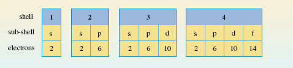

							Figure 20 The sub-shells in the shells of principal quantum numbers 1-4, and the maximum number of electrons that each type of sub-shell can hold

To assign electronic configurations to atoms, you need only one more piece of information. This is an energy-level diagram displaying the order in which the sub-shells are filled. Surprisingly, electronic configurations can be correctly assigned to *nearly all* atoms using just one such diagram, Figure 21.

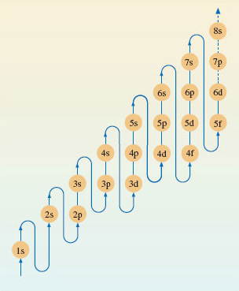

							Figure 21 A pathway showing the order in which the sub-shells should be filled when writing out the electronic configurations of atoms

<!--SAQ id=saq013-->

### Question 13

#### Question

<!--Quote id=quo014-->
>The atomic number of silicon is 14. Write down the electronic configuration of the silicon atom.

#### Answer

1s22s22p63s23p2.
<!--ENDSAQ-->
This is established as follows. Assign the fourteen electrons in the silicon atom to the sub-shells in Figure 21. The 1s and 2s levels on the left can each take two electrons. The next highest level is 2p and this sub-shell is filled by the next six electrons. The 3s sub-shell then takes another two electrons and the thirteenth and fourteenth electrons go into the sub-shell of next highest energy, which is 3p.

Notice that the value of *n* for the outermost shell of the electronic configuration of the silicon atom is three. This outer shell contains four electrons, two of which are in an s sub-shell, and two in a p sub-shell. We say, therefore, that the outer electronic configuration of the silicon atom is of the type s2p2.

## 3.3 Electronic configurations and the Periodic Table

<a xmlns:str="http://exslt.org/strings" href="">Figure 21</a> has been designed for use in a particular *thought experiment*. The purpose of the thought experiment is to see how the electronic configuration of the atoms *changes* as one moves through the Periodic Table from beginning to end. We start with the hydrogen atom, which has one proton and one electron. Then we proceed through a series of stages in each of which we add one new proton to the nucleus, and one new electron to the clutch of surrounding electrons. At each stage, the filling order of <a xmlns:str="http://exslt.org/strings" href="">Figure 21</a> tells us what sub-shells are occupied, and how many electrons those occupied sub-shells contain. In addition, the filling of successive sub-shells in this thought experiment generates the form of the Periodic Table shown in Figure 22, in which the winding arrowed pathway follows the filling order of <a xmlns:str="http://exslt.org/strings" href="">Figure 21</a>. The different blocks of elements span regions in which particular types of sub-shells are being filled up. With the typical elements, the sub-shell type is either s or p; in the case of the transition elements, with rows of ten, it is d; for the lanthanides and actinides, with rows of fourteen, it is f. Indeed, because of this connection, one can think of Figure 22 as a demonstration of how the filling order of <a xmlns:str="http://exslt.org/strings" href="">Figure 21</a> can be deduced from the form of the Periodic Table.

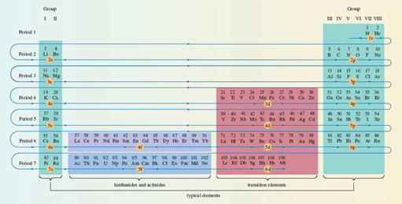

Figure 22 The winding pathway shows how the order of sub-shell filling (Figure 21) generates the full Periodic Table. Elements in the same column *usually* have similar outer electronic configurations. Hydrogen has been juxtaposed with helium to indicate the filling of the 1s sub-shell

Click to view larger version of Figure 22

[View document](https://www.open.edu/openlearn/ocw/mod/resource/view.php?id=26799)

---

3.3.1 Writing out electronic configurations
In Section 3.2, we described <a xmlns:str="http://exslt.org/strings" href="">Figure 21</a> as an *energy-level* diagram, which represented the build-up of electronic configurations as electrons were inserted into sub-shells of progressively increasing energy. However, Figure 21 has been designed for just one purpose: to generate the correct electronic configurations in our thought experiment in which, to quote Niels Bohr, 'the neutral atom is built up by the capture and binding of electrons to the nucleus, one by one'. What Figure 21 tells us, at any stage of the thought experiment, is which of the *still unfilled* sub-shells has the lowest energy. That sub-shell then receives the next electron.

<a xmlns:str="http://exslt.org/strings" href="">Figure 21</a> is therefore designed to give the order of energies only for those sub-shells that, at any stage of the thought experiment, are candidates for the reception of the next electron. It does not necessarily give the correct order of energies for *all* of the sub-shells in any *one particular atom*. Consider lead, atomic number 82.
<!--SAQ id=saq014-->

### Question 14

#### Question

<!--Quote id=quo015-->
>Use Figure 21 to write out the electronic configuration of the lead atom.

#### Answer

1s22s22p63s23p64s23d104p65s24d105p66s24f145d106p2.
<!--ENDSAQ-->
In the lead atom, the occupied sub-shells of highest energy are 6s2 and 6p2. The four electrons in these sub-shells are the ones that most influence the chemistry of lead. They are the outermost electrons, and the most easily removed, being furthest from the nucleus. But the sub-shell sequence from Figure 21 does not give this impression. Although 6p2 appears at the end, suggesting that these are outermost electrons, 6s2 does not. A more correct order of energies *in any particular atom* is obtained by grouping the sub-shells first in order of increasing value of *n*, and then, within each *n* value, in the order s, p, d and f.
<!--SAQ id=saq015-->

### Question 15

#### Question

<!--Quote id=quo016-->
>Do this for the configuration of the lead atom.

#### Answer

1s2|2s22p6|3s23p63d10|4s24p64d104f14|5s25p65d10|6s26p2. For clarification, the individual shells have been separated by vertical lines.
<!--ENDSAQ-->
The electronic configurations of the atoms within this course have been written in this style. One of its merits is that the outer electrons with the highest principal quantum numbers appear at the right-hand end. In this case, they show that the outer electronic configuration of lead is of the type s2p2. This is less apparent in the earlier configuration that was derived directly from <a xmlns:str="http://exslt.org/strings" href="">Figure 21</a>.

## 3.4 Outer electronic configurations and the Periodic Table

The essential message of <a xmlns:str="http://exslt.org/strings" href="">Figure 22</a> is that the Groups of elements that appear in columns of the Periodic Table usually have atoms with similar outer electronic configurations. Figure 23 incorporates these configurations into our mini-Periodic Table of typical elements; they appear at the top of each Group. They imply that the typical elements have outer electronic configurations either of the type ns**x**, where **x** = 1 or 2, or of the type ns2np**x**, where *x* runs from 1 to 6. For any particular element, *n* is the principal quantum number of the outer occupied shell. This can easily be found from Figure 23, because it is equal to the number of the Period in which the element is to be found. The outer electrons are simply those in occupied sub-shells with this principal quantum number.

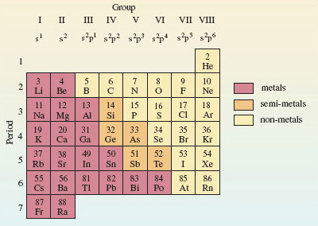

							Figure 23 A mini-Periodic Table for the typical elements up to radium. Along the top are the Group numbers in roman numerals, and the outer electronic configurations of the elements of each Group. As in Figure 18, hydrogen has been omitted

<!--SAQ id=saq016-->

### Question 16

#### Question

<!--Quote id=quo017-->
>According to Figure 23, what are the principal quantum numbers of the outer occupied shells for the atoms of silicon and lead?

#### Answer

Three and six, respectively: silicon appears in Period 3 and lead in Period 6.
<!--ENDSAQ-->
According to Figure 23 therefore, silicon and lead have outer electronic configurations of the type ns2np2, with *n* = 3 for silicon and *n* = 6 for lead. This is just what you got when you worked out the full electronic configuration of the silicon and lead atoms in <a xmlns:str="http://exslt.org/strings" href="">Sections 3.2</a> and <a xmlns:str="http://exslt.org/strings" href="">3.3.1</a>, respectively.
<!--SAQ id=saq017-->

### Question 17

#### Question

<!--Quote id=quo018-->
>According to Figure 23, what is the relationship between the Group number for silicon and lead, and the outer electronic configurations of their atoms?

#### Answer

In both cases, the Group number is four and there are four outer electrons: two s electrons and two p electrons.
<!--ENDSAQ-->
Here is confirmation of the explanation of chemical periodicity mentioned at the beginning of <a xmlns:str="http://exslt.org/strings" href="">Section 3</a>. Elements in the same Group of the Periodic Table behave similarly because they usually have similar outer electronic configurations. It also demonstrates that, for the typical elements, the total number of outer electrons is equal to the Group number. It is to preserve this generalisation that, in this course, we take the Group number of the noble gases to be VIII rather than zero. Apart from helium (1s2), they have eight outer electrons (s2p6).

Finally, notice that Figures 17 and 22 imply that the atoms of highest known atomic number (113-118) at the outer limit of the Periodic Table are expected to be typical elements. This is only one of the reasons that makes them of special interest (see Box 2 *The island of stability*).

### Box 2: The island of stability

The elements of highest atomic number are made through the collision of atoms and ions of lighter elements in particle accelerators. Success does not come easily, because the atoms that are formed are highly radioactive and very short lived. However, theory suggests that somewhere above atomic number 110 there is an 'island of stability', where the atoms will have longer lifetimes. This island is marked by favourable combinations of neutrons and protons, with its summit centred around an atom of atomic number 114 and mass number 298. So far [2007], the elements of highest atomic number for which isotopes have been identified are 114, 116 and 118. These may therefore supply evidence for the existence of the island.

In 1999, scientists at Dubna in Russia made the first atoms of element 114, to which we shall give the provisional name auditorium (Ad)! Ions of the isotope

   were accelerated to 30 000 km h−1, and directed on to a target containing the plutonium isotope   . Two nuclei fused, three neutrons were ejected, and an atom of the 289 isotope of element 114 was produced:

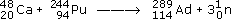

The half-life of    proved to be 30 seconds. It underwent α-decay to the 285 isotope of element 112, whose half-life is 15.4 minutes. These half-lives may seem short, but you must go back to element 103 to find known isotopes which are as long lived.

							Figure 24 shows the half-lives of the known isotopes of elements 112-118.    and the two other isotopes of element 114 support the emergence of an island of stability, but we are still a long way (9 neutrons) from the predicted summit at 184 neutrons. There is a reason for this. The proportion of neutrons in the most stable isotope of an element increases with atomic number. So the lighter isotopes such as    and   , from which the new heavy elements are made, lack the neutrons needed to produce the *most stable* isotope of the heavier element that they create.

This is simultaneously encouraging and discouraging. It means that the expected summit of the island of stability will be hard to reach. But if we do get there, we may find very stable elements. It may even be possible to study their chemistry. 

In the most recent piece of research [2007], collaboration between Californian and Russian scientists is believed to have produced the 294 isotope of element 118 (176 neutrons). This has a half-life of about one millisecond and decays to the 290 isotope of element 116 which has a half-life of 10 milliseconds.

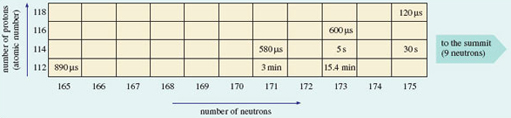

								Figure 24 As the number of neutrons in known isotopes of each of the elements 112-118 increases above 165, the half-lives increase (even-numbered elements only shown). This indicates the emergence of an island of stability whose summit is predicted to be at 114 protons and 184 neutrons. (1 μs = 10−6 s; 1 min = 1 minute)

## 3.5 Electron states and box diagrams

So far, we have represented the electronic state of an atom as a collection of sub-shells. Now we turn to the states of the electrons within those sub-shells. Just as shells can be broken down into sub-shells, so sub-shells can be broken down into __atomic orbitals__. Each atomic orbital describes an allowed spatial distribution about the nucleus for an electron in the sub-shell. Here we shall only be concerned with their number.

Consider the formula for the sub-shell electron capacities, which is 2(2*l* + 1), *l* being the second quantum number. The factor (2*l* + 1) tells us the number of atomic orbitals in the sub-shell.
<!--SAQ id=saq018-->

### Question 18

#### Question

<!--Quote id=quo019-->
>How many atomic orbitals are there in an s sub-shell, and how many in a p sub-shell?

#### Answer

One and three, respectively; for s and p sub-shells, *l* = 0 and 1, so (2*l* + 1) = 1 and 3, respectively.
<!--ENDSAQ-->
It turns out that each orbital in a sub-shell can contain up to two electrons. This is connected to a property of the electron called __spin__. This spin occurs in one of two senses, which are physically pictured as clockwise and anticlockwise (Figure 25).

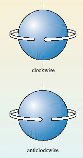

							Figure 25 The two senses of electron spin.

When an atomic orbital contains its maximum complement of two electrons, those two electrons must always have spins of opposite sense. This phenomenon of electron spin accounts for the '2' that precedes the bracket in the formula for sub-shell capacities, 2(2*l* + 1). For example, as we have seen, the factor (*l* + 1) tells us that there are three atomic orbitals in a p sub-shell. Each of the three orbitals can accommodate up to two electrons with opposed spins. So a p sub-shell can contain a maximum of 2 × 3 or 6 electrons.

A full atomic orbital, therefore, contains two electrons with spins of opposite sense. This is represented by writing one electron as an upward-pointing half-headed arrow, and the other as a downward-pointing half-headed arrow. For example, the helium atom has the electronic configuration 1s2. The 1s sub-shell contains just one orbital, which can be represented by a single box containing the two electrons of opposite spin:

 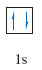 

Two such electrons with opposed spins are said to be *paired* and the diagram that puts these electrons into boxes is referred to as a __box diagram__. Now consider the case of nitrogen, whose atom has the configuration 1s22s22p3. The 1s and 2s sub-shells contain one orbital each, and the 2p sub-shell contains three. The box diagram that must be filled therefore takes the form:

 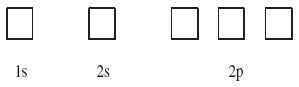 
<!--SAQ id=saq019-->

### Question 19

#### Question

<!--Quote id=quo020-->
>Assign the two 1s and two 2s electrons of nitrogen to boxes in this diagram.

#### Answer

The 1s and 2s boxes should now both look like the 1s box for the helium atom above: they should each contain two electrons with opposed spins.
<!--ENDSAQ-->
The final step is the assignment of the three 2p electrons to the three 2p boxes. There are several possibilities, but the one we want is the __ground-state__ arrangement, the state of lowest energy. There is a simple rule, called __Hund's rule__, that tells us what this is:

<!--Quote id=quo021-->
>Within any sub-shell, there will be the maximum number of electrons with spins of the same sense.

Because electrons in the same box must have opposed spins, we must put the electrons, as far as possible, in different boxes with spins of the same sense, or, as it is usually termed, with __parallel spins__. In this case there are three 2p electrons and three boxes, so each box can take one electron with the same spin, and this is the preferred arrangement according to Hund's rule. The final result for the nitrogen atom is therefore:

 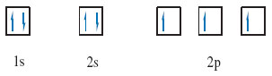 
<!--SAQ id=saq019a-->

### Question 19a

#### Question

The oxygen atom, with the configuration 1s22s22p4, has one more electron than the nitrogen atom. Draw the box diagram for the oxygen atom.

#### Answer

As there are four 2p electrons and only three 2p boxes, the fourth 2p electron cannot have a spin parallel to the other three. It must go into a box that is already occupied by one electron with opposite spin:

 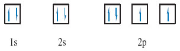 
<!--ENDSAQ-->

## 3.6 Summary of Section 3

1. 
The electronic configuration of an atom can be obtained by allocating its electrons to s, p, d and f sub-shells in the order given by <a xmlns:str="http://exslt.org/strings" href="">Figure 21</a>. This procedure generates a periodicity in electronic configuration which matches that of the Periodic Table.

2. 
The typical elements have outer electronic configurations of the type ns*x*, where *x* = 1 or 2, or of the type ns2npx, where *x* runs from 1 to 6, and *n*, the principal quantum number, is equal to the number of the Period.

3. 
In <a xmlns:str="http://exslt.org/strings" href="">Figure 23</a>, the Group numbers are equal to the number of outer electrons, except in the case of helium.

4. 
The ground (electronic) state of an atom can be represented by a box diagram in which each sub-shell of the electronic configuration is broken down into atomic orbitals. Each orbital is portrayed as a box that can accommodate up to two electrons with opposite spins. In incomplete sub-shells, the electrons are assigned to the boxes so as to maximise the number of parallel spins (Hund's rule).

### Question 6

#### Question

Use <a xmlns:str="http://exslt.org/strings" href="">Figure 23</a> to identify the elements whose outer electronic configurations are (a) 3s23p5; (b) 4s24p3; (c) 6s26p1.

#### Answer

The elements are: (a) chlorine, Cl; (b) arsenic, As; and (c) thallium, Tl. The outer electronic configurations contain seven, five and three electrons, respectively, and are therefore characteristic of Groups VII, V and III, respectively. The principal quantum numbers of the outer electrons are three, four and six, respectively, and are equal to the Period numbers. These Group and Period numbers identify the elements when Figure 23 is used as a grid.

### Question 7

#### Question

Write down the electronic configurations of (a) the calcium atom (atomic number 20); (b) the bromine atom (atomic number 35); and (c) the tin atom (atomic number 50). Make sure you order the sub-shells according to their principal atomic number.

#### Answer

(a) 1s2|2s22p6|3s23p6|4s2;

(b) 1s2|2s22p6|3s23p63d10|4s24p5;

(c) 1s2|2s22p6|3s23p63d10|4s24p64d10|5s25p2.

With atomic numbers 20, 35 and 50, the calcium, bromine and tin atoms will contain 20, 35 and 50 electrons, respectively. Putting 20, 35 and 50 electrons into the sub-shells in the order given in <a xmlns:str="http://exslt.org/strings" href="">Figure 21</a> yields:

(a) 1s22s22p63s23p64s2;

(b) 1s22s22p63s23p64s23d104p5;

(c) 1s22s22p63s23p64s23d104p65s24d105p2.

Our answers are obtained from these sequences by regrouping the sub-shells in cases (b) and (c) so that they are arranged in order of increasing *n* value.

### Question 8

#### Question

Substance A is both a typical element and a metal. It forms two normal oxides, A2O3 and A2O5, and two fluorides AF3 and AF5. Identify A, and state its outer electronic configuration.

#### Answer

A is bismuth, Bi, and its outer electronic configuration is 6s26p3. The existence of the compounds A2O5 and AF5 suggests that the highest valency of A is five. This implies a Group V element. According to <a xmlns:str="http://exslt.org/strings" href="">Figure 23</a>, the only Group V element that is a metal is bismuth. As it lies in the Period 6, the outer electronic configuration of the atom is 6s26p3.

### Question 9

#### Question

Represent the electronic ground state of the chlorine atom by a box diagram.

#### Answer

There are 17 electrons in the chlorine atom and, from <a xmlns:str="http://exslt.org/strings" href="">Figure 21</a>, the electronic configuration is 1s22s22p63s23p5. Turning this into a box diagram, the 1s and 2s boxes are each filled with a pair of electrons with opposite spins. The three orbitals in the 2p sub-shell and the single 3s orbital each take pairs of opposite spins in a similar way. This leaves five electrons for the three orbitals of the 3p sub-shell. We start by assigning one electron to each of the three orbitals, making sure that all three have the same spin. This maximises the number of electrons with the same spin. The final two electrons must then go into different 3p boxes with spins opposed to the other three.

 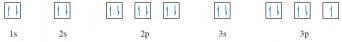 

