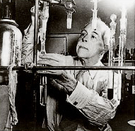
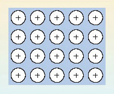
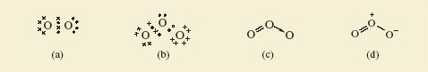

# 4 Chemical bonds consist of shared pairs of electrons

## 4.1 Introduction

Simple theories of chemical bonding are based on the idea of the electron-pair bond, and the extent to which the electron pair is shared between the bound atoms. There is also an assumption that the electronic structures of noble gas atoms are especially stable, and that many elements try to attain these structures when they react to form chemical compounds. These ideas were the brainchild of the American chemist, G. N. Lewis (Box 3). In developing them, we shall simplify the electronic configurations of atoms by writing *shell structures* that merely show the electron content of successive shells. Shell structures for atoms of elements 2-20 are shown in Figure 27.

### Box 3: G.N. Lewis

Until he was 14, Gilbert Newton Lewis (1875-1946; Figure 26) was educated at home in Nebraska by his parents. It is remarkable that he did not win a Nobel Prize, because, as J. W. Linnett, sometime Professor of Physical Chemistry at Cambridge said, his idea of the electron-pair bond is 'the most productive and important contribution that has ever been made to the subject of valency and chemical binding'. In 1912, he became Chairman of a rather lacklustre chemistry department at the University of Berkeley in California. He set about reorganising and revitalising the department, appointing staff with a broad chemical knowledge rather than specalists. Under his direction, it quickly acquired the world reputation that it still enjoys today. During the First World War, he trained gas warfare specialists and was made a Lieutenant-Colonel. A love of cigars may have contributed to his death from heart failure while doing an experiment.

							Figure 26 G.N. Lewis

						Figure 27 A part Periodic Table showing shell structures for atoms of elements 2-20

## 4.2 Ionic and covalent bonding

We begin by applying simple bonding theories to molecular chlorine gas (Cl2) and non-molecular sodium chloride (NaCl), whose structures were discussed in <a xmlns:str="http://exslt.org/strings" href="">Section 1</a>. Figure 28 shows the result.

							Figure 28 Lewis structures for (a) gaseous Cl2 and (b) solid NaCl. Chlorine has seven outer electrons, but can acquire an additional electron to give eight, and the shell structure of argon, if an electron pair is shared between the two atoms in Cl2. Sodium has one outer electron, so sodium can acquire a neon shell, and chlorine an argon shell structure if this electron is transferred to a chlorine atom. This generates the Na + and Cl− ions in sodium chloride

						Figure 28a shows the __Lewis structure__ of the Cl2 molecule. Note that the electrons are grouped in pairs. This reflects the pairing of electrons in atomic orbitals noted in <a xmlns:str="http://exslt.org/strings" href="">Section 3.5</a>. The ions in sodium chloride have also been represented in this way in Figure 28b. The chloride ion has the shell structure of argon, with eight outer electrons, and the electron transferred from the sodium atom is marked by a small filled circle. In both structures, the formation of a chemical bond involves the production of a new electron pair in the outer shell of chlorine. However, in Cl2, because the two atoms are identical, the electron pair must be equally shared between the two atoms; in NaCl by contrast, it resides on the resulting chloride ion.

From this contrast flows the difference in properties between the two substances. The transference of the electron to chlorine in NaCl produces ions, each of which can exist independently of any one partner. So in sodium chloride, each ion is surrounded by as many ions of opposite charge as space allows. In this case the number is six, as you saw in <a xmlns:str="http://exslt.org/strings" href="">Figure 10</a>. Figure 29 is Figure 10 adjusted to show the presence of ions. Because of the strong attractive forces existing between the closely packed ions of opposite charge, the sodium chloride structure is not easily broken down: it has a high melting temperature and does not dissolve in organic solvents like the liquid hydrocarbons found in petrol, or dry-cleaning fluid. When it does melt, or dissolve in water, the ions separate and the resulting ionic fluid conducts electricity. Compounds of this type are called *ionic*, and the type of bonding is called *ionic bonding*.

							Figure 29 An ionic picture of solid sodium chloride which explains important properties of the substance. The solid is regarded as an assembly of Na +  and Cl− ions

By contrast, in Cl2, the electron pair is shared. This is called *covalent bonding*. Here, the bonding can be maintained only if the atoms stay together in pairs, so it gives rise to a molecular substance: elemental chlorine consists of discrete Cl2 molecules with only weak forces acting between them. It is a gas at room temperature, and dissolves easily in liquid hydrocarbons, including petrol. However, because a solution of chlorine contains no ions, it does not conduct electricity.
<!--SAQ id=saq020-->

### Question 20

#### Question

<!--Quote id=quo022-->
>According to this picture, ionic and covalent bonding are the same process carried to different extents; what is the process, and how do the extents differ?

#### Answer

The common process is the formation of an electron-pair bond; in covalent bonding the electron pair is shared between the atoms involved; in ionic bonding it resides on just one of them.
<!--ENDSAQ-->
This link between ionic and covalent bonding is clarified by the concept of *electronegativity*. The electronegativity of an element is a measure of the power of its atom to attract electrons to itself *when forming chemical bonds*. In the Cl2 molecule, the two identical atoms have an equal appetite for electrons: their electronegativities are equal, so the electron pair is shared equally between them. Now consider sodium chloride.
<!--SAQ id=saq021-->

### Question 21

#### Question

<!--Quote id=quo023-->
>Which atom is the more electronegative, sodium or chlorine?

#### Answer

In sodium chloride, the electron pair has been completely taken over by chlorine, which forms a chloride ion. Imagine the sodium and chlorine atoms competing for electrons; the chlorine atoms win, so chlorine is the more electronegative.
<!--ENDSAQ-->
So chlorine, near the end of Period 3, has a greater electronegativity than sodium, at the beginning. This contrast applies generally: the electronegativities of atoms increase across a Period of the Periodic Table; electronegativities also usually increase up a Group from the bottom to the top. These trends are explained in Figure 30. 

							Figure 30 Across a Period of the Periodic Table, the atomic number, or positive charge on the nucleus, increases. This increases the attraction of the outer electrons to the nucleus, so the electronegativity of the elements also increases. The principal quantum number of the outer electrons decreases from the bottom to the top of a Group. This means that they get closer to the positively charged nucleus. The result is, again, that the outer electrons are attracted more strongly, and the electronegativity usually increases. The three most electronegative elements are shown on a green background

						Figure 30 shows that the most electronegative elements lie towards the top right-hand corner of the Periodic Table. Electronegativities refer to an attraction for outer electrons when an element is forming compounds. The noble gases have been omitted from Figure 30 because at normal temperatures helium, neon and argon form no compounds; hence electronegativities are not assigned to them. Consequently, fluorine is the most electronegative element, followed by oxygen and chlorine.

						Figure 30 confirms that chlorine is much more electronegative than sodium. Because of this large difference in electronegativity, the electron pair    of <a xmlns:str="http://exslt.org/strings" href="">Figure 28b</a> spends all its time on chlorine, the charges on sodium and chlorine are +1 and −1, respectively, and NaCl is ionic. So the electronegativity trends in Figure 30 explain why ionic compounds arise when a metallic element of low electronegativity from the left of the Periodic Table combines with a non-metallic element of high electronegativity from the right. In Cl2, by contrast, the electronegativity difference between the bound elements is zero; the shared electrons spend equal times on each chlorine atom, both chlorines are uncharged, the substance is molecular, and is held together by covalent bonding. Covalently bound molecular substances such as Cl2, I2 and CO2 (<a xmlns:str="http://exslt.org/strings" href="">Section 1.4</a>) are combinations from the right of Figure 30, because, although for these elements the individual electronegativities are large, the electronegativity *differences* between them are small.

These two cases deal with combinations of elements with very different electronegativities from the left and right of Figure 30 (ionic bonding), and with combinations of elements of high but similar electronegativity from the right (covalent bonding). But what is the result of combining elements of low but similar electronegativity from the left? The reasoning that we have pursued until now suggests that, in this case, electronegativity differences between atoms will be small, so again we would expect shared electron-pair bonds and covalent substances, possibly of the molecular type typified by Cl2.
<!--SAQ id=saq022-->

### Question 22

#### Question

<!--Quote id=quo024-->
>Is this correct? Answer by considering what happens when sodium atoms become bound together at room temperature.

#### Answer

It is incorrect; at room temperature, sodium atoms do not yield Na2 molecules. Instead, they form a non-molecular metal.
<!--ENDSAQ-->
So let us look more closely at the bonding in metals.

## 4.3 Metallic bonding

Two familiar properties of metals point to a simple model of metallic bonding. Firstly, metals have a strong tendency to form positive ions. Thus, when sodium reacts with water, and when magnesium and aluminium react with acids, hydrogen gas is evolved and the ions Na+(aq), Mg2+(aq) and Al3+(aq), respectively, are formed. Secondly, metals are good conductors of electricity: when a voltage difference is applied across two points on a piece of metal, there is a movement of electrons between the two points, and an electric current flows.

						Figure 31 exploits these two observations to produce a model of the bonding in a metal like sodium. The sodium sites in the metallic crystal are assumed to be occupied by Na+ ions with the shell structure of neon. The Na+ ions are formed by removing the single outer electrons from each sodium atom. The electrons so removed are no longer tied to individual sodium sites, and are allowed to move freely throughout the entire volume of the metallic substance. These free electrons, sometimes described as an '__electron gas__', are responsible for a metal's ability to conduct electricity. At the same time, they occupy the space between the positive sodium ions, so their negative charge acts like a binding glue pulling the sodium sites together.

							Figure 31 In the electron gas model of metallic bonding for metals and alloys, an array of positive ions is steeped in a pool of negatively charged free electrons (indicated by the background blue tone). The electrons pull the positive ions together

So electron-sharing has taken place as predicted at the end of <a xmlns:str="http://exslt.org/strings" href="">Section 4.2</a>, but in a different way: because all the atoms have low electronegativities, they are prepared to surrender electrons to other atoms, either by electron transfer or electron-pair sharing. However, the low electronegativities mean that none of the atoms present will readily *take on* these electrons, either by forming a negative ion, or by accepting a share in electron-pair bonds. Consequently, a pool of free electrons is created which is like hot money: they are passed quickly from hand to hand, and can find no permanent home! This is the situation pictured in Figure 31. So far in this Section, we have only considered cases where all the combining atoms are the same, and a metallic *element* is the result. However, such metallic substances can be formed from two or more elements, and they are then called __alloys__.

## 4.4 A classification of chemical substances

We now have a provisional but useful classification of chemical substances. First they are divided into molecular and non-molecular types, largely on the basis of their structures. Then a further division is made according to the major source of the chemical bonding holding their atoms together. In molecular substances, the bonding is covalent, but in the non-molecular class, it may be covalent, ionic or metallic. This classification is shown in Figure 32. For a recent and interesting example of a substance changing categories within this classification, see Box 4.

								Figure 32 A classification of chemical substances using, first, structure, and then bond type, as criteria

### Box 4: Turning dry ice into sand

As Mendeléev emphasised, the highest valencies of the elements are the clearest *chemical* sign of periodicity. At first glance, the highest oxides of carbon and silicon are quite different. CO2 is a gas, which freezes to a molecular solid at −79 °C; SiO2 is a non-molecular solid melting at over 1 500 °C. But despite these differences, both are *di*oxides. In both compounds, carbon and silicon exercise a valency of four, and this is why Mendeléev put both elements in the same Group.

Even the differences are not unalterable. In solid carbon dioxide (<a xmlns:str="http://exslt.org/strings" href="">Figure 7</a>), the distances between molecules are relatively large. The quartz structure of SiO2 (<a xmlns:str="http://exslt.org/strings" href="">Figure 11</a>) is non-molecular, with identical short distances between neighbouring atoms. It is therefore more compact. When pressure is applied to a solid, it encourages a change into more compact forms. So at high pressures, solid CO2 might shift to a silica-like structure. Raising the temperature should also help by speeding up any change.

In 1999, scientists at the Lawrence Livermore laboratory in California subjected solid carbon dioxide to 400 kilobars pressure. This is 400 times the pressure at the bottom of the Mariana Trench, the deepest point in the world's oceans. At these pressures, the CO2 stayed solid even when the temperature was raised to 2000 °C. The Livermore scientists then used the following technique: they determined the Raman spectrum of the solid, a type of *vibrational spectrum*. It showed (Figure 33) that under these conditions the carbon dioxide had assumed a silica-like structure. Dry ice had taken on the structure of sand!

								Figure 33 (a) At normal pressures, solid carbon dioxide is molecular, and its vibrational spectrum shows no peaks in the frequency range 2 × 1013 - 4 × 1013 Hz. (b) After heating at a pressure of 400 kilobars, a peak appears at 2.37 × 1013 Hz. This is characteristic of the vibrations of two carbon atoms bound to, and equidistant from, an oxygen atom. It suggests that solid CO2 has assumed a silica-like form

## 4.5 More about covalent bonding

So far, the valencies in <a xmlns:str="http://exslt.org/strings" href="">Table 1</a> have just been numbers that we use to predict the formulae of compounds. But in the case of covalent substances they can tell us more. In particular, they can tell us how the atoms are linked together in the molecule. This information is obtained from a two-dimensional drawing of the __structural formula__ of the molecule. (Note that structural formulae cannot be assumed to carry any implications about molecular shape.) Consider, for example, the molecules H2, Cl2, NCl3 and CH4. Their structural formulae are shown here as Structures __5.1-5.4__. They can be drawn correctly by ensuring that the number of lines or bonds emerging from any atom is equal to its valency. Thus, in Structure __5.3__, three bonds emerge from the nitrogen atom and one from each chlorine atom. The single lines of Structures __5.1-5.4__ represent single bonds, but bonds may also be double or triple.

  

### Question 10

#### Question

Check that you are comfortable with the bonding ideas discussed above by using the valencies of <a xmlns:str="http://exslt.org/strings" href="">Table 1</a> to draw structural formulae for the following molecular substances: hydrogen chloride (HCl), ammonia (NH3), water (H2O), oxygen (O2), carbon dioxide (CO2), ethene (C2H4), hydrogen cyanide (HCN), ethyne (C2H2) and ethanal (CH3CHO).

#### Answer

Structures __Q.1-Q.9__ show the structural formulae. In each case, the number of lines issuing from each atom is equal to the element's quoted valency in <a xmlns:str="http://exslt.org/strings" href="">Table 1</a>.

  

---

4.5.1 Lewis structures
G.N. Lewis used the shared electron-pair bond to re-express structural formulae in an electronic form. Examples appeared in <a xmlns:str="http://exslt.org/strings" href="">Figure 28</a>, where the sharing leads to Lewis structures in which each atom has the shell structure of a noble gas.
<!--SAQ id=saq023-->

### Question 23

#### Question

<!--Quote id=quo025-->
>Use the shell structures of <a xmlns:str="http://exslt.org/strings" href="">Figure 27</a> to write down Lewis structures for (a) NH3; (b) H2O; (c) CO2; (d) HCN.

#### Answer

See Structures __5.5-5.8;__ single, double and triple bonds are represented by one, two and three shared pairs of electrons, respectively. Hydrogen attains the shell structure of helium, with 2 outer electrons; carbon, nitrogen and oxygen attain that of neon, with 8 outer electrons.

  
<!--ENDSAQ-->
Note that the electron pairs in these Lewis structures are of two types. The pairs shared between atoms represent chemical bonds and are called __bond pairs__. But there are also pairs that remain on just one atom and are unshared. These are called __non-bonded electron pairs__ or __lone pairs__.
<!--SAQ id=saq024-->

### Question 24

#### Question

<!--Quote id=quo026-->
>How many bond pairs and non-bonded electron pairs are there in (a) the ammonia molecule; (b) the water molecule?

#### Answer

NH3 contains three bond pairs and one non-bonded pair. In H2O there are two of each.
<!--ENDSAQ-->
So far, we have only written Lewis structures for neutral molecules, but they can also be drawn for ions, such as the hydroxide ion, HO− and the ammonium ion, NH4+. However, to take the charges into account we must begin by adding or subtracting electrons from particular atoms. To create a systematic procedure, we shall apply this process of addition or subtraction at the atom of highest valency. In HO−, this is the oxygen atom; in NH4+, it is the nitrogen atom. As the hydroxide ion carries a single negative charge, we add one electron to the shell structure of the oxygen atom which is (2,6). This gives (2,7).
<!--SAQ id=saq025-->

### Question 25

#### Question

<!--Quote id=quo027-->
>What shell structure does a corresponding adjustment to the nitrogen atom in NH4+ generate?

#### Answer

(2,4); the single positive charge on the ammonium ion requires the removal of one electron from the nitrogen atom shell structure, which is (2,5)
<!--ENDSAQ-->
By allowing the ions O− and N+ to form single bonds to hydrogen atoms, we can generate Lewis structures for OH− (Structure __5.9__) and NH4+ (Structure __5.10__) in which each atom has a noble gas electronic structure:

  

---

4.5.2 Noble gas configurations under stress
It is remarkable how many molecules and ions of the typical elements can be represented by Lewis structures in which each atom has a noble gas shell structure. Nevertheless, many exceptions exist. According to the periodic trends summarised in <a xmlns:str="http://exslt.org/strings" href="">Section 2</a>, the highest fluorides of boron and phosphorus are BF3 and PF5. However, phosphorus, in accordance with <a xmlns:str="http://exslt.org/strings" href="">Table 1</a>, also forms the lower fluoride PF3. All three compounds are colourless gases at room temperature and contain the molecules BF3, PF3 and PF5. As the valency of fluorine is one (Table 1), each bond in these molecules is a shared electron pair, and we may write the Lewis structures as follows:

  
<!--SAQ id=saq026-->

### Question 26

#### Question

<!--Quote id=quo028-->
>In how many of these Lewis structures do all the atoms have noble gas shell structures?

#### Answer

In only one, namely that of PF3; in Structure __5.11__, the three shared electron pairs around the boron atom are two electrons short of the shell structure of neon, and in Structure __5.13__, the five electron pairs around the phosphorus atom give us two electrons more than the shell structure of argon.
<!--ENDSAQ-->
You will meet more exceptions of this sort in <a xmlns:str="http://exslt.org/strings" href="">Section 6</a>. Here, we merely note their existence, and observe that they are a consequence of our assumption that a chemical bond consists of *two* electrons shared between *two* atoms.

---

4.5.3 Dative bonds
So far, the bonds in our Lewis structures have been shared electron pairs made by taking one electron from each of the two bound atoms. But this need not necessarily be the case. In Sections 4.5.1 and 4.5.2, we encountered the colourless gases NH3 and BF3. When these gases are mixed, a solid compound H3NBF3 is formed as a dense white smoke. The chemical equation for the process is:

<!--Quote id=eqn000_01-->
>NH3(g) + BF3(g) = H3NBF3(s)                    (5.1)

<!--Quote id=quo_e01-->
>(The notation used in chemical equations is discussed in Box 5.)

### Box 5: Chemical equations and state symbols

Equation 5.1 is balanced. In this course, the two sides of balanced equations like this are connected by an equals sign, symbolising the equality in the numbers of the different types of atom on each side. Unless otherwise stated, such equations should be understood as having a direction: they proceed from reactants on the left to products on the right. This is also true of the commonly used alternative to the equals sign-an arrow pointing from left to right. In this course, such arrows are reserved for different sorts of chemical equation (see, for example, the introduction to <a xmlns:str="http://exslt.org/strings" href="">Section 5</a>).

Equation 5.1 also has bracketed state symbols after each of the chemical formulae. The four most common such symbols are (s), (l), (g) and (aq), representing solid, liquid, gas and aqueous ion, respectively.

How are we to understand Reaction 5.1? In Section 4.5.1, we saw that the Lewis structure of ammonia (Structure __5.5__) provided each atom with a noble gas shell structure, one non-bonded pair being allocated to nitrogen. In Section 4.5.2 we saw that the Lewis structure of boron trifluoride (Structure __5.11__) left the boron atom two electrons short of a noble gas configuration. If we create an electron-pair bond by allowing the non-bonded electron pair on nitrogen in the ammonia molecule to be shared between the nitrogen and boron atoms, we can write a Lewis structure (Structure __5.14__) in which all atoms, including boron, have a noble gas shell structure. (Note that, in order to focus attention on the bonding electrons, the non-bonded electron pairs on the fluorine atoms have been omitted from Structure __5.14__.)

  

A bond in which the electron pair is provided by just one of the bonded atoms is called a __dative bond__. We need to differentiate such bonds from the more familiar bonds in which *each* bound atom contributes an electron to the electron pair. To do this, we write the dative bonds as arrows running from the 'donor' atom (in this case nitrogen) to the 'receptor' atom (in this case boron). Then Equation 5.1 becomes:

Another puzzle solved by the use of dative bonds is the electronic structure of carbon monoxide, CO. If we write the compound C=O, then we get Lewis structure __5.15__, in which oxygen, with two non-bonded pairs, has an octet, but carbon is two electrons short of this noble gas state. Suppose, however, that, in addition, a dative bond is formed by allowing one of the oxygen non-bonded pairs to become shared between oxygen and carbon.

  

  

Dative bonds are also useful when writing Lewis structures for oxoions such as carbonate, CO32−. We begin in the usual way (<a xmlns:str="http://exslt.org/strings" href="">Section 4.5.1</a>) by adding the overall charge to the central atom with highest valency, namely carbon. This means adding two electrons to carbon, which gives the shell structure (2,6). Formation of one C=O double bond and two C→O dative bonds then gives Lewis structure __5.18__, which is equivalent to structural formula __5.19__.

  

Before leaving dative bonds, we shall introduce an alternative way of writing them that proves especially useful in organic chemistry. Suppose that atom A forms a dative bond with atom B by donating a non-bonded electron pair to it:

<!--Quote id=eqn005_003-->
>A __:__ + B = A __:__ B                    (5.3)

So far, we have written the dative bond as A→B. But consider atom A before the bond is formed. If we remove one of its lone pair electrons, and put that electron on atom B, we end up with the separate ions [A•] +  and [B•]−. Suppose we now form a conventional shared electron-pair bond from the odd electrons on the two ions. The electrons are shared between the A and B sites in just the way that they are on the right-hand side of Equation 5.3, but the bond would now be written as   .

Thus, A→B and    are equivalent ways of writing the dative bond between A and B, and both are equally valid. The structures H3N→BF3 and C  O can therefore also be written as H3  −  F3 and   .
<!--SAQ id=saq028-->

### Question 28

#### Question

<!--Quote id=quo030-->
>Transform Structure __5.19__ for the carbonate ion into this new dative bond representation.

#### Answer

See Structure __5.20__; each C→O bond is replaced by   −  , and as the carbon atom forms two dative bonds, a charge of +2 must be added to the double negative charge on carbon in Structure __5.19__. This gives zero charge on carbon in the new version, but as there is now a single negative charge on each of the two singly bonded oxygens, the total charge on the ion is −2 as before.

  
<!--ENDSAQ-->

---

4.5.4 Resonance structures
Gaseous oxygen occurs as O2 molecules. But ultraviolet light or an electric discharge converts some of the oxygen to ozone (Box 6). This has the molecular formula O3.

### Box 6: Ozone is blue

Many people know that gaseous ozone in the stratosphere protects us from harmful solar radiation, and that at low altitude it is a source of photochemical smog. But few know that the gas is blue. In the laboratory, ozone is made by exposing O2 gas to an electric discharge. This yields oxygen containing only 10-15% ozone, and the colour of ozone is then almost imperceptible. But if the gas is passed through a vessel immersed in liquid O2, it condenses to a liquid mixture of O2 and ozone; this is cornflower blue. If the liquid is kept cold, a vacuum pump will suck the more volatile O2 out of it, and the liquid soon separates into two layers. The upper layer is deep blue, and is a 30% solution of ozone in liquid O2. The lower layer is 30% O2 in liquid ozone, and has a dark violet colour.

Continued pumping on the lower layer eventually leaves pure liquid ozone, with a deep indigo colour and a boiling temperature of −112 °C (Figure 34). Evaporation normally leads to a violent explosion caused by the decomposition reaction:

<!--Quote id=eqn005_04-->
>2O3(g) = 3O2(g)                    (5.4)

However, clean procedures that exclude dust and organic matter allow slow uninterrupted evaporation. The product is a deep blue gas, which is almost 100% ozone.

__Figure 34:__ The very dark indigo colour of liquid ozone viewed through a cooling bath and the glass of a surrounding vacuum flask

A Lewis structure for the O2 molecule is shown in Figure 35a. For ozone too, a Lewis structure can be written which gives each atom a noble gas shell structure (Figure 35b); Figures 35c and 35d give the corresponding structural formulae with alternative representations of the dative bond.

__Figure 35: (a)__ Lewis structure for O2, each oxygen having the shell structure of neon; (b) Lewis structure for ozone, O3; (c) and (d) show structural formulae for ozone containing alternative representations of the dative bond

<!--SAQ id=saq029-->

### Question 29

#### Question

<!--Quote id=quo031-->
>Do Figures 35c and d suggest that the lengths of the two bonds in the ozone molecule should be equal or unequal?

#### Answer

Unequal; one is a double bond and the other a single dative bond. We would expect this difference to influence their lengths.
<!--ENDSAQ-->
But experimental measurement shows that both bonds have the same length (127.8 pm). To account for this, we note that the structures shown in Figures 35c and d have companions in which the double and single bonds have simply been exchanged. Figure 36, for example, shows Figure 35d and its partner. The real structure of the molecule with its equal bond lengths is a sort of average of the two. In situations like this, where a molecule is not adequately represented by a single Lewis structure and seems like a composite of two or more, the competing structures are written down and linked by a double-headed arrow, as shown in Figure 36.

The two structures are called __resonance structures__, and the real structure of ozone is said to be a __resonance hybrid__ of the two. The significance of the representations in Figure 36 is that in ozone, each bond is a mixture of one-half of a double bond and one-half of a single dative bond. Note that Figure 36 is not meant to imply that the molecule is constantly changing from one resonance structure to the other. It is a hybrid in the same sense that a mule is a hybrid: it does not oscillate between a horse and a donkey.

								Figure 36:The two resonance structures of ozone. The equality of the bond lengths in the real ozone molecule suggests that its actual structure is an average, or superposition of the two

To clarify this, we turn to benzene, C6H6. Like ozone, it can be represented as a resonance hybrid of two resonance structures in which all atoms have noble gas configurations (Figure 37).

Figure 37 The two resonance structures of benzene

A typical C—C single bond length in an alkane hydrocarbon such as ethane, C2H6 (Structure __5.21__), is 154 pm; in contrast, a typical C—C bond length in an alkene hydrocarbon such as ethene, C2H4 (Structure __5.22__), is 134 pm. The *individual* resonance structures in Figure 37 therefore suggest that the carbon-carbon bond lengths in benzene should alternate between about 134 pm and 154 pm around the ring.

  
<!--SAQ id=saq030-->

### Question 30

#### Question

<!--Quote id=quo032-->
>But what does the *whole* of Figure 37 suggest?

#### Answer

The real structure of benzene is a hybrid of the individual structures, and each carbon-carbon bond will be a mixture of one-half single and one-half double bonds; all carbon-carbon bond lengths should be equal and lie *between* 134 and 154 pm.
<!--ENDSAQ-->
This is precisely the case: all carbon—carbon bond lengths in benzene are 140 pm!

Number the carbon—carbon bonds in a benzene ring of Figure 37 clockwise from 1-6. All bonds contain at least one pair of electrons. However, in one of the resonance structures, bonds 1, 3 and 5 are double bonds, each containing a second electron pair; in the other resonance structure, the double bonds and extra pair of electrons are found at bonds 2, 4 and 6. The implication of Figure 37 is that in the resonance hybrid these three extra pairs of electrons are not confined to, or *localised* within, just half of the bonds in the ring. Instead, they are __delocalised__ around the ring and equally shared within all six bonds. Although, in this course, we shall draw benzene and its derivatives as a single resonance hybrid (Structure __5.23__), remember that this delocalization makes the bond lengths in the ring equal, contrary to the implications of Structure __5.23__.

  

We conclude with a resonance hybrid which is an ion. Structure __5.20__ suggests unequal bond lengths in the carbonate ion. In fact, X-ray crystallography of carbonates suggests that all three bond lengths are equal, at about 129 pm; standard values for C—O and C=O bond lengths are around 143 pm and 120 pm, respectively. Three resonance structures, all equivalent to Structure __5.20__ contribute to a resonance hybrid that accounts for the bond length (Figure 38).

								Figure 38 The three resonance structures for the carbonate ion. They suggest that all three bonds should be of equal length

## 4.6 Summary of Section 4

1. 
The chemical formulae of many substances can be understood by arguing that their atoms attain noble gas structures by chemical combination.

2. 
In ionic compounds, this is achieved by the transfer of electrons from one atom to another; in molecular substances, it happens through the sharing of electron pairs in covalent bonds. But in both cases, bonds between atoms consist of shared pairs of electrons. In covalent compounds the sharing is fairly equitable; in ionic compounds it is much less so.

3. 
In metals, the sharing takes a different form. An 'electron gas' is created by removing electrons from the atoms of the metallic elements. The result is an array of ions steeped in a pool of free electrons. The negatively charged electron gas occupies the space between the ions and pulls them together.

4. 
Atoms with high but similar electronegativities from the right of <a xmlns:str="http://exslt.org/strings" href="">Figure 30</a> combine to form covalent substances; those with low but similar electronegativities from the left of Figure 30 yield metallic substances. The combination of atoms of low and high electronegativity from the left and right of Figure 30 produces ionic compounds.

5. 
Chemical substances can now be classified, first structurally as either molecular or non-molecular, and second by bond type as ionic, covalent or metallic.

6. 
In Lewis structures, each covalent bond is represented by a shared electron pair. Double bonds, as in CO2, require two shared pairs; a triple bond, as in HCN, requires three. These allocations often leave some atoms with non-bonded electron pairs.

7. 
In many cases, this operation provides each atom with a noble gas shell structure, especially if we introduce dative bonds in which both electrons are contributed by one atom. But in some cases, such as PF5, it does not.

8. 
Sometimes the bond lengths in a chemical substance are such that the substance cannot be represented by a single Lewis structure or structural formula. It is better described as a resonance hybrid-an average or superposition of two or more structural formulae called 'resonance structures'.

### Question 11

#### Question

Consider the compounds IBr, CaCl2 and CaMg2. One is ionic, one is covalent, and one is metallic. Identify which is which, and match each compound to one of the descriptions below. In each case, suggest whether the compound is molecular or non-molecular.

* 
(i) White solid that melts at 782 °C. It is a poor conductor of electricity in the solid state, but a good one when melted or dissolved in water.

* 
(ii) Brown-black solid that melts at 41 °C to give a liquid with low electrical conductivity.

* 
(iii) Silvery-looking solid that melts at 720 °C. Whether solid or molten, it is an excellent conductor of electricity.

#### Answer

(i) CaCl2; (ii) IBr; (iii) CaMg2.

The properties listed are characteristic of (i) an ionic substance, (ii) a molecular covalent substance, and (iii) a metallic substance. CaCl2 is a combination of elements from the extreme left and extreme right of <a xmlns:str="http://exslt.org/strings" href="">Figure 30</a>, so the electronegativity difference will be large and CaCl2 will be the ionic compound; such compounds are non-molecular. IBr will be covalent because it is a combination of elements of high electronegativity from the extreme right of Figure 30. CaMg2 will be a metallic alloy because it is a combination of metallic elements with low electronegativity from the left of Figure 30. Such alloys are non-molecular.

### Question 12

#### Question

Write single Lewis structures, and the corresponding structural formulae, for the following molecules or ions: (a) hypochlorous acid, HOCl; (b) sulfur hexafluoride, SF6; (c) nitrosyl chloride, ONCl; (d) the amide ion, NH2−. In each case, state the number of bonding electron pairs and non-bonded pairs on the atom of highest valency. In which of the four Lewis structures do some atoms not have a noble gas shell structure?

#### Answer

* 
(a) For hypochlorous acid, see Structures __Q.10__ and __Q.11__. The oxygen has two non-bonded pairs and two bonding pairs.

  

* 
(b) For SF6, see Structures __Q.12__ and __Q.13__. The sulfur atom has six bonding pairs and no non-bonded pairs.

  

* 
(c) For ONCl, see Structures __Q.14__ and __Q.15__. The nitrogen has one non-bonded pair and three bonding pairs.

  

* 
(d) For NH2−, the amide ion, see Structures __Q.16__ and __Q.17__ . The nitrogen has two bonding pairs and two non-bonded pairs.

  

All the atoms in Lewis structures __Q.10, Q.12, Q.14__ and __Q16__ have noble gas shell structures, except for sulfur in SF6, which is assigned twelve outer electrons.

### Question 13

#### Question

In the nitrate ion, NO3−, the nitrogen atom is central and surrounded by three oxygens. Draw a single Lewis structure for this ion which gives each atom a noble gas shell structure. Also draw two structural formulae for this Lewis structure, each containing a different representation of any dative bonds.

#### Answer

The Lewis structure of NO3− is shown as Structure __Q.18__. The atom of highest valency is nitrogen, so the single negative charge on the NO3− ion is assigned to nitrogen, giving the shell structure (2,6). All atoms gain the shell structure of neon if nitrogen forms one double bond and two single dative bonds to oxygen. Structure __Q.19__ shows the two dative bonds as arrows. In the alternative representation, one of the two positive charges at the nitrogen end of the two dative bonds is cancelled by the single negative charge of the central nitrogen. This gives Structure __Q.20__.

  

### Question 14

#### Question

For the Al2Br6 molecule (<a xmlns:str="http://exslt.org/strings" href="">Figure 8</a>), write a single Lewis structure that contains dative bonds and gives each atom a noble gas structure (the bromine atom, like chlorine, has seven electrons in its outer shell). Use the two different representations of the dative bond to draw two structural formulae for the Lewis structure. Experiments on this molecule show that all bond lengths in the Al—Br—Al bridges are identical. Which of your two structural formulae best fits this observation?

#### Answer

See Structures __Q.21-Q.23__.

  

In the Lewis structure __Q.21__, each bridging bromine atom forms one shared electron pair bond with one aluminium and one dative bond to the other aluminium. All atoms gain a noble gas shell structure with eight outer electrons. Structural formula __Q.22__ shows the dative bonds as arrows, and suggests that the two bonds formed by each bridging bromine are different. The alternative __Q.23__ makes these two bonds identical. It is therefore a better representation of the experimental data. Nevertheless, although the single formula __Q.22__ is not compatible with the equal Al—Br bond lengths, this way of representing the dative bonds can be made consistent with them by using the two resonance hybrids shown in Structure __Q.24__.

  

### Question 15

#### Question

In the nitrate ion, NO3−, all three nitrogen-oxygen bonds are of equal length. Is either of the structural formulae in your answer to Question 12 consistent with this observation? If not, how do you explain the discrepancy?

#### Answer

In the answer to Question 12, both Structure __Q.19__ and Structure __Q.20__ contain one double bond and two single dative bonds. Neither is therefore consistent with three equal bond lengths. To explain the discrepancy we represent the nitrate ion as the resonance hybrid shown as Structure __Q.25__.

  

