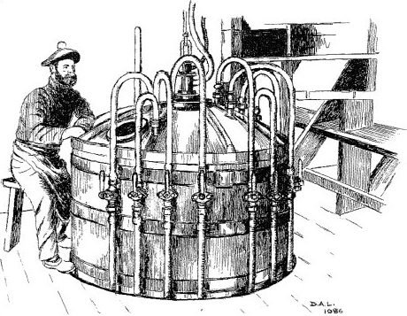

# 5 Molecular reactivity

## 5.1 Molecular reactivity is concentrated at key sites

Reactivity is not spread evenly over a molecule; it tends to be concentrated at particular sites. The consequences of this idea are apparent in the chemistry of many elements. However, in organic chemistry, the idea has proved so valuable that it receives specific recognition through the concept of the __functional group__. Structure __6.1__ shows the abbreviated structural formula of hexan-1-ol, an alcohol.

<!--Quote id=ueqn000_001-->
>__CH3—CH2—CH2—CH2—CH2CH2—OH__                               (__6.1__)

<!--SAQ id=saq031-->

### Question 31

#### Question

<!--Quote id=quo033-->
>Identify the functional group in this molecule.

#### Answer

It is the fragment —OH, which is known as the *alcohol* functional group.
<!--ENDSAQ-->
Because reactivity is concentrated at the —OH site, we can, through an informed choice of other chemical reactants, change that site (and sometimes the atoms immediately adjacent to it) into something else *while leaving the rest of the molecule unchanged*. For example, the liquid thionyl chloride, SOCl2, will convert hexan-1-ol into 1-chlorohexane:

(Note that in the formulae in this equation we have omitted all the bonds apart from the ones connecting the functional groups to the rest of the molecule; these are known as *condensed structural formulae.*) In this reaction the —OH group has been replaced by —Cl. An example of a change in both the functional group and its adjacent atoms is the reaction of hexan-1-ol with chromic acid, H2CrO4, which yields hexanoic acid:

Here, the terminal —CH2OH fragment has been converted into the carboxylic acid functional group, —COOH. (Note that an arrow has been used in Equation 6.2. An equals sign - see Box 5 - would be inappropriate because the equation is not balanced. This type of equation allows us to concentrate attention on the way in which one molecular fragment, —CH2OH, is transformed into another, —COOH. Organic chemists often write equations of this sort, the reagent that brings about the change appearing above the arrow.)

We can divide organic molecules into three parts: the functional groups, their immediate environment, and the rest of the molecule. To a first approximation, we expect a functional group and its immediate environment to respond to a reactant in exactly the same way whatever the rest of the molecule is like. Thus, if we write the many molecules containing an alcohol functional group as R—OH, the general form of Reaction 6.1 becomes

Likewise, if we write the many molecules that terminate in the unit —CH2OH as R—CH2OH, then the general form of Reaction 6.2 becomes:

In principle therefore, Reactions 6.3 and 6.4 allow us to predict the response of many very different molecules to thionyl chloride and chromic acid.

To a first approximation, the behaviour of organic functional groups is therefore unaffected by the larger environment of the molecules in which those groups are set. A good example is the reaction of some alcohols with nitric acid, HNO3 (or HONO2), to give nitrate esters:

Thus, hexan-1-ol (Structure __6.1__) yields hexyl nitrate, CH3CH2CH2CH2CH2CH2—O—NO2.

 Two organic molecules that contain more than one alcohol functional group are glycerol (Reaction 6.6), made by heating natural fats or oils with sodium hydroxide, and pentaerythritol (Reaction 6.7). Reactions 6.6 and 6.7 show how a mixture of concentrated nitric and sulfuric acid replaces all of the —OH groups with —O—NO2 groups, leaving the rest of the molecules unchanged.

Finally, we consider cotton, whose fibres consist of the polymer cellulose. A typical fibre has the formula [C6H7O2(OH)3]n, where *n* varies, but may be as large as 2 000. Each C6H7O2(OH)3 unit contains three —OH groups, and at the left of Figure 39 two of the units are shown linked together. Figure 39 also shows that despite this polymeric situation, all of the —OH groups can still be replaced by —O—NO2 groups through a reaction with mixed nitric and sulfuric acids.

The products of Reactions 6.6, 6.7 and Figure 39 are called nitroglycerine, pentaerythritol tetranitrate (PETN) and nitrocellulose, respectively. They are three important high explosives.

What makes functional groups such as —OH so much more reactive than the carbon-hydrogen skeleton to which they are attached?  Look again at Structure __6.1__ (hexan-1-ol).

						Figure 39 Cotton is nearly pure cellulose, which is Nature's most common polymer. It is composed of glucose molecules linked through bridging oxygen atoms - a glycosidic linkage (highlighted in red). To the left of the reaction arrow two units are so joined. The six-membered rings are composed of five carbon atoms and one oxygen atom, but here the carbon atom labels have been omitted. Notice the terminal bonds through which the extended chains of the cotton fibre are formed. Replacement of the —OH groups by nitrate groups using a mixture of concentrated nitric and sulfuric acids gives nitrocellulose, a high explosive

<!--SAQ id=saq032-->

### Question 32

#### Question

<!--Quote id=quo034-->
>Which of the 21 atoms in the molecule have non-bonded electron pairs?

#### Answer

Only one; the oxygen atom of the functional group has two non-bonded electron pairs.
<!--ENDSAQ-->
Chemical reactions often occur in steps; in each step, groups of atoms attach themselves to the molecule, undergo change, and then depart. Attractive points of attachment in a molecule will therefore make a reaction more likely.
<!--SAQ id=saq033-->

### Question 33

#### Question

<!--Quote id=quo035-->
>Why are non-bonded electron pairs possible points of attachment?

#### Answer

In <a xmlns:str="http://exslt.org/strings" href="">Section 4.5.3</a>, you saw that they allow formation of dative bonds.
<!--ENDSAQ-->
Such bonds cannot be formed by carbon and hydrogen atoms in hexan-1-ol, because all their outer electrons are used to form strong C—H and C—C bonds. This, then, is one reason why the —OH functional group in __6.1__ is the most probable site for a reaction.

Another arises from the fact that functional groups often introduce electronegativity differences into an organic system. For example, the oxygen atom is very electronegative (<a xmlns:str="http://exslt.org/strings" href="">Figure 30</a>). Thus, in the C—O—H sequence of bonds in any alcohol, the oxygen atom attracts electrons from the adjacent carbon and hydrogen atoms (carbon and hydrogen have similar electronegativities). The oxygen atom of an alcohol therefore carries a fractional negative charge, and the carbon and hydrogen atoms carry fractional positive charges. Any one of the three atoms then becomes a possible point of attachment for the atom of a reagent that carries a fractional charge of opposite sign.

Finally, we remind you of a reservation that we made about functional groups: the idea that their reactions are unaffected by the rest of the molecule is only an approximation. We illustrate the point with another powerful explosive. In phenol, on the left of Reaction 6.8, an —OH group is attached to the benzene ring of Structure __5.23__. Through Reactions 6.5-6.7 and <a xmlns:str="http://exslt.org/strings" href="">Figure 39</a>, we know that the combination HNO3/H2SO4 usually converts an —OH group to a nitrate, —ONO2, group. But Reaction 6.8 is an exception. The —OH group is untouched, and hydrogen atoms at three points on the benzene ring are replaced by the nitro group, —NO2. The product is a yellow crystalline solid known as 2,4,6-trinitrophenol or picric acid, whose explosive power exceeds that of TNT (see Box 7). Our expectations about the nitration of —OH functional groups were worked up from cases where the hydrocarbon skeleton is __saturated__; that is, all carbon valencies in the skeleton are used to form *single* bonds to either hydrogen or other carbon atoms. Evidently, the benzene ring, which is not saturated, enhances the reactivity of the hydrogen atoms attached to it, and simultaneously diminishes that of the attached —OH group. The behaviour of a functional group can therefore be affected by its immediate environment. 

### Box 7: High explosives and propellants

High explosives generate shock waves moving with a velocity of 7 000-9 000 ms−1. Their commercial production began in 1863 when Immanuel Nobel and his son Alfred began manufacturing nitroglycerine at Helenborg near Stockholm (Figure 40). Nitroglycerine is a yellow oil prone to accidental explosion, and in 1864, the factory blew up, killing Alfred Nobel's brother Emil. Nevertheless, nitroglycerine proved invaluable in nineteenth-century mining engineering projects which required extensive blasting. It was used, for example, to make a way for the Central Pacific railway over the Sierra Nevada, and thus enabled the United States to create the first transcontinental railroad (Figure 41). The availability of so dangerous a material in frontier conditions caused many accidents. There are tales of nitroglycerine being mistakenly used in spirit lamps and as a lubricant, things which, as Nobel's biographer laconically remarks, 'were seldom done more than once by the same person'.

							Figure 40 Alfred Nobel (1833-1896) made his fortune through the manufacture of high explosives. In his will, the bulk of his estate was used to fund in perpetuity from 1901 the five Nobel Prizes (for Chemistry, Literature, Peace, Physics, and Physiology or Medicine; a sixth Nobel Prize for Economics was added in 1968), which are awarded annually by Swedish or Norwegian organizations. Nobel appears here at the controls of the equipment that he invented for the manufacture of nitroglycerine. The dangerous nature of the work is revealed by the one-legged stool on which he sits. It protects the operator from the mortal dangers of falling asleep on the job!

							Figure 41 The creation of the first transcontinental railroad: the Central Pacific, working from the West (left), and the Union Pacific from the East (right) meet at Promontory Point, Utah, where, on 10 May 1869, the 'wedding of the rails' was established with a golden spike driven home with a silver sledgehammer. The Central Pacific outbuilt their rivals by using immigrant Chinese labour and nitroglycerine for blasting

Subsequently, Alfred developed the safer dynamites, first by absorbing nitroglycerine with the clay, kieselguhr (guhr dynamite), and then by mixing it with nitrocellulose to form a gel (gelatin dynamite). A mixture of nitrocellulose and nitroglycerine called cordite was the propellant that launched shells from the guns of Royal Navy battleships in both World Wars.

  

When the hydrocarbons in petrol burn, they acquire the necessary oxygen from the air. High explosives carry their own oxygen, usually in the form of —NO2 groups, which are bound either to oxygen in nitrate esters, or to nitrogen as in RDX (<a xmlns:str="http://exslt.org/strings" href="">Figure 9b</a>), or to carbon as in TNT (Structure __6.2__). In a typical explosion, this oxygen converts the carbon-hydrogen skeleton to steam and oxides of carbon, leaving nitrogen as N2 molecules. The heat liberated raises the temperature of the products to about 4000 °C. Thus, for PETN (Reaction 6.7):

<!--Quote id=eqn006_009-->
>C(CH2ONO2)4(s) = 2CO(g) + 3CO2(g) + 4H2O(g) + 2N2(g)                (6.9)

During the First World War, the principal high explosive used for bursting charges was TNT, supplemented by other substances such as picric acid and ammonium nitrate. In the Second World War, this role was assumed by RDX, supplemented by TNT and PETN. Currently, the chief military explosive is RDX. Semtex, the explosive favoured by terrorists, takes various forms; it usually consists of crystals of RDX embedded in a rubber-like matrix made from a polymer such as polystyrene, or from a wax.

## 5.2 Summary of Section 5

1. 
The structural formulae of organic molecules can be divided into the carbon-hydrogen framework or skeleton, and the functional group(s). In the first approximation, the functional groups are the sites where reaction occurs, the framework remaining unreactive.

2. 
This approximation works best when the framework consists of saturated carbon atoms.

### Question 16

#### Question

The compound ethene glycol (ethane-1,2-diol), HO—CH2—CH2−OH, is used as antifreeze in car engine coolants. Identify any functional groups in this molecule. Explain how you might make a powerful explosive from ethene glycol, and write down its structural formula.

#### Answer

The ethene glycol molecule contains two alcohol functional groups, —OH. These should both be replaceable by ONO2 groups when ethene glycol is treated with a mixture of concentrated nitric and sulfuric acids. The expected product has the structural formula __Q.26__. These expectations are correct. The product is a colourless liquid, ethene glycol dinitrate (EGDN), and it is indeed a powerful explosive.

  

