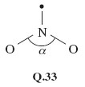

# 6 Molecular shape affects molecular reactivity

## 6.1 Introduction

Structural formulae of, for example, hexan-1-ol (Structure __6.1__) and PF5 (Structure __5.13__) merely tell us the immediate neighbours of any particular atom. They are two-dimensional drawings, which ignore the three-dimensional shapes of the molecules. But in studying the structures obtained by X-ray crystallography in <a xmlns:str="http://exslt.org/strings" href="">Section 1</a>, we recognised that the atoms in a substance have a definite three-dimensional arrangement in space. In other words, molecules have a definite shape and size. Those shapes and sizes are often a key to the understanding of chemical reactions.

Let us start with methane, CH4, and bromomethane, CH3Br. In both molecules, the carbon atoms form four single bonds. It turns out that the four bonds are directed towards the corners of a tetrahedron. The resulting molecular shapes are shown in Figure 42 as ball-and-stick representations.

						Figure 42 The structures of (a) methane, CH4; (b) bromomethane, CH3Br

We now take bromomethane (Figure 42b) and successively replace each hydrogen atom by a methyl group, CH3, to give the molecules CH3CH2Br, (CH3)2CHBr and (CH3)3CBr. Ball-and-stick representations of each of these molecules are shown at the top of Figure 43. At each carbon atom, there are four bonds directed towards the corners of a tetrahedron, and the complexity of the molecular shape therefore increases from left to right, as the number of carbon atoms increases from one to four.

						Figure 43 The molecules (a) bromomethane, CH3Br; (b) bromoethane, CH3CH2Br; (c) 2-bromopropane, (CH3)2CHBr; (d) 2-bromo-2-methylpropane, (CH3)3CBr, shown in both ball-and-stick (top) and space-filling representations (bottom). Also shown are the relative rates of reaction of the four compounds when they are treated with lithium iodide in acetone (propanone) solution

Ball-and-stick representations are a natural three-dimensional development of structural formulae, and they show the disposition of the atoms in space. But by emphasising the bonds, they fail to reveal the subtleties of the molecular shape created by the different sizes of atoms. In this respect, space-filling models are better. These appear at the bottom of Figure 43. In each case, the viewing direction is the same as the ball-and-stick model above. 

Now we shall look at a reaction of these four molecules, all of which contain the same functional group.
<!--SAQ id=saq034-->

### Question 34

#### Question

<!--Quote id=quo036-->
>Identify this functional group.

#### Answer

It is the bromo group, —Br.
<!--ENDSAQ-->
  

So the molecules are of the general type, RBr, where R is the framework to which the functional group is attached. When such bromo compounds are treated with a solution of lithium iodide in 
the solvent propanone (acetone, Structure __7.1__), they often undergo a reaction in which the bromo group is replaced by an iodo group:

<!--Quote id=eqn007_001-->
>RBr + I− = RI + Br−              (7.1)

What happens in this reaction at the molecular level? As Figure 43 shows, the reactant R—Br contains a carbon-bromine bond, C—Br. Bromine is more electronegative than carbon, so the carbon atom in this bond carries a partial positive charge, written δ+, and the bromine atom a partial negative charge, written δ− (Structure __7.2__). The negatively charged iodide ion will then tend to approach, and become attached to, the positive carbon. As a carbon-iodine bond is formed, the carbon-bromine bond breaks and a bromide ion is ejected. The reaction is therefore a good illustration of an important point made at the end of Section 5: electronegativity differences often contribute to the reactivity of functional groups.

  

What is interesting, however, is that in this case, the four bromo compounds respond at very different speeds; <a xmlns:str="http://exslt.org/strings" href="">Figure 43</a> contains their relative rates of reaction with iodide. They decrease from left to right. For example, CH3Br reacts 221 000 times as quickly as (CH3)2CHBr, and the reaction of (CH3 )3CBr is so slow that it appears not to take place at all.

The space-filling molecules explain this. The reaction is one in which an iodide ion must approach and become attached to the carbon atom that is bound to the bromine atom. There is most room for such an approach on the side of the carbon atom that is opposite to the bulky bromine atom - in other words, according to the direction of view depicted in Figure 43. Now look at the space-filling models at the bottom of Figure 43.
<!--SAQ id=saq035-->

### Question 35

#### Question

<!--Quote id=quo037-->
>Why do you think the reaction with iodide should be easier for CH3Br than for (CH3)3CBr?

#### Answer

In CH3Br, the carbon atom is very exposed to the incoming iodide. But if hydrogen atoms are replaced by the more bulky methyl groups, this exposure diminishes, until at (CH3)3CBr the carbon atom attached to bromine lies at the bottom of a small cavity created by the three surrounding methyl groups. The iodide cannot reach this carbon atom, so no reaction occurs.
<!--ENDSAQ-->
The effect that an organic group produces by virtue of its bulk is described as __steric__. Our chosen example is a crude one, but it illustrates an important idea. Whether the reaction occurs or not depends on the ease with which the iodide ion can gain access to the crucial site on the surface of the molecule. Such ideas can be applied to enzymes. Enzymes are protein molecules that facilitate vital biological reactions. They can do this because their molecular surfaces contain *active sites* to which the molecules participating in the reaction (known as *substrates*) can become temporarily bound. The active sites are crevices in the enzyme surface, often of a complicated shape. The substrate has the precise shape required to fit the crevice, but potential competitors that lack this shape are excluded (Figure 44). The need for the substrate to bind to the enzyme surface will often weaken other bonds within the substrate itself, encouraging the changes that the enzyme facilitates. So molecular shape has a fundamental role in the chemistry of life. Let us take a more careful look at it.

						Figure 44 A model for enzyme action: only one of the three molecules has the shape required to fit the cavity on the enzyme surface; the other two are excluded

## 6.2 The shapes of some molecules

Here we shall look at the shapes of some simple molecules of the typical elements. In doing so, we shall meet the problem of representing three-dimensional shapes on two-dimensional paper. Let's use methane, CH4, as an example. A ball-and-stick representation of this tetrahedral molecule is shown in Figure 45. To draw such structures in this course, we shall often make use of the '__flying-wedge notation__'. A flying-wedge representation of the methane molecule of Figure 45 is shown in Figure 46. The atom at the pointed or thin end of the wedge is assumed to be in the plane of the paper, and the atom at the thick end is in front of the plane. The connection between this wedge and the perspective of Figure 45 is obvious. A continuous line (—) joins two atoms that both lie in the plane of the paper. A dashed line (- -) joins together two atoms, one of which is in the plane of the paper, whereas the other is behind it.

							Figure 45 A ball-and-stick model of methane, CH4

							Figure 46 A flying-wedge representation of methane

Having established this convention, we shall now examine the shapes of some simple fluorides. In <a xmlns:str="http://exslt.org/strings" href="">Section 2</a>, we reminded you how to use the Periodic Table to predict the highest fluoride of a typical element.
<!--SAQ id=saq036-->

### Question 36

#### Question

<!--Quote id=quo038-->
>Use <a xmlns:str="http://exslt.org/strings" href="">Figure 18</a> to predict the highest fluorides of beryllium, boron, carbon, iodine, phosphorus and sulfur.

#### Answer

The Group numbers are: beryllium, II; boron, III; carbon, IV; phosphorus, V; sulfur, VI; iodine, VII. The predicted highest fluorides are therefore BeF2, BF3, CF4, PF5, SF6 and IF7.
<!--ENDSAQ-->
These predictions are correct. All these molecules exist, and their shapes, which have been experimentally determined, are shown in Figure 47.

							Figure 47 The shapes of some fluoride molecules: (a) BeF2; (b) BF3; (c) CF4; (d) PF5; (e) SF6; (f) IF7

Beryllium difluoride is a glassy non-molecular solid at room temperature, but the BeF2 molecule (Figure 47a) is obtained when the solid is vaporized by heating it to 1 200 °C. It is linear; that is, the sequence of atoms F—Be—F lies on a straight line. The spatial arrangement of the neighbouring atoms around a particular atom is said to be the __coordination__ of that atom. In BeF2, therefore, the beryllium is in linear coordination.

At 25 °C, BF3, CF4, PF5, SF6 and IF7 are all gases containing molecules with the shapes shown in Figure 47b-f. In BF3, all four atoms lie in the same plane, the boron atom forming three B—F bonds to three fluorine atoms at the corners of an equilateral triangle (see Maths Help below). This arrangement of fluorines around boron is called __trigonal planar__. In CF4, we have the __tetrahedral coordination__ around carbon that we have already noted in methane (Figures 45 and 46)

### Maths help: equilateral triangles

An equilateral triangle (Figure 48) has three equal sides, and three internal angles of 60°. The three fluorine atoms in BF3 lie at the corners of an equilateral triangle. The four faces of a regular tetrahedron, like the one whose corners are defined by the four hydrogen atoms of methane (<a xmlns:str="http://exslt.org/strings" href="">Figure 45</a>), are equilateral triangles. So are the eight faces of a regular octahedron, like the one whose corners are defined by the six chloride ions around each sodium ion in NaCl (<a xmlns:str="http://exslt.org/strings" href="">Figure 10b</a>).

								Figure 48 An equilateral triangle

The coordination in PF5, SF6 and IF7 is best described by starting with the horizontal planes containing the central atom of these molecules. In PF5, this plane contains three P—F bonds directed towards the corners of an equilateral triangle as in BF3; in SF6, it contains the sulfur atom with four surrounding fluorines at the corners of a square.
<!--SAQ id=saq037-->

### Question 37

#### Question

<!--Quote id=quo039-->
>What does this horizontal plane contain in IF7?

#### Answer

The iodine atom, and five I—F bonds directed towards five fluorine atoms at the corners of a regular pentagon.
<!--ENDSAQ-->
In all three cases, the coordination is then completed by two other bonds to fluorine at 90° to those in the horizontal plane, one pointing up, and the other pointing down. These arrangments in PF5, SF6 and IF7 are called __trigonal bipyramidal, octahedral__ and __pentagonal bipyramidal__, respectively.

In the octahedral molecule SF6, all the fluorine atoms are equivalent. From each of the fluorine atoms, the view of the rest of the molecule looks the same. But in PF5 and IF7, this is not so. There are two kinds of fluorine position: *equatorial positions* in the horizontal plane, and *axial positions* at right-angles to it. In Figure 49, these two kinds of position are labelled for the trigonal-bipyramidal arrangement in PF5.

							Figure 49 Axial and equatorial positions in PF5

Why are such arrangements adopted? We can imagine that SF6*might* have the shape shown in Structure __7.3__, where the sulfur atom has six S—F bonds directed towards the corners of a regular hexagon, and all seven atoms are in the same plane. But experiment shows the actual shape is the octahedral one shown in <a xmlns:str="http://exslt.org/strings" href="">Figure 47e</a>.

  
<!--SAQ id=saq038-->

### Question 38

#### Question

<!--Quote id=quo040-->
>Suggest a reason for this preference.

#### Answer

What we are looking for is the idea that the S—F bonds repel one another, so that they get as far apart in space as possible. In Structure __7.3__, they are confined to a single plane and the angle between them is only 60°. By adopting octahedral coordination, the greatest possible separation of the S—F bonds is achieved, the angle being increased to 90°.
<!--ENDSAQ-->
All the shapes shown in Figure 47 conform to this principle by enforcing a good separation of the bonds in space. The principle looks even more reasonable when we remember that we have identified the bonds with pairs of electrons; the like charges of these electron pairs lead to an expectation that one pair will repel another.

However, two very common molecules will soon dispel the notion that repulsion between bonding pairs of electrons is the *sole* determinant of molecular shape. These are water, H2O, and ammonia, NH3.
<!--SAQ id=saq039-->

### Question 39

#### Question

<!--Quote id=quo041-->
>What would be the shapes of H2O and NH3 molecules if they were dictated only by bond-bond repulsions?

#### Answer

The two O—H bonds of H2O and the three N—H bonds of NH3 would get as far apart as possible: H2O would be linear like BeF2, and NH3 would be trigonal planar like BF3 (see <a xmlns:str="http://exslt.org/strings" href="">Figure 47</a>).
<!--ENDSAQ-->
The observed shapes are shown in Structures __7.4__ and __7.5__. H2O is V-shaped and NH3 is pyramidal. In both cases the inter-bond angle is much closer to the tetrahedral angle of 109.5° than to our predicted values of 180° and 120°, respectively.

  
<!--SAQ id=saq040-->

### Question 40

#### Question

<!--Quote id=quo042-->
>What is present in H2O and NH3 that might explain these deviations?

#### Answer

In <a xmlns:str="http://exslt.org/strings" href="">Section 4.5.1</a> you saw that the central atoms in these molecules, O and N, carry non-bonded electron pairs. In the molecules of <a xmlns:str="http://exslt.org/strings" href="">Figure 47</a> this is not the case. If these non-bonded pairs, like the bonding pairs, also exert repulsions, this might explain the unexpected shapes of Structures __7.4__ and __7.5__.
<!--ENDSAQ-->
Lewis structure __5.6__ (<a xmlns:str="http://exslt.org/strings" href="">Section 4.5.1 </a>click to reveal the answer to the first question to see the structure) shows that, around the oxygen atom in water, there are two bonding pairs of electrons and two non-bonded pairs. Structure __5.5__ shows that around the nitrogen atom in ammonia, there are three bonding pairs and one non-bonded pair. Thus, both central atoms are surrounded by four pairs of electrons. If these four pairs repel one another, they will be directed towards the corners of a tetrahedron like the four C—F bonds of CF4 in Figure 47c. The resulting arrangements are shown in Figure 50. They predict a V-shaped H2O and a pyramidal NH3 molecule, with inter-bond angles close to the tetrahedral angle. This agrees with the experimental results indicated in Structures __7.4__ and __7.5__. So, if we take account of both bond pairs and non-bonded pairs, can we predict the shapes of molecules of the typical elements?

							Figure 50 The shapes of the H2O (left) and NH3 (right) molecules are consistent with the idea that the four pairs of electrons around the central atoms try to get as far apart as possible. The non-bonded pairs as well as the bonding pairs are involved in this repulsion

## 6.3 Valence-shell electron-pair repulsion theory

The theory of molecular shape that we have been working towards is called __valence-shell electron-pair repulsion theory__ (VSEPR theory). When applied to molecules and ions of the typical elements, its success rate is high. Here is a stepwise procedure that you can follow when applying this theory. It is illustrated with the molecule XeF4 and the ion C1O3−. Xenon tetrafluoride is one of the select band of noble gas compounds that were unknown before 1962. The chlorate ion, ClO3−, is found in potassium chlorate, KClO3, which is a major ingredient of matches. The steps are as follows:

__1 Count the number of outer or valence electrons on the central atom.__

Our central atoms are xenon and chlorine, for which the numbers of outer electrons are eight and seven, respectively (<a xmlns:str="http://exslt.org/strings" href="">Figure 23</a>).

__2 If you are dealing with an ion, add one electron for each negative charge and subtract one electron for each positive charge.__

XeF4 is a neutral molecule, so the number of valence electrons remains eight. The ion ClO3− carries a single negative charge, so the number of valence electrons is also eight (7 + 1).

__3 Assign these electrons to the bonds.__

We assume that the bonds formed by the central atom with the halogens or hydrogen are single bonds consisting of one electron pair. Each atom of the bond contributes one electron to this pair. In XeF4, xenon forms four such bonds, so four of its eight outer electrons are used in this way.

At first sight, bonds formed to oxygen are more complicated. Oxygen has six outer electrons, and it can complete its octet in two ways. Both ways are apparent in the structure for ozone (<a xmlns:str="http://exslt.org/strings" href="">Figure 35c and d</a>). One of the terminal oxygen atoms forms a double bond with the central atom; this bond consists of two shared electron pairs. The other terminal oxygen atom receives a pair of electrons from the central atom, which is the donor in a dative bond. *But in both types of bond, the central atom contributes two electrons*. Now in C1O3− the central chlorine forms three bonds to oxygens. Six of its eight electrons are therefore used in these bonds.

__4 Divide any outer electrons not used in bonding into non-bonded pairs as far as possible.__

In XeF4, subtraction of the four xenon bonding electrons from the total of eight leaves four electrons or two non-bonded pairs. In C1O3−, subtraction of the six bonding chlorine electrons from the total of eight leaves one non-bonded pair. Each bond, and each non-bonded pair, is now regarded as a __repulsion axis__, an axis of negative charge that repels other such axes.

__5 Count each non-bonded pair and each bond as a repulsion axis. Select the appropriate disposition of these repulsion axes from Figure 47.__

The theory assumes that the repulsion axes mimic the bonds formed with fluorine in <a xmlns:str="http://exslt.org/strings" href="">Figure 47</a> by getting as far apart as possible. For XeF4, four bonds and two non-bonded pairs give six repulsion axes, and Figure 47 tells us that these will have an octahedral disposition. For C1O3−, three bonds and one non-bonded pair give four repulsion axes with a tetrahedral disposition.

__6 Choose between any alternative arrangements by minimising inter-axis repulsion.__

In many cases, the shape is fully determined at the end of step 5. This is the case for C1O3−. We have predicted the shape shown in Structure __7.6__, and this suggests that C1O3− should be pyramidal with an inter-bond angle close to the tetrahedral angle of 109.5°. The experimentally observed value is 105°.

  

In some cases, however, a choice between two or more possibilities must be made. XeF4 is one of these. The two non-bonded pairs and four bonds can be octahedrally disposed in two ways (Structures __7.7__ and __7.8__). It can be quite difficult to choose between such competing arrangements, but a useful procedure assumes that the inter-axis repulsions vary as follows:

<!--Quote id=quo043-->
>non-bonded pair-non-bonded pair &gt; non-bonded pair-bond pair &gt; bond pair-bond pair

The shape can then usually be obtained by choosing that possibility in which the strongest of these different repulsions is minimised. In the case of XeF4, the strongest repulsion is of the non-bonded pair-non-bonded pair type.
<!--SAQ id=saq041-->

### Question 41

#### Question

<!--Quote id=quo044-->
>Is this type of repulsion lower in Structure __7.7__ or Structure __7.8__?

#### Answer

In Structure __7.8__, where the angle between the non-bonded pairs is 180°, so they are as far apart as possible.
<!--ENDSAQ-->
This suggests that XeF4 is planar in shape, the xenon atom being surrounded by four fluorines at the corners of a square (hence the shape is referred to as __square planar__). Experimentally this is found to be the case.

---

6.3.1 Refinements and difficulties
In <a xmlns:str="http://exslt.org/strings" href="">Section 6.2</a>, we said that inter-axis repulsions vary in the order:

<!--Quote id=quo045-->
>non-bonded pair-non-bonded pair &gt; non-bonded pair-bond pair &gt; bond pair-bond pair

There is evidence for this in the inter-bond angles in molecules. For example, in water and ammonia (Structures __7.4__ and __7.5__), the bond angles are about 5° and 2° less than the tetrahedral angle of 109.5°.
<!--SAQ id=saq042-->

### Question 42

#### Question

<!--Quote id=quo046-->
>Does this support the quoted order of inter-axis repulsions?

#### Answer

Yes; non-bonded pair-bond pair repulsions tend to reduce the inter-bond angle; bond pair-bond pair repulsions tend to increase it. The observed reduction shows that non-bonded pair-bond pair repulsions are dominant. The reduction is greater in H2O than NH3 because the water molecule has two non-bonded pairs.
<!--ENDSAQ-->
Similar effects suggest that there are differences in the repulsive effects of single, double and triple bonds. As Lewis theory implies that these consist of one, two and three pairs of electrons, we might expect that their repulsive effects would vary in the order:

<!--Quote id=quo046a-->
> triple bond &gt; double bond &gt; single bond. 

The geometry of the ethene molecule can be seen in Structure __7.9__. The four outer electrons on each carbon atom are distributed between three repulsion axes: one double bond to carbon and two single bonds to hydrogen.

  
<!--SAQ id=saq043-->

### Question 43

#### Question

<!--Quote id=quo047-->
>Do the inter-bond angles support our assumed difference in the repulsive effects of single and double bonds?

#### Answer

Yes; the stronger repulsion exerted by the C=C bond forces the two C—H bonds together. The inter-bond angle falls below 120°, the value for regular trigonal-planar coordination.
<!--ENDSAQ-->
Recognition of the different repulsive effects of single and double bonds can therefore be useful in choosing a molecular shape or predicting bond angles.

Nevertheless, when step 5 of the procedure of <a xmlns:str="http://exslt.org/strings" href="">Section 6.2</a> leaves us with two or more structures to choose from, it is sometimes hard to make an informed choice. Minimising the strongest repulsions is usually effective, but not always. A particular problem can arise when there are five repulsion axes - the trigonal-bipyramidal disposition. We can illustrate it with ClF3, a liquid that boils at 12 °C, and reacts with water with a sound like the crack of a whip. The central chlorine atom has seven outer electrons, three of which are used in forming the three Cl\F bonds. The other four electrons become two non-bonded pairs, which, with the three bonds, give us five repulsion axes disposed in the trigonal-bipyramidal arrangement. There are three possibilities (Structures __7.10-7.12__):
						

  

In all three, the strongest repulsive interaction is of the non-bonded pair-non-bonded pair type. If we minimise this, we would decisively reject __7.10__, where the non-bonded pair axes are at right-angles, and choose __7.12__, where they both occupy the axial positions and so are at 180° to one another. This predicts a planar ClF3 molecule. But experiment shows that the correct structure is __7.11__, where the non-bonded pairs occupy equatorial positions at 120° to each other. Indeed, it seems that in molecules based on the trigonal-bipyramidal disposition of repulsion axes, the non-bonded pairs avoid the axial, and occupy the equatorial sites. In this case, our recommended procedure must be modified.

Note that throughout this Section we have confined ourselves to typical element molecules containing an even number of valence electrons. The valence electrons can then always be divided into pairs, and each repulsion axis consists of a pair or pairs of electrons. But a few typical element molecules contain an odd number of electrons, and the application of VSEPR theory then forces us to deal with repulsion axes consisting of a single electron. An example of this sort is considered in Question 21 below.

Finally, you should recognise that the restriction of VSEPR theory to typical elements is important. It is very much less successful in predicting the molecular shape of transition-metal compounds.

## 6.4 Summary of Section 6

1. 
Molecules have a three-dimensional shape. Bulky irregularities in the shape of a molecule around a reactive site can exclude a potential reactant. Such effects are described as steric.

2. 
A sufficient refinement of the molecular shape in the region of the reactive site can make that site specific to just one particular reactant. Many enzymes operate in this way.

3. 
The shapes of simple molecules can be predicted using valence-shell electron-pair repulsion theory. The valence electrons of a central atom are divided between the bonds to other atoms, and non-bonded pairs, each bond or non-bonded pair constituting a repulsion axis. The total number of repulsion axes determines their arrangement in space (see <a xmlns:str="http://exslt.org/strings" href="">Figure 47</a>): two, linear; three, trigonal planar; four, tetrahedral; five, trigonal bipyramidal; six, octahedral; seven, pentagonal bipyramidal.

4. 
A choice between alternative distributions of bonds and non-bonded pairs within any one of these arrangements can usually be made by minimising the strongest types of repulsion. In making this choice, the following points are relevant:

(i) Repulsive effects involving non-bonded pairs and bond pairs vary in the order: non-bonded pair-non-bonded pair &gt; non-bonded pair-bond pair &gt; bond pair-bond pair

(ii) Multiple bonds exert stronger repulsions than single bonds.

(iii) In a trigonal-bipyramidal distribution of repulsion axes, non-bonded pairs occupy equatorial rather than axial positions.

### Question 17

#### Question

The six carbon atoms of benzene, C6H6, lie at the corners of a regular hexagon, and each one carries a hydrogen atom. In compounds __7.13-7.16__ below, some of these hydrogen atoms have been replaced by other groups. In each case, a carboxylic acid functional group, —COOH, is present.

  

The —COOH group is normally converted to —COOCH3 when a compound containing it is heated in a solution containing hydrogen chloride and methanol, CH3OH. When compounds __7.13-7.16__ are subjected to this treatment, __7.13__ and __7.16__ react as expected, forming C6H5COOCH3 and (CH3)3C6H2CH2COOCH3, respectively. But compounds __7.14__ and __7.15__ undergo little or no reaction. Explain these differences.

#### Answer

We shall number the carbon atoms of the benzene ring from 1 to 6, calling the atom to which the —COOH or —CH2COOH units are attached, carbon number 1. In Structure __7.13__, hydrogen atoms (relatively small) are attached to positions 2 and 6. Incoming reactants attacking the —COOH group attached to carbon 1 are therefore relatively unimpeded, and reaction occurs readily. In Structures __7.14__ and __7.15__, the 2 and 6 positions are occupied by the much more bulky —Br and —CH3 groups, respectively. These impede access of the incoming reactant to the —COOH group, thereby hindering the reaction. In Structure __7.16__, the insertion of a —CH2— unit between the —COOH group and carbon 1 increases the distance between the —CH3 groups in positions 2 and 6 and the —COOH group. Steric hindrance is no longer severe and reaction once more occurs readily.

### Question 18

#### Question

By heating the solids BeCl2 and SnCl2 to quite moderate temperatures, discrete gaseous BeCl2 and SnCl2 molecules can be obtained. What shapes and bond angles would you expect the molecules to have?

#### Answer

Beryllium has two valence electrons. Both are used up in forming the two bonds to chlorine. There are two repulsion axes, so BeCl2 should be linear; this is the case. Tin has four valence electrons. Two are used in forming the two single bonds to chlorine, and this leaves one non-bonded pair. There are three repulsion axes, which should therefore be disposed in a triangular sense (see Structure __Q.27__), so SnCl2 should be V-shaped with a bond angle slightly less than 120° because of the primacy of the non-bonded pair-bond pair repulsions. Experimentally, this is found to be so.

  

### Question 19

#### Question

Predict the shapes of the ions (i) NH4+; (ii) ICl2− (central atom I); (iii) PCl6− (central atom P).

#### Answer

* 
(i) Nitrogen has five valence electrons, but as the NH4+ ion carries a positive charge, one must be subtracted, leaving four. All four electrons are used to form the four bonds to hydrogen, so there are just four repulsion axes, and the ion has a tetrahedral shape.

* 
(ii) Iodine has seven valence electrons, and if one electron is added for the single negative charge on ICl2−, this becomes eight. Two of the eight electrons are used in forming single bonds to the two chlorines, leaving six which are divided into three non-bonded pairs. There are therefore five repulsion axes, which take on a trigonal-bipyramidal disposition (cf. PF5, <a xmlns:str="http://exslt.org/strings" href="">Figure 47d</a>). In this arrangement, non-bonded pairs occupy equatorial positions leaving the axial positions for the two chlorines. Thus, ICl2− is linear (Structure __Q.28__).

  

* 
(iii) Phosphorus has five valence electrons, and the negative charge of PCl6− makes six. All six are used in forming single bonds to the six chlorines, so there are six repulsion axes: PC16− is octahedral like SF6 in <a xmlns:str="http://exslt.org/strings" href="">Figure 47e</a>.

### Question 20

#### Question

Predict the shapes and bond angles in the molecules (i) BrF5 (central atom Br) and (ii) SF4 (central atom S).

#### Answer

* 
(i) Bromine has seven valence electrons, and five of them are used to form the five Br—F bonds, leaving two as a non-bonded pair. The six repulsion axes take on an octahedral disposition, giving a square-pyramidal BrF5 molecule (Structure __Q.29__). Because of the strong repulsive effect of the non-bonded pair, we would expect the angle α to be less than 90°. Experimental measurement shows this to be so (85°).

* 
(ii) In SF4, the sulfur has six valence electrons, four of which are used to form the four S—F bonds. This leaves two as a non-bonded pair. The five repulsion axes adopt the trigonal bipyramidal arrangement (<a xmlns:str="http://exslt.org/strings" href="">Figure 49</a>), with the non-bonded pair in an equatorial position. Consequently, SF4 has the shape shown in Structure __Q.30__, the repulsive effect of the lone pair giving an angle *β* slightly less than __90°__.

  

### Question 21

#### Question

Predict the shape and bond angle of (i) the sulfur dioxide molecule, SO2 (central atom S), and (ii) the shape of the molecule XeOF4 (central atom Xe).

#### Answer

* 
(i) Sulfur has six valence electrons, and four are used up in forming two double bonds to oxygen. This leaves one non-bonded pair, giving a total of three repulsion axes. We predict a V-shaped molecule (Structure __Q.31__), with a bond angle close to 120°. The experimental value is 119.5°.

* 
  

* 
(ii) In XeOF4, two of the eight xenon electrons are involved in the double bond to oxygen, and four in the Xe—F bonds, leaving one non-bonded pair. There are therefore six repulsion axes, and with four electrons assigned to the Xe—O bond, we might expect the repulsions between this bond and the non-bonded pair to be the greatest. The structure that minimises this repulsion is the square-pyramidal __Q.32__, and this is confirmed by experiment.

* 
  

### Question 22

#### Question

For a compound of the typical elements, the brown gas nitrogen dioxide, NO2, is unusual in that its molecule contains an odd number of electrons. Consequently, when applying VSEPR theory to it, a repulsion axis consisting of a single electron is the result. Use VSEPR theory to predict the shape and likely bond angle of NO2 by assessing the repulsive effect that this single-electron repulsion axis might have.

#### Answer

Nitrogen has five valence electrons and four of them will be used in forming two bonds to oxygen. This leaves a single electron. We therefore have three repulsion axes with a trigonal-planar disposition, one of them being a single electron. Structure __Q.33__, in which the nature of the N—O bonds (dative or double) is nonspecific, shows this arrangment. A single non-bonded electron would be expected to exert a smaller repulsive effect than bonds or non-bonded pairs containing at least two electrons, so the angle α should be greater than 120°. The experimentally observed value is α = 134°.

  

