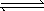
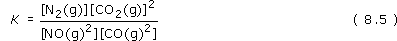
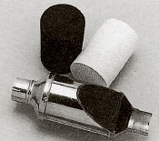
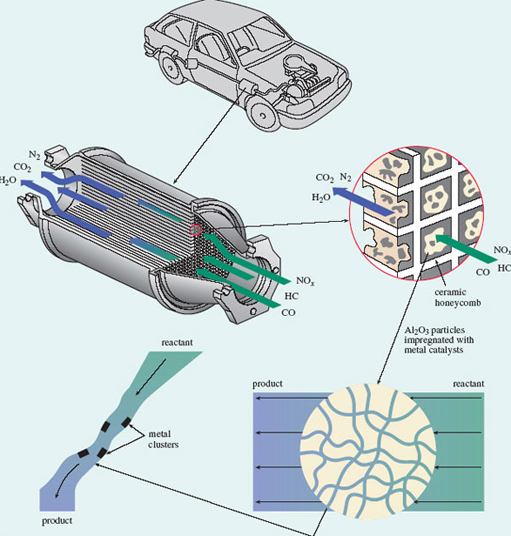
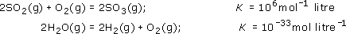
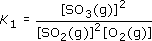
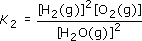

# 7 Reactivity needs a favourable rate and equilibrium constant

## 7.1 Introduction

So far, we have concentrated on the electronic and spatial structures of chemical substances, but we have not said much about chemical reactions. Now we turn to the question of why chemical reactions happen. To remind you of the basic ideas, we shall concentrate on one particular reaction which occurs in the modern motor car.

					Table 2 shows typical percentages of the main constituents of the exhaust gas that emerges from a modern car engine. The two most dangerous pollutants are carbon monoxide, CO, and nitric oxide (strictly known as *nitrogen monoxide*), NO. Both are very poisonous gases. For example, when nitric oxide emerges from the exhaust into the open air and cools down, it reacts with oxygen to form nitrogen dioxide, NO2 (Figure 51). This causes respiratory problems even at very low concentrations, and features in the 'air watch' bulletins given in regional weather forecasts.
<table xmlns:str="http://exslt.org/strings">
<caption>
						Table 2 The percentage by volume of the different gases in a typical car exhaust stream</caption>
<tbody>
<tr>
<th>Gas</th>
<th>Volume per cent</th>
</tr>
<tr>
<td class="highlight_" rowspan="" colspan="">nitrogen and argon</td>
<td class="highlight_" rowspan="" colspan="">71.00</td>
</tr>
<tr>
<td class="highlight_" rowspan="" colspan="">carbon dioxide</td>
<td class="highlight_" rowspan="" colspan="">13.50</td>
</tr>
<tr>
<td class="highlight_" rowspan="" colspan="">water vapour</td>
<td class="highlight_" rowspan="" colspan="">12.50</td>
</tr>
<tr>
<td class="highlight_" rowspan="" colspan="">carbon monoxide</td>
<td class="highlight_" rowspan="" colspan="">00.68</td>
</tr>
<tr>
<td class="highlight_" rowspan="" colspan="">oxygen</td>
<td class="highlight_" rowspan="" colspan="">00.51</td>
</tr>
<tr>
<td class="highlight_" rowspan="" colspan="">hydrogen</td>
<td class="highlight_" rowspan="" colspan="">00.23</td>
</tr>
<tr>
<td class="highlight_" rowspan="" colspan="">nitric oxide</td>
<td class="highlight_" rowspan="" colspan="">00.11</td>
</tr>
<tr>
<td class="highlight_" rowspan="" colspan="">hydrocarbons</td>
<td class="highlight_" rowspan="" colspan="">00.05</td>
</tr>
</tbody>
Reference: 

</table>

						Figure 51 Brown nitrogen dioxide gas being produced, in this case, by the reaction of copper with concentrated nitric acid

Given these dangers, there is a reaction that could be very beneficial:

<!--Quote id=eqn008_001-->
>2NO(g) + 2CO(g) = N2(g) + 2CO2(g)                                    (8.1)

If NO and CO reacted like this, then the nitric oxide in the exhaust would disappear, and take a substantial amount of poisonous carbon monoxide with it. Unfortunately, the reaction does not seem to happen. Why is this?

## 7.2 Is the equilibrium position unfavourable?

The first possibility is that the reaction system has been able to reach chemical equilibrium, but the equilibrium position is not favourable. How does this come about? If equilibrium has been reached, then the forward (left to right) and backward (right to left) reactions are occurring at equal rates. In such a case, we can emphasise the fact by writing the reaction with two opposed, half-headed arrows: 

<!--Quote id=eqn008_002-->
>2NO(g) + 2CO(g)    N2(g) + 2CO2(g)                              (8.2)

This indicates that both the forward reaction:

<!--Quote id=eqn008_003-->
>2NO(g) + 2CO(g)    N2(g) + 2CO2(g)                              (8.3)

and the backward reaction:

<!--Quote id=eqn008_004-->
>N2(g) + 2CO2(g)    2NO(g) + 2CO(g)                              (8.4)

are taking place: at the microscopic, molecular level there is ceaseless change in both directions. However, at equilibrium, *the overall rates of the forward and backward reactions are equal*. The reaction system then *seems* static because, at the macroscopic level where we measure things, there is no apparent change in the amounts or concentrations of any of the four gases involved. Suppose that Reaction 8.1 appears not to occur because, although it has reached equilibrium, the equilibrium position is unfavourable. Then it must be that the rates of the forward and backward reactions become equal when the concentrations of the reactants (NO and CO) are very high, and those of the products (N2 and CO2) are very small, so small as to be undetectable. This possibility can be tested by examining the *equilibrium constant, K*, for the reaction.

---

7.2.1 The equilibrium constant
An expression for the equilibrium constant of a reaction can be put together from the concentrations of the reactants and products at equilibrium. A concentration of a reactant or product is represented by enclosing its chemical formula in square brackets. Thus, the concentration of NO(g) is written [NO(g)].

To write down the equilibrium constant of a reaction, we start with the concentrations of the products. Each one is raised to the power of the number that precedes it in the reaction equation, and the corresponding terms for each product are then multiplied together.
<!--SAQ id=saq044-->

### Question 44

#### Question

<!--Quote id=quo048-->
>Do this now for the products of the equilibrium system 8.2.

#### Answer

The result is [N2(g)] × [CO2(g)]2, or, taking the multiplication sign as understood, [N2(g)][CO2(g)]2. In Equation 8.2, CO2(g) is preceded by a two, so its concentration is squared.
<!--ENDSAQ--><!--SAQ id=saq045-->

### Question 45

#### Question

<!--Quote id=quo049-->
>Now repeat the operation for the reactants in Equation 8.2.

#### Answer

The result is [NO(g)]2[CO(g)]2; in Equation 8.2, both NO(g) and CO(g) are preceded by a two.
<!--ENDSAQ-->
The equilibrium constant, *K*, is obtained by dividing the result for the products by the result for the reactants:

We have raised the possibility that Reaction 8.1 does not happen because the equilibrium position for equilibrium system 8.2 lies well over to the left. In other words, at equilibrium, the concentrations of NO(g) and CO(g) are very high, and those of N2 (g) and CO2(g) are so small as to be undetectable.
<!--SAQ id=saq046-->

### Question 46

#### Question

<!--Quote id=quo050-->
>If so, will *K* be large or small?

#### Answer

It will be very small because the large quantities ([NO(g)] and [CO(g)]) occur on the bottom of Equation 8.5, and the small quantities ([N2(g)] and [CO2(g)]) occur on the top.
<!--ENDSAQ-->
The value of *K* can be determined experimentally. A typical temperature in a car exhaust system is 525 °C. At this temperature, *K* turns out to be 1040 mol−1 litre.
<!--SAQ id=saq047-->

### Question 47

#### Question

<!--Quote id=quo051-->
>Given this information, does the equilibrium position lie to the left of Equation 8.2?

#### Answer

No; *K* is immense, so at equilibrium, the concentrations of the products (which appear on top of the fraction in Equation 8.5) must be much greater than those of the reactants (which appear on the bottom). The equilibrium position for Reaction 8.2 at 525 °C therefore lies well over to the right.
<!--ENDSAQ-->

## 7.3 Is the rate of reaction very slow?

If the equilibrium position is very favourable, then the reason why Reaction 8.1 fails to occur at 525 °C must be that its rate is very slow. Usually, a reasonable response would be to increase the temperature yet further, but the structure and economy of the car gives us little scope to do this. The alternative is to use a __catalyst__, which leaves the equilibrium constant unchanged, while speeding the reaction up.

Let us look at the changes that take place in the internal energy as reactants change progressively into products. Figure 52 shows a simplified version. The internal energies of the reactants (2NO + 2CO) and products (N2 + 2CO2) are marked by two 'platforms'. The platform for the products lies lower than that for the reactants. This shows that the internal energy change during the reaction is negative.

							Figure 52 A simplified version of the change that takes place in the internal energy of the molecules as nitric oxide and carbon monoxide change into nitrogen and carbon dioxide. The upper (red) curve shows the change in the absence of a catalyst; the lower (blue) curve, the change when a catalyst is present

Between the reactants and products, the internal energy does not decrease gradually as the reaction progresses; instead, it rises initially, reaches a maximum, and then declines. The upper curve shows the situation in the absence of a catalyst. The internal energy of the reacting molecules must first increase by an amount marked 'energy barrier' in Figure.
<!--SAQ id=saq048-->

### Question 48

#### Question

<!--Quote id=quo052-->
>How might the reactants, NO and CO, acquire this extra energy?

#### Answer

One possible source is the kinetic energy of other molecules. Lucky collisions may provide some NO and CO molecules with unusually high energies. If these high-energy molecules then chance to collide with each other, they might be able to surmount the energy barrier and react with each other.
<!--ENDSAQ-->
This also explains why an increase in temperature increases the rate of a reaction: a temperature rise increases the speed of the molecules, and the required increase in internal energy following collisions then becomes more probable. But as we have seen, in this case the rate is not great even at 525 °C. The energy barrier must be high. The main reason is a property of nitric oxide. In Reaction 8.1, the nitrogen and oxygen atoms in NO must be separated at some point, but the bond that holds them together is very strong. A large input of energy is therefore needed to bring the separation about, so the energy barrier is high and the reaction is slow.

### Box 8: The three-way catalytic converter

The solution to the high energy barrier for Reaction 8.1 is to involve a third party - a catalyst. A suitable material is the metal rhodium. When NO and CO molecules enter a catalytic converter, they become bound to rhodium surfaces. The binding of NO to rhodium weakens the bond between the N and O atoms, and the NO unit becomes more vulnerable to change. For example, it is believed that in some cases, the bond is so weakened that the N and O atoms separate completely, and move about on the rhodium surface. Pairs of nitrogen atoms can then meet, combine and leave the surface as N2(g); oxygen atoms can meet and combine with CO molecules on the surface, leaving as CO2(g).

Obviously, this type of reaction pathway is very different from one that takes place entirely in the gas phase with no catalyst present. Most particularly, because the catalyst surface assists the breaking of the bond in the NO molecule, it has a lower energy barrier (see <a xmlns:str="http://exslt.org/strings" href="">Figure 52</a>) and is much faster. In a *three-way catalytic converter*, some 90 per cent of the nitric oxide in the exhaust stream is converted to nitrogen and carbon dioxide. Figure 53 shows an example. The catalyst actually contains rhodium and platinum. The platinum catalyses the reactions of both carbon monoxide and unburnt hydrocarbons (from the petrol) with oxygen, giving carbon dioxide and steam. The converter is called 'three way' because it thereby removes all three main types of pollutant: nitrogen oxides, carbon monoxide and unburnt hydrocarbons. Figure 54 provides you with further details.

								Figure 53 A three-way catalytic converter; the metal shell has been partially cut away, exposing a gauze lining, inside which is the cylindrical grid of exhaust channels. A separate grid of this type is shown above and to the left. It is black because the platinum-rhodium catalyst has been dispersed over its surfaces. Before the catalyst is spread over it, the ceramic grid is white, as shown above and to the right.

Figure 54 The core of a typical three-way catalytic converter 
							

The core of a typical three-way catalytic converter consists of a cylindrical grid of thin-walled channels of square cross-section, composed of a ceramic material made from oxides of magnesium, aluminium and silicon (Figure 54). The platinum-rhodium catalyst is dispersed over granules of solid aluminium oxide, Al2O3, which have been specially prepared with a high surface area. The catalyst-coated granules are mixed with water to form a slurry, and passed through the grid, which is then heated in a furnace. The process leaves Al2O3, impregnated with catalyst particles, dispersed on the walls of the channels. In passing through the channels, exhaust pollutants traverse pores in the Al2O3 granules, encountering metal catalyst sites where reactions such as that shown in Equation 8.1 occur. Efficient conversion occurs only if the air-fuel ratio on entry to the converter is right. The ratio is controlled mainly by measuring the oxygen with a sensor and then making any necessary adjustments to the air and fuel supply (NO*x* denotes oxides of nitrogen; HC denotes hydrocarbons)

## 7.4 Equilibrium positions and rates of reaction in this course

Section 7 showed that if a reaction is to occur at a particular temperature, two conditions must be fulfilled: its equilibrium constant must be sufficiently large, and its rate sufficiently great. We finish by pointing out how this crucial distinction between the equilibrium constant and the rate reveals itself in <a xmlns:str="http://exslt.org/strings" href="">Figure 52</a>. The figure shows two different pathways by which the reactants can change into the products, but both routes begin at the *same* reactant energy level, and finish at the *same* product energy level. Regardless of reaction pathway, the energy difference between reactants and products is the same. It is an energy difference between reactants and products that determines the equilibrium constant of a reaction, and therefore the equilibrium position. The fact that both pathways have the same energy difference, and therefore the same equilibrium constant, shows that the equilibrium constant in a reaction is quite unaffected by *how* reactants change into products. With equilibrium constants, the nature and energies of the initial and final states are everything; what happens in between is immaterial.

When we turn to reaction rates, this is not so. In Figure 52, both routes start with the same reactants, and end with the same products, but the intervening stages along each pathway are very different. Such sequences of intervening stages are called __reaction mechanisms__, and the mechanism in the presence of a catalyst delivers a smaller energy barrier and a faster rate than the one that pertains when the catalyst is absent. With rates of reaction, therefore, the mechanism is crucial. 

## 7.5 Summary of Section 7

1. 
The equilibrium constant of a reaction is fixed at any particular temperature. It depends only on the natures of the initial reactants and the final products; what happens as reactants change into products has no effect on the equilibrium constant or position of equilibrium.

2. 
The rate of a chemical reaction is affected both by the temperature and by the pathway (reaction mechanism) through which reactants change into products. This pathway can sometimes be altered, for example by the introduction of a catalyst.

3. 
The catalyst causes a change in the reaction mechanism which leads to a lowering of the energy barrier and to a greater rate of reaction.

### Question 23

#### Question

The combination of sulfur dioxide with oxygen, and the decomposition of steam into hydrogen and oxygen are both reactions of great potential practical value. These reactions, and their equilibrium constants at 427 °C (700 K) are as follows:

Write down expressions for the equilibrium constants of the two reactions. When the two reactions are attempted at 700 K, neither seems to occur. Which of the two might be persuaded to occur at this temperature, and what form might your 'persuasion' take?

#### Answer

The equilibrium constant of the first reaction, *K*1, is given by

That of the second,

The data show that *K*2 is tiny: at equilibrium, the concentrations of the hydrogen and oxygen in the numerator (the top line of the fraction) are minute in comparison with the concentration of steam in the denominator (the bottom line of the fraction). So in a closed system at 700 K, significant amounts of hydrogen and oxygen will never be formed from steam.

By contrast, *K*1 is large, so the equilibrium position at 700 K lies well over to the right of the equation, and conversion of sulfur dioxide and oxygen to sulfur trioxide is favourable. The fact that the reaction does not occur must be due to a slow rate of reaction. We may therefore be able to obtain sulfur trioxide in this way if we can find a suitable catalyst to speed up the reaction. A suitable catalyst is divanadium pentoxide, V2O5, and at 700 K, this reaction is the key step in the manufacture of sulfuric acid from sulfur, oxygen and water. Figure 52 shows a similar comparison between uncatalysed and catalysed progress of reaction plots that would reflect the sulfur dioxide to sulfur trioxide conversion.

