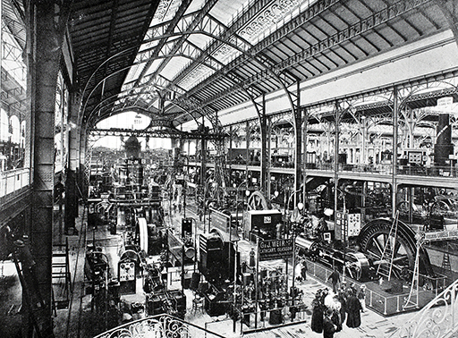
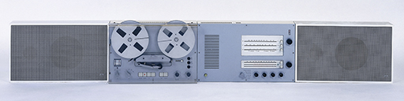
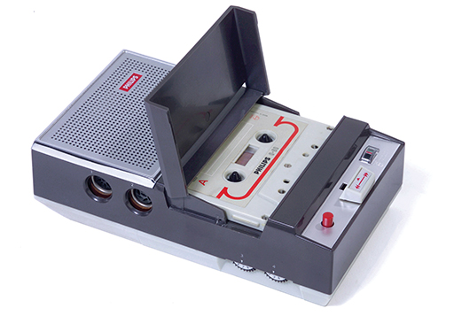
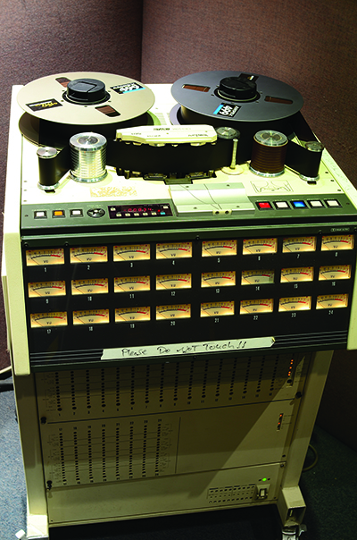
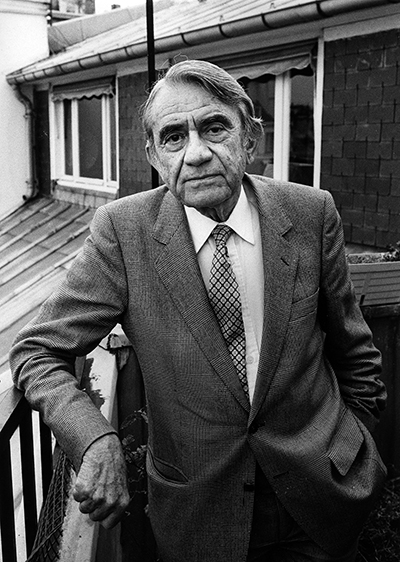

# 3 Magnetic recording

Figure 9 Gallery of electric machines, Exposition Universelle, Paris, 1900 (b/w photo), French Photographer, (20th century) 

Sounds, pictures, measurement data, financial statistics, personal details, etc. can all be recorded and stored on magnetic media, i.e. materials that are able to be magnetised to store information for future retrieval. During the twentieth century magnetic media increasingly came to the fore in the recording industry, culminating in the tape recording technology with which some people today are still familiar.

A paper published by Oberlin Smith (1840–1926) in an 1888 issue of Electrical World discussed the possibilities for recording sound using the property of magnetism. He envisaged a cotton thread impregnated with steel dust passing through a coil carrying a current controlled by a microphone. The variations with the sound in the strength of the current would cause corresponding magnetic fluctuations in the magnetic medium. Unfortunately he dismissed his own idea, which remained theoretical as he never performed any experiments. However, by the end of the nineteenth century Valdemar Poulsen (1869–1942), a Danish electrical engineer, had demonstrated Smith’s hypothesis. Poulsen’s ‘telegraphone’ was patented in 1898. It used steel wire wrapped around a brass cylinder as the magnetic medium. At the Paris Exposition of 1900, Poulsen made a recording of Emperor Franz Josef of Austria that is the oldest magnetic recording now in existence.

At this stage the telegraphone could not compete with the gramophone, but the development of an electronic amplifier using the thermionic valve (vacuum tube) enabled the tiny magnetic fluctuations in the steel wire to be magnified to a usable level and by 1924 a German engineer, Dr Curt Stille, had developed a machine that could record sounds on a steel tape.

## 3.1 Magnetic tape recorders

Figure 10 TS45 receiver; a wall-mounted system comprising of reel-to-reel tape, receiver and pair of speakers, 1964 (aluminium, plastic, tape), Rams, Dieter (b.1932) 

Experiments showed that the use of paper tape coated with iron oxide particles significantly improved the signal-to-noise ratio. A plastic-based version of this magnetic tape, developed by the German company BASF, led to the development of a commercial tape recorder with audio characteristics that could nearly match those of the gramophone record, but not at an economical price. Secret work on tape recorders was undertaken by the Germans throughout the Second World War.

Soon tape recorders were in use by the American radio networks for pre-recording their broadcasts, the entertainer Bing Crosby being one of the greatest proponents of the technology. Recording companies were also quick to embrace the benefits of tape – especially the ease with which mistakes could be edited and retakes inserted. Also the ability to record for longer periods (30 minutes or more) meant less need for recording sessions to be split into short takes. Early domestic recorders were used primarily for playing stereo recordings, but they were costly in terms of both the hardware and the media: a pre-recorded stereo tape cost five times that of the equivalent mono LP disc. The sales of pre-recorded tape plummeted once stereo LPs became available in 1958. From that point on, domestic tape recorders were used mainly by enthusiasts for home recording.

An important feature of the use of magnetic tape is the effect on the sound of the speed at which the tape travels. The audio bandwidth of a tape recorder is determined to an extent by the selection of the tape speed, i.e., the rate at which the tape is drawn across the record and play heads. The wavelength of the audio signal recorded onto the magnetic tape is proportional to the tape speed. As the tape speed is increased, a greater proportion of the tape is used to store the audio signal, allowing higher frequencies to be retained on the tape. Because high tape speeds are less economical on tape usage, tape recorders had speed controls to allow users to select the tape speed to suit the audio quality. The figures below give you some idea of the variation of tape speed that was used for different purposes.

Speeds are measured in cm/s (centimetres per second) and ips (inches per second).
<table xmlns:str="http://exslt.org/strings">
<caption>Table 1 Tape speed, bandwidth and their uses</caption>
<tbody>
<tr>
<th>Tape speed</th>
<th>Bandwidth</th>
<th> Use</th>
</tr>
<tr>
<td class="highlight_" rowspan="" colspan="">38 cm/s (15 ips) </td>
<td class="highlight_" rowspan="" colspan="">20 Hz-20 kHz</td>
<td class="highlight_" rowspan="" colspan="">studio recording</td>
</tr>
<tr>
<td class="highlight_" rowspan="" colspan="">19 cm/s (7½ ips)</td>
<td class="highlight_" rowspan="" colspan="">30 Hz-15 kHz</td>
<td class="highlight_" rowspan="" colspan="">high-quality home recording</td>
</tr>
<tr>
<td class="highlight_" rowspan="" colspan="">9.5 cm/s (3¼ ips)</td>
<td class="highlight_" rowspan="" colspan="">40 Hz-13 kHz</td>
<td class="highlight_" rowspan="" colspan="">general domestic music and speech</td>
</tr>
<tr>
<td class="highlight_" rowspan="" colspan="">4.8 cm/s (1 7/8 ips)</td>
<td class="highlight_" rowspan="" colspan="">50 Hz-6kHz</td>
<td class="highlight_" rowspan="" colspan="">recording speech (dictation)</td>
</tr>
</tbody>
</table>

## 3.2 Tape at home

The use of magnetic tape for home use was always somewhat problematic. While it offered several advantages over discs, being capable of high-quality sound, substantially free from surface noise and able to make personal recordings, tape never became so popular as to make any serious inroads into the sales of discs. Why should this be the case? The answer is one of convenience, for magnetic tape has always been difficult to handle compared with discs – threading the tape through the machine onto the take-up spool was fiddly, and the tape could easily become damaged, stretch or snap. 

Many companies developed tape cassette systems based on standard quarter-inch tape but none succeeded in gaining enthusiastic acceptance by consumers. The compact cassette system, shown in Figure 11, was developed by Philips Gloeilampenfabrieken in 1963 for recording speech. Philips called their cassettes compact to distinguish their system from other audio cassette systems and they made no pretence of achieving high-quality sound, deciding to use a slow tape speed (1 7/8 ips) and a new narrow one-eighth-inch-wide tape to keep the whole system as small as possible. The convenience of slotting cassettes into the machine rather than having to thread tape around guides and tape heads made this format much more suitable for consumers. Along with the introduction of the Sony Walkman in 1979, this was one of the key technologies that drove the portable music market from which the iPod and mp3 players, and smartphone music streaming services, have grown.

Figure 11 A compact cassette system

## 3.3 Multi-track tape recording

The importance of tape recording to record production cannot be overemphasised. From its development until the late 1970s, the tape recorder was at the heart of the professional music recording studio. Initially, the full width of the standard quarter-inch tape was used for making monophonic recordings. Stereo needed two tracks – one for each channel. Rather than doubling the tape width, a decision was made to halve the track width by incorporating two discrete heads one above the other in a single head assembly. As technology advanced, more tracks were able to be added. By also widening the tape, even more tracks could be incorporated, so allowing individual instruments to be recorded on separate tracks for down-mixing at a later date. Figure 12 shows a professional 24-track analogue tape recorder using special 5 cm (2 inch) wide tape. These complex machines are capable of reproducing high-quality sound for each track and they represent the pinnacle of analogue multitrack tape recorders.

Figure 12 A 24-track analogue tape recorder

The expansion from mono through 2, 4, 8, 16 and up to 24 tracks over the course of the late 1950s to 1970s allowed the development of recording and production techniques (and beyond that via the synchronising of multiple tape machines even 48 tracks were common). For example, the early mostly ‘live’ recordings found in early Beatles recordings were recorded using several microphones all mixed down to a two track tape machine. But since most radio broadcast and portable record players only supported mono reproduction, all of the Beatles records were primarily mixed down to mono. Stereo versions were also produced at the request of the record label, but these were of secondary importance to the producer George Martin, who delegated the task to other engineers.

When EMI started using 4-track tape machines at their Abbey Road Studios in 1963, a greater degree of freedom entered the recording process. The additional tracks allowed different parts to be added to the recording at different times. It also allowed tracks to be ‘bounced’. If three tracks contained, for example, drums, bass guitar, and lead guitar, these could be mixed together and recorded onto the fourth track on the same tape, allowing those original three tracks to be re-used for additional instruments. Of course, the mix had to be right, because it was not possible to return to the original tracks and try again once they had been replaced.

As the capability of tape machines expanded to 8 and 16 tracks in the late 1960s and 24 tracks at the start of the 1970s, the need to bounce tracks, and to commit to mixing decisions decreased. It was still a very useful technique, but usually the main elements of the recording would be kept separate. A typical use for bouncing tracks in a 70s recording session might be to record the main parts on the first 16 tracks, and then use 6 tracks for backing vocals. Once all of the backing vocals were recorded, those 6 tracks could be mixed and bounced onto a single track, leaving plenty of tracks for overdubbing other instruments.

It was possible to link up two tape machines so that they were perfectly synchronised. In practice this was tricky, but it allowed bands to record onto 48 tracks. More tracks obviously allows more options, and increases the potential for different approaches to making a recording, and that applies just as much to orchestral recording sessions, with one channel for each section of instruments, as to a popular recording. The trade-off is that this process can be much more costly, and decisions about mixing can be made far more complicated and subject to change, thus making the whole process far more time consuming.

## 3.4 Editing

Before the use of tape, recordings had to be started at the beginning and stopped at the end. Once a groove had been cut on a wax cylinder or a disk, it was not possible to go back and recut any part of it. Tape, however, is a fundamentally different medium and allows for two kinds of manipulation after the original recording event. 

Firstly, tape can be cut and stuck back together. Cutting and splicing tape allows the rearrangement of music after it has been recorded, which means that whole sections may be easily removed, either to improve the music or because they contain mistakes. Secondly, tape can also be erased and reused easily, and it is possible to record onto any selected tracks of a multitrack tape while the other tracks are playing. It is also possible to ‘drop in’ short extracts, thus correcting any mistake by re-recording only that small section in which the error may have occurred.

Overdubbing does not change the overall length of a recording, but editing can allow fundamental changes to the duration and ordering of a recording. By editing, it is possible to add in additional, subsequent or previous recordings, simply by using a razor blade and sticky tape. The next logical step is to start to construct music by editing tape together, and not necessarily using tape that contains recordings of musical instruments.

Figure 13 The Canadian Pianist, Glenn Gould

This leads to two kinds of practices, one exemplified by Glenn Gould and the other by Pierre Schaeffer. Glenn Gould (Figure 13) was a concert pianist who saw the possibilities of recording and especially editing very early on. He notably gave up giving concerts and instead devoted himself to making studio recordings instead. He would often record pieces bar by bar so that he could concentrate on getting exactly the right nuances of performance for every detail, later editing all of these takes together to make the master recording. By doing this he could create a ‘performance’ of a piece that was impossible to achieve in a single take.

Figure 14 Pierre Schaeffer

Pierre Schaeffer (Figure 14), on the other hand, developed a new way of making music by using all kinds of recorded sounds, and editing them together. He started in the 1940s by using records, and would make indents into the surface to create ‘sillons fermés’ – locked grooves. When tape machines became available the potential for editing together different sounds by using certain techniques such as repetition, reversal, and transposition all increased. Schaeffer called this kind of music Musique Concrète. There was also a parallel movement of making tape music using electronically generated sounds such as sine waves and noise, primarily based in Cologne, with key figures being Herbert Eimert and Karlheinz Stockhausen.

### Activity 5 
__Timing: Allow about 5 minutes__

#### Question

Listen to the following piece of music made using the above techniques. Can you hear the difference between naturally repetitive sounds and those sounds that have been artificially repeated?
<!--MEDIACONTENT--><!--ENDMEDIACONTENT-->

#### Discussion

Some of the train sounds we hear are naturally repeated whereas with others Schaeffer has created a degree of repetition artificially. The use of repeated rhythmic sounds is a familiar feature in much popular music and especially in electronic dance music. This recording is one of the earliest examples of using recordings to artificially create repeated rhythmic elements, and is in many ways a precursor to some of the techniques of sound manipulation used in contemporary music production.

