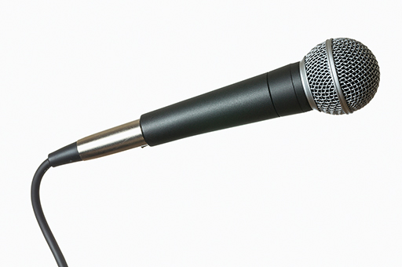
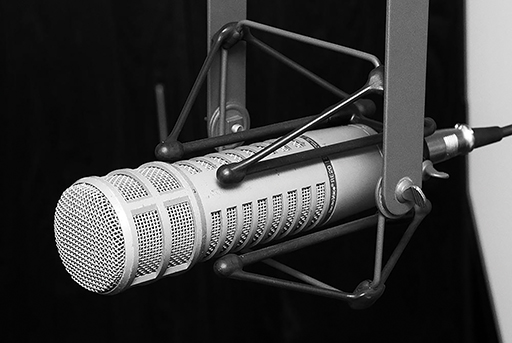
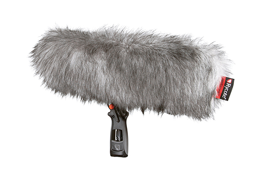

# 4 Practical recording

Now you have an understanding of the history of sound recording, in the rest of this course you will be exploring the kinds of issues you might face when making your own recordings using a small portable recorder. You may wish to invest in such a recording device but do not need to do so to understand the issues facing sound recordists.

All recording situations require some degree of planning, and the right amount of planning can help you get results even when many elements are beyond your control. If you have one, it is a good idea to get into the habit of taking your recording device with you wherever you go, and being ready to capture sounds around you that you find interesting, or that you think may be useful later. I have built up quite a wide-ranging sample library in this way. You should give yourself every advantage to be able to capture sounds indoors or outdoors. At the very least you need to make sure your batteries are charged and that you have enough storage space in your recorder. If you have a windshield for your recorder, and some headphones, that is even better, but this can still be a highly portable rig.

Outdoors, the biggest enemy is the wind. Microphones work by having a very lightweight diaphragm that responds to changing sound pressure, but when the air is moving this has a much greater impact on the diaphragm of the microphone and can easily cause it to reach its limit of movement and therefore to distort the signal.

## 4.1 Microphone distortion

Distortion caused by too much air movement is not just a problem in outdoor recording. Any microphone placed close to a source of moving air can be susceptible to distortion. The human voice is such a source, as are several wind instruments. The amount of air moved by a vibrating drum skin, especially a bass- or kick-drum can easily enough to cause a microphone to distort, and in the case of a ribbon mic, the air movement can be enough to break the ribbon.

Figure 15 Shure SM58 dynamic microphone

Figure 16 Electrovoice RE-20 dynamic microphone.

Some microphones such as the Electrovoice RE20 and Shure SM58 as pictured in Figures 15 and 16 have a foam shield mounted inside the wire basket surrounding the capsule which greatly reduces the effect of air movement. These two microphones are both designed primarily for voice, and so this foam combats the air movement generated when making plosive sounds (‘p’ and ‘b’ sounds). There is a trade-off between robustness and sensitivity in these kind of dynamic microphones, which makes them less well suited to recording quieter sounds. Conversely, the more sensitive microphones that you may have in a portable recording device may need some additional protection when used outdoors.

Many microphones come with external foam shields, which can be added when needed, and your portable device could have such a wind shield included. For really serious outdoor recording, a more sophisticated wind shield is needed. You might have seen the kind of hairy blimp style microphone shield, particularly at sporting events where the sound has to be captured from many different locations around the pitch, arena, or field of play in all kinds of weather.

Figure 17 Rycote windshield

Several companies make these, but they have become synonymous with the manufacturer Rycote. You may have a simple foam windshield or even a furry cover for your recording device. Usually these simply fit over the microphones. Some covers are available as add-ons, so if you want to record outdoors, you might consider your options. Anything you put in front of the microphone will have an effect on the sound, so don’t immediately choose the most protective cover unless you really need it. Even a light breeze can cause distortion, so it is always worth using a foam windshield for outdoor recording if you have one.

Figure 18 A condenser microphone, pop-filter and vocalist. 

A ‘pop-filter’ (shown in Figure 18) between the vocalist and the microphone, is a similar device used for recording vocals in a studio. Sometimes called a pop-screen or pop-shield, this device uses the same principle as the windshield, reducing the impact of moving air on the microphone diaphragm. A pop-filter is used to prevent any strong blasts of air caused by ‘p’ and ‘b’ sounds from overloading the microphone diaphragm. This allows you to use any kind of microphone to record a vocalist, especially sensitive condenser mics. Without a pop-filter, these sounds can cause ‘pops’ or heavy booming sounds. If you haven’t noticed this before, focus your attention on ‘p’ and ‘b’ sounds next time you hear somebody speaking through a microphone without a pop-filter and see if you can observe this phenomenon. 

An effective DIY pop-filter can be made using a wire coat hanger and stocking or pair of tights by creating a wire circle with a diameter of around 15 cm and stretching the tights over this. This is then attached to a microphone stand so that it is about 2-5 cm in front of a microphone. 

Another critical factor that tends to be more of a concern in outdoor sound recording is avoiding handling noise. In the studio there is usually easy access to microphone stands and suspension mounts which help to isolate microphones from any vibrations by suspending the microphone by elastic cords. Outside the studio, and particularly in field recording scenarios when portability is a priority, the opportunity for using a specialised microphone stand and suspension mount can be limited. 

Anything you can do to remove or reduce the sounds you make yourself is a good thing. If you have a choice of jackets, wool or cotton makes less noise than a brand new anorak, so if you set out to make some outdoor recordings, think about what you can wear that will reduce the likelihood of generating excess noise. Soft-soled shoes might be better than hobnailed boots.

Given that it is difficult to be absolutely silent and still even for short periods of time, always try to put your device on a stable surface rather than holding it, and if you can fix it to a microphone stand then that is even better. Many devices have camera-tripod compatible fixings which allow you to mount your device on a range of different tripods, and some have an adapter that allows you to use a microphone stand. Failing that, you can use tables, tree-stumps, or any other stable base to rest the device on, and if you can protect the device from the wind at the same time, then so much the better. A certain amount of vibration from the environment, especially traffic rumbling, can be picked up by a microphone that is directly coupled to the floor.

