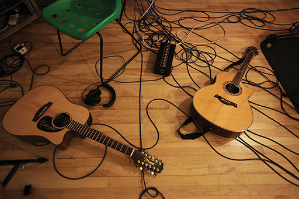

# 5 Recording log

Figure 19 Recording a live performance

A recording log is where you can make notes of many different aspects of your session, and can be absolutely essential when you return to a recording weeks, months, or even years in the future. Details about the session that seem obvious today will have been forgotten next year unless you write them down.

If you are planning on recording a live performance, you will have just one chance to get it right, and you may only end up with one single sound file. The necessity for creating a recording log might seem very low on your list of priorities; however, there are a number of good reasons to get into the habit of making recording logs for each and every session.

Recording logs are valuable whether the recording takes place on location or in the studio, and in this section the use of recording logs across a range of different situations will be discussed.

## 5.1 General notes

In general, I use a fairly similar recording log independent of where I am recording, but some details are much more useful depending on the situation. When I am recording on location I try to include the following:

* Time and date

* Location

* Recording engineer (usually me)

* Producer (if there is one, often there isn’t)

* Performers (names and instruments)

* Title of piece or pieces, plus instruments if non-standard

* Sketch of stage layout with microphone positions

* Name and position of each microphone

All of these elements will appear at the start of my recording log, and to accompany this I always try to take a few photographs of the session, especially the microphone placement. 

A sketch of the performers and the microphone position(s) is most useful when you are recording a non-standard setup. When recording a string quartet, for example, you might expect the first violin to be on the far left, then the second violin to the left of centre, with the viola to the right of centre and the cello on the right. In such a scenario, it is easy to check whether your recording channels are the right way around; however, if the players were oriented differently, it would not be so easy to check, and a simple sketch would help.

## 5.2 Notes on each take

The main body of the recording log of a live recording is quite different to that of a studio session in that a live recording will have far fewer ‘takes’ but may need more notes for each take. A studio, or dedicated recording session will have many more takes, with fewer notes per take.

A list of take numbers should be your key to relate your notes to your sound files. Most recording devices and Digital Audio Workstations automatically number files, incrementing the number by one each time you stop and start a new recording. It is really important to make sure that your take numbers match up with the numbers in your file names. You should double check this very often during a session; otherwise you can end up breaking the link between the notes in your recording log and your sound recordings, and this can cause all kinds of problems when you return to edit the project.

The kind of notes I might make while making a live recording could include:

---

### Change gain -4dB at 12:10.

I will always try to set the microphone pre-amp gain correctly, and to leave it alone once set, but occasionally, especially if there was inadequate opportunity to record the rehearsal, I might have to adjust the gain during the performance. If I note down exactly when I do this, then when I’m mixing the recording in the studio, I can make the appropriate adjustments to balance the levels later. In this case my note indicates that I reduced the mic pre-amp gain by 4dB at 12 minutes and 10 seconds. Ideally this would have been in a natural break such as a pause between pieces, or movements, and not while any of the instruments were playing.

---

---

### Cough 3:45

It is very easy to hear noises such as coughs, chair squeaks and door slams during a recording when you are present in the space, but it is sometimes harder to notice these on playback. If I hear a sound like this and note exactly when it happened, I can try some different techniques to minimise the effect of the noise later.

---

---

### Soprano # 11:53

If I have a score I might notice if wrong notes are played, but even without a score it can be easy to hear if particular notes are out of tune (# is shorthand for ‘sharp’). If a high note within a chorus is out of tune, it may be possible to copy a similar note from another chorus and swap it for the out of tune one. Making a note of this kind of mistake speeds up the editing process enormously. Sometimes nothing can be done to fix errors, but it is good to know what to focus on without having to listen all the way through the entire recording.

Whether it takes place in the studio or on location, for example in a concert hall, a managed session requires a very different kind of note for each take. When the performer or performers are not under pressure to get it right first time, as in the case of a live performance, there are many occasions where they will stop shortly after the beginning of the take in order to start again and perform better. There is a danger in starting and stopping the recording device in such instances as it is easy to miss the start of the second performance, so if this happens it is common practice to leave the recorder running and to note ‘FS’ for ‘false start’. 

In managed sessions it is much more common to have a copy of the score, so very often notes can be made directly in the score. Bar numbers are a very useful reference point, so before each take I make sure to ask the conductor or performer which bar number they will be starting from and ending on. If you have the score, you can then note bar numbers for any mistakes, or extraneous noises such as page turns. If you don’t have a copy of the score you can at least make sure that there are no bar numbers missing.

In general, you should think of your recording log as the framework for your editing process. Many decisions about which takes are better than others can be made during the recording. For this reason, I include a separate column into which I put a tick or a cross, sometimes half a tick and sometimes two ticks to indicate the general standard and quality of that take. It is then quite easy to scan your recording log before the end of the recording session to make sure you have got a good take to cover all sections. There are different ways of doing this – you might draw a smiley face or sad face, or you might give marks out of 10, gold stars or black marks. The trick is to find an intuitive system that works for you without you having to think about it.

In a live recording situation, a good idea is to use a copy of the concert programme (if there is one) to make your notes in. Much of the information is already there, so it can be a time saver. Otherwise, you should make a table and pre-populate some of the boxes to include the kind of data you most often need. This is an iterative process, and you will make different versions each time you record until you settle on the right balance.

---

## 5.3 Field recording notes

When you are recording outside (field recording), it is much harder to make written notes; however, you should still fill out a recording log with some general information at some point before or after you make your recordings. The best way of making notes when you are on the move is to speak them at the start or at the end of each recording you make. You will always have to edit your recordings, so you needn’t worry about ruining them by recording your own voice on them. The best thing about this method is that the notes you dictate will always be attached to the recording unless you deliberately delete them. This is not always the case with handwritten notes!

The more detail you can give the better, especially given the amount of information you will be able to collect with your other senses as you make your recordings. For example, if you are recording a bird song, and you can see that a robin and a blackbird are both singing at once, if you dictate this at the end of the recording, this might save you time later trying to work out what you have recorded. Likewise, if you are recording passing cars, if you notice that the third car was a Ferrari, then mention it on the end of the recording as it may be really handy to know that in a couple of years’ time when you are designing some sound effects for a film, or making a ringtone for a friend or relative.

