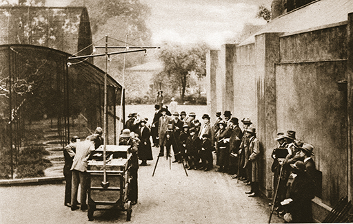

# 6 Microphone placement

Figure 20 The Symphony Orchestra of the Bavarian Radio (BR), conducted by Bernard Haitink, plays Gustav Mahler’s Symphony No. 9 for SZ readers during the public rehearsal at the Philharmonie im Gasteig, 2011 (photo) 

In semi-planned situations, the environment will often dictate some of the choices a sound recordist may make, or at least will narrow down the options. For example, to record the dawn chorus, you would almost certainly have to rely on battery rather than mains power. Although a laptop can power a soundcard, which in turn can power microphones, this tends to drain batteries quite quickly and is quite cumbersome and fragile, so a typical choice for field recording is a dedicated battery-powered portable recording device. This may be anything from a sub-£100 Zoom to a professional-level Nagra or Sound Devices machine costing several thousand pounds. The more professional (and expensive) devices usually allow large capacity batteries to be attached, giving several hours of continuous recording time. However, less expensive devices often use less power, so two fully charged AA batteries can also provide enough power for a lot of recording. Since your portable device is likely to be small with few extra features, you should be able to get good battery life out of it. However, given the effort you will dedicate to any recording work, it is good practice to carry spare batteries with you, just in case.

The choice of recording device will also affect the selection of microphones. A professional device won’t have built-in microphones, and the expectation is that high-quality external microphones will therefore be used. Your device will almost certainly have built-in microphones but may also allow you to connect external microphones, either as an alternative, or as additional to the built-in ones. If you are using external microphones then you will have the chance to position them carefully before the birds start singing, and monitor the recording from a point further away.

If you choose to record a live concert, you won’t have much control over the timing of the event, and you won’t be able to get the performers to redo any sections if either you or they make a mistake, so you will have to be ready to go and get it right first time. If you are organised enough you should be able to set up before the sound-check or rehearsal and get an idea about the best position for your microphones or device and what levels to set while this is happening. Making recordings during rehearsals is a great way to learn how your device works in practice without the pressure of having to capture a one-off performance. Recording is a social practice, so the better the relationship you have with the performers, the better chance you will have of asking them to play a loud bit in rehearsal so that you can make sure you have made the right gain settings. 

The visual element of any performance is always going to be important for the performers and the audience, so this will place limitations on where you can place your microphones. It is often the case that the most effective place for capturing the best sound simply isn’t accessible because of this reason, so you have to be ready to compromise. Given the presence of an audience, this should also make you think about microphone choice and positioning.

### Activity 6 
__Timing: Allow about 5 minutes__

#### Question

Take a moment to write a list of as many different kinds of noises that an audience may make.

#### Discussion

Your list may include applause, cheering, coughing, sniffling, chair creaking, chatting, rustling or dropping programmes, glass clinking, children crying, and many other sounds. Some of these could be essential to include as part of your recording, but many other can detract from the end result.

Of the two main types of microphones – directional and omnidirectional – the most common choice for live recordings is directional, as this gives you at least some ability to focus more on the performance and less on the audience. This choice might not eliminate incidental noises, but it can reduce their amplitude relative to the performance, and it will still pick up applause very clearly.

Your device may not offer you any choice of microphones, in which case your main focus should be on deciding exactly where to place it in order to capture the right balance between each instrument and the space in which they are playing. This will almost always be somewhere along a line that passes through the centre of the space. If you place your device to one side, you will most likely end up with an unbalanced recording that has one channel quieter than the other or else contains more signal from the instruments on one side of the stage than the other.

In order to find the best distance for your device or microphones, you will have to experiment by making several recordings with your device at different distances from the sound source. It’s a good idea to try the extremes of distance first, and then, making careful notes, and taking photographs or maybe even using a tape measure, make more recordings with your mics at different locations. You will probably have to wait until you get home to be able to listen to these recordings properly, so making accurate notes is vital. In this way you should be able to build up a sense of how your device works best, but this will also give you great practical experience of how and why recorded music can sound so different.

## 6.1 Minimising noise

Figure 21 An early outside broadcast by the BBC from London Zoo as technicians attempted to record the sound of screeching from the aviary, from ‘Wonderful London’, published 1926-27 (photogravure), English Photographer, (20th century) 

It is always best to try to reduce any background noise as much as possible. Best practice, as with virtually all audio practice, is to start at the source and not to rely on fixing problems later on. When you are recording at home you can easily address most noise issues. Simple things like closing doors and windows and turning off televisions and radios will help. Less obvious sources of noise are central heating systems and fridges. You may not be aware of central heating noise until you turn it off, at which point you should appreciate the reduction in low-frequency rumble and general background noise.

One of the first things I do when recording on location is to listen for a ticking clock. This is the kind of background sound that can easily avoid your direct perception because it is such a familiar sound; however, a ticking clock can ruin a recording, especially any quiet passages which require the listener to focus on the smallest detail in the music. 

In order to move clocks or remove clock batteries, turn off central heating systems, and generally combat other such noise sources in public buildings, it is essential to develop a good working relationship with the custodian or caretaker of the building that you are using for recording. These social interactions are a fundamental part of making successful recordings, and the more sensitive you are when making such preparations for a recording session, the more help you will get during a session, and with future sessions.

It may not be possible to eliminate all types of noise, and in the winter, it may not be possible to turn off the central heating. In these cases you can sometimes compromise by asking to have turned off any particularly noisy radiators, but it might be that you need to reposition the performers and/or your microphones or recording device to move them away from any noise sources.

## 6.2 Mains Hum

Anything electrical that is plugged into the mains can be susceptible to hum. Mains electricity is an alternating current, whereas something like a battery provides direct current. In the UK the mains voltage is about 240 V, with a frequency of 50 Hz. Most of Europe has a voltage of 220 V at 50 Hz, while the USA has a voltage of 110 V and a frequency of 60 Hz.

The voltage doesn’t cause noise, but the fact that it is alternating and not direct current can cause problems. The 50 Hz frequency (in the UK and Europe) can interact with some components inside electrical devices such as transformers, and can cause a vibration which is audible as a hum. The fundamental frequency of this hum is usually 50 Hz, (or 60 Hz in the USA), but just like a musical instrument, this can have a number of additional harmonics.

If you notice any hum in your recording environment, if possible, try to turn off any problematic device before recording.

