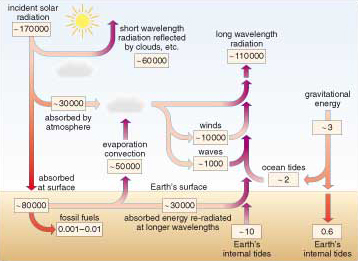
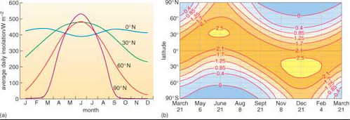
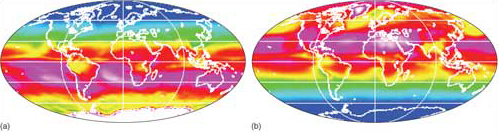

# 1 Solar energy

The Sun will radiate energy until it ceases thermonuclear fusion, in around 5 billion years. The solar power that enters the Earth's system is 1.1 × 105TW (0.3 × 105 TW to atmospheric heating and 0.8 × 105 TW absorbed at the surface - <a xmlns:str="http://exslt.org/strings" href="">Figure 1</a>). This is equivalent to a global energy supply of 3.5 × 106 EJ yr−1. About 33% heats the atmosphere and contributes to setting winds and waves in motion. Of that reaching the Earth's surface, 70% falls on the sea, setting in motion ocean currents and a large proportion of the circulation of water vapour in the atmosphere because of evaporation from the ocean surface. The remainder falls on the land. <a xmlns:str="http://exslt.org/strings" href="">Figure 1</a> shows the complexity of primary redistribution of solar energy through interlinked surface systems:

* 
the carbon cycle based on photosynthesis;

* 
atmospheric circulation and the water cycle;

* 
winds and ocean waves; and the ocean current system.

Each of them is a potential source of useable energy: this course discusses the *direct* use of solar energy.

Figure 1 The exchange of energy between the Earth's natural energy systems per second - the power of these systems measured in TW

In every case, with the exception of the energy available from surface water flow, humanity comes nowhere near exploiting the Sun's potential to supply useable energy; in fact, we really do not know the practical limits. Whatever those are, they will not disappear as a resource - all are renewable. Compare this with the solar energy stored chemically by the degraded products of photosynthesis in fossil fuels. Although carbon burial adds continually to that resource, its pace of renewal (between 1 to 10 GW - <a xmlns:str="http://exslt.org/strings" href="">Figure 1</a>) is about 2000 times slower than we use it. Fossil fuels are non-renewable and declining extremely quickly in terms of human history.

In British summers direct sunlight (__insolation__) on a clear day can reach power densities of up to 1 kW m−2 when the Sun is at its highest in the sky (the daytime average is about 450 W m−2), and supplies around 6.5 kWh m−2 per day (450 W m−2 × about 14 hours of daylight in June) (<a xmlns:str="http://exslt.org/strings" href="">Figure 2a</a>). This is enough to heat a bathful of water to a comfortable temperature. Summer insolation in southern Europe (~30° N on <a xmlns:str="http://exslt.org/strings" href="">Figure 2a</a>) reaches 7.5 kWh m−2 per day (by virtue of a higher Sun angle). Winter insolation is much lower. In January, northern Europe (~60° N on <a xmlns:str="http://exslt.org/strings" href="">Figure 2a</a>) has an average insolation around 10% of its summer value and around only 20% of the January value in southern Europe. In the tropics (0° N on <a xmlns:str="http://exslt.org/strings" href="">Figure 2a</a>), insolation shows far less seasonal fluctuation. Solar energy collection in northern Europe is therefore most effective in the summer, in southern Europe there is useful winter potential as well, and at low latitudes it can be used throughout the year. High latitudes have a problem with solar energy; it is most abundant when it is least needed, i.e. in summer. Although variations in cloudiness reduce insolation, diffuse solar energy still reaches the surface at a power density that is often useable.

Figure 2 (a) Seasonal variation of the daily average incoming solar power (W m−2) at the Earth's surface, under *cloud-free* conditions. Variations in solar power are shown for four northern latitudes, and allow for variations in the length of the day and that of the Sun's elevation above the horizon. (b) Seasonal variation with latitude of daily incoming solar energy (in 107 J m−2)- assuming cloud-free conditions. The axes are latitude and time of year (this is not a map), and the contours are for solar energy received per day under cloud-free conditions. (*Note*: There is a difference between Northern and Southern Hemispheres because during the Southern Hemisphere summer the Earth is closer to the Sun than it is during the Northern Hemisphere summer.)

Curvature of the Earth's surface and the inclination of its rotational axis relative to the Sun result in insolation declining from a maximum in the tropics towards higher latitudes (<a xmlns:str="http://exslt.org/strings" href="">Figure 2b</a>). There is also considerable variation with the seasons. Satellite data give a more realistic view of the amount of available solar energy across the planet (<a xmlns:str="http://exslt.org/strings" href="">Figure 3</a>). One surprising feature is that summer months in Greenland and Antarctica have the highest *actual* insolation on the planet. That is partly because the Sun shines for 24 hours each summer day, but also because ice caps are usually free of cloud during summer months - high-pressure air masses exclude moist air from the oceans. (*Note*: Much is reflected away by ice and snow.) Bar that oddity, available solar energy varies roughly as expected, but always lower than theory predicts (Figure 2) because of cloud cover.

Figure 3 Average available insolation (i.e. depending on cloud cover) at the Earth's surface for (a) January (1984-1991); (b) July (1983-1990) from NASA satellite data. The 'rainbow' colour range (blue-green-yellow-red-magenta-white) represents average power densities through the day (0-&gt;350 W m−2). Values of available solar insolation are at their highest over Antarctica in January and over Greenland in July. High values also occur along the subtropics during Northern and Southern Hemisphere summers.

__Direct solar energy use__ is of two basic kinds; using it as a source of heat or converting it into electricity using photovoltaic technology.

