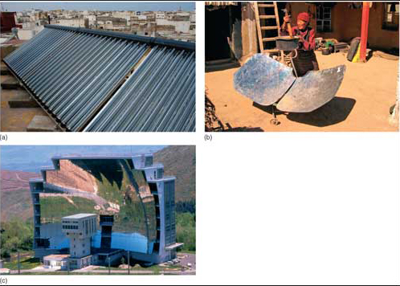

# 2 Solar thermal energy

Solar heating of trapped air, water and solids has been used for centuries, but modern architectural design can enhance all three effects for space heating, hot water supply and heat storage. Such __passive solar heating__ relies on short-wave radiation being absorbed by materials so that they heat up and then slowly re-emit long-wave radiation. The most obvious example is inside a greenhouse, where solar radiation that passes through the glass heats the inside air to temperatures well above those outside. Glass is more transparent to short-wave radiation than to long wavelengths, so a glazed room absorbs and retains heat, especially if the windows face the Sun. By absorbing solar radiation, house bricks, beach sand and rocks can become uncomfortably hot, even in the UK. The darker solids are, the more short-wave radiation they absorb - black cars become hotter inside than do white ones on sunny days.

The most common design using water as a heat absorber is a flat glass plate set above a waterproof black surface (<a xmlns:str="http://exslt.org/strings" href="">Figure 4a</a>). Water flows slowly between the two, becomes heated and can either be stored in tanks or pumped through radiators for space heating. Greater efficiency is achieved by the use of fluids that are more volatile than water. They are vaporized in the gap and then pass through a condenser, where the gas to liquid transformation releases the latent heat of vaporization imparted to the gas by solar energy; a form of heat pump. Some solids require more energy to raise their temperature than others; they have a high *specific heat capacity*. If this property is combined with that of slow release of energy - because of high density and low thermal conductivity -such solids are ideal for night-storage heaters. Conventionally, such storage devices are heated by electricity, but can be used in walls to absorb solar energy. The more massive they are, the more energy they absorb, and the longer they are capable of heating spaces. Used in well-insulated buildings, solar energy can be the sole means of space- and water-heating.

Figure 4 Types of solar collector. (a) Passive solar energy collectors mounted on the roof of an eco-hotel in Essaouira, Morocco. The hot water obtained from this system is also used in the local *hammam*, or Turkish bath. (b) A solar cooker based on mirrored plates arranged in the rough form of a parabolic mirror. The point of focus is the base of the pot, and little heating occurs away from that, so such cookers are safe to use. (c) Experimental solar furnace in the French Pyrenees.

Passive solar heating systems first appeared during the 19th century, particularly in the southern states of America, where water filled tanks were warmed behind glazed walls. As cheap and more convenient oil and gas came to dominate domestic heating during the 20th century this bulky approach all but disappeared. Since the late 1960s, growing environmental consciousness has brought renewed interest in solar heating. By 2001, 57 million square metres of simple solar collecting panels (<a xmlns:str="http://exslt.org/strings" href="">Figure 4a</a>) had been installed globally, mainly in industrialized countries. That they are not even more widely used reflects their high price, driven by high demand relative to a restricted number of suppliers. Despite current high costs of installation, in the long-term almost totally free energy input makes passive solar heating a good investment.

A more technically advanced exploitation of insolation uses mirrors to focus solar radiation. __Active solar heating__ is increasingly used in poor countries for cooking (<a xmlns:str="http://exslt.org/strings" href="">Figure 4b</a>), thereby reducing the demand for fuelwoods and the risk of cancers from smoke inhalation. Similar, roof-mounted devices heat water for domestic use or radiators to much higher temperatures than does passive solar heating. On a larger scale, arrays of large reflectors boil water to power turbines and generate electricity, or create extremely high temperatures in solar furnaces (<a xmlns:str="http://exslt.org/strings" href="">Figure 4c</a>). The mirrors are motorized and controlled so that they track the movement of the Sun.

