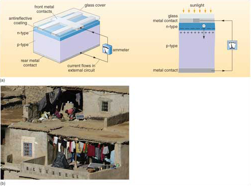

# 3 Photovoltaic conversion of solar energy

You have probably used direct conversion of solar energy to electricity though a solar cell that powers a pocket calculator or a solar 'trickle' charger to top up car batteries. Both exploit the __photovoltaic (PV) effect__, first described in 1839 by Edmond Becquerel. He observed that the voltage of an early 'wet cell' battery increased when its silver plates were exposed to light. In 1877 Cambridge physicists discovered that selenium crystals created an electrical current when exposed to light. A New York electrician, Charles Edgar Fritts, devised the first working PV cells in 1883, using selenium plates covered in gold wires, but they converted less than 1% of the incident solar energy into electricity. Since then PV technology has been mainly concerned with improving efficiency, so that today's solar cells convert up to 25% of incident solar power to electricity.

In the 1950s the Bell Telephone Company's laboratory in New Jersey, USA experimented on the effect of light on __semiconductors__, that had been invented as miniature analogues of the valves used in radios. These first transistors were made of silicon that had been 'doped' with minute amounts of other elements, including boron or phosphorus. The impurities increase the electrical conductivity of poorly conductive silicon to that intermediate between non-conductors and metals -hence the name, semiconductor.

The outer electron shell of a silicon atom is only half filled, leaving *four* unfilled electron sites. In crystalline silicon the atoms share their electrons. Consequently, pure crystalline silicon is a poor conductor of electricity because the outer electrons are barely able to move.'Doping' the silicon with elements whose atoms have different numbers of outer electrons modifies this reluctance to conduct electricity.

Phosphorus, with *five* electrons in its outer shell, is one example of a doping element. For each phosphorus atom that bonds with an adjacent silicon atom there is an excess electron. So silicon doped with phosphorus has a slight overall *negative* charge; it is an *n-type* semiconductor. When a photon of light meets a doped silicon-phosphorus pair the weakly bonded,'excess' phosphorus electron breaks free and moves. Passage of electrons through the silicon lattice creates a weak electrical current and an electrical potential.

Silicon doped with boron is left with *unfilled* electron shells, since boron has *three* outer electrons, leaving the boron-doped silicon with a slight *positive* charge; this is a *p-type* semiconductor that is able to *accept* electrons. Layering together both n- and p-type semiconductors in wafers (<a xmlns:str="http://exslt.org/strings" href="">Figure 5a</a>) enhances the PV effect. Negatively charged electrons from the illuminated n-type cross the gap between the wafers to restore electrical equilibrium. However, despite the high electrical potential across the gap, large positively charged silicon atoms cannot cross it, and so only electrons can flow. The resulting current is conducted to its point of use through metal ribbons embedded in the PV wafer, which inevitably block some incoming photons. Silicon is highly reflective, so an antireflection coating is applied to the cell surface to maximize photon capture. Doped wafers and electrical conductors are generally mounted in a vacuum between glass sheets as __solar PV cells__ for assembly in tiled arrays (e.g. <a xmlns:str="http://exslt.org/strings" href="">Figure 5b</a>).

Figure 5 (a) Simplified photovoltaic cell, showing its bonded, multilayered structure. The 'working parts' consist of bonded wafers of n- and p-type semiconductors (enlarged). The moving electrons produced in them by the PV effect have to be conducted away. Metal contacts are bonded onto the top and bottom surfaces of the pair of semiconductors, using metal ribbons that are as narrow as possible so that as much sunlight as possible can pass through. Another layer above the top conductor lessens reflection of light, and the whole cell is sealed by a glass cover. The bonding has to be as near perfect as possible, free of air bubbles and extremely durable. (b) Solar PV cells used by Berber householders in the Atlas Mountains, Morocco. They show clearly as rectangular white frames about 1 m × 0.3 m in size, as near the woman preparing mint tea, contrasting with the general irregularities of traditional rural life in Morocco.

Solar PV cells based on doped crystalline silicon have a theoretical maximum efficiency of 28%, because only a narrow range of short wavelength radiation from the Sun has the appropriate energy to displace electrons. In practice, they convert about 15% of the incoming solar energy in that wavelength range to electrical current. Crystalline silicon is durable but expensive to manufacture. Fine-grained, doped silicon formed into wafers is cheaper, but its efficiency is around 5 to 7%, and it eventually degrades. Current research centres on low-cost semiconducting materials, one promising candidate being fine-grained titanium dioxide - the white pigment used in paints, and therefore cheaply available. Combined with dyes to increase the sensitivity of TiO2 to sunlight, it has a practical PV efficiency of 7 to 12%, and degrades very slowly. Titanium dioxide occurs as a natural mineral (*rutile* - TiO2), concentrated in some beach sands because of its high density. Titanium dioxide embedded in thin plastic films may prove to be a much cheaper alternative to silicon cells. Research into PV materials is understandably a 'hot topic', and among novel possibilities are organic compounds that behave as PV semiconductors, and could be formed into flexible and strong solar cells.
<!--ITQ-->

#### Question

What is the main practical problem that might inhibit the widespread deployment of solar cells? (Think of your household electricity supply.)

#### Answer

*Direct* current (DC) is produced, whereas all appliances linked to the 'mains' use *alternating* current (AC) generated by conventional turbines. Photovoltaic cells need DC-AC *inverters* to supply alternating current to the grid system (see Chapter 1.
<!--ENDITQ-->
Another drawback of photovoltaic solar power is the area needed to give a useful supply; a 1 m2 solar panel operates at an average power of about 30 W, so three are needed to light one 100 W light bulb. To put this in perspective, to supply the entire electricity needs of New York City with solar power would require solar cells covering an area of 192 km2; equivalent to about 25% of the city's area.

