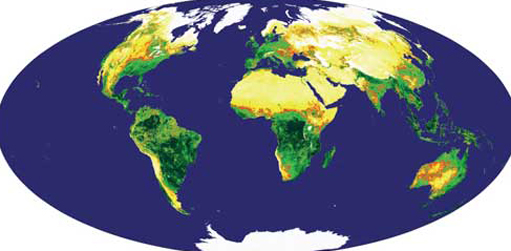

# 5 Biomass conversion of solar energy

Photosynthesis in the geological past was responsible for all fossil fuel reserves, but its products are buried about 2000 times more slowly than we use them at present. The total carbon content of all biomass growing on land is estimated to be 5.6 × 1014 kg and, as Figure 10 shows, about one-fifth of this mass is renewed each year. Figure 6 shows how modern plant biomass is distributed across the continents. Clearly, biological conversion of solar energy to a chemical form in combustible materials presents a potentially vast resource. Using biomass as a fuel need not add to carbon dioxide in the atmosphere, because its products, CO2 and water vapour, are exactly the same as those of natural aerobic decay. If plant photosynthesis is carefully managed to renew carbon consumed by using vegetable matter as an energy source, the natural balance of the carbon cycle can be sustained. About 6% of the total biomass that grows annually - containing about 7.5 × 1012 kg of carbon content - would meet all humanity's current demands for energy. However, such a perspective has nightmarish overtones because its production would involve about 11% of the global land area (a much greater proportion of fertile areas - see <a xmlns:str="http://exslt.org/strings" href="">Figure 6</a>). Nonetheless, 'high-tech' harvesting of solar energy via photosynthesis is a potential alternative to fossil-fuel use. There are five main approaches to extracting biomass energy: solid fuel combustion; gasification; pyrolysis; digestion and fermentation.

Figure 6 Estimated variations in plant biomass on the continents, based on NASA satellite data. Pale areas have low vegetation cover; red and orange indicates areas where vegetation varies widely from wet to dry seasons; the green areas have permanently dense vegetation cover, the darker the green, the greater the plant biomass.

